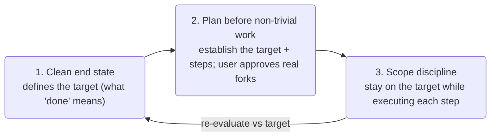
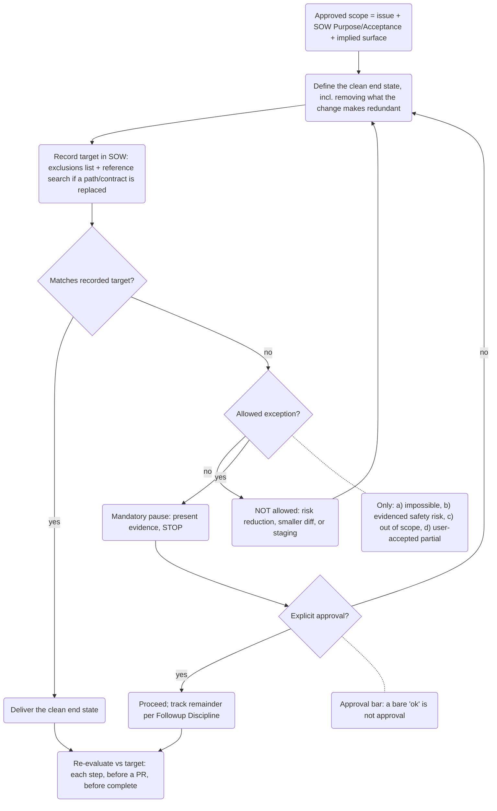
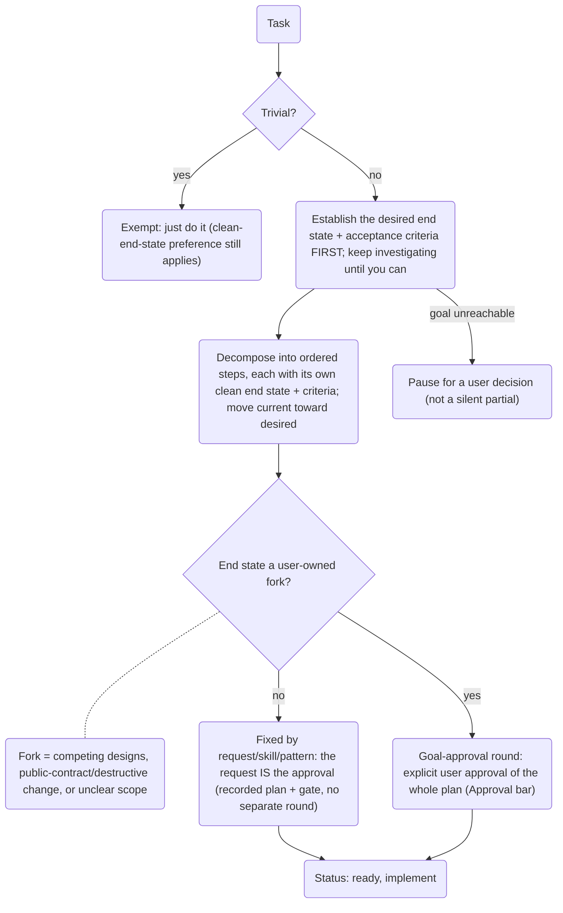
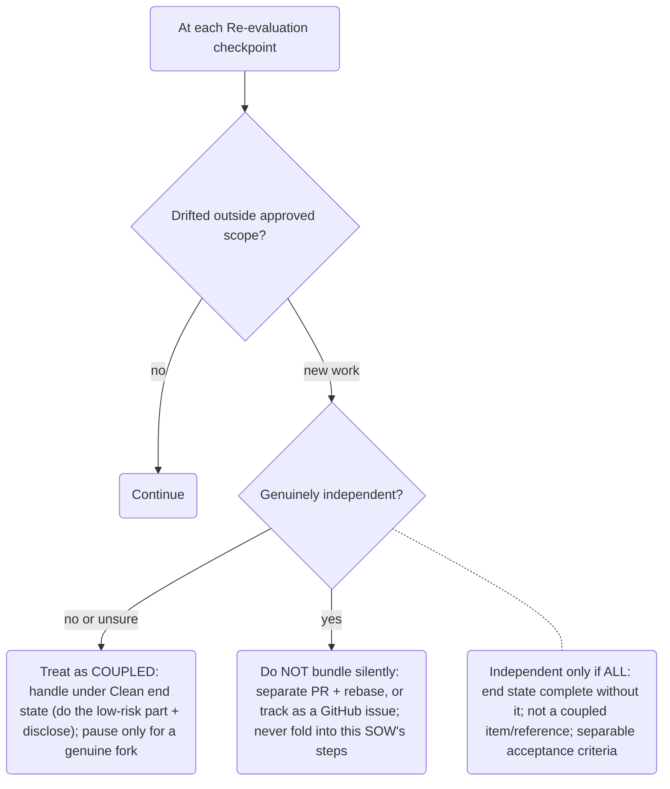

# AGENTS.md

## Goals

This repository is the Netdata Agent codebase. It is a large, multi-language, multi-platform monolith that serves production monitoring, troubleshooting, data collection, alerting, storage, streaming, cloud integration, packaging, and documentation workflows.

Work in this repository must prioritize root-cause understanding, correctness, performance, maintainability, portability, security, and consistency with existing project conventions.

## Requirement Language

This repository uses RFC-style requirement language:

- **MUST** / **REQUIRED**: mandatory. Work that violates it is not acceptable
  unless the user explicitly changes the requirement.
- **MUST NOT**: prohibited.
- **SHOULD** / **RECOMMENDED**: expected default. Deviate only with evidence
  and explain the trade-off.
- **MAY** / **OPTIONAL**: allowed, not required.

CRITICAL RULES:

1. You MUST ALWAYS find the root cause of a problem, before offering/giving a solution.
   Patching without understanding the problem IS NOT ALLOWED.

2. Before patching code, you MUST understand the codebase and the potential implications of the changes.
   What else is affected? What else is using this part of the code?

3. Do not duplicate code.
   First check if similar code already exists and reuse it.

## Mandatory Development Principles

These principles are mandatory for every task. Code is cheap to add and
expensive to live with, so a larger diff that removes debt beats a smaller one
that preserves it.

**Core (read first; the bullets under each principle are the authority for forks
and edge cases):**

- Deliver the **clean end state** of the approved scope, not the smallest diff —
  including removing what the change makes redundant; refactor low-risk mess in
  code you touch.
- **Record that target in the SOW first** (what you remove; any coupled item you
  exclude, with its reason). When you replace a path or contract, record a
  reference search proving the list is complete.
- **You are not the scope authority.** Coupled cleanup is in scope: do the
  low-risk part and disclose it; never silently drop it or relabel it
  "independent."
- Falling short of the recorded target — or any user-owned **fork** (competing
  designs, a public-contract or destructive change, unclear scope) — triggers a
  **Mandatory pause**: stop, state the trade-off, get explicit approval.
- **Plan before non-trivial work:** establish the user-approved end state plus
  acceptance criteria, then ordered steps; re-evaluate against the target at each
  step, before any PR, and before completion.
- **Default on doubt:** if unsure whether something is in scope, trivial, or a
  user-owned fork, treat it as in-scope / non-trivial / user-owned and ask.

1. **Clean end state over less churn.**
   - Binding rule (read first): you MUST recommend and deliver the clean end
     state — the structure the codebase SHOULD have once the approved scope is
     fully delivered, including removing the code, config, docs, and tests the
     change makes redundant — not the smallest diff. You MUST NOT relabel the
     smallest working diff as "the clean end state."
   - Record the target: before generating options, record that clean end state in
     the SOW. The recorded target is the clean end state of this SOW's approved
     scope; for staged work, each stage's SOW records that stage's target and the
     stages together MUST reach the full target. Any option that does not match
     the recorded target is a non-clean state and triggers the Mandatory pause.
   - Open design decision: when the clean end state is itself an open design
     decision that is the user's to make, do not invent a fixed target; record a
     provisional target plus the open design question and resolve it with the
     user first.
   - Approved scope: "the approved scope" is the union of (a) the issue or user
     request, (b) the SOW Purpose and Acceptance Criteria, and (c) the
     migration/contract surface they imply. If it is unclear whether work is in
     scope, treat it as in-scope and raise it with the user; never silently
     exclude it.
   - You are not the scope authority:
     - A "coupled item" is code, config, docs, or tests the current change makes
       redundant or leaves inconsistent (for example a replaced path, its
       callers, or its tests).
     - You MUST NOT reclassify in-scope or coupled work as "independent" or "out
       of scope" to avoid doing it, and you MUST NOT silently drop coupled work.
     - When you only suspect something is coupled and including it is low-risk and
       confined to what you are changing, include it and disclose it rather than
       stopping to ask.
     - Pause for the user only when including it would expand the blast radius,
       change a user-visible contract, or the boundary is itself a genuine scope
       fork.
     - This overrides any reading of "Scope discipline" that would defer coupled
       cleanup.
   - Disclose exclusions: in the recorded target you MUST list (i) what you will
     remove as redundant, and (ii) any coupled item you are treating as NOT part
     of this clean end state, each with its reason and the scope source it rests
     on. Excluding an in-scope or coupled item without recording it there is
     silent scope-narrowing and is prohibited, so a reviewer or the next agent can
     check your exclusions against those sources.
   - Touch-the-mess-you-touch: when your change modifies code that already
     contains adjacent duplication, dead code, or a clear pre-existing defect, you
     SHOULD clean that adjacent mess as part of this work rather than build on top
     of it, provided the cleanup is low-risk and confined to the code you are
     already modifying. Cleanup that would reach into unrelated code is
     independent work (Scope discipline) — track it, do not silently bundle it. If you
     choose NOT to clean adjacent mess you touched, record why under the
     disclosure list (ii).
   - Reference search (when replacing a path or altering a contract):
     - You MUST run and record in the SOW a reference search for remaining
       references to the replaced path or contract.
     - Search construction sites and prefixes too, not only literal final names —
       identifiers here are often built dynamically (for example via
       `fmt.Sprintf`).
     - Every surviving reference MUST appear in (i) or (ii) with its scope source,
       or the target is incomplete; an item you did not search for counts as
       silent scope-narrowing.
     - A repository-wide search cannot prove safety for consumers outside this
       repo (Netdata Cloud, exporters, streaming, ML, the docs pipeline); treat
       renaming a shipped public contract as a user-owned breaking decision (an
       Allowed-exceptions pause), not something the search clears.
   - Allowed exceptions (pause conditions, not auto-routes): recommend a
     non-clean route ONLY for one of:
     - (a) technically impossible — impossible to implement correctly at all, NOT
       impossible within a preferred diff size;
     - (b) a concrete, evidenced safety risk — a named hazard such as data loss
       or a security/production-stability regression, NOT "a larger diff is
       riskier";
     - (c) confirmed by the user as outside the approved scope; or
     - (d) accepted by the user, through the Mandatory pause, as an in-scope
       partial to ship now.

     For (a)/(b) you MUST cite specific evidence (file/line, failure class, or
     test) and route through the Mandatory pause — you do not self-certify
     "unsafe." For (d) track the remainder per "Followup Discipline" with why
     deferral is acceptable and when it lands; repeatedly shipping partials is
     debt accumulation, not delivery. Risk reduction, review convenience, smaller
     diff, and issue staging are NEVER valid and MUST NOT be relabeled "unsafe"
     or "independent."
   - Mandatory pause: if the delivered state will fall short of its recorded
     target for any reason other than approved staged delivery, you MUST present
     the evidence, STOP, and obtain explicit user approval (see Approval bar)
     before proceeding, before requesting non-draft review, and before marking
     the work complete.
   - Approval bar (used by every gate): approval means the user explicitly
     accepts a trade-off, goal, or plan that you stated in your own words (what
     stays redundant or partial, and why). A bare "ok" or "sounds good" to a
     one-sided pitch is not approval.
   - Re-evaluation: at the completion of each planned step, before opening or
     updating a PR, and before marking a SOW completed (the Re-evaluation
     checkpoints), you MUST re-evaluate already-written changes against the
     recorded target; you SHOULD also re-evaluate whenever you pause to report
     progress. Do not keep a compromise only because it already exists in the
     branch.
   - Staged delivery: allowed ONLY when every stage is an in-scope decomposition
     of one approved clean end state and the stages together reach it. The user
     approval recorded for the staged plan covers the intermediate states, so an
     approved stage does not re-trigger the Mandatory pause; every later stage
     MUST be tracked per "Followup Discipline" (implemented here, rejected with
     evidence, or a linked GitHub issue) before an earlier stage merges. A
     self-certified "a later stage will finish it" with no tracked item is not
     acceptable.
   - Re-ground staged designs: a design recorded during planning or an earlier
     stage MAY have drifted from the code a previous stage produced (a removed
     structure, an obsoleted mechanism). Before implementing a later stage you
     MUST re-verify its recorded design against the current code and record the
     correction in the SOW; never implement against stale assumptions.
   - Deferral check: before recommending deferral, check the issue, SOW,
     acceptance criteria, and affected migration scope. Silence or ambiguity MUST
     NOT be read as permission to defer; if those sources do not clearly place
     the work outside the approved clean end state, treat it as in-scope and
     either complete it or pause for a user decision.
   - Trivial-work exemption: trivial work (per "When A SOW Is Required") has no
     SOW and is exempt from the record-the-target, disclosure, and
     reference-search bullets above; the clean-end-state preference still applies.
     When unsure, treat the work as non-trivial.

2. **Plan before non-trivial work.**
   - Plan first: non-trivial work (see "When A SOW Is Required") MUST start with
     a plan recorded in the SOW before any implementation-file change and before
     any implementation-equivalent action — migrations, deletions, pushes,
     non-draft PRs, or external-state mutations via tools. Trivial work is exempt;
     when unsure, treat the work as non-trivial.
   - Human-owned goal: the desired end state — the goal, or coherent goal set, the
     work must reach — MUST be created with or approved by the user. You MUST NOT
     finalize the goal unilaterally (same user-owned target as Clean end state).
   - End state first: you MUST establish the desired end state — including its
     acceptance criteria — before planning the steps; the goal drives the work,
     not a first diff. If you cannot yet state the end state, keep investigating
     until you can; do not start work against an unknown target. When the end
     state is itself a user-owned design decision, record a provisional target
     plus the open question and resolve it with the user first (Clean end state).
     Then plan the steps to move from the current state toward that end state.
   - Decompose into steps: split the work into ordered steps, each with its own
     clean end state and acceptance criteria, each building on the previous one
     toward the desired end state. A single coherent step is a valid decomposition
     when the work is atomic; do not invent artificial sub-steps.
   - Resolve huge or vague work: if the deliverable is large or vague, keep
     refining the plan until every step has a clean end state and acceptance
     criteria. Do not start implementation while steps are still unclear.
   - Reachability: the plan MUST either reach the desired end state through its
     steps, or produce evidence that it is not achievable; an unachievable goal
     is a pause condition for a user decision, not a silent partial result.
   - Human approval gate: when a goal-approval round is required (see "Approval is
     for goal-decisions" below), the whole plan — the desired end state and the
     step breakdown — MUST be explicitly approved by the user before
     implementation. The assistant proposes and investigates; the user approves.
     State the goal and step breakdown being accepted, and get confirmation that
     meets the Approval bar (Clean end state). If the user rejects or edits the
     plan, revise and re-seek approval; the SOW stays in `planning` until an
     explicit approval is recorded, then reaches `Status: ready`. This gate is the
     canonical statement of the approval requirement that the Pre-Implementation
     Gate and Required First Checks reference.
   - Approval is for goal-decisions, not work categories:
     - The goal-approval round fires ONLY when the end state is a genuine
       user-owned fork — competing designs, a public-contract change, a
       destructive or irreversible step, or unclear scope.
     - Other non-trivial work whose end state is already fixed by the triggering
       request, an existing project skill, or an established repository pattern
       (for example a clear bug fix, a metadata/docs edit with no contract change,
       or a collector's skeleton and wiring fixed by its authoring skill — though
       its Function surface, vnode/host-scope design, and new public config
       options remain user-owned forks) still needs a recorded plan and the
       Pre-Implementation Gate, but the triggering request IS the recorded goal
       approval — no separate round, which also satisfies the resume re-check and
       the progress rule.
     - When it is unclear whether a real fork exists, treat it as user-owned and
       seek approval.
   - Approval persists; re-check on resume: before continuing an `in-progress` or
     `paused` SOW you did not personally take through this gate — including
     takeover or handoff — you MUST confirm the SOW records explicit approval of
     the current goal and plan. If it does not, or the plan changed materially
     since approval, treat the SOW as `planning` and re-obtain approval before
     further implementation.

3. **Scope discipline at every step.**
   - Drift check: at each Re-evaluation checkpoint (Clean end state), you MUST
     also check whether the work has drifted outside the approved scope, not only
     whether the diff still matches the recorded target.
   - Independence test: new work is "genuinely independent" only if ALL hold —
     (a) the approved clean end state is still complete and correct without it,
     (b) it is not a coupled item or a remaining reference recorded under Clean
     end state, and (c) it has its own separable acceptance criteria. If any test
     fails, or you are unsure, treat the work as coupled, not independent, and
     handle it under Clean end state (do the low-risk part and disclose it; pause
     only for a genuine fork) — you are not the scope authority.
   - Disposition of independent work:
     - Do NOT silently bundle it.
     - Submit it as a separate PR first and rebase the current branch after it
       merges, or track it as a GitHub issue per "Followup Discipline."
     - Do NOT fold it into this SOW's steps — Clean-end-state staged-delivery
       stages must be a decomposition of one clean end state.
   - Governed elsewhere: coupled cleanup is in scope (Clean end state), and
     non-trivial work is delivered in coherent incremental steps (Plan before
     non-trivial work); this principle does not restate them.

**Flow diagrams (human reading aid, non-normative):** the bullets above are
authoritative; the diagrams below summarize the flow for human readers and MUST
be kept in sync when the principles change.

<details>
<summary>Show per-principle flow diagrams</summary>

How the three principles connect (lifecycle order):



1. Clean end state over less churn:



2. Plan before non-trivial work:



3. Scope discipline at every step:



</details>

USER COMMUNICATION:

1. ALWAYS DO YOUR HOMEWORK BEFORE ASKING QUESTIONS OR REQUESTING USER DECISIONS.
   PROACTIVELY CHECK ALL RELATED ASPECTS AND ALL POSSIBILITIES SO THAT YOUR QUESTIONS AND REQUESTS ARE WELL INFORMED AND TO THE POINT.

2. NEVER WRITE WALLS OF TEXT TO THE USER, UNLESS THEY ASKED FOR IT.
   YOUR COMMUNICATION MUST BE SIMPLE, DIRECT, LEAN, ORDERED BY IMPORTANCE.
   PROVIDE THE FULL PICTURE AT THE BEGINNING, START FROM THE HIGH LEVEL, AND LET THE USER ASK FOR DETAILS.

3. NEVER AGREE TO THE USER WHEN THE FACTS CONTRADICT THEIR UNDERSTANDING.
   YOU MUST ALWAYS PROVIDE CLEAR DESCRIPTIONS OF THE RISKS AND IMPLICATIONS OF THEIR DECISIONS.
   YOU ARE HELPFUL WHEN YOU ACCURATELY REVEAL THE TRUTH, NOT WHEN YOU AGREE.

## SOW System

Project SOW status: initialized

This project uses a local Statement of Work system.

SOWs and specs are **local-only working memory, never committed**:

- SOW working files live under `.agents/sow/q/**` (the queue tree) and MUST NOT
  be committed to any branch.
- Specs live under `.agents/sow/specs/**` and are likewise local-only and
  gitignored. They may be re-introduced to git later, reorganized, as a
  deliberate decision; until then treat them as local memory.
- Only the SOW framework files are committed and shared via git:
  `.agents/sow/SOW.template.md`, `.agents/sow/audit.sh`,
  `.agents/sow/scan-sensitive.sh`, `.agents/sow/worktree-link.sh`.
- `.gitignore` enforces this: `/.agents/sow/q` and `/.agents/sow/specs` are
  ignored; the framework files are tracked normally.
- Durable knowledge that must survive a SOW belongs in project skills, docs,
  code, and tests (and, once reorganized, specs) — not in the SOW body.
- Worktree sharing: SOW working memory is per-developer, not per-worktree. Run
  `.agents/sow/worktree-link.sh` after creating a git worktree (or after
  updating an old checkout to this model) to create the queues and symlink
  `.agents/sow/q`, `.agents/sow/specs`, `.local`, and `.env` to the origin
  checkout. See "### SOW Locations And Naming".

The SOW system is self-contained in this repository. Normal SOW work must not depend on `~/.agents`, `~/.AGENTS.md`, global skills, global templates, or global scripts. Use this `AGENTS.md`, the local SOW, project-local specs, and project-local skills.

### Roles

- **User responsibilities:** purpose, scope decisions, design forks, risk acceptance, destructive approvals, and final product judgment.
- **Assistant responsibilities:** investigation, evidence, implementation, tests or equivalent validation, reviews, documentation, memory updates, and concise reporting.

### Required First Checks

Before non-trivial work:

1. Read the active SOWs under `.agents/sow/q/` (the local-only queue tree) if any exist. SOWs are local working memory; discover other in-flight work through open PRs and issues, not through `master`.
2. Read relevant specs under `.agents/sow/specs/` (local-only memory).
3. Inspect `.agents/skills/*/SKILL.md` if any exist, and load every runtime project skill whose trigger matches the work.
4. Inspect legacy runtime skills listed below when the user request matches their frontmatter trigger.
5. Inspect code, docs, tests, and existing project instructions as ground truth.
6. Ask the user only for irreducible product/design/risk decisions. For non-trivial work, the goal and plan are user-owned decisions gated by the "Plan before non-trivial work" Human approval gate.

### Git Worktrees

Assistants must not create git worktrees on their own. Create a git worktree only when the user explicitly asks for it or approves it.

After a git worktree is created — or after an old checkout is updated to the
local-only SOW model — run `.agents/sow/worktree-link.sh`. It builds the SOW
queues and symlinks `.agents/sow/q`, `.agents/sow/specs`, `.local`, and `.env`
to the origin checkout, so SOW working memory is shared per-developer rather than
re-created per worktree. (Exception: a worktree that already has its own real
`.env` keeps it and is not relinked, so per-worktree secrets are never
overwritten.) The script is idempotent, never loses data on a name collision,
re-points a symlink whose origin moved, and refuses to run in a worktree whose
origin checkout is not yet on this model (it prints how to update the origin
first).

### Sensitive Data In Durable Artifacts

SOWs, specs, documentation, project skills, agent instructions, and code comments are commit-ready artifacts. Treat them as public unless a repository-specific policy explicitly says otherwise.

CRITICAL: Never write raw sensitive data to durable artifacts. This includes passwords, API keys, bearer tokens, SNMP communities, private keys, connection strings with embedded credentials, session cookies, community member names, customer names, customer identifiers, personal data, non-private IP addresses that can identify customers, private endpoints, account IDs, and proprietary incident details.

Write only sanitized evidence:

- use placeholders such as `[REDACTED_SECRET]`, `[CUSTOMER]`, `[ACCOUNT]`, `[PRIVATE_ENDPOINT]`;
- use stable aliases such as `customer-a` only when the real mapping is not stored in the repository;
- cite file paths, line numbers, command names, schema fields, or error classes instead of copying sensitive values;
- summarize logs and traces; include only minimal redacted snippets.

If sensitive data is required to continue, stop and ask the user for a secure handling path. If sensitive data is found in a durable artifact, sanitize it before any commit. If sensitive data was already committed, tell the user and do not rewrite history without explicit approval.

### Durable AI-Facing Artifact Formatting

AI-facing durable artifacts include `AGENTS.md`, SOW specs, runtime project
skills, public/operator skills, SOW templates, instruction bridge files, and
other docs primarily written so future AI agents can execute repository rules
correctly.

When writing or updating these artifacts:

- Structure for retrieval and scanning. Use headings, short sections, labeled
  bullets, and numbered procedures so both humans and AI agents can find the
  exact rule quickly.
- Avoid dense multi-rule paragraphs. If a paragraph contains multiple
  requirements, exceptions, or decision branches, split it into bullets or a
  table.
- Use tables only for matrices or comparisons where the cells stay short. Use
  bullets for rules, workflows, checklists, and exception handling.
- Put RFC-style requirement words (`MUST`, `MUST NOT`, `SHOULD`, `MAY`) close
  to the action they govern. Do not hide mandatory behavior in explanatory
  prose.
- Prefer labeled bullets for operational guardrails, such as `Target`,
  `Exception handling`, `Validation`, or `Failure mode`.
- Keep one durable idea per bullet. If a bullet needs multiple sentences, the
  first sentence states the rule and later sentences provide evidence,
  rationale, or examples.
- For a guardrail with several distinct requirements, use a labeled parent
  bullet with an indented sub-list — one requirement per sub-bullet — rather than
  a multi-requirement paragraph; keep a single rule-plus-rationale as one bullet.
- Preserve precision over brevity. Formatting is for readability, not for
  weakening contracts or removing necessary evidence.

### Open-Source Reference Evidence

When SOW evidence comes from other open-source repositories, cite the upstream repository and checked commit instead of the workstation absolute path.

Use:

```text
owner/repo @ commit
relative/path/inside/repo:line
```

Resolve `owner/repo` from the repository remote, record the checked commit, and keep paths relative to the upstream repository root. Never write absolute paths into SOW evidence.

### Pre-Implementation Gate

Implementation must not begin until the local SOW contains a concrete `## Pre-Implementation Gate` section with `Status: ready` or `Status: in-progress`. Before changing implementation files, or before continuing implementation in an existing SOW that lacks this section, fill the gate. Reaching `Status: ready` additionally requires the "Plan before non-trivial work" Human approval gate (explicit user approval of the goal and plan).

The gate must record the problem/root-cause model, evidence reviewed, affected contracts and surfaces, the clean-end-state target (its removed-redundant and excluded-coupled items, and the reference search where a path or contract is replaced), existing patterns to reuse, risk and blast radius, sensitive data handling plan, implementation plan, validation plan, artifact impact plan, and open decisions. The sensitive data plan must cover SOWs, specs, documentation, project skills, agent instructions, and code comments. Generic placeholders such as `TBD`, `N/A`, or "to be checked later" are invalid unless the SOW explains why the item truly does not apply. If the gate exposes an unknown that cannot be resolved by investigation, stop and ask the user before implementation.

### When A SOW Is Required

Create or reuse a SOW for non-trivial work:

- feature work;
- bug fixes with behavioral impact;
- refactors;
- migrations;
- documentation or content changes with product/business impact;
- process changes;
- regressions;
- spec hygiene;
- project skill changes;
- collector changes;
- packaging, install, or deployment changes;
- PR review iteration;
- static analysis triage that changes source, docs, or project policy;
- any work with unclear risk.

Trivial work does not need a SOW:

- typo fixes;
- formatting-only changes;
- mechanical rename with no behavior change;
- simple search/replace with low risk (still grep for the old token to confirm no call sites are missed).

When unsure, treat the work as non-trivial.

### SOW Locations And Naming

- SOW queues (local-only): `.agents/sow/q/` with sub-queues `pending/`,
  `current/`, `active/`, `done/`. Move a SOW file between these as its state
  changes; the whole `q/` tree is gitignored.
- Specs (local-only): `.agents/sow/specs/`
- Template for new SOWs (committed): `.agents/sow/SOW.template.md`
- Local audit (committed): `.agents/sow/audit.sh`
- Worktree/queue setup (committed): `.agents/sow/worktree-link.sh`

SOW working files and specs are never committed. `.gitignore` ignores
`/.agents/sow/q` and `/.agents/sow/specs`; only the framework files above are
tracked. The queue directories are created locally by
`.agents/sow/worktree-link.sh`, not by committed `.gitkeep` markers, so there is
no committed SOW layout to preserve.

Worktree model: SOW working memory is shared per-developer, not per-worktree.
In a linked worktree, `.agents/sow/worktree-link.sh` symlinks `.agents/sow/q`,
`.agents/sow/specs`, `.local`, and `.env` to the origin checkout, and migrates
any pre-existing top-level queue dirs into `q/` without data loss.

Create new SOW files from `.agents/sow/SOW.template.md`. The template is project-local and may be customized for this repository.

### Local SOW Parking

Users may keep private paused, abandoned, or not-yet-public SOW drafts under
`<repo-root>/.local/sow/`. This directory is gitignored and outside the project
SOW lifecycle.

Use `<repo-root>/.local/sow/` when the user wants to preserve work locally
without creating a public or team-visible GitHub issue yet.

Local parked SOWs are private memory only:

- they are not durable project memory;
- they are not visible to other contributors;
- they are not acceptable as the only tracking for work that must coordinate a
  team, block a merge, or survive across machines.

Deferred work has two valid tracking paths:

- public or team-visible follow-up: GitHub issue;
- private or local follow-up: `<repo-root>/.local/sow/`.

Active implementation work still MUST use the `.agents/sow/q/` queues. SOW
working files are never committed (the `q/` tree is gitignored), so there is no
commit-for-handoff and no remove-before-merge step.

Destructive local deletion guard:

- Assistants MUST NOT use `rm`, `apply_patch` delete hunks, editor delete
  operations, or any equivalent filesystem operation to remove a SOW working
  file from the local checkout unless the user explicitly asks to discard the
  local SOW.
- SOW working files are local-only and gitignored, so there is no tracked SOW to
  untrack and no merge guard to clear.
- Moving a SOW between `.agents/sow/q/` sub-queues (for example `current/` →
  `done/`) is normal lifecycle, not deletion.

Filename:

```text
SOW-YYYYMMDD-{slug}.md
```

Use the creation date plus a descriptive slug. There is no sequential `NNNN`
counter because it cannot be allocated safely across parallel branches.

SOW state lives in the file's `Status:` field:

- `planning` - analysis or decisions are incomplete; implementation is blocked.
- `ready` - the Pre-Implementation Gate is complete and, where the goal-approval round ("Plan before non-trivial work") applies, the user has approved the goal and plan; implementation can start.
- `in-progress` - implementation is underway.
- `paused` - work is intentionally stopped but may resume on the branch.
- `completed` - work is validated and durable memory has been transferred. The
  SOW file is local-only and never committed; it MAY be moved to
  `.agents/sow/q/done/` as local history or deleted locally at the user's
  request. Never delete it without the user asking.

### SOW Completion And Merge

The successful terminal SOW status is `completed`.

When a SOW's work is ready to merge:

1. Finish implementation, docs, skills, validation, and follow-up mapping.
2. Transfer all durable knowledge into project skills, docs, code, and tests
   (and specs once specs are re-introduced to git). After this step, the SOW
   body MUST hold nothing durable that is not captured elsewhere.
3. Update the SOW to `Status: completed`.

SOW working files are never committed (they live under the gitignored
`.agents/sow/q/`), so there is no "remove SOW from git before merge" step and no
CI merge guard to clear. A completed SOW MAY stay in `.agents/sow/q/done/` as
local history or be deleted locally at the user's discretion — never delete a
local SOW working file without the user's request (see the deletion guard above).

### Enforcement

The SOW system is enforced by local audit tooling and CI:

- `.agents/sow/audit.sh` is the local consistency audit for SOW rules, the
  local-only queue/spec layout, framework files, and sensitive-data scanning.
- `.agents/sow/scan-sensitive.sh` is the shared sensitive-data scanner used by
  local audit and CI.
- `.agents/sow/worktree-link.sh` builds the local queues and links a worktree's
  SOW working memory to its origin checkout.
- `.github/workflows/sow.yml` rejects pull requests that commit SOW working
  files or specs — anything under `.agents/sow/q/**`, `.agents/sow/specs/**`, or
  a stray `.agents/sow/{active,pending,current,done}/SOW-*.md`. These paths are
  local-only and gitignored; a hit means the file was force-added and MUST be
  removed before merge.
- The same workflow scans changed instruction, skill, and framework files for
  raw sensitive data.

These checks are guards, not substitutes for the SOW Validation Gate. The
assistant still owns transferring durable knowledge out of the SOW before
merge.

### One SOW At A Time

Never execute multiple SOWs as one batch.

If work overlaps:

- coordinate through the relevant open PRs and issues;
- merge or consolidate branches before implementation; or
- split into separate SOWs and complete one before starting the next.

Progress reports are not stop points (re-evaluating against the target per the Clean-end-state rule is not itself a stop point). Once a SOW is in progress and its goal/plan approval is recorded ("Plan before non-trivial work"), continue until it is delivered, failed with evidence, blocked on a real user decision/approval, or superseded by newer user instructions.

### User Decisions

When user decisions are needed:

1. Present concrete evidence with files/lines or source references.
2. Provide numbered options.
3. Explain pros, cons, implications, and risks.
4. Recommend one option with reasoning.
5. Record the user's decision in the SOW before implementation. For the goal/plan approval round, the bar is the "Plan before non-trivial work" Human approval gate.

### Followup Discipline

"Deferred" is not a terminal outcome.

Before a SOW can close, every valid deferred item must be:

- implemented in the current SOW; or
- explicitly rejected as not worth doing, with evidence; or
- represented by a GitHub issue linked from the current SOW or PR.

Pre-close, search the SOW for:

```text
defer|later|follow-up|future|TODO|pending
```

Map every remaining item to implemented, rejected, or tracked.

### Regressions

A regression is broken behavior discovered after a SOW's work merged, where the
original claimed outcome is no longer true.

Because completed SOWs are not retained on `master`, a regression is handled as
new work:

1. Open a new local SOW under `.agents/sow/q/active/`.
2. In `## Requirements`, link the prior work: `Regresses: PR #NNNNN` and cite
   any known commit, spec, issue, or test evidence.
3. Run the normal Pre-Implementation Gate and Validation for the new SOW.
4. Update the relevant spec, skill, doc, code, or test so durable memory reflects
   current reality.

Do not attempt to resurrect or mutate a prior SOW.

### Validation Gate

A SOW cannot be completed until Validation records:

- acceptance criteria evidence;
- clean-end-state evidence: the delivered state matches the clean end state recorded in the SOW, including its recorded list of removed-redundant and excluded coupled items (and, where a path or contract was replaced, the recorded reference search), or an explicit user approval for a non-clean state is recorded and linked;
- deferred clean-end-state remainder: any clean-end-state work deferred under an approved partial (exception (d)) or otherwise tracked rather than done is listed with why deferral was acceptable and when (or under what condition) it lands;
- tests or equivalent validation;
- real-use evidence when a runnable path exists;
- reviewer findings and how they were handled;
- same-failure search results;
- artifact maintenance gate for `AGENTS.md`, runtime project skills, specs, end-user/operator docs, end-user/operator skills, and SOW lifecycle;
- local-only SOW layout respected: no SOW working file or spec was committed
  (they stay under the gitignored `.agents/sow/q/` and `.agents/sow/specs/`);
- spec update or specific reason no spec update was needed;
- project skill update or specific reason no skill update was needed;
- end-user/operator docs update or evidence-backed reason none were affected;
- end-user/operator skill update or evidence-backed reason none were affected by docs/spec changes;
- lessons extracted or specific reason there were none;
- workflow-friction triage: each recorded `Workflow Friction & Rule Gaps` note resolved to a rule update (`AGENTS.md`, project skill, spec, or SOW template), an evidence-backed rejection, or a tracked follow-up (or an explicit "none arose");
- follow-up mapping.

Generic "N/A" is invalid.

### Artifact Maintenance Gate

Every SOW close must explicitly record whether each durable artifact class was updated or why no update was needed:

- `AGENTS.md` - workflow, responsibility, local framework, project-wide guardrails.
- Runtime project skills - `.agents/skills/project-*/SKILL.md` for HOW to work here.
- Specs - `.agents/sow/specs/` for WHAT the project does.
- End-user/operator docs - README, docs site, runbooks, published guides, help text, or other human-facing documentation.
- End-user/operator skills - output/reference skills copied or consumed outside normal repo work.
- SOW lifecycle - local-only SOW under `.agents/sow/q/` (never committed), durable memory transfer, deferred work tracked as GitHub issues, and regressions handled as new linked SOWs.

This is an assistant responsibility. If a SOW changes behavior, docs, specs, commands, schemas, defaults, workflows, examples, or operating procedure, the assistant must update every affected artifact in the same SOW, or record the evidence-backed reason an artifact is unaffected.

### Specs

Specs are memory of WHAT this project does.

Specs currently live under `.agents/sow/specs/` as **local-only** memory
(gitignored, not committed). They are being reorganized and will be
re-introduced to git later as a deliberate decision; until then they are
per-developer local memory, shared across worktrees by
`.agents/sow/worktree-link.sh`. Durable contracts that must be shared with the
team right now belong in project skills, docs, code, and tests.

This repository is bootstrapped incrementally. The existing source tree and public documentation remain the primary ground truth. Specs under `.agents/sow/specs/` capture durable project decisions, cross-cutting behavioral rules, and area-specific contracts as they are worked.

`.agents/sow/specs/` stays flat until scale proves hierarchy is needed. Use
`<domain>-<topic>.md` names, one durable contract or cross-cutting rule per file,
and update `.agents/sow/specs/README.md` in the same change. Do not split specs
by repository path; specs are organized by contract ownership, not source-file
location.

Update specs when shipped work changes:

- product behavior;
- public contracts;
- collector behavior;
- APIs and schemas;
- data formats;
- alerting semantics;
- packaging or deployment behavior;
- operational guarantees;
- known edge cases.

Specs describe current reality, not aspiration. If specs and code disagree, record the discrepancy in the active SOW and resolve or track it.

### Project Skills

Project skills are memory of HOW to work here.

Runtime input project skills should live under `.agents/skills/*/SKILL.md`. Before non-trivial work, inspect those skill descriptions and load every matching runtime skill.

Output/reference skills may also exist under product documentation or generated skill directories. Do not rename, shorten, or change their descriptions only to satisfy runtime discovery. Update them when their related public/operator workflow changes.

### Public skill convention (`docs/netdata-ai/skills/`)

End-user-facing AI skills under `docs/netdata-ai/skills/` follow the directory shape `docs/netdata-ai/skills/<skill-name>/SKILL.md`, with optional supporting docs (`<topic>.md`) and an optional `scripts/` subdirectory for helper code. SKILL.md frontmatter has `name` and `description`; the description is the trigger-matching text and must enumerate the phrases users will actually type.

Public skills are for operators and end-users. They may teach users how to
query Netdata Cloud, query Agents, inspect metrics/logs/topology/alerts, or run
safe operational commands. They must not contain developer-contract validation,
schema migration plans, producer authoring workflows, UI adapter work,
aggregator implementation notes, SOW handoff instructions, fixture maintenance,
PR-review tasks, or codebase-internal implementation recipes.

Developer-facing skills must live under `.agents/skills/`, preferably with a
`project-` prefix when they are runtime input for repository work. If a workflow
requires reading source files, updating schemas, validating fixtures, changing
collectors/producers, or coordinating frontend/backend/aggregator code, it is a
project developer skill, not a public skill.

Skill verification harness inputs are not public skill content. Keep seed
questions, grader rubrics, runner scripts, and transcript-generation prompts
under `.agents/skill-verification/<skill>/`, not under
`docs/netdata-ai/skills/<skill>/`.

Each public skill is reachable from `.agents/skills/<skill-name>` via a relative symlink (`.agents/skills/<name>` → `../../docs/netdata-ai/skills/<name>`) so local AI assistants reading from `.agents/skills/` see the same skill as end-users. Create the symlink with `ln -srfn`. Verify with `readlink -f .agents/skills/<name>`.

Public-skill scripts must follow the same `_lib.sh` shape as existing skills (`set -euo pipefail`, ANSI colors with real ESC bytes via `$'\033[...]'`, `<prefix>_repo_root` via `git rev-parse --show-toplevel`, `<prefix>_load_env` that sources `<repo>/.env` with `: "${VAR:?}"` validation, `<prefix>_audit_dir` that creates `<repo>/.local/audits/<topic>/`, masked-token `<prefix>_run`/`<prefix>_run_read` wrappers).

Public-skill scripts that touch credentials (cloud tokens, per-agent bearers, claim ids, session cookies) MUST be **token-safe** -- helpers that handle credential bytes are named with a leading underscore (`_skill_*`, internal-only) and return them via bash namerefs into the caller's local variables, NEVER to stdout. Public wrappers (no leading underscore) read credentials from `.env` internally and emit ONLY the response body. Each token-handling lib must ship a `<prefix>_selftest_no_token_leak` function that drives every public wrapper with a sentinel token and asserts the sentinel never appears on captured stdout.

### How-tos catalog rule

Each public skill ships a `how-tos/` subdirectory with `INDEX.md`. The catalog is **live**: every time an AI assistant is asked a concrete operator/end-user question that requires analysis (multiple wrapper calls, jq pipelines, or cross-referencing more than one per-domain guide) and the answer isn't already documented under `how-tos/`, the assistant MUST author a new how-to and add it to `INDEX.md` BEFORE completing the task. This rule is repeated in each skill's `SKILL.md` so future assistants honor it. Skipping it means the next assistant repeats the same analysis from scratch -- an explicit framework violation.

The how-to rule does not override audience boundaries. If the analysis produced
a developer validation recipe, put it in the matching `.agents/skills/` project
skill and update that skill's index instead of adding it under
`docs/netdata-ai/skills/`.

The existing private skills (`coverity-audit`, `sonarqube-audit`, `graphql-audit`, `pr-reviews`) keep their `.agents/skills/<name>/` location -- they are intentionally private and have no `docs/netdata-ai/skills/` counterpart.

### Project Skills Index

Runtime input skills:

- `.agents/skills/project-snmp-profiles-authoring/`
  Trigger: editing SNMP profile YAMLs, topology SNMP profiles, ddsnmp profile parsing, or SNMP profile-format documentation.
  Purpose: require MIB `MAX-ACCESS` checks and index-derived extraction for `not-accessible` INDEX objects.

- `.agents/skills/project-snmp-trap-profiles-authoring/`
  Trigger: editing SNMP trap profile YAMLs under `src/go/plugin/go.d/config/go.d/snmp.trap-profiles/`, the trap profile-format documentation, the `src/go/cmd/snmptrapprofilegen/` Go helper, or running a regeneration of the OOB trap profile pack.
  Purpose: enforce the closed 8-category / 8-severity taxonomy, the file-scoped `varbinds:` table pattern, cardinality discipline on `labels:`, and stock/operator separation. Documents the regeneration recipe.

- `.agents/skills/project-writing-collectors/`
  Trigger: authoring or modifying any Netdata data-collection plugin or module (Go go.d / ibm.d, Rust crates, internal C plugins, external plugins via PLUGINSD). Read before adding a new collector, modifying an existing one, working on NetFlow/sFlow/IPFIX, OTEL ingestion, topology, SNMP profiles, or interactive Functions.
  Status: live. Updates that close gaps or fix outdated pointers must ship in the same PR that exposed the issue.

- `.agents/skills/project-create-topology/`
  Trigger: creating or updating Netdata topology producers, topology Function payloads, topology schema fixtures, graph presentation, correlation rules, direction semantics, topology drilldowns, telemetry overlays, or Cloud topology aggregation fixtures.
  Status: live. Developer-facing topology authoring workflow. End-user/operator-facing AI skills belong under `docs/netdata-ai/skills/`; this project skill is the runtime guidance for repository work.

- `.agents/skills/project-writing-go-modules-framework-v2/`
  Trigger: creating or migrating a Go go.d collector to framework V2; touching `CollectorV2`, `metrix.CollectorStore`, `ChartTemplateYAML` / `charts.yaml`, `charttpl`, `chartengine`, V2 host scopes, or V2 collector tests.
  Purpose: mirror maintainer-preferred framework V2 patterns from accepted collectors so new or migrated modules blend with repository style.

- `.agents/skills/integrations-lifecycle/`
  Trigger: editing any `metadata.yaml` or collector `taxonomy.yaml`; modifying `integrations/` generators, schemas, taxonomy registries, or templates; debugging generated gitignored integration outputs (`integrations.js`, `integrations.json`, `integrations/taxonomy.json`); working with committed per-integration `.md` files / `COLLECTORS.md` / `SECRETS.md` / `SERVICE-DISCOVERY.md`; ibm.d module generation (`contexts.yaml` -> `metadata.yaml`); CI workflows `generate-integrations.yml` and `check-markdown.yml`; the collector-consistency rule.
  Status: live. SKILL.md plus per-domain guides (`pipeline.md`, `schema-reference.md`, `per-type-matrix.md`, `artifacts-and-banners.md`, `ibm-d.md`, `consistency.md`, `in-app-contract.md`, `gotchas.md`) and `recipes/`, `how-tos/` directories.

- `.agents/skills/learn-site-structure/`
  Trigger: adding/moving/renaming/deleting any docs page that should appear on `learn.netdata.cloud`; editing `<repo>/docs/.map/map.yaml`; investigating why a Learn page looks the way it does; reading the live `ingest/ingest.py` orchestrator or the legacy `ingest.js` / `ingest.md` (which are stale); MDX escape rules; redirects; the Netlify deploy contract.
  Status: live. SKILL.md plus per-domain guides (`mapping.md`, `pipeline.md`, `sidebars.md`, `mdx-rules.md`, `redirects.md`, `pitfalls-and-gotchas.md`, `authoring-boundary.md`) and `recipes/`, `how-tos/` directories.
- `.agents/skills/learn-pr-preview/`
  Trigger: only when the user explicitly asks to build, run, preview, inspect, or validate `learn.netdata.cloud` locally using the contents of a PR or documentation branch before merge.
  Status: live. SKILL.md with an isolated preview workflow that copies PR source content, runs Learn ingest with `--local-repo`, builds Docusaurus with the Netlify-pinned runtime, and inspects representative pages without dirtying the real Learn checkout.
- `.agents/skills/query-agent-events/`
  Trigger: investigating crashes, panics, or fatals across the Netdata fleet; downloading events from the agent-events ingestion namespace; analyzing AE_* fields and their enums; understanding the 23h client-side dedup or the after-the-fact event timing; using the systemd-journal Function multi-value `selections` filter for index-friendly queries.
  Status: live. SKILL.md plus per-domain guides (`AE_FIELDS.md`, `transports.md`, `update-cadence.md`, `query-discipline.md`, `finding-crashes.md`, `finding-fatals.md`), scripts (`scripts/_lib.sh`, `get-events.sh`, `analyze-events.sh`, `redact-events.sh`) and `recipes/`, `how-tos/` directories. Bug-investigation tool, NOT a generic logs query skill -- consumes `query-netdata-{cloud,agents}` for transport.

- `.agents/skills/mirror-netdata-repos/`
  Trigger: setting up or updating a local mirror of Netdata-org source repositories at `${NETDATA_REPOS_DIR}` for cross-repo grep / code review without GitHub API calls; running the vendored sync script; questions about the reset-to-default-branch safety mechanism or the `--repo NAME` scoping flag.
  Status: live. SKILL.md (single-file overview) plus the vendored `scripts/sync-netdata-repos.sh` (env-driven, sanitized, `--repo` scoping, `gh` optional for Phase 2) and `how-tos/` catalog. Independent from any other repo mirrors this workstation may have.

- `.agents/skills/coverity-audit/`
  Trigger: Coverity Scan defect triage for this repository.
  Status: live.

- `.agents/skills/sonarqube-audit/`
  Trigger: SonarCloud findings triage for this repository.
  Status: live.

- `.agents/skills/graphql-audit/`
  Trigger: GitHub Code Scanning/CodeQL triage for this repository.
  Status: live.

- `.agents/skills/pr-reviews/`
  Trigger: PR comment and review iteration work for this repository.
  Status: live.

- `.agents/skills/codacy-audit/`
  Trigger: Codacy Cloud workflow for this repository -- pre-push local analysis (`codacy-analysis-cli` via docker or local binary) and read-only PR-issue fetching via the v3 API.
  Status: live. SKILL.md plus `scripts/_lib.sh` (token-safe wrappers + sentinel no-leak self-test), `scripts/analyze-local.sh`, `scripts/pr-issues.sh`, and a live `how-tos/INDEX.md` catalog. Read-only by design; write actions require a GitHub issue or branch-local SOW.

Public skills (canonical under `docs/netdata-ai/skills/<name>/`; relative symlinks at `.agents/skills/<name>`):

- `docs/netdata-ai/skills/query-netdata-cloud/`
  Trigger: querying Netdata Cloud REST API -- metrics, logs (systemd-journal), alerts, generic Function calls on a node.
  Symlink: `.agents/skills/query-netdata-cloud` -> `../../docs/netdata-ai/skills/query-netdata-cloud`.
  Status: live. SKILL.md plus per-domain guides (`query-metrics.md`, `query-logs.md`, `query-alerts.md`, `query-functions.md`).

- `docs/netdata-ai/skills/query-netdata-agents/`
  Trigger: querying Netdata Agents directly on port 19999, including auto-mint of per-agent bearer tokens from a Cloud token.
  Symlink: `.agents/skills/query-netdata-agents` -> `../../docs/netdata-ai/skills/query-netdata-agents`.
  Status: live. SKILL.md plus `scripts/_lib.sh` helpers (`agents_resolve_bearer`, `agents_call_function`, `agents_netdata_prefix`).

- `docs/netdata-ai/skills/query-snmp-traps/`
  Trigger: querying SNMP trap logs through Netdata Cloud or directly from a Netdata Agent; use for trap journal entries, severities, categories, senders, deduplication summaries, `TRAP_*` fields, and `TRAP_JSON` varbind searches.
  Symlink: `.agents/skills/query-snmp-traps` -> `../../docs/netdata-ai/skills/query-snmp-traps`.
  Status: live. SKILL.md plus `how-tos/INDEX.md` and seeded operator how-tos.

Output/reference skills:

- `docs/netdata-ai/skills/`
  Consumer: downstream assistants and users of Netdata AI skill artifacts.
  Update when: public/operator AI skill docs, examples, commands, schemas, or workflows change.

- `src/ai-skills/`
  Consumer: downstream assistants and users of generated or source AI skill artifacts when this tree is present in the working copy.
  Update when: generated/source AI skill behavior, tests, examples, commands, schemas, or workflows change.

### Project-specific commands

- This bootstrap pass does not define a full-project command matrix for the monolith.
- Use the narrowest existing command that validates the changed subsystem.
- Do not claim full-project validation from a narrow subsystem command.
- Existing local helper scripts such as `install.sh` may exist in this working copy; inspect before use and do not assume they are tracked project interfaces.

### Go test style

- Prefer table-driven tests using `map[string]struct{}` keyed by test-case name
  when cases share setup and assertion shape.
- Use separate test functions only when setup or assertions are materially
  different.
- Prefer map keys over a `name` field in `[]struct{}` so case names are
  prominent and order-independent.

### Project-specific overrides

All existing project-specific instructions in this file remain active. The SOW framework adds durable work tracking; it does not weaken the root-cause, collector consistency, C code, naming, local-output, or secret-handling rules below.

## Collector Consistency Requirements

When working on collectors, runtime behavior, metrics, charts, configuration,
alerts, taxonomy, and generated documentation MUST stay consistent in one PR.
The detailed collector consistency checklist and CI enforcement notes live in
`.agents/skills/integrations-lifecycle/consistency.md`.

## C code
- gcc, clang, glibc and muslc
- libnetdata.h includes everything in libnetdata (just a couple of exceptions) so there is no need to include individual libnetdata headers
- Functions with 'z' suffix (mallocz, reallocz, callocz, strdupz, etc.) handle allocation failures automatically by calling fatal() to exit Netdata
- The freez() function accepts NULL pointers without crashing
- Resuable, generic, module agnostic code, goes to libnetdata
- Double linked lists are managed with DOUBLE_LINKED_LIST_* macros
- json-c for json parsing
- buffer_json_* for manual json generation

## Naming Conventions
- "Netdata Agent" (capitalized) when referring to the product
- "`netdata`" (lowercase, code-formatted) when referring to the process
- See DICTIONARY.md for precise terminology

## Local-only working directory

`/.local/` at the repo root is gitignored and reserved for per-user runtime
artifacts: audit reports, fetched API data, scratch notes, queue files,
intermediate triage decisions. Agents writing skill output should default to
`<repo-root>/.local/audits/<topic>/...` -- where `<topic>` is the skill
name with any trailing `-audit` suffix removed (so `coverity-audit/`
writes under `coverity/`, `pr-reviews/` writes under `pr-reviews/`).

Convention:
- `/.local/audits/coverity/`  - Coverity raw fetches, per-defect details, triage decisions
- `/.local/audits/sonarqube/` - Sonar finding queues, FP comment templates
- `/.local/audits/graphql/`   - GitHub Code Scanning fetches and dismissals
- `/.local/audits/pr-reviews/`- Per-PR comment / review caches

Naming: each skill `<topic>-audit/` writes to `.local/audits/<topic>/`
(the `-audit` suffix is dropped from the directory name so the URL-style
path stays short). Skills without the `-audit` suffix keep their full
name (e.g. `pr-reviews/` writes to `.local/audits/pr-reviews/`). When
adding a new skill, follow this convention.

Nothing under `/.local/` is committed. Treat the directory as ephemeral
between users and machines, not as a shared source of truth.

## Per-user secrets via `.env`

`/.env` at the repo root is gitignored and holds per-user secrets and
endpoint configuration consumed by skill scripts: API tokens, session
cookies, project keys. Never commit secrets; never hard-code tokens in scripts.

**Setup**: copy `<repo>/.env.template` to `<repo>/.env` and fill in
the keys you need.

**Reference**: `<repo>/.agents/ENV.md` is the single canonical guide
covering every key -- what it is, where to find the value, sample
format, common mistakes, and which skills require it. When a script
errors with `<KEY> is empty`, check `.agents/ENV.md` for that key.
