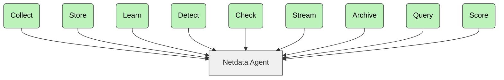

<h3 align="center">X-Ray Vision for your infrastructure!</h3>
<h4 align="center">Every Metric, Every Second. No BS.</h4>

 

  
   
  
  
  
   
  
  
   
  
  

  
  
  
  

<b>Visit our <a href="https://www.netdata.cloud">Home Page</a></b>

MENU: **[WHO WE ARE](#who-we-are)** | **[KEY FEATURES](#key-features)** | **[GETTING STARTED](#getting-started)** | **[HOW IT WORKS](#how-it-works)** | **[FAQ](#faq)** | **[DOCS](#book-documentation)** | **[COMMUNITY](#tada-community)** | **[CONTRIBUTE](#pray-contribute)** | **[LICENSE](#scroll-license)**

> [!WARNING]
> People **get addicted to Netdata.**
> Once you use it on your systems, *there's no going back.*

---

## WHO WE ARE

Netdata is an open-source, real-time infrastructure monitoring platform. Monitor, detect, and act across your entire infrastructure.

**Core Advantages:**

* **Instant Insights** – With Netdata you can access per-second metrics and visualizations.
* **Zero Configuration** – You can deploy immediately without complex setup.
* **ML-Powered** – You can detect anomalies, predict issues, and automate analysis.
* **Efficient** – You can monitor with minimal resource usage and maximum scalability.
* **Secure & Distributed** – You can keep your data local with no central collection needed.

With Netdata, you get real-time, per-second updates. Clear **insights at a glance**, no complexity.

  
<strong>All heroes have a great origin story. Click to discover ours.</strong>

   

In 2013, at the company where Costa Tsaousis was COO, a significant percentage of their cloud-based transactions failed silently, severely impacting business performance.

Costa and his team tried every troubleshooting tool available at the time. None could identify the root cause. As Costa later wrote:

“*I couldn’t believe that monitoring systems provide so few metrics and with such low resolution, scale so badly, and cost so much to run.*”

Frustrated, he decided to build his own monitoring tool, starting from scratch.

That decision led to countless late nights and weekends. It also sparked a fundamental shift in how infrastructure monitoring and troubleshooting are approached, both in method and in cost.

### Most Energy-Efficient Monitoring Tool

According to the [University of Amsterdam study](https://www.ivanomalavolta.com/files/papers/ICSOC_2023.pdf), Netdata is the most energy-efficient tool for monitoring Docker-based systems. The study also shows Netdata excels in CPU usage, RAM usage, and execution time compared to other monitoring solutions.

---

## Key Features

| Feature                    | Description                               | What Makes It Unique                                     |
|----------------------------|-------------------------------------------|----------------------------------------------------------|
| **Real-Time**              | Per-second data collection and processing | Works in a beat – click and see results instantly        |
| **Zero-Configuration**     | Automatic detection and discovery         | Auto-discovers everything on the nodes it runs           |
| **ML-Powered**             | Unsupervised anomaly detection            | Trains multiple ML models per metric at the edge         |
| **Long-Term Retention**    | High-performance storage                  | ~0.5 bytes per sample with tiered storage for archiving  |
| **Advanced Visualization** | Rich, interactive dashboards              | Slice and dice data without query language               |
| **Extreme Scalability**    | Native horizontal scaling                 | Parent-Child centralization with multi-million samples/s |
| **Complete Visibility**    | From infrastructure to applications       | Simplifies operations and eliminates silos               |
| **Edge-Based**             | Processing at your premises               | Distributes code instead of centralizing data            |

> [!NOTE]  
> Want to put Netdata to the test against Prometheus?
> Explore the [full comparison](https://www.netdata.cloud/blog/netdata-vs-prometheus-2025/).

---

## Netdata Ecosystem

This three-part architecture enables you to scale from single nodes to complex multi-cloud environments:

| Component         | Description                                                                                                                                                 | License                                         |
|-------------------|-------------------------------------------------------------------------------------------------------------------------------------------------------------|-------------------------------------------------|
| **Netdata Agent** | • Core monitoring engine • Handles collection, storage, ML, alerts, exports • Runs on servers, cloud, K8s, IoT • Zero production impact            | [GPL v3+](https://www.gnu.org/licenses/gpl-3.0) |
| **Netdata Cloud** | • Enterprise features • User management, RBAC, horizontal scaling • Centralized alerts • Free community tier • No metric storage centralization |                                                 |
| **Netdata UI**    | • Dashboards and visualizations • Free to use • Included in standard packages • Latest version via CDN                                             | [NCUL1](https://app.netdata.cloud/LICENSE.txt)  |

## What You Can Monitor

With Netdata you can monitor all these components across platforms:

|                                                                                                   Component |              Linux               | FreeBSD | macOS |                      Windows                      |
|------------------------------------------------------------------------------------------------------------:|:--------------------------------:|:-------:|:-----:|:-------------------------------------------------:|
|                             **System Resources**<small> CPU, Memory and system shared resources</small> |               Full               |   Yes   |  Yes  |                        Yes                        |
|                                **Storage**<small> Disks, Mount points, Filesystems, RAID arrays</small> |               Full               |   Yes   |  Yes  |                        Yes                        |
|                                 **Network**<small> Network Interfaces, Protocols, Firewall, etc</small> |               Full               |   Yes   |  Yes  |                        Yes                        |
|                        **Hardware & Sensors**<small> Fans, Temperatures, Controllers, GPUs, etc</small> |               Full               |  Some   | Some  |                       Some                        |
|                                       **O/S Services**<small> Resources, Performance and Status</small> | Yes<small> `systemd`</small> |    -    |   -   |                         -                         |
|                                      **Processes**<small> Resources, Performance, OOM, and more</small> |               Yes                |   Yes   |  Yes  |                        Yes                        |
|                                                                             System and Application **Logs** | Yes<small> `systemd`-journal |    -    |   -   | Yes<small> `Windows Event Log`, `ETW`</small> |
|                                 **Network Connections**<small> Live TCP and UDP sockets per PID</small> |               Yes                |    -    |   -   |                         -                         |
|                               **Containers**<small> Docker/containerd, LXC/LXD, Kubernetes, etc</small> |               Yes                |    -    |   -   |                         -                         |
|                                 **VMs** (from the host)<small> KVM, qemu, libvirt, Proxmox, etc</small> | Yes<small> `cgroups`</small> |    -    |   -   |         Yes<small> `Hyper-V`</small>          |
|                       **Synthetic Checks**<small> Test APIs, TCP ports, Ping, Certificates, etc</small> |               Yes                |   Yes   |  Yes  |                        Yes                        |
| **Packaged Applications**<small> nginx, apache, postgres, redis, mongodb, and hundreds more</small> |               Yes                |   Yes   |  Yes  |                        Yes                        |
|                              **Cloud Provider Infrastructure**<small> AWS, GCP, Azure, and more</small> |               Yes                |   Yes   |  Yes  |                        Yes                        |
|                       **Custom Applications**<small> OpenMetrics, StatsD and soon OpenTelemetry</small> |               Yes                |   Yes   |  Yes  |                        Yes                        |

On Linux, you can continuously monitor all kernel features and hardware sensors for errors, including Intel/AMD/Nvidia GPUs, PCI AER, RAM EDAC, IPMI, S.M.A.R.T, Intel RAPL, NVMe, fans, power supplies, and voltage readings.

---

## Getting Started

You can install Netdata on all major operating systems. To begin:

### 1. Install Netdata

Choose your platform and follow the installation guide:

* [Linux Installation](https://learn.netdata.cloud/docs/installing/one-line-installer-for-all-linux-systems)
* [macOS](https://learn.netdata.cloud/docs/installing/macos)
* [FreeBSD](https://learn.netdata.cloud/docs/installing/freebsd)
* [Windows](https://learn.netdata.cloud/docs/netdata-agent/installation/windows)
* [Docker Guide](/packaging/docker/README.md)
* [Kubernetes Setup](https://learn.netdata.cloud/docs/installation/install-on-specific-environments/kubernetes)

> [!NOTE]
> You can access the Netdata UI at `http://localhost:19999` (or `http://NODE:19999` if remote).

### 2. Configure Collectors

Netdata auto-discovers most metrics, but you can manually configure some collectors:

* [All collectors](https://learn.netdata.cloud/docs/data-collection/)
* [SNMP monitoring](https://learn.netdata.cloud/docs/data-collection/monitor-anything/networking/snmp)

### 3. Configure Alerts

You can use hundreds of built-in alerts and integrate with:

`email`, `Slack`, `Telegram`, `PagerDuty`, `Discord`, `Microsoft Teams`, and more.

> [!NOTE]  
> Email alerts work by default if there's a configured MTA.

### 4. Configure Parents

You can centralize dashboards, alerts, and storage with Netdata Parents:

* [Streaming Reference](https://learn.netdata.cloud/docs/streaming/streaming-configuration-reference)

> [!NOTE]  
> You can use Netdata Parents for central dashboards, longer retention, and alert configuration.

### 5. Connect to Netdata Cloud

[Sign in to Netdata Cloud](https://app.netdata.cloud/sign-in) and connect your nodes for:

* Access from anywhere
* Horizontal scalability and multi-node dashboards
* UI configuration for alerts and data collection
* Role-based access control
* Free tier available

> [!NOTE]  
> Netdata Cloud is optional. Your data stays in your infrastructure.

## Live Demo Sites

  <b>See Netdata in action</b> 
  <a href="https://frankfurt.netdata.rocks"><b>FRANKFURT</b></a> |
  <a href="https://newyork.netdata.rocks"><b>NEWYORK</b></a> |
  <a href="https://atlanta.netdata.rocks"><b>ATLANTA</b></a> |
  <a href="https://sanfrancisco.netdata.rocks"><b>SANFRANCISCO</b></a> |
  <a href="https://toronto.netdata.rocks"><b>TORONTO</b></a> |
  <a href="https://singapore.netdata.rocks"><b>SINGAPORE</b></a> |
  <a href="https://bangalore.netdata.rocks"><b>BANGALORE</b></a>
   
  <i>These demo clusters run with default configuration and show real monitoring data.</i>
   
  <i>Choose the instance closest to you for the best performance.</i>

---

## How It Works

With Netdata you can run a modular pipeline for metrics collection, processing, and visualization.

With each Agent you can:

1. **Collect** – Gather metrics from systems, containers, apps, logs, APIs, and synthetic checks.
2. **Store** – Save metrics to a high-efficiency, tiered time-series database.
3. **Learn** – Train ML models per metric using recent behavior.
4. **Detect** – Identify anomalies using trained ML models.
5. **Check** – Evaluate metrics against pre-set or custom alert rules.
6. **Stream** – Send metrics to Netdata Parents in real time.
7. **Archive** – Export metrics to Prometheus, InfluxDB, OpenTSDB, Graphite, and others.
8. **Query** – Access metrics via an API for dashboards or third-party tools.
9. **Score** – Use a scoring engine to find patterns and correlations across metrics.

> [!NOTE]  
> Learn more: [Netdata's architecture](https://learn.netdata.cloud/docs/netdata-agent/#distributed-observability-pipeline)

## Agent Capabilities

With the Netdata Agent, you can use these core capabilities out-of-the-box:

| Capability                   | Description                                                                                                                                   |
|------------------------------|-----------------------------------------------------------------------------------------------------------------------------------------------|
| **Comprehensive Collection** | • 800+ integrations • Systems, containers, VMs, hardware sensors • OpenMetrics, StatsD, and logs • OpenTelemetry support coming soon |
| **Performance & Precision**  | • Per-second collection • Real-time visualization with 1-second latency • High-resolution metrics                                       |
| **Edge-Based ML**            | • ML models trained at the edge • Automatic anomaly detection per metric • Pattern recognition based on historical behavior             |
| **Advanced Log Management**  | • Direct systemd-journald and Windows Event Log integration • Process logs at the edge • Rich log visualization                         |
| **Observability Pipeline**   | • Parent-Child relationships • Flexible centralization • Multi-level replication and retention                                          |
| **Automated Visualization**  | • NIDL data model • Auto-generated dashboards • No query language needed                                                                |
| **Smart Alerting**           | • Pre-configured alerts • Multiple notification methods • Proactive detection                                                           |
| **Low Maintenance**          | • Auto-detection • Zero-touch ML • Easy scalability • CI/CD friendly                                                                 |
| **Open & Extensible**        | • Modular architecture • Easy to customize • Integrates with existing tools                                                             |

---

## CNCF Membership

  <picture>
    <source media="(prefers-color-scheme: dark)" srcset="https://raw.githubusercontent.com/cncf/artwork/master/other/cncf/horizontal/white/cncf-white.svg">
    <source media="(prefers-color-scheme: light)" srcset="https://raw.githubusercontent.com/cncf/artwork/master/other/cncf/horizontal/color/cncf-color.svg">
    
  </picture>
   
  Netdata actively supports and is a member of the Cloud Native Computing Foundation (CNCF). 
  It is one of the most starred projects in the <a href="https://landscape.cncf.io/?item=observability-and-analysis--observability--netdata">CNCF landscape</a>.

---

## FAQ

<strong>Is Netdata secure?</strong>

 

Yes. Netdata follows [OpenSSF best practices](https://bestpractices.coreinfrastructure.org/en/projects/2231), has a security-first design, and is regularly audited by the community.

* [Security design](https://learn.netdata.cloud/docs/security-and-privacy-design)
* [Security policies and advisories](https://github.com/netdata/netdata/security)

<strong>Does Netdata use a lot of resources?</strong>

 

No. Even with ML and per-second metrics, Netdata uses minimal resources.

* \~5% CPU and 150MiB RAM by default on production systems
* <1% CPU and \~100MiB RAM when ML and alerts are disabled and using ephemeral storage
* Parents scale to millions of metrics per second with appropriate hardware

> You can use the **Netdata Monitoring** section in the dashboard to inspect its resource usage.

<strong>How much data retention is possible?</strong>

 

As much as your disk allows.

With Netdata you can use tiered retention:

* Tier 0: per-second resolution
* Tier 1: per-minute resolution
* Tier 2: per-hour resolution

These are queried automatically based on the zoom level.

<strong>Can Netdata scale to many servers?</strong>

 

Yes. With Netdata you can:

* Scale horizontally with many Agents
* Scale vertically with powerful Parents
* Scale infinitely via Netdata Cloud

> You can use Netdata Cloud to merge many independent infrastructures into one logical view.

<strong>Is disk I/O a concern?</strong>

 

No. Netdata minimizes disk usage:

* Metrics are flushed to disk every 17 minutes, spread out evenly
* Uses direct I/O and compression (ZSTD)
* Can run entirely in RAM or stream to a Parent

> You can use `alloc` or `ram` mode for no disk writes.

<strong>How is Netdata different from Prometheus + Grafana?</strong>

 

With Netdata you get a complete monitoring solution—not just tools.

* No manual setup or dashboards needed
* Built-in ML, alerts, dashboards, and correlations
* More efficient and easier to deploy

> [Performance comparison](https://blog.netdata.cloud/netdata-vs-prometheus-performance-analysis/)

<strong>How is Netdata different from commercial SaaS tools?</strong>

 

With Netdata you can store all metrics on your infrastructure—no sampling, no aggregation, no loss.

* High-resolution metrics by default
* ML per metric, not shared models
* Unlimited scalability without skyrocketing cost

<strong>Can Netdata run alongside Nagios, Zabbix, etc.?</strong>

 

Yes. You can use Netdata together with traditional tools.

With Netdata you get:

* Real-time, high-resolution monitoring
* Zero configuration and auto-generated dashboards
* Anomaly detection and advanced visualization

<strong>What if I feel overwhelmed?</strong>

 

You can start small:

* Use the dashboard's table of contents and search
* Explore anomaly scoring ("AR" toggle)
* Create custom dashboards in Netdata Cloud

> [Docs and guides](https://learn.netdata.cloud/guides)

<strong>Do I have to use Netdata Cloud?</strong>

 

No. Netdata Cloud is optional.

Netdata works without it, but with Cloud you can:

* Access remotely with SSO
* Save dashboard customizations
* Configure alerts centrally
* Collaborate with role-based access

<strong>What telemetry does Netdata collect?</strong>

 

Anonymous telemetry helps improve the product. You can disable it:

* Add `--disable-telemetry` to the installer, or
* Create `/etc/netdata/.opt-out-from-anonymous-statistics` and restart Netdata

> Telemetry helps us understand usage, not track users. No private data is collected.

<strong>Who uses Netdata?</strong>

 

You'll join users including:

* Major companies (Amazon, ABN AMRO Bank, Facebook, Google, IBM, Intel, Netflix, Samsung)
* Universities (NYU, Columbia, Seoul National, UCL)
* Government organizations worldwide
* Infrastructure-intensive organizations
* Technology operators
* Startups and freelancers
* SysAdmins and DevOps professionals

---

## \:book: Documentation

Visit [Netdata Learn](https://learn.netdata.cloud) for full documentation and guides.

> [!NOTE]  
> Includes deployment, configuration, alerting, exporting, troubleshooting, and more.

---

## \:tada: Community

Join the Netdata community:

* [Discord](https://discord.com/invite/2mEmfW735j)
* [Forum](https://community.netdata.cloud)
* [GitHub Discussions](https://github.com/netdata/netdata/discussions)

> [!NOTE]  
> [Code of Conduct](https://github.com/netdata/.github/blob/main/CODE_OF_CONDUCT.md)

Follow us on:
[Twitter](https://twitter.com/netdatahq) | [Reddit](https://www.reddit.com/r/netdata/) | [YouTube](https://www.youtube.com/c/Netdata) | [LinkedIn](https://www.linkedin.com/company/netdata-cloud/)

---

## \:pray: Contribute

We welcome your contributions.

Ways you help us stay sharp:

* Share best practices and monitoring insights
* Report issues or missing features
* Improve documentation
* Develop new integrations or collectors
* Help users in forums and chats

> [!NOTE]  
> [Contribution guide](https://github.com/netdata/.github/blob/main/CONTRIBUTING.md)

---

## \:scroll: License

The Netdata ecosystem includes:

* **Netdata Agent** – Open-source core (GPLv3+). **Includes** data collection, storage, ML, alerting, APIs and **redistributes** several other open-source tools and libraries.
    * [Netdata Agent License](https://github.com/netdata/netdata/blob/master/LICENSE)
    * [Netdata Agent Redistributed](https://github.com/netdata/netdata/blob/master/REDISTRIBUTED.md)
* **Netdata UI** – Closed-source but free to use with Netdata Agent and Cloud. Delivered via CDN. It integrates third-party open-source components.
    * [Netdata Cloud UI License](https://app.netdata.cloud/LICENSE.txt)
    * [Netdata UI third-party licenses](https://app.netdata.cloud/3D_PARTY_LICENSES.txt)
* **Netdata Cloud** – Closed-source, with free and paid tiers. Adds remote access, SSO, scalability.
