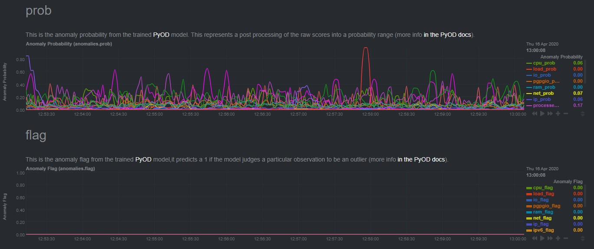
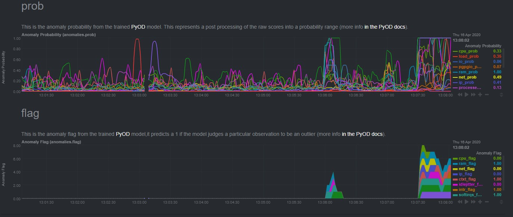

<!--
---
title: "Anomalies"
custom_edit_url: https://github.com/andrewm4894/netdata/edit/master/collectors/python.d.plugin/anomalies/README.md
---
-->

# Anomalies

Generate Anomaly Scores for specified charts based on models available from the [PyOD](https://pyod.readthedocs.io/en/latest/index.html) library.

The general idea is to view each chart as just a rolling matrix of numbers (one row per line on chart, and a column per timestep) and from that rolling matrix generate an appropriate "[feature vector](https://brilliant.org/wiki/feature-vector/)" (based on typical preprocessing like taking differences, lags, and smoothing etc) to train a PyOD model on.

Then at each timestep the most recent feature vector "X" is used to generate each of:
- **Anomaly Score** - raw anomaly score coming from the trained PyOD model (see PyOD docs [`pyod.models.base.BaseDetector.decision_function`](https://pyod.readthedocs.io/en/latest/api_cc.html#pyod.models.base.BaseDetector.decision_function)).
- **Anomaly Probability** - the anomaly score from above but transformed to by on a `[0,1]` scale and behave more like a probability (see PyOD docs [`pyod.models.base.BaseDetector.decision_function`](https://pyod.readthedocs.io/en/latest/api_cc.html#pyod.models.base.BaseDetector.predict_proba)).
- **Anomaly Flag** - A `1` if the trained PyOD model considered the observation an outlier `0` otherwise (see PyOD docs [`pyod.models.base.BaseDetector.predict`](https://pyod.readthedocs.io/en/latest/api_cc.html#pyod.models.base.BaseDetector.predict)).   

### MODEL_CONFIG

One of the main inputs is the `MODEL_CONFIG` object that defines the various parameters and settings used to initialize and train the model.

```
# an example model configuration
MODEL_CONFIG = {
    'models': {chart: CBLOF(**{'contamination': 0.001}) for chart in CHARTS_IN_SCOPE},
    'do_score': False,
    'do_prob': True,
    'do_flag': True,
    'diffs_n': 1,
    'lags_n': 2,
    'smoothing_n': 2,
    'train_max_n': 60*60,
    'train_min_n': 60,
    'train_sample_pct': 1,
    'fit_every_n': 60*5,
    'flags_min_n': 2,
    'flags_window_n': 3
}
```

- `models` - A dictionary defining a [PyOD model](https://pyod.readthedocs.io/en/latest/pyod.html) for each chart in scope.
- `do_score` - A True/False used to tell the plugin if it needs to compute and display the raw anomaly score (sometimes you may just want the probability, although it may depend on the type of model used from PyOD). 
- `do_prob` - A True/False used to tell the plugin if it needs to compute and display the anomaly probability (which is derived from the anomaly score - see PyOD docs [here](https://pyod.readthedocs.io/en/latest/api_cc.html#pyod.models.base.BaseDetector.predict_proba)).
- `do_flag` - A True/False used to tell the plugin if it needs to compute and display the anomaly flag, that is, if the PyOD model considered the latest observation to be an outlier or not. 
- `diffs_n` - An integer used if you want to preprocess the data to just train on difference's of values as opposed to the raw values from the chart. For example if you set `diffs_n=0` then models will be trained on the raw values from that charts, whereas if you set `diffs_n=1` then the data will be preprocessed and the changes in values is what the model will be trained on. For further information on differencing see [this Wikipedia page](https://en.wikipedia.org/wiki/Autoregressive_integrated_moving_average#Differencing) and [this blog post](https://machinelearningmastery.com/remove-trends-seasonality-difference-transform-python/) for some examples.  
- `lags_n` - An integer used to define if we want to include lagged values of the data in our feature vector "X". You might want to do this if you are not only interested in point anomalies (see [blog post here](https://www.anodot.com/blog/quick-guide-different-types-outliers/) for overview of different types of anomalies) but also is anomalous sub patterns in your data which you might only capture by looking across a lagged history of data points when training your model.
- `smoothing_n` - An integer used to define the extend to which we want to smooth our feature vector "X". For example if we set `smoothing_n=2` then we will train on a rolling average of 2 so as to smooth the data somewhat in the idea that this may make out trained model a little less trigger happy in response to transient spikes and jumps. 
- `data_max_n` - This is the maximum number of data points the model will keep in `self.data` for training on.
- `train_max_n` - This is the maximum number of data points from `self.data` that the model will sample when retraining models. If `data_max_n` > `train_max_n` then when retraining a sample of `train_max_n` observations from `self.data` will be used. You might use this if you wanted to have a longer history of data but still have each training job only use a certain amount of data.
- `train_min_n` - This is the minimum number of data points required to train an initial model on.
- `fit_every_n` - The schedule on which to refit the model for each chart (calls [`fit()`](https://pyod.readthedocs.io/en/latest/api_cc.html#pyod.models.base.BaseDetector.fit) method for the PyOD model).
- `flags_min_n` - Used to post process the anomaly flags from the PyOD model to smooth them out or have more control on when to raise a flag in the anomaly flag chart. For example if we set `flags_min_n=2` and `flags_window_n=4` then we will only raise a flag in the netdata anomaly flags chart if we have seen 2 or more flags from the PyOD model in the last 4 predictions. 
- `flags_window_n` - Used to determine over how many recent predictions to look when using `flags_min_n`. 

### Screenshots

So an example of how things might look when all is normal might look like below, where the anomaly probabilities are jumping around but none are really high enough to trigger an anomaly flag. 



And here is an example where some charts have consistent anomaly flags against them that might be worth exploring in more detail by navigating to the underlying charts in question.



# Notes
- There will be a 'burn in' period at the start whereby the model will be a bit noisy until it gets the opportunity to train on more data.
- As this is still an experimental feature and involves training ML models on the same host as the agent there will be some overhead cost of this plugin in terms of cpu's usage. So it might be best to initially turn this on in a setting where you can benchmark and get comfortable with the impact the plugin itself may have on the system. Probably the nicest way to use this plugin would be on a master agent where you are comfortable spending some additional resources.  
- We'd love to hear and feedback or ideas on the feature so please reach out to us at [analytics-ml-team@netdata.cloud](mailto:analytics-ml-team@netdata.cloud) if you'd like to chat. 

# Useful Links
- [PyOD Examples](https://pyod.readthedocs.io/en/latest/example.html).
- An ["Awesome" list](https://github.com/rob-med/awesome-TS-anomaly-detection) of useful anomaly detection tools and software.
- [Anomaly Detection YouTube Playlist](https://www.youtube.com/playlist?list=PL6Zhl9mK2r0KxA6rB87oi4kWzoqGd5vp0) - Playlist of useful and interesting anomaly detection related videos and talks.

# Feedback

If you have any feedback or want to chat more about anomaly detection or potential other ML features in Netdata please feel free to reach out to us at [analytics-ml-team@netdata.cloud](mailto:analytics-ml-team@netdata.cloud) 
