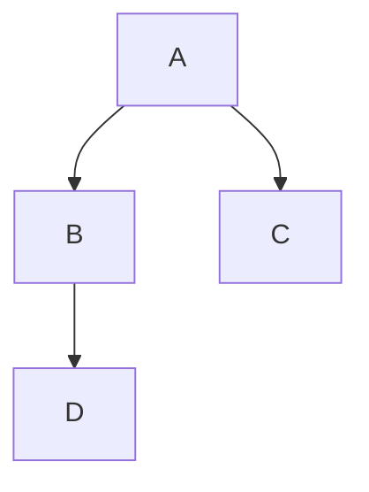

# CLAUDE.md

This file provides guidance to Claude Code (claude.ai/code) when working with documentation in this repository.

## Repository Overview

This is the main Netdata repository, documentation is mainly stored in the docs directory, but README files across the repo are used.

The current files that are published in Learn exist [here](https://github.com/netdata/learn/blob/master/map.tsv) and are pulled by a script in the documentation repository.

## Documentation Technology Stack

- **Framework**: Docusaurus 3.7.0
- **Styling**: Tailwind CSS with custom configuration
- **Content**: MDX (Markdown + JSX components)

## Styling and Components

The styling guidelines exist in the [style-guide](https://github.com/netdata/netdata/blob/master/docs/developer-and-contributor-corner/style-guide.md) and can be seen across the files used in the documentation.

### Links

When linking to a file in this repo, you should use root-relative syntax like this:

[link](/docs/CLAUDE.md)

### Mermaid Diagrams

You can also use Mermaid Diagrams where applicable

```mdx

