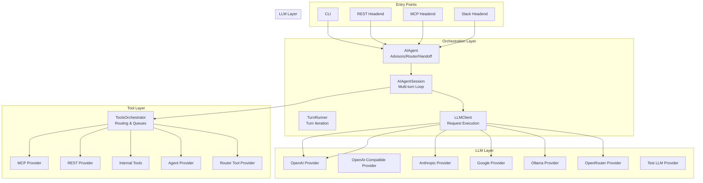
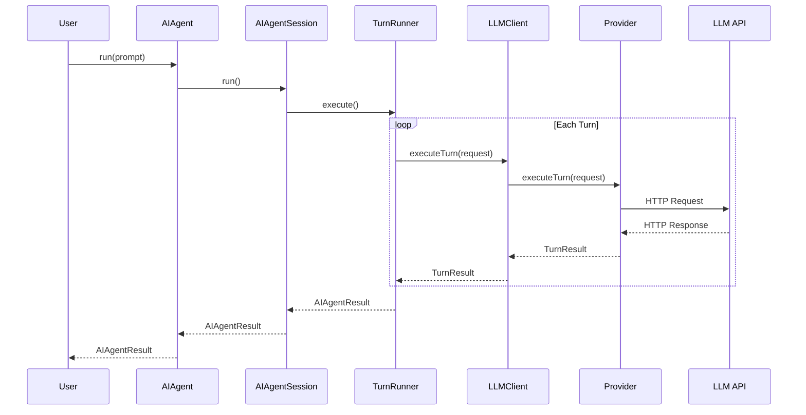
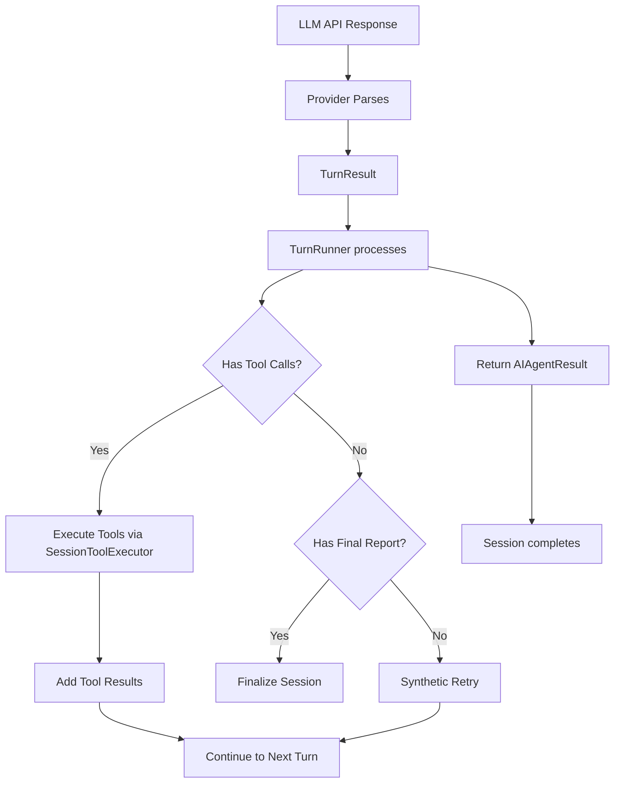

# Architecture

Layered architecture with strict separation of concerns between orchestration, LLM communication, and tool execution.

---

## Table of Contents

- [TL;DR](#tldr) - Quick summary of the architecture
- [Why This Matters](#why-this-matters) - When you need to understand architecture
- [Component Overview](#component-overview) - High-level system diagram
- [Core Components](#core-components) - Detailed component descriptions
- [Data Flow](#data-flow) - Request and response paths
- [Exit Codes](#exit-codes) - Session termination states
- [Session Configuration](#session-configuration) - Key configuration options
- [See Also](#see-also) - Related documentation

---

## TL;DR

ai-agent uses a layered architecture: **CLI/Headend** → **AIAgent** → **AIAgentSession** → **LLMClient** → **Providers**. The session orchestrates multi-turn conversations, the LLM client executes single requests, and providers handle protocol-specific communication. Tools are abstracted through the **ToolsOrchestrator** with multiple provider types (MCP, REST, internal, sub-agent).

---

## Why This Matters

Understanding the architecture helps you:

- **Debug issues**: Know which component to investigate based on symptoms
- **Add features**: Understand where new functionality belongs
- **Configure correctly**: Know what each layer controls
- **Optimize performance**: Identify bottlenecks in the right layer

---

## Component Overview



---

## Core Components

### 1. AIAgent (Orchestration Wrapper)

**File**: `src/ai-agent.ts`

**Responsibility**: Wraps the inner session loop with higher-level orchestration patterns.

| Feature      | Description                                      |
| ------------ | ------------------------------------------------ |
| **Advisors** | Parallel pre-consultation with specialist agents |
| **Router**   | Dynamic agent selection based on task            |
| **Handoff**  | Post-session delegation to another agent         |

**Lifecycle**:

1. Run advisor sessions in parallel (if configured)
2. Build enriched prompt with advisory context
3. Execute main `AIAgentSession.run()`
4. Apply router delegation (if selected)
5. Run handoff target (if configured)
6. Merge and return results

---

### 2. AIAgentSession

**File**: `src/ai-agent.ts`

**Responsibility**: Multi-turn orchestration, retry logic, context management, and tool execution.

**Key State**:

| Property            | Purpose                                       |
| ------------------- | --------------------------------------------- |
| `conversation`      | Full conversation history (messages array)    |
| `logs`              | Structured log entries for debugging          |
| `accounting`        | Token and cost tracking                       |
| `currentTurn`       | Current turn index (1-based for action turns) |
| `opTree`            | Hierarchical operation tracking for snapshots |
| `toolsOrchestrator` | Tool execution engine                         |
| `llmClient`         | LLM request executor                          |
| `finalReport`       | Captured `final_report` tool result           |

**Core Loop**:

```
for turn = 1 to maxTurns:
    select provider/model
    check context guard
    execute LLM request
    if tool calls: execute tools
    if final_report: finalize
    record accounting
```

The core loop is implemented in `TurnRunner.execute()` and invoked by `AIAgentSession.run()`.

---

### 3. LLMClient

**File**: `src/llm-client.ts`

**Responsibility**: Single LLM request execution, response parsing, and metadata collection.

**Key Operations**:

| Method                     | Purpose                                |
| -------------------------- | -------------------------------------- |
| `executeTurn(TurnRequest)` | Execute one LLM request/response cycle |
| Provider selection         | Route to correct provider by name      |
| Metadata collection        | Gather cost, routing, cache statistics |
| Pricing computation        | Calculate token costs                  |

**Registered Providers**:

| Name                | Class                    | Protocol              |
| ------------------- | ------------------------ | --------------------- |
| `openai`            | OpenAIProvider           | OpenAI API            |
| `openai-compatible` | OpenAICompatibleProvider | OpenAI-compatible API |
| `anthropic`         | AnthropicProvider        | Anthropic API         |
| `google`            | GoogleProvider           | Google AI API         |
| `openrouter`        | OpenRouterProvider       | OpenRouter API        |
| `ollama`            | OllamaProvider           | Ollama local API      |
| `test-llm`          | TestLLMProvider          | Test/mock provider    |

---

### 4. ToolsOrchestrator

**File**: `src/tools/tools.ts`

**Responsibility**: Tool discovery, schema management, execution routing, and queue management.

**Provider Types**:

| Provider             | Kind    | Description                                                                      |
| -------------------- | ------- | -------------------------------------------------------------------------------- |
| MCPProvider          | `mcp`   | Model Context Protocol tools                                                     |
| RestProvider         | `rest`  | REST/OpenAPI tools                                                               |
| InternalToolProvider | `agent` | Built-in tools (final_report, task_status, batch, progress updates)              |
| AgentProvider        | `agent` | Sub-agent invocation                                                             |
| RouterToolProvider   | `agent` | Router delegation tool (registered only when router destinations are configured) |

**Execution Flow**:

1. Validate tool exists in registry
2. Check tool response cache
3. Acquire queue slot (if queued)
4. Begin opTree operation
5. Apply timeout wrapper
6. Call `provider.execute()`
7. Record accounting
8. End opTree operation
9. Apply response size cap (via tool_output storage or truncation)

---

### 5. TurnRunner

**File**: `src/session-turn-runner.ts`

**Responsibility**: Turn iteration and retry logic, provider/model cycling, context guard evaluation, LLM call orchestration, message sanitization, final report extraction/adoption.

---

### 6. SessionTreeBuilder (OpTree)

**File**: `src/session-tree.ts`

**Responsibility**: Hierarchical operation tracking for debugging and snapshots.

**Structure**:

```
Session
├── Turn 0 (system setup)
│   ├── Op: init
│   └── Op: fin
├── Turn 1
│   ├── Op: llm (attempt 1)
│   │   └── latency, tokens, status
│   ├── Op: tool (call 1)
│   │   └── latency, result
│   └── Op: tool (call 2)
├── Turn 2
│   └── ...
└── Turn N
    └── Op: llm (final)
```

---

## Data Flow

### Request Flow (User → LLM)



### Response Processing



---

## Exit Codes

Session termination states returned in `AIAgentResult.exitCode`.

### Success States

| Exit Code                      | Description                                   |
| ------------------------------ | --------------------------------------------- |
| `EXIT-FINAL-ANSWER`            | Agent called `final_report` tool successfully |
| `EXIT-MAX-TURNS-WITH-RESPONSE` | Max turns reached with valid response         |
| `EXIT-USER-STOP`               | User-initiated graceful stop                  |

### LLM Failure States

| Exit Code              | Description                             |
| ---------------------- | --------------------------------------- |
| `EXIT-NO-LLM-RESPONSE` | No response received from any provider  |
| `EXIT-EMPTY-RESPONSE`  | Empty response after all retries        |
| `EXIT-AUTH-FAILURE`    | Authentication failed (API key invalid) |
| `EXIT-QUOTA-EXCEEDED`  | Account quota exceeded                  |
| `EXIT-MODEL-ERROR`     | Model returned an error                 |

### Tool Failure States

| Exit Code                  | Description                     |
| -------------------------- | ------------------------------- |
| `EXIT-TOOL-FAILURE`        | Critical tool execution failed  |
| `EXIT-MCP-CONNECTION-LOST` | MCP server disconnected         |
| `EXIT-TOOL-NOT-AVAILABLE`  | Requested tool not in registry  |
| `EXIT-TOOL-TIMEOUT`        | Tool execution exceeded timeout |

### Configuration States

| Exit Code              | Description                      |
| ---------------------- | -------------------------------- |
| `EXIT-NO-PROVIDERS`    | No LLM providers configured      |
| `EXIT-INVALID-MODEL`   | Specified model not available    |
| `EXIT-MCP-INIT-FAILED` | MCP server initialization failed |

### Limit States

| Exit Code                    | Description                           |
| ---------------------------- | ------------------------------------- |
| `EXIT-INACTIVITY-TIMEOUT`    | Session inactive too long             |
| `EXIT-MAX-RETRIES`           | Max retries exhausted without success |
| `EXIT-TOKEN-LIMIT`           | Token limit exceeded                  |
| `EXIT-MAX-TURNS-NO-RESPONSE` | Max turns without valid response      |

### Unexpected States

| Exit Code                 | Description        |
| ------------------------- | ------------------ |
| `EXIT-UNCAUGHT-EXCEPTION` | Uncaught exception |
| `EXIT-SIGNAL-RECEIVED`    | Signal received    |
| `EXIT-UNKNOWN`            | Unknown error      |

---

## Session Configuration

Key configuration options that affect architecture behavior.

| Setting                | Type        | Description                                 |
| ---------------------- | ----------- | ------------------------------------------- |
| `targets`              | Array       | Model fallback chain (provider/model pairs) |
| `systemPrompt`         | String      | System prompt template                      |
| `maxTurns`             | Number      | Maximum action turns (default: 10)          |
| `maxRetries`           | Number      | Max retries per turn (default: 3)           |
| `toolTimeout`          | Number      | Tool execution timeout in ms                |
| `toolResponseMaxBytes` | Number      | Max tool response size before storage       |
| `abortSignal`          | AbortSignal | Cancellation signal                         |
| `callbacks`            | Object      | Event callbacks for streaming               |

---

## Key Design Decisions

1. **Layered Isolation**: Each layer only knows about its immediate dependencies
2. **Provider Abstraction**: LLM providers share a common interface
3. **Tool Abstraction**: All tools (MCP, REST, sub-agent) share a common interface
4. **Stateless Providers**: Providers hold no session state
5. **Session Owns State**: All session state lives in `AIAgentSession`

---

## See Also

- [Session Lifecycle](Technical-Specs-Session-Lifecycle) - Detailed session execution flow
- [Tool System](Technical-Specs-Tool-System) - Tool provider internals
- [Context Management](Technical-Specs-Context-Management) - Token budget management
- [Design History](Technical-Specs-Design-History) - Why these decisions were made
- [specs/architecture.md](specs/architecture.md) - Full specification
