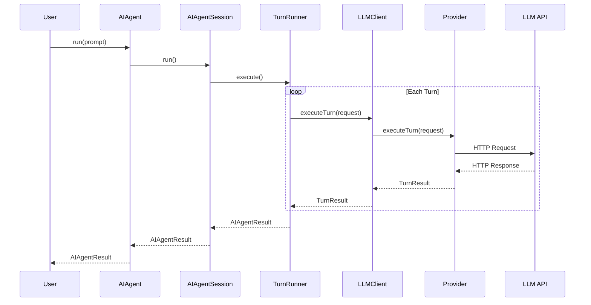
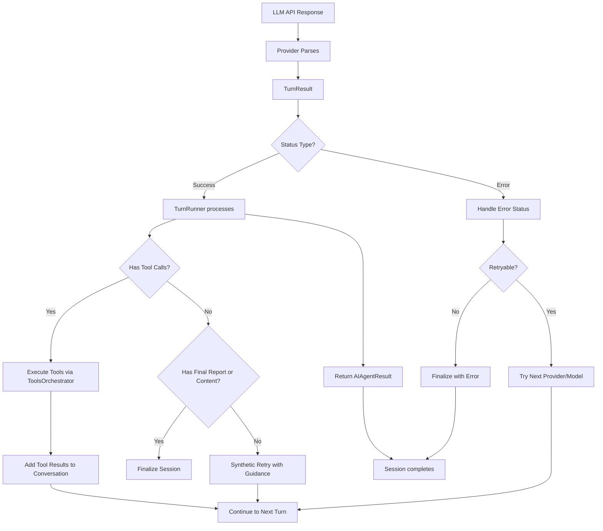

# Architecture

Layered architecture with strict separation of concerns between orchestration, LLM communication, and tool execution.

---

## Table of Contents

- [TL;DR](#tldr) - Quick summary of the architecture
- [Why This Matters](#why-this-matters) - When you need to understand architecture
- [Component Overview](#component-overview) - High-level system diagram
- [Core Components](#core-components) - Detailed component descriptions
- [Data Flow](#data-flow) - Request and response paths
- [Exit Codes](#exit-codes) - Session termination states
- [Session Configuration](#session-configuration) - Key configuration options
- [See Also](#see-also) - Related documentation

---

## TL;DR

ai-agent uses a layered architecture: **Entry Points** (CLI/Headends) → **AIAgent** (Orchestration Wrapper) → **AIAgentSession** (Multi-turn Loop with TurnRunner) → **LLMClient** → **Providers**. The session orchestrates multi-turn conversations via TurnRunner.execute(), the LLM client executes single requests, and providers handle protocol-specific communication. Tools are abstracted through the **ToolsOrchestrator** with multiple provider types (MCP, REST, internal, sub-agent, router, tool-output).

---

## Why This Matters

Understanding the architecture helps you:

- **Debug issues**: Know which component to investigate based on symptoms
- **Add features**: Understand where new functionality belongs
- **Configure correctly**: Know what each layer controls
- **Optimize performance**: Identify bottlenecks in the right layer

---

## Component Overview

```mermaid
graph TB
    subgraph "Entry Points"
        CLI[CLI]
        REST[REST Headend]
        MCP[MCP Headend]
        Slack[Slack Headend]
        Embed[Embed Headend]
        OpenAIHeadend[OpenAI Headend]
        AnthropicHeadend[Anthropic Headend]
    end

    subgraph "Orchestration Layer"
        AIAgent[AIAgent<br/>Advisors/Router/Handoff]
        Session[AIAgentSession<br/>Multi-turn Loop<br/>TurnRunner.execute()]
        LLMClient[LLMClient<br/>Request Execution]
        end

    subgraph "LLM Layer"
        OpenAI[OpenAI Provider]
        OpenAICompat[OpenAI-Compatible Provider]
        Anthropic[Anthropic Provider]
        Google[Google Provider]
        Ollama[Ollama Provider]
        OpenRouter[OpenRouter Provider]
        TestLLM[Test LLM Provider]
        end

     subgraph "Tool Layer"
        ToolsOrch[ToolsOrchestrator<br/>Routing & Queues]
        MCPProv[MCP Provider]
        RESTProv[REST Provider]
        InternalProv[Internal Tools]
        AgentProv[Sub-Agent Provider]
        RouterProv[Router Tool Provider]
        ToolOutputProv[Tool Output Provider]
        end

    CLI --> AIAgent
    REST --> AIAgent
    MCP --> AIAgent
    Slack --> AIAgent
    Embed --> AIAgent
    OpenAIHeadend --> AIAgent
    AnthropicHeadend --> AIAgent

    AIAgent --> Session
    Session --> LLMClient
    Session --> ToolsOrch

    LLMClient --> OpenAI
    LLMClient --> OpenAICompat
    LLMClient --> Anthropic
    LLMClient --> Google
    LLMClient --> Ollama
    LLMClient --> OpenRouter
    LLMClient --> TestLLM

    ToolsOrch --> MCPProv
    ToolsOrch --> RESTProv
    ToolsOrch --> InternalProv
    ToolsOrch --> AgentProv
    ToolsOrch --> RouterProv
    ToolsOrch --> ToolOutputProv
```

---

## Core Components

### 1. AIAgent (Orchestration Wrapper)

**File**: `src/ai-agent.ts`

**Responsibility**: Wraps the inner session loop with higher-level orchestration patterns.

| Feature      | Description                                      |
| ------------ | ------------------------------------------------ |
| **Advisors** | Parallel pre-consultation with specialist agents |
| **Router**   | Dynamic agent selection based on task            |
| **Handoff**  | Post-session delegation to another agent         |

**Lifecycle**:

1. Run advisor sessions in parallel (if configured)
2. Build enriched prompt with advisory context
3. Execute main `AIAgentSession.run()`
4. Apply router delegation (if selected)
5. Run handoff target (if configured)
6. Merge and return results

---

### 2. AIAgentSession

**File**: `src/ai-agent.ts`

**Responsibility**: Multi-turn orchestration, retry logic, context management, and tool execution.

**Key State**:

| Property                | Purpose                                                              |
| ----------------------- | -------------------------------------------------------------------- |
| `conversation`          | Full conversation history (messages array)                           |
| `logs`                  | Structured log entries for debugging                                 |
| `accounting`            | Token and cost tracking                                              |
| `currentTurn`           | Current turn index (1-based for action turns)                        |
| `opTree`                | Hierarchical operation tracking for snapshots                        |
| `toolsOrchestrator`     | Tool execution engine                                                |
| `llmClient`             | LLM request executor                                                 |
| `finalReport`           | Captured `final_report` tool result (via FinalReportManager)         |
| `targetContextConfigs`  | Per-model context window and buffer settings                         |
| `forcedFinalTurnReason` | Context guard enforcement state (context/max_turns/task_status/etc.) |
| `pendingToolSelection`  | Cached tool selection for current turn (planned subturns tracking)   |

**Core Loop**:

```
for turn = 1 to maxTurns:
    select provider/model
    check context guard
    execute LLM request
    if tool calls: execute tools
    if final_report: finalize
    record accounting
```

The core loop is implemented in `TurnRunner.execute()` and invoked by `AIAgentSession.run()`.

---

### 3. LLMClient

**File**: `src/llm-client.ts`

**Responsibility**: Single LLM request execution, response parsing, and metadata collection.

**Key Operations**:

| Method                     | Purpose                                |
| -------------------------- | -------------------------------------- |
| `executeTurn(TurnRequest)` | Execute one LLM request/response cycle |
| Provider selection         | Route to correct provider by name      |
| Metadata collection        | Gather cost, routing, cache statistics |
| Pricing computation        | Calculate token costs                  |

**Registered Providers**:

| Name                | Class                    | Protocol              |
| ------------------- | ------------------------ | --------------------- |
| `openai`            | OpenAIProvider           | OpenAI API            |
| `openai-compatible` | OpenAICompatibleProvider | OpenAI-compatible API |
| `anthropic`         | AnthropicProvider        | Anthropic API         |
| `google`            | GoogleProvider           | Google AI API         |
| `openrouter`        | OpenRouterProvider       | OpenRouter API        |
| `ollama`            | OllamaProvider           | Ollama local API      |
| `test-llm`          | TestLLMProvider          | Test/mock provider    |

**Key Operations**:

| Method                     | Purpose                                   |
| -------------------------- | ----------------------------------------- |
| `executeTurn(TurnRequest)` | Execute one LLM request/response cycle    |
| `setTurn(turn, subturn)`   | Set current turn/subturn for logging      |
| `waitForMetadataCapture()` | Await all async metadata collection tasks |
| Provider selection         | Route to correct provider by name         |
| Metadata collection        | Gather cost, routing, cache statistics    |
| Pricing computation        | Calculate token costs                     |

---

### 4. ToolsOrchestrator

**File**: `src/tools/tools.ts`

**Responsibility**: Tool discovery, schema management, execution routing, queue management, and execution lifecycle management.

**Provider Types**:

| Provider             | Kind    | Description                                                                       |
| -------------------- | ------- | --------------------------------------------------------------------------------- |
| MCPProvider          | `mcp`   | Model Context Protocol tools                                                      |
| RestProvider         | `rest`  | REST/OpenAPI tools                                                                |
| InternalToolProvider | `agent` | Built-in tools (final_report, task_status, batch, progress updates)               |
| AgentProvider        | `agent` | Sub-agent invocation                                                              |
| RouterToolProvider   | `agent` | Router delegation tool (registered only when router destinations are configured)  |
| ToolOutputProvider   | `agent` | Tool output storage and retrieval (registered when tool output config is enabled) |

**Registered Tool Providers**:

| Provider             | Namespace     | Tools Managed                                                               |
| -------------------- | ------------- | --------------------------------------------------------------------------- |
| MCPProvider          | `mcp`         | Model Context Protocol servers (stdio/websocket/http/sse)                   |
| RestProvider         | `rest`        | REST/OpenAPI endpoints (frontmatter-selected)                               |
| InternalToolProvider | `agent`       | Built-in: final_report, task_status, batch, progress, title                 |
| AgentProvider        | `subagent`    | Sub-agent tool invocations (registered via SubAgentRegistry)                |
| RouterToolProvider   | `agent`       | router\_\_handoff-to (registered only when router.destinations configured)  |
| ToolOutputProvider   | `tool-output` | tool_output tool for storage/retrieval (registered when toolOutput.enabled) |

**Execution Flow**:

1. Validate tool exists in registry (with alias resolution)
2. Check tool response cache (for MCP/REST tools)
3. Acquire queue slot (if queued for tool kind)
4. Begin opTree operation (kind='tool' or kind='session' for sub-agents)
5. Apply timeout wrapper (skipped for session-type tools)
6. Call `provider.execute()`
7. Handle cache hits and store new entries
8. Apply response size cap (via tool_output storage or truncation)
9. Reserve token budget for output
10. Record accounting and metrics
11. End opTree operation

---

### 5. SessionTreeBuilder (OpTree)

**File**: `src/session-tree.ts`

**Responsibility**: Hierarchical operation tracking for debugging and snapshots.

**Structure**:

```
Session
├── Turn 0 (system setup)
│   ├── Op: init
│   └── Op: fin
├── Turn 1
│   ├── Op: llm (attempt 1)
│   │   └── latency, tokens, status
│   ├── Op: tool (call 1)
│   │   └── latency, result
│   └── Op: tool (call 2)
├── Turn 2
│   └── ...
└── Turn N
    └── Op: llm (final)
```

---

## Data Flow

### Request Flow (User → LLM)



### Response Processing



---

## Exit Codes

Session termination states returned in `AIAgentResult.exitCode`.

### Success States

| Exit Code                      | Description                                   |
| ------------------------------ | --------------------------------------------- |
| `EXIT-FINAL-ANSWER`            | Agent called `final_report` tool successfully |
| `EXIT-MAX-TURNS-WITH-RESPONSE` | Max turns reached with valid response         |
| `EXIT-USER-STOP`               | User-initiated graceful stop                  |

### LLM Failure States

| Exit Code              | Description                             |
| ---------------------- | --------------------------------------- |
| `EXIT-NO-LLM-RESPONSE` | No response received from any provider  |
| `EXIT-EMPTY-RESPONSE`  | Empty response after all retries        |
| `EXIT-AUTH-FAILURE`    | Authentication failed (API key invalid) |
| `EXIT-QUOTA-EXCEEDED`  | Account quota exceeded                  |
| `EXIT-MODEL-ERROR`     | Model returned an error                 |

### Tool Failure States

| Exit Code                  | Description                     |
| -------------------------- | ------------------------------- |
| `EXIT-TOOL-FAILURE`        | Critical tool execution failed  |
| `EXIT-MCP-CONNECTION-LOST` | MCP server disconnected         |
| `EXIT-TOOL-NOT-AVAILABLE`  | Requested tool not in registry  |
| `EXIT-TOOL-TIMEOUT`        | Tool execution exceeded timeout |

### Configuration States

| Exit Code              | Description                      |
| ---------------------- | -------------------------------- |
| `EXIT-NO-PROVIDERS`    | No LLM providers configured      |
| `EXIT-INVALID-MODEL`   | Specified model not available    |
| `EXIT-MCP-INIT-FAILED` | MCP server initialization failed |

### Limit States

| Exit Code                    | Description                           |
| ---------------------------- | ------------------------------------- |
| `EXIT-INACTIVITY-TIMEOUT`    | Session inactive too long             |
| `EXIT-MAX-RETRIES`           | Max retries exhausted without success |
| `EXIT-TOKEN-LIMIT`           | Token limit exceeded                  |
| `EXIT-MAX-TURNS-NO-RESPONSE` | Max turns without valid response      |

### Unexpected States

| Exit Code                 | Description        |
| ------------------------- | ------------------ |
| `EXIT-UNCAUGHT-EXCEPTION` | Uncaught exception |
| `EXIT-SIGNAL-RECEIVED`    | Signal received    |
| `EXIT-UNKNOWN`            | Unknown error      |

---

## Session Configuration

Key configuration options that affect architecture behavior.

| Setting                       | Type                    | Description                                       |
| ----------------------------- | ----------------------- | ------------------------------------------------- | ------------------------------- | ----- | ------- | ------------ | ------------- |
| `targets`                     | Array                   | Model fallback chain (provider/model pairs)       |
| `systemPrompt`                | String                  | System prompt template                            |
| `userPrompt`                  | String                  | User prompt                                       |
| `maxTurns`                    | Number                  | Maximum action turns (default: 10)                |
| `maxRetries`                  | Number                  | Max retries per turn (default: 3)                 |
| `maxToolCallsPerTurn`         | Number                  | Max tool calls per turn                           |
| `toolTimeout`                 | Number                  | Tool execution timeout in ms                      |
| `toolResponseMaxBytes`        | Number                  | Max tool response size before storage             |
| `llmTimeout`                  | Number                  | LLM request timeout in ms                         |
| `toolOutput`                  | Object                  | tool_output module overrides                      |
| `abortSignal`                 | AbortSignal             | Cancellation signal                               |
| `stopRef`                     | `{ stopping: boolean; reason?: 'stop' \| 'abort' \| 'shutdown' }` | Stop signal with reason |
| `callbacks`                   | Object                  | Event callbacks for streaming and accounting      |
| `temperature`                 | Number                  | null                                              | Sampling temperature            |
| `topP`                        | Number                  | null                                              | Top-p sampling                  |
| `topK`                        | Number                  | null                                              | Top-k sampling                  |
| `repeatPenalty`               | Number                  | null                                              | Repeat penalty                  |
| `maxOutputTokens`             | Number                  | Max output tokens                                 |
| `reasoning`                   | ReasoningLevel          | Extended thinking level (minimal/low/medium/high) |
| `reasoningValue`              | ProviderReasoningValue  | null                                              | Direct reasoning value override |
| `stream`                      | Boolean                 | Enable streaming                                  |
| `traceLLM`                    | Boolean                 | Enable LLM request/response tracing               |
| `traceMCP`                    | Boolean                 | Enable MCP tool tracing                           |
| `traceSdk`                    | Boolean                 | Enable Vercel AI SDK tracing                      |
| `verbose`                     | Boolean                 | Verbose logging                                   |
| `caching`                     | CachingMode             | Cache mode                                        |
| `outputFormat`                | OutputFormatId          | Output format identifier                          |
| `renderTarget`                | `'cli'                  | 'slack'                                           | 'api'                           | 'web' | 'embed' | 'sub-agent'` | Render target |
| `agentId`                     | String                  | Agent identifier                                  |
| `agentPath`                   | String                  | Agent path in hierarchy                           |
| `callPath` (in trace)         | String                  | Call path for tracing                             |
| `headendId`                   | String                  | Headend identifier                                |
| `headendWantsProgressUpdates` | Boolean                 | Enable progress updates for headends              |
| `telemetryLabels`             | Record<string, string>  | Custom telemetry labels                           |
| `conversationHistory`         | Array                   | Initial conversation history                      |
| `expectedOutput`              | Object                  | Expected output spec (format, schema)             |
| `initialTitle`                | String                  | Pre-set session title                             |
| `mcpInitConcurrency`          | Number                  | MCP initialization concurrency override           |
| `contextWindow`               | Number                  | Override context window for all targets           |
| `cacheTtlMs`                  | Number                  | Cache TTL in milliseconds                         |
| `ancestors`                   | Array                   | Ancestor agent paths for recursion prevention     |

---

## Key Design Decisions

1. **Layered Isolation**: Each layer only knows about its immediate dependencies
2. **Provider Abstraction**: LLM providers share a common interface
3. **Tool Abstraction**: All tools (MCP, REST, sub-agent, router, tool-output) share a common interface via `ToolProvider`
4. **Stateless Providers**: Providers hold no session state
5. **Session Owns State**: All session state lives in `AIAgentSession`
6. **Complete Session Autonomy**: Each session is completely independent with zero shared state - orchestration (advisors/router/handoff) is layered outside the session loop so session itself stays pure and isolated

---

## See Also

- [specs/architecture.md](specs/architecture.md) - Full architecture specification
- [specs/DESIGN.md](specs/DESIGN.md) - Core design principles and separation of concerns
- [specs/session-lifecycle.md](specs/session-lifecycle.md) - Session execution flow
- [specs/tools-overview.md](specs/tools-overview.md) - Tool system internals
- [specs/context-management.md](specs/context-management.md) - Token budget management
