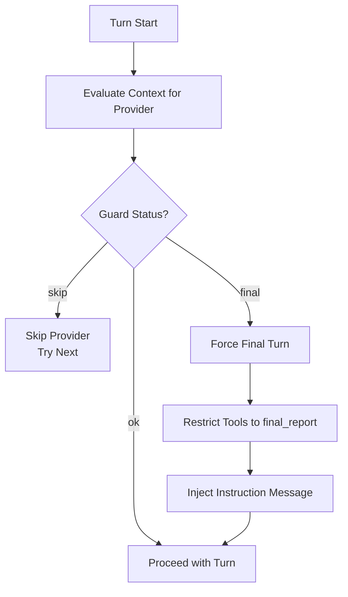

# Context Management

Token budget tracking, context guard enforcement, and overflow handling to prevent LLM context window overflow.

---

## Table of Contents

- [TL;DR](#tldr) - Quick summary of context management
- [Why This Matters](#why-this-matters) - When context management affects you
- [Core Concepts](#core-concepts) - Key terms and counters
- [Context Guard Algorithm](#context-guard-algorithm) - How limits are enforced
- [Limit Calculation](#limit-calculation) - How budgets are computed
- [Token Estimation](#token-estimation) - How tokens are counted
- [Tool Budget Management](#tool-budget-management) - Tool output handling
- [Configuration Options](#configuration-options) - Settings that affect context
- [Debug Mode](#debug-mode) - Troubleshooting context issues
- [Troubleshooting](#troubleshooting) - Common problems and solutions
- [See Also](#see-also) - Related documentation

---

## TL;DR

ai-agent tracks token usage across the conversation and enforces limits before they cause LLM API errors. When approaching the context window limit, the guard forces a final turn (tools restricted to `final_report` only). Tool outputs that exceed size limits are stored on disk and replaced with handles.

---

## Why This Matters

Context management affects you when:

- **Session ends unexpectedly**: Context guard forced a final turn
- **Tools stop executing**: Tool budget exceeded
- **Large responses stored**: Tool output exceeded size limit
- **Provider errors**: Context window overflow at the API level

Understanding these mechanisms helps you:

- Configure appropriate limits for your use case
- Debug "unexpected final turn" scenarios
- Optimize token usage for longer conversations
- Handle large tool outputs gracefully

---

## Core Concepts

### Token Counters

The session tracks multiple token counters to project usage.

```mermaid
graph LR
    subgraph "Current State"
        Current[currentCtxTokens<br/>Committed conversation]
    end

    subgraph "Pending"
        Pending[pendingCtxTokens<br/>Uncommitted outputs]
        New[newCtxTokens<br/>New this turn]
    end

    subgraph "Overhead"
        Schema[schemaCtxTokens<br/>Tool schemas]
    end

    subgraph "Projection"
        Projected[projected tokens<br/>Sum of all]
    end

    Current --> Projected
    Pending --> Projected
    New --> Projected
    Schema --> Projected
```

| Counter                  | Description                                                   | Updated When                                                        |
| ------------------------ | ------------------------------------------------------------- | ------------------------------------------------------------------- |
| `currentCtxTokens`       | Tokens in committed conversation                              | After turn completes (includes previous turn's input/output/schema) |
| `pendingCtxTokens`       | Tokens pending commit (seed conversation at turn start)       | Set at turn start, committed on turn completion                     |
| `newCtxTokens`           | New tokens added this turn (tool outputs, assistant messages) | During turn (accumulated during turn execution)                     |
| `schemaCtxTokens`        | Tool schema token estimate (scaled × 2.09)                    | When tools change (before each LLM request)                         |
| `currentReasoningTokens` | Reasoning/thinking budget tokens for display/logging only     | At turn start (not used in projection)                              |

### Guard Triggers

| Trigger          | When Checked                  | Action if Exceeded                                                                                                                                                                                                                                        |
| ---------------- | ----------------------------- | --------------------------------------------------------------------------------------------------------------------------------------------------------------------------------------------------------------------------------------------------------- |
| `turn_preflight` | Before each LLM request       | Evaluates context projection and returns:<br/>• `final`: Force final turn (all providers blocked)<br/>• `skip`: Skip this provider, try next<br/>• `ok`: Proceed<br/>Special case: If only schema tokens overflow and base projection fits, allow request |
| `tool_preflight` | During tool output evaluation | Returns failure with `toolBudgetExceeded` flag, causing tool outputs to be replaced with failure messages and enforcement of final turn                                                                                                                   |

---

## Context Guard Algorithm

### Pre-Turn Evaluation

Before each LLM request, the guard evaluates whether the context fits.



**Special Case**: If only schema tokens overflow and base projection (without schema) fits within limit, the guard returns `ok` and allows the request to proceed.

### Projection Formula

```
projected = currentCtxTokens + pendingCtxTokens + newCtxTokens + extraTokens
limit = contextWindow - bufferTokens - maxOutputTokens

if projected > limit:
    trigger guard enforcement
```

**Note**: `schemaCtxTokens` is tracked separately but is already included in `currentCtxTokens` after the first turn (via cache_write/cache_read). On the first turn, projection is slightly underestimated; subsequent turns are accurate.

### Enforcement Actions

When the guard triggers:

| Step | Action                                       |
| ---- | -------------------------------------------- |
| 1    | Set `forcedFinalTurnReason = 'context'`      |
| 2    | Log context guard enforcement                |
| 3    | Commit pending tokens to current             |
| 4    | Reset new tokens counter                     |
| 5    | Restrict tools to `agent__final_report` only |
| 6    | Emit telemetry event                         |

---

## Limit Calculation

### Effective Limit Formula

```
effectiveLimit = contextWindow - bufferTokens - maxOutputTokens
```

**Example Calculation**:

| Setting            | Value       |
| ------------------ | ----------- |
| contextWindow      | 128,000     |
| bufferTokens       | 8,192       |
| maxOutputTokens    | 16,384      |
| **effectiveLimit** | **103,424** |

### Max Output Tokens Calculation

When `maxOutputTokens` is not explicitly configured, it defaults to one quarter of the context window:

```
maxOutputTokens = floor(contextWindow / 4)
```

### Context Window Resolution

The context window value is resolved from multiple sources (first defined wins):

| Priority | Source                          | Example            |
| -------- | ------------------------------- | ------------------ |
| 1        | `modelConfig.contextWindow`     | Per-model override |
| 2        | `providerConfig.contextWindow`  | Provider default   |
| 3        | `DEFAULT_CONTEXT_WINDOW_TOKENS` | 131,072 (fallback) |

### Buffer Resolution

| Priority | Source                                     | Default |
| -------- | ------------------------------------------ | ------- |
| 1        | `modelConfig.contextWindowBufferTokens`    | -       |
| 2        | `providerConfig.contextWindowBufferTokens` | -       |
| 3        | `defaults.contextWindowBufferTokens`       | -       |
| 4        | `DEFAULT_CONTEXT_BUFFER_TOKENS`            | 8192    |

---

## Token Estimation

### Estimation Methods

| Method          | Accuracy | Speed  | Used When                                          |
| --------------- | -------- | ------ | -------------------------------------------------- |
| Tokenizer-based | High     | Slower | Tokenizer configured (tiktoken, anthropic, gemini) |
| Character-based | Low      | Fast   | Always computed as fallback or comparison          |

**Combined approach**: Uses `Math.max(tokenizerResult, characterApproximation)` to get the higher of both estimates.

**Character-based approximation**: `tokens ≈ characters / 4` (via `Math.ceil(text.length / 4)`)

### Tokenizer Configuration

```yaml
providers:
  openai:
    models:
      gpt-4:
        tokenizer: "tiktoken:cl100k_base" # or "tiktoken:gpt-4"
```

Supported tokenizer prefixes:

- `tiktoken:<model>` - OpenAI-compatible models
- `anthropic` or `claude:` - Anthropic models
- `gemini`, `google:gemini`, `google-gemini` - Google models
- `approximate` - Force character-based approximation

### What Gets Estimated

| Content            | Estimation                                                     |
| ------------------ | -------------------------------------------------------------- |
| System prompt      | At session start                                               |
| User message       | At session start                                               |
| Assistant messages | After LLM response                                             |
| Tool results       | Before commit, using maximum of all configured tokenizers      |
| Tool schemas       | When tools change (scaled × 2.09)                              |
| Reasoning/thinking | Set at turn start for display/logging only (not in projection) |

---

## Tool Budget Management

### Tool Output Size Handling

Tool outputs exceeding size limits are handled through the ToolOutputExtractor with multiple modes:

| Mode           | Description                                                             |
| -------------- | ----------------------------------------------------------------------- |
| `auto`         | Automatically selects strategy based on content size and configuration  |
| `full-chunked` | Splits large output into chunks for processing via LLM calls            |
| `read-grep`    | Uses filesystem tools (Read, Grep) to extract information               |
| `truncate`     | Falls back to truncation with a truncation marker when other modes fail |

The `toolResponseMaxBytes` setting controls the size threshold for tool output handling. When outputs exceed this limit, the ToolOutputExtractor determines the appropriate strategy to manage the content.

Tool budget callbacks provide an interface for the tools orchestrator to:

- `reserveToolOutput`: Reserve tokens for tool output before execution
- `previewToolOutput`: Preview token cost without reserving
- `canExecuteTool`: Check if more tools can execute
- `countTokens`: Estimate tokens for arbitrary text

Once `toolBudgetExceeded` is set, `canExecuteTool()` returns `false` and the orchestrator skips remaining tool calls.

---

## Configuration Options

| Setting                     | Type   | Default | Effect                                                                       |
| --------------------------- | ------ | ------- | ---------------------------------------------------------------------------- |
| `contextWindow`             | number | 131,072 | Total token capacity (fallback if not set)                                   |
| `contextWindowBufferTokens` | number | 8,192   | Safety margin from context window                                            |
| `maxOutputTokens`           | number | 4,096   | Reserved for LLM response (or defaults to floor(contextWindow/4) if not set) |
| `tokenizer`                 | string | -       | Tokenizer ID for estimation accuracy                                         |
| `toolResponseMaxBytes`      | number | 12,288  | Size threshold for tool output handling                                      |
| `reasoning`                 | enum   | -       | Enables extended thinking for capable models                                 |

### Example Configuration

```yaml
providers:
  openai:
    contextWindow: 128000
    models:
      gpt-4-turbo:
        maxOutputTokens: 16384
        contextWindow: 128000

defaults:
  toolResponseMaxBytes: 12288
  maxOutputTokens: 16384
```

---

## Debug Mode

Enable detailed context guard logging with environment variable.

**Enable**: `CONTEXT_DEBUG=true`

### Debug Topics

| Topic                           | Information                                            |
| ------------------------------- | ------------------------------------------------------ |
| `context-guard/init-counters`   | Initial token counts (current, pending, new, schema)   |
| `context-guard/loop-init`       | Per-turn initialization with seed conversation tokens  |
| `context-guard/schema-estimate` | Tool schema token estimate (scaled × 2.09)             |
| `context-guard/evaluate`        | Full projection with current/pending/new/schema tokens |
| `context-guard/evaluate-target` | Per-target limit calculation                           |
| `context-guard/provider-eval`   | Per-provider evaluation status (ok/skip/final)         |
| `context-guard/build-metrics`   | Context metrics for LLM request                        |
| `context-guard/enforce`         | Guard enforcement event with blocked entries           |

### Example Debug Output

**Provider evaluation**:

```
context-guard/provider-eval {
  provider: 'openai',
  model: 'gpt-4',
  blocked: [
    {
      provider: 'openai',
      model: 'gpt-4',
      limit: 111360,
      projected: 50000
    }
  ]
}
```

**Full evaluation**:

```
context-guard/evaluate {
  projectedTokens: 50000,
  currentCtxTokens: 45000,
  pendingCtxTokens: 2000,
  newCtxTokens: 0,
  schemaCtxTokens: 3000,
  extraTokens: 0,
  currentReasoningTokens: 0
}
```

**Per-target evaluation**:

```
context-guard/evaluate-target {
  provider: 'openai',
  model: 'gpt-4',
  contextWindow: 128000,
  bufferTokens: 8192,
  maxOutputTokens: 16384,
  limit: 103424
}
```

---

## Troubleshooting

### Unexpected Final Turn

**Symptom**: Session ends with "context guard enforced" message.

**Causes**:

- Context window setting too low
- Buffer tokens too large
- Tool schemas consuming budget
- Large tool outputs accumulated

**Solutions**:

1. Check `contextWindow` matches your model's actual limit
2. Reduce `contextWindowBufferTokens` (carefully)
3. Use `toolsAllowed`/`toolsDenied` to limit tools
4. Configure `toolResponseMaxBytes` to truncate large outputs early

### Token Count Mismatch

**Symptom**: Estimated tokens differ significantly from provider-reported.

**Causes**:

- No tokenizer configured (character approximation used)
- Wrong tokenizer for model
- Provider counts differently
- Estimation uses `Math.max(tokenizer, char_approx)` which may overestimate

**Solutions**:

1. Configure correct tokenizer for your model
2. Compare with actual provider token counts
3. Adjust buffer tokens to account for variance

### Tool Budget Exceeded

**Symptom**: Tools stop executing mid-turn.

**Causes**:

- Large tool outputs consuming context
- Many tool calls in single turn
- Accumulated conversation history

**Solutions**:

1. Lower `toolResponseMaxBytes` to truncate large outputs early
2. Increase `contextWindow` if model supports it
3. Review tool output sizes
4. Consider breaking into multiple sessions

### Post-Shrink Still Over Limit

**Symptom**: "Still over limit after shrink" warning.

**Cause**: Even with only `final_report` tool, context exceeds limit.

**Behavior**: Session proceeds best-effort (may fail at API level).

**Solutions**:

1. Increase context window
2. Review conversation history size
3. Use more aggressive context management earlier

---

## Invariants

These rules MUST hold:

1. **Guarded overflow**: When projections exceed limit, guard forces final turn
2. **Buffer preserved**: `bufferTokens` always subtracted from capacity
3. **Output space reserved**: `maxOutputTokens` always carved out
4. **Monotonic growth**: Counters only increase until turn commits
5. **Final turn enforcement**: Triggered BEFORE next LLM/tool execution
6. **Reasoning included**: Reasoning/thinking tokens are INSIDE `maxOutputTokens`, not added on top

---

## See Also

- [Session Lifecycle](Technical-Specs-Session-Lifecycle) - When context is checked
- [Tool System](Technical-Specs-Tool-System) - Tool output handling
- [Agent-Files-Behavior](Agent-Files-Behavior) - Configuration options
- [specs/context-management.md](specs/context-management.md) - Full specification
