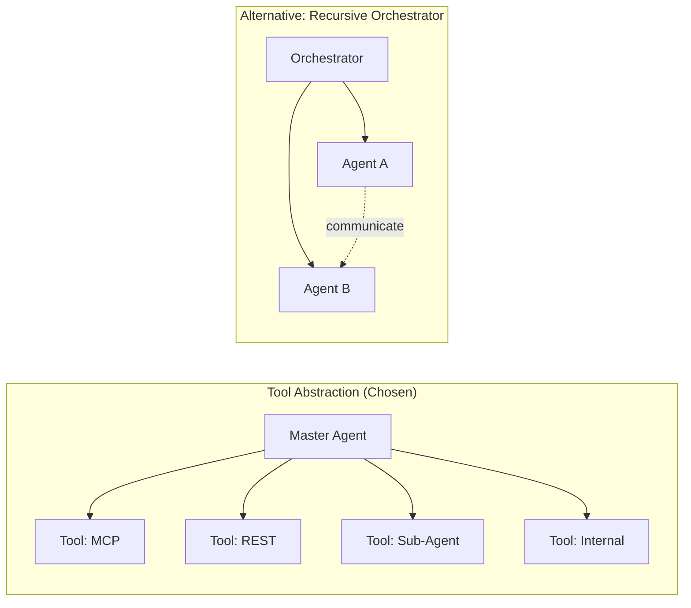
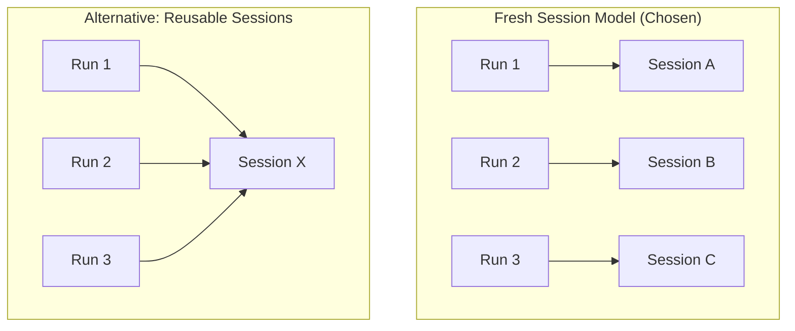
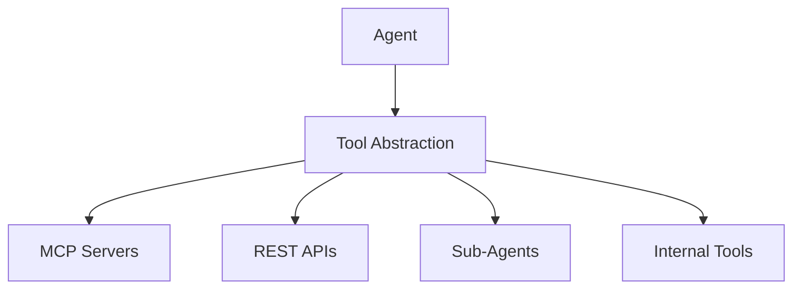

# Design History

Architectural Decision Records (ADRs) documenting key design choices and the rationale behind them.

---

## Table of Contents

- [TL;DR](#tldr) - Quick summary of design history
- [Why This Matters](#why-this-matters) - When you need to understand design decisions
- [ADR-001: Sub-Agent as Tool](#adr-001-sub-agent-as-tool) - Tool abstraction for agents
- [ADR-002: Session Model](#adr-002-session-model) - Fresh session per run
- [Design Principles](#design-principles) - Ongoing design guidance
- [Anti-Patterns](#anti-patterns) - What we avoid and why
- [Future Considerations](#future-considerations) - Potential evolution
- [See Also](#see-also) - Related documentation

---

## TL;DR

Two foundational decisions shape ai-agent: (1) **Sub-agents are tools** - all capabilities use the same abstraction, and (2) **Fresh session per run** - no shared state between runs. These decisions prioritize predictability, isolation, and maintainability over potential performance optimizations.

---

## Why This Matters

Understanding design history helps you:

- **Make consistent decisions**: Align new features with established patterns
- **Avoid regressions**: Know why constraints exist
- **Evaluate changes**: Understand trade-offs made previously
- **Contribute effectively**: Work within the design philosophy

---

## ADR-001: Sub-Agent as Tool

**Status**: Accepted
**Date**: 2025-09-04

### Context

Multi-agent behavior can be architected two ways:

| Approach | Description |
|----------|-------------|
| **Tool Abstraction** | Sub-agents as first-class tools |
| **Recursive Orchestrator** | Coordinating autonomous agents |



### Decision

**Sub-agent = Tool, always and only.**

The master agent is unaware of a tool's origin. Whether it's an MCP server, sub-agent, or internal tool, the agent loop interacts with a unified interface.

### Rationale

| Benefit | Explanation |
|---------|-------------|
| **Predictability** | Single abstraction reduces cognitive load |
| **Isolation** | Tool calls are naturally bounded |
| **Maintainability** | Unified registry is easier to test |
| **Simplicity** | No special-case handling for agents |

### Invariants

These rules MUST hold to preserve the design:

| Invariant | Description |
|-----------|-------------|
| **Opaque Origin** | No branching on tool origin type in core loop |
| **No Global Mutable State** | No `process.chdir`, no direct `process.env` reads |
| **Per-Session Isolation** | Tools receive only explicit inputs |
| **Uniform Budgets** | Depth caps and resource limits apply uniformly |
| **Unified Observability** | Consistent logging independent of origin |
| **Semantics over Optimization** | Pooling must not change isolation |

### Consequences

**Positive**:
- Simple, testable orchestration loop
- Tools are interchangeable
- Clear boundaries for accounting/tracing

**Negative**:
- No direct agent-to-agent communication
- Sub-agent latency appears as tool latency
- Cannot "share context" between sub-agents

---

## ADR-002: Session Model

**Status**: Accepted
**Date**: 2025-09-04

### Context

Need to guarantee isolation and predictability across agent runs:

| Approach | Risk |
|----------|------|
| **Reusable, stateful sessions** | Shared mutation, state bleed |
| **Fresh session per run** | Cold start overhead |

### Decision

**Fresh session per run.**

- Public API constructs new session per run
- Retry operations create new sessions internally
- Sessions are never reused across runs



### Rationale

| Benefit | Explanation |
|---------|-------------|
| **Isolation** | No cross-run state bleed |
| **Concurrency** | Parallel runs never share state |
| **API clarity** | Simple create → run → result model |
| **Debugging** | Each session is self-contained |

### Sub-Agent Semantics

Under this model:

| Rule | Implication |
|------|-------------|
| Sub-agents as foreign services | No special internal handling |
| No implicit retries on failure | Parent decides retry policy |
| Explicit context in request | No hidden state transfer |
| Session state as tokens/handles | Explicit serialization if needed |

### Invariants

| Invariant | Description |
|-----------|-------------|
| **Fresh instances per run** | No session reuse |
| **No global mutable state** | Enforced by ADR-001 |
| **Structured results at boundaries** | No thrown exceptions |
| **Explicit context transfer** | No hidden state |

### Consequences

**Positive**:
- Completely isolated runs
- Safe concurrent execution
- Predictable behavior

**Negative**:
- Cannot resume sessions
- Tool connections re-established per run
- Cold start for MCP servers

---

## Design Principles

These principles guide ongoing development.

### 1. Tool Abstraction

**All external capabilities are tools.**



No special cases. No branching on tool type in core logic.

### 2. Session Isolation

**Each session is independent.**

| Property | Owned By Session |
|----------|------------------|
| Conversation history | Yes |
| Accounting | Yes |
| Context budget | Yes |
| Tool connections | Yes |

No shared mutable state between sessions.

### 3. Fail-Fast with Boom

**Silent failures are not justified.**

| Principle | Implementation |
|-----------|----------------|
| All errors logged | No swallowed exceptions |
| User config errors stop execution | Fail early |
| Other errors: retry, recover, continue | Resilient to transient issues |

### 4. Model-Facing Error Quality

**Error messages to the model must be exceptional.**

| Requirement | Why |
|-------------|-----|
| Extremely detailed | Model needs specific information |
| Descriptive of exact issue | Not "something went wrong" |
| Direct instructions to overcome | Actionable guidance |

Bad: `"Error processing your request"`
Good: `"Tool call failed: parameter 'limit' must be number, received string 'ten'. Use a numeric value like 10."`

### 5. Thin Orchestration Loops

**Keep main loops lean.**

| Principle | Implementation |
|-----------|----------------|
| Move complexity to specialized modules | Not inline in loop |
| Separation of concerns paramount | Each module has one job |
| Gradual improvement over time | Refactor continually |

---

## Anti-Patterns

What we deliberately avoid.

### Global State

```typescript
// BAD: Global state
process.chdir(newDir);
globalConfig.update(settings);

// GOOD: Explicit, passed state
const session = new Session({ cwd: newDir, config: settings });
```

### Tool Type Branching

```typescript
// BAD: Branching on tool type
if (tool.type === 'subagent') {
    // special handling
} else if (tool.type === 'mcp') {
    // different handling
}

// GOOD: Uniform interface
const result = await toolsOrchestrator.execute(toolName, params);
```

### Silent Failures

```typescript
// BAD: Silent swallow
try {
    await riskyOperation();
} catch {
    // ignore
}

// GOOD: Log and handle
try {
    await riskyOperation();
} catch (error) {
    logger.error('Operation failed', { error });
    throw new OperationError(error);
}
```

### Vague Model Errors

```typescript
// BAD: Vague
return { error: 'Invalid request' };

// GOOD: Specific and actionable
return {
    error: `Parameter 'query' is required but was not provided. ` +
           `Please call this tool with { "query": "<your search terms>" }`
};
```

---

## Future Considerations

Areas for potential architectural evolution.

### Tool/MCP Pooling

**Goal**: Reduce cold-start latency for MCP servers.

**Constraints**:
- MUST preserve isolation semantics
- MUST NOT change overlays behavior
- MUST NOT introduce shared state

**Approach**: Pool connections, not state. Each session gets isolated view.

### Interactive Agents

**Goal**: Human or agent-to-agent messaging.

**Constraints**:
- MUST build on tool abstraction
- MUST NOT bypass session isolation
- MUST fit within turn/tool model

**Approach**: Interaction as specialized tools.

### Streaming Improvements

**Goal**: Real-time token output, progressive tool results.

**Constraints**:
- MUST NOT change session semantics
- MUST preserve accounting accuracy
- MUST support abort/cancel

**Approach**: Streaming within existing session model.

---

## ADR Template

For future architectural decisions:

```markdown
## ADR-XXX: Title

**Status**: Proposed | Accepted | Deprecated | Superseded
**Date**: YYYY-MM-DD

### Context
What is the issue? Why is a decision needed?

### Decision
What is the decision?

### Rationale
Why this decision over alternatives?

### Consequences
Positive and negative impacts.

### Invariants
Rules that must hold to preserve the design.
```

---

## See Also

- [Architecture](Technical-Specs-Architecture) - Current architecture
- [Session Lifecycle](Technical-Specs-Session-Lifecycle) - Session execution
- [Tool System](Technical-Specs-Tool-System) - Tool provider design
- [specs/ADR-001-sub-agent-as-tool.md](specs/ADR-001-sub-agent-as-tool.md) - Full ADR
- [specs/ADR-002-session-model.md](specs/ADR-002-session-model.md) - Full ADR
- [specs/DESIGN.md](specs/DESIGN.md) - Design overview
