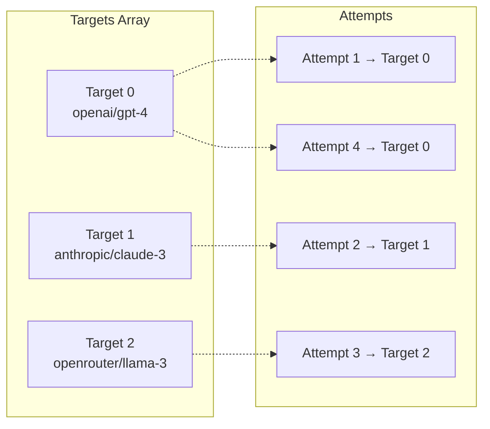
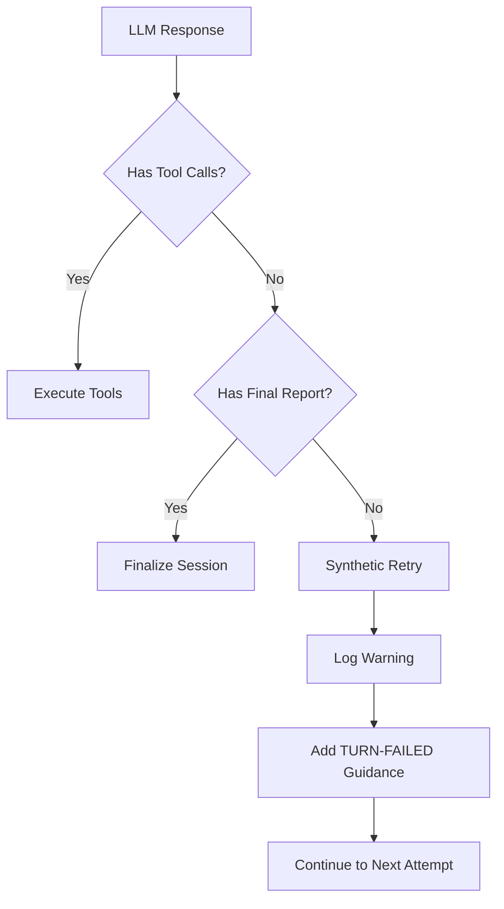
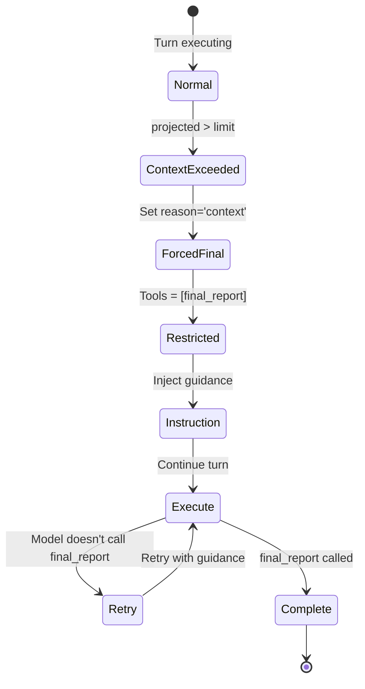

# Retry Strategy

Error handling, provider cycling, backoff algorithms, and recovery mechanisms for resilient session execution.

---

## Table of Contents

- [TL;DR](#tldr) - Quick summary of retry behavior
- [Why This Matters](#why-this-matters) - When retry strategy affects you
- [Retry Architecture](#retry-architecture) - Core retry concepts
- [Error Classification](#error-classification) - How errors are handled
- [Provider Cycling](#provider-cycling) - Multi-provider failover
- [Backoff Strategy](#backoff-strategy) - Rate limit handling
- [Synthetic Retries](#synthetic-retries) - Model-level recovery
- [Final Turn Enforcement](#final-turn-enforcement) - Forced completion
- [Final Report Handling](#final-report-handling) - Report capture and fallback
- [Configuration](#configuration) - Settings that affect retries
- [Troubleshooting](#troubleshooting) - Common problems and solutions
- [See Also](#see-also) - Related documentation

---

## TL;DR

ai-agent implements per-turn retry with round-robin provider cycling, exponential backoff for rate limits, and synthetic retries for invalid LLM responses. When retries are exhausted or limits are reached, the session forces a final turn with tools restricted to `final_report` only.

---

## Why This Matters

Retry strategy affects you when:

- **Provider flaky**: Rate limits, temporary outages
- **Model misbehaves**: Empty responses, no tool calls
- **Session stuck**: Retries exhausted without progress
- **Unexpected completion**: Forced final turn triggered

Understanding retries helps you:

- Configure appropriate retry limits
- Set up effective provider fallbacks
- Debug "retry exhausted" failures
- Optimize for cost vs. reliability

---

## Retry Architecture

### Retry Directive

Each LLM turn result includes a retry directive.

```typescript
interface TurnRetryDirective {
  action: "retry" | "skip-provider" | "abort";
  backoffMs?: number; // Optional wait time
  logMessage?: string; // Human-readable reason
  sources?: string[]; // Error sources
}
```

### Retry Loop Structure

```mermaid
flowchart TD
    Start[Turn Start] --> Init[attempts = 0<br/>pairCursor = 0]
    Init --> Check{attempts < maxRetries<br/>AND not successful?}

    Check -->|Yes| Select[Select Provider<br/>targets[pairCursor % length]]
    Check -->|No| Exit[Exit Retry Loop]

    Select --> Execute[Execute LLM Turn]
    Execute --> Result{Result Status?}

    Result -->|Success + Tools| Done[turnSuccessful = true]
    Result -->|Success + Final| Done
    Result -->|Success, No Tools| Synthetic[Synthetic Retry]
    Result -->|Rate Limit| Rate[Rate Limit Processing]
    Result -->|Auth Error| Skip[Skip to Next Provider]
    Result -->|Quota Exceeded| Skip
    Result -->|Model Error| Model[Model Error Check]

    Model -->|Retryable| Execute[Continue to next attempt]
    Model -->|Not Retryable| Skip[Skip to Next Provider]

    Rate --> LimitedAll{All Providers<br/>Rate Limited?}
    LimitedAll -->|Yes| Backoff[Wait + Continue<br/>pairCursor++<br/>attempts++]
    LimitedAll -->|No| ContinueNoSleep[Continue Immediately<br/>attempts++]

    Synthetic --> Check
    Backoff --> Check
    Skip --> CheckPairCursor[Skip to Next Provider<br/>pairCursor++<br/>Continue Loop]
    Done --> Exit
```

---

## Error Classification

### Retryable Errors

These errors trigger retry with backoff.

| Status             | Condition          | Backoff                                     | Behavior        |
| ------------------ | ------------------ | ------------------------------------------- | --------------- |
| `rate_limit`       | Too many requests  | Conditional (only when retrying)            | Wait then retry |
| `network_error`    | Connection failed  | Yes (linear, max 30s)                       | Wait then retry |
| `timeout`          | Request timeout    | Yes (linear, max 30s)                       | Wait then retry |
| `invalid_response` | Malformed response | No                                          | Immediate retry |

Note: If the LLM response includes an HTTP status and it is non‑200, we skip the current provider/model pair instead of retrying (this includes 429s).

---

## Provider Cycling

### Skip-Target Errors

These errors skip the current provider/model pair but continue with others.

| Status / Rule          | Condition                         | Action                           |
| ---------------------- | --------------------------------- | -------------------------------- |
| `http_status != 200`   | Non‑200 HTTP response             | Skip to next provider/model pair |
| `auth_error`           | Invalid API key                   | Skip to next provider/model pair |
| `quota_exceeded`       | Account quota hit                 | Skip to next provider/model pair |
| `model_error`          | Model unavailable (non-retryable) | Skip to next provider/model pair |

Note: `auth_error` and `quota_exceeded` trigger skip-provider action to try next available provider/model pair. The `abort` action exists in the type definition but is not used in current implementation.

Note: `model_error` with `retryable: true` continues with same provider (immediate retry).

### Round-Robin Selection



**Selection Formula**:

```
target = targets[pairCursor % targets.length]
// pairCursor incremented when skip-provider (target skip) action triggered
```

**Behavior**:

- Cycles through all configured targets
- Wraps around when array exhausted
- Each attempt increments cursor for skip-provider (target skip), not for normal retries
- Continues until `maxRetries` exhausted

### Rate Limit Tracking

```typescript
let rateLimitedInCycle = 0;
let maxRateLimitWaitMs = 0;
```

| Scenario                   | Behavior               |
| -------------------------- | ---------------------- |
| One provider rate-limited  | Continue to next       |
| All providers rate-limited | Wait max observed time |
| After successful turn      | Reset counters         |

---

## Backoff Strategy

### Backoff Calculation

```mermaid
flowchart TD
    RateLimit[Rate Limit Hit] --> HasHeader{Provider Returned<br/>retry_after?}

    HasHeader -->|Yes| UseProvided[Use Provider Value<br/>Clamped 1s-60s]
    HasHeader -->|No| Calculate[Calculate Fallback]

    Calculate --> FormulaRateLimit[wait = min(max(attempts * 1000, 1000), 60000)<br/>Minimum 1000ms]
    Calculate --> FormulaNetwork[wait = min(max((attempt + 1) * 1000, 1000), 30000)<br/>Minimum 1000ms]

    UseProvided --> Track[Track Max Wait]
    FormulaRateLimit --> Track
    FormulaNetwork --> Track

    Track --> AllLimited{All Providers<br/>Rate Limited?}
    AllLimited -->|Yes| Sleep[Sleep Max Wait]
    AllLimited -->|No| Continue[Continue Immediately]

    Sleep --> NextAttempt[Next Attempt]
    Continue --> NextAttempt
```

### Backoff Values

| Error Type                | Constant                         | Max Wait | Purpose                      |
| ------------------------- | -------------------------------- | -------- | ---------------------------- |
| `rate_limit`              | `RATE_LIMIT_MAX_WAIT_MS`: 60,000 | 60,000   | Maximum wait time            |
| `network_error`/`timeout` | Hardcoded: 30,000                | 30,000   | Linear backoff, max 30,000ms |

**Fallback Formulas**:

For `rate_limit` errors:

```
fallbackWait = min(max(attempts * 1000, 1000), 60000)
```

For `network_error` and `timeout` errors:

```
fallbackWait = min(max((attempt + 1) * 1000, 1000), 30000)
```

### Sleep Behavior

- Uses `sleepWithAbort()` for cancellation support
- Rate-limit sleep only after full rotation when ALL providers rate-limited
  - Condition: `attempts < maxRetries || hasStopRef` (don't sleep if retries exhausted)
  - Logs `agent:retry` event with selected wait time
- Other backoffs (network/timeout): Sleep unconditionally; `sleepWithAbort()` handles cancellation internally

---

## Synthetic Retries

### Content Without Tools

**Trigger**: LLM returns text content but no tool calls and no `final_report`.



**Behavior**:

1. Set lastErrorType to 'invalid_response'
2. Add TURN-FAILED guidance message to conversation
3. Continue to next retry attempt

### Invalid Tool Parameters

**Trigger**: Tool call has malformed JSON parameters.

**Behavior**:

1. Preserve tool call with sanitization marker
2. Log ERR with full original payload
3. Return tool failure response: `(tool failed: invalid tool call payload. <reason>. Original payload<truncation note>: <original payload>)`
4. Continue to next attempt within same turn (no TURN-FAILED added)

---

## Final Turn Enforcement

### Context-Forced Final Turn

**Trigger**: Context guard detects token budget exceeded.

**Location**: `src/session-turn-runner.ts` (via `ContextGuard.enforceFinalTurn()`)



**Actions**:

1. Set `forcedFinalTurnReason = 'context'`
2. Inject instruction message
3. Restrict tools to `agent__final_report`
4. Log warning
5. Retry if model doesn't call `final_report`

### Max Turns Final Turn

**Trigger**: `currentTurn === maxTurns`

**Location**: `src/session-turn-runner.ts` (retry loop exit condition)

**Actions**:

1. Set `isFinalTurn = true` (forced turn detected)
2. Inject instruction message
3. Restrict tools to `agent__final_report`
4. Log warning
5. Retry if model doesn't call `final_report`

---

## Final Report Handling

### Attempt Tracking

`finalReportAttempts` increments when:

- Sanitizer drops malformed `final_report` calls
- Tool executor receives legitimate `final_report` call

### Turn Collapse

When final report is attempted or incomplete detection triggers:

| Step | Action                                       |
| ---- | -------------------------------------------- |
| 1    | Set `maxTurns = currentTurn + 1`             |
| 2    | Log `agent:orchestrator` with old/new limits |
| 3    | Emit `ai_agent_retry_collapse_total` metric  |

### Final Report Storage

When a valid final report is committed:

| Step | Action                                                                  |
| ---- | ----------------------------------------------------------------------- | -------------- | ----------- |
| 1    | Validate against expected schema (if applicable)                        |
| 2    | Store in `finalReport`                                                  |
| 3    | Track source: 'tool-call'                                               | 'tool-message' | 'synthetic' |
| 4    | On forced final turn with existing report: Finalize session immediately |

**Purpose**: Preserves final report across retry attempts.

### Synthetic Failure

When exhausted without valid final report:

1. Synthesize failure report
2. Log `agent:failure-report`
3. Set metadata with reason and context
4. Return with `success: false`

---

## Configuration

### Key Settings

| Setting      | Type   | Default | Effect                                      |
| ------------ | ------ | ------- | ------------------------------------------- |
| `maxRetries` | number | 3       | Total attempts per turn (initial + retries) |
| `maxTurns`   | number | 10      | When to enforce final turn                  |
| `targets`    | array  | -       | Provider/model cycling pool                 |
| `llmTimeout` | number | 600000  | Request timeout threshold (10 minutes)      |

### Retry vs. Attempts

> **Note**: `maxRetries: 3` means **3 total attempts**, not "initial + 3 retries".

| maxRetries | Total Attempts | Retries After Initial |
| ---------- | -------------- | --------------------- |
| 1          | 1              | 0                     |
| 2          | 2              | 1                     |
| 3          | 3              | 2                     |

### Example Configuration

```yaml
---
maxRetries: 5
maxTurns: 30
models:
  - openai/gpt-4-turbo
  - anthropic/claude-3-sonnet
  - openrouter/meta-llama/llama-3-70b
---
```

---

## Telemetry

### Per Retry Attempt

| Metric         | Description                        |
| -------------- | ---------------------------------- |
| `attempt`      | Attempt number (1-based)           |
| `provider`     | Provider name                      |
| `model`        | Model name                         |
| `status`       | Result status                      |
| `latencyMs`    | Request latency                    |
| `errorDetails` | Error information (if failed)      |
| `backoffMs`    | Backoff duration (if rate-limited) |

### Per Turn

| Metric                | Description             |
| --------------------- | ----------------------- |
| `totalAttempts`       | Attempts used this turn |
| `finalStatus`         | Turn outcome            |
| `retryLoopDurationMs` | Time in retry loop      |

---

## Troubleshooting

### Retries Exhausted Quickly

**Symptom**: Session fails after few attempts.

**Causes**:

- `maxRetries` too low
- All providers returning same error
- Only one target configured

**Solutions**:

1. Increase `maxRetries` (consider cost implications)
2. Add more diverse providers to `targets`
3. Check provider error logs for patterns

### Stuck in Retry Loop

**Symptom**: Many retries but no progress.

**Causes**:

- Model consistently returning content without tools
- Final turn instructions unclear
- Tool schema issues

**Solutions**:

1. Review system prompt for clear tool usage instructions
2. Check model's tool-calling capabilities
3. Simplify available tools
4. Try different model

### Rate Limit Wait Too Long

**Symptom**: Session pauses for extended periods.

**Causes**:

- Provider rate limits aggressive
- Single provider in targets
- High request volume

**Solutions**:

1. Add more providers to distribute load
2. Implement request queuing
3. Upgrade provider plan
4. Reduce session concurrency

### Unexpected Synthetic Retry

**Symptom**: "Synthetic retry" warnings when expecting response.

**Causes**:

- Model misunderstanding task
- Missing tool schemas
- Prompt unclear about tool requirement

**Solutions**:

1. Review prompt for clarity
2. Verify tools are correctly registered
3. Check for tool schema issues
4. Try more capable model

---

## Invariants

These rules MUST hold:

1. **Retry cap honored**: Never exceed `maxRetries` per turn
2. **Provider cycling**: Round-robin through all targets
3. **Backoff respected**: Wait before retry when directed
4. **Skip-provider errors**: `auth_error`/`quota_exceeded`/non-retryable `model_error` skip to next provider
5. **Conversation integrity**: Failed attempts don't corrupt history
6. **Final turn enforcement**: Last turn restricted to `final_report`

---

## See Also

- [Session Lifecycle](Technical-Specs-Session-Lifecycle) - Turn execution flow
- [Context Management](Technical-Specs-Context-Management) - Context-forced final turn
- [User Contract](Technical-Specs-User-Contract) - Guaranteed behaviors
- [specs/retry-strategy.md](specs/retry-strategy.md) - Full specification
