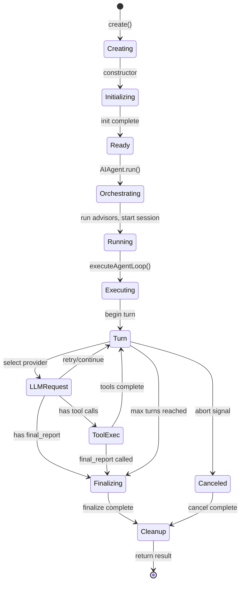
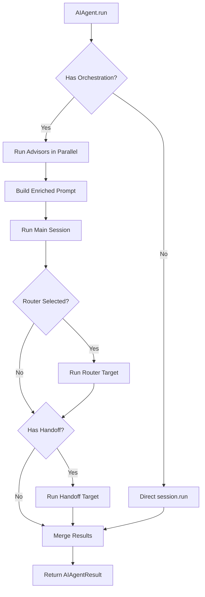
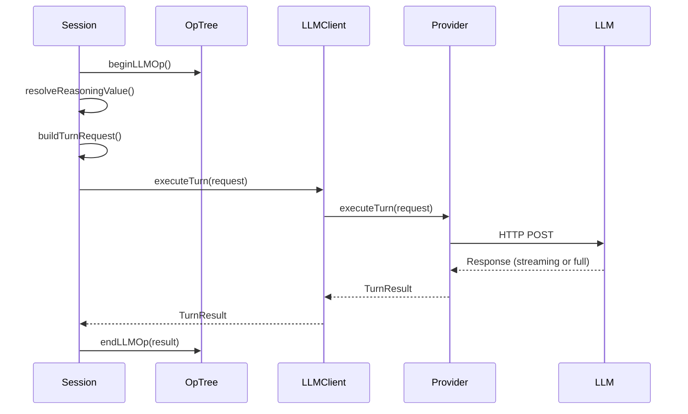
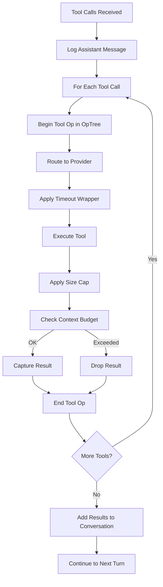

# Session Lifecycle

Complete flow from session creation through execution to finalization, including all intermediate states and transitions.

---

## Table of Contents

- [TL;DR](#tldr) - Quick summary of session lifecycle
- [Why This Matters](#why-this-matters) - When you need to understand lifecycle
- [Lifecycle Overview](#lifecycle-overview) - Visual state machine
- [Phase 1: Creation](#phase-1-creation) - Session instantiation
- [Phase 2: Initialization](#phase-2-initialization) - Constructor setup
- [Phase 3: Orchestration](#phase-3-orchestration) - AIAgent wrapper
- [Phase 4: Execution](#phase-4-execution) - Main run loop
- [Phase 5: Agent Loop](#phase-5-agent-loop) - Turn iteration
- [Phase 6: Turn Execution](#phase-6-turn-execution) - Single turn flow
- [Phase 7: Tool Execution](#phase-7-tool-execution) - Tool call handling
- [Phase 8: Finalization](#phase-8-finalization) - Session completion
- [Cancellation Paths](#cancellation-paths) - Abort and graceful stop
- [Events and Logging](#events-and-logging) - Observable lifecycle events
- [See Also](#see-also) - Related documentation

---

## TL;DR

Sessions are created via a static factory method, initialized with configuration, and executed through a multi-turn loop. Each turn: select provider → check context → LLM request → process tools → repeat or finalize. The `AIAgent.run()` wrapper adds orchestration (advisors, router, handoff) around the inner `AIAgentSession.run()` loop.

---

## Why This Matters

Understanding the session lifecycle helps you:

- **Debug stuck sessions**: Identify which phase is blocking
- **Optimize performance**: Know where time is spent
- **Handle errors correctly**: Understand error propagation
- **Implement callbacks**: Know when events fire
- **Build integrations**: Understand the execution contract

---

## Lifecycle Overview



---

## Phase 1: Creation

**Entry Point**: `AIAgentSession.create(config)`

The static factory method validates configuration and creates the session instance.

**Steps**:

| Step | Description                                       |
| ---- | ------------------------------------------------- |
| 1    | Validate config (providers, MCP servers, prompts) |
| 2    | Generate unique session transaction ID            |
| 3    | Infer agent path from config                      |
| 4    | Enrich config with trace fields                   |
| 5    | Create LLMClient with provider configurations     |
| 6    | Instantiate AIAgentSession                        |
| 7    | Bind external log relay                           |

**Invariants**:

- Config validation throws on invalid input (fail fast)
- Session always receives a unique `txnId`
- `originTxnId` defaults to `selfId` for root agents

**Example Transaction IDs**:

```
Root agent:    txnId=abc123, originTxnId=abc123
Sub-agent:     txnId=def456, originTxnId=abc123
```

---

## Phase 2: Initialization

**Entry Point**: Constructor (`new AIAgentSession()`)

Sets up all session state before execution begins.

**Steps**:

| Step | Action                                      |
| ---- | ------------------------------------------- |
| 1    | Store config references                     |
| 2    | Set up abort signal listener                |
| 3    | Initialize target context configs           |
| 4    | Initialize SubAgentRegistry (if configured) |
| 5    | Set trace IDs                               |
| 6    | Initialize opTree (SessionTreeBuilder)      |
| 7    | Initialize progressReporter                 |
| 8    | Begin system turn (turn 0)                  |
| 9    | Initialize ToolsOrchestrator                |
| 10   | Apply initial session title                 |

Note: Initial context token count is computed in Phase 5 (agent loop execution), not during constructor. |

**Key Initializations**:

```typescript
conversation = []; // Empty message array
currentTurn = 0; // System turn (action turns start at 1)
currentCtxTokens = 0; // Will be computed
accounting = []; // Empty entries array
```

---

## Phase 3: Orchestration

**Entry Point**: `AIAgent.run(session)`

Wraps the inner session with higher-level orchestration patterns.



**Orchestration Features**:

| Feature      | Trigger                          | Behavior                                   |
| ------------ | -------------------------------- | ------------------------------------------ |
| **Advisors** | `advisors` configured            | Run in parallel, inject advice into prompt |
| **Router**   | `router.destinations` configured | Route to selected agent                    |
| **Handoff**  | `handoff` configured             | Post-session delegation                    |

---

## Phase 4: Execution

**Entry Point**: `AIAgentSession.run()`

Main entry point for session execution.

**Steps**:

| Step | Action                                           |
| ---- | ------------------------------------------------ |
| 1    | Create OpenTelemetry span                        |
| 2    | Emit `agent_started` event                       |
| 3    | Warm up tools orchestrator                       |
| 4    | Log settings summary (if verbose)                |
| 5    | Log tools banner                                 |
| 6    | Check pricing coverage                           |
| 7    | Expand system and user prompts                   |
| 8    | Build enhanced system prompt                     |
| 9    | Initialize conversation with messages            |
| 10   | **Execute agent loop** (delegated to TurnRunner) |
| 11   | End system turn and session in opTree            |
| 12   | Flatten opTree                                   |
| 13   | Emit completion event                            |
| 14   | Persist final snapshot                           |
| 15   | Flush accounting                                 |
| 16   | Return AIAgentResult                             |

---

## Phase 5: Agent Loop

**Entry Point**: `TurnRunner.execute()`

The core multi-turn execution loop.

```
for turn = 1 to maxTurns:
    check cancellation/stop signals
    begin turn in opTree

    attempts = 0
    while attempts < maxRetries and not successful:
        select provider/model (round-robin)
        check context guard
        execute single turn (LLM request)
        sanitize messages
        process tool calls

        handle status:
            success with tools     → execute tools
            success with final     → finalize
            success without tools  → synthetic retry
            rate_limit            → backoff and retry
            auth_error            → abort
            model_error           → retry or skip

        record accounting
        update opTree

    end turn in opTree
    if final_report captured: break
```

**Key State During Loop**:

| State                   | Purpose                        |
| ----------------------- | ------------------------------ |
| `currentTurn`           | Current turn number (1-based)  |
| `pairCursor`            | Provider cycling index         |
| `attempts`              | Retry counter for current turn |
| `forcedFinalTurnReason` | Why tools are restricted       |

---

## Phase 6: Turn Execution

**Entry Point**: `executeSingleTurn()`

Executes a single LLM request/response cycle.



**TurnRequest Structure**:

```typescript
{
    messages: CoreMessage[],
    tools: ToolDefinition[],
    model: string,
    temperature?: number,
    maxOutputTokens?: number,
    reasoning?: ReasoningConfig,
    // ... provider-specific options
}
```

**TurnResult Structure**:

```typescript
{
    status: 'success' | 'rate_limit' | 'auth_error' | ...,
    messages: CoreMessage[],
    toolCalls: ToolCall[],
    tokens: TokenUsage,
    metadata: ResponseMetadata,
    retry?: RetryDirective
}
```

---

## Phase 7: Tool Execution

**Entry Point**: `ToolsOrchestrator.executeWithManagement()`

Executes tool calls after a successful LLM turn.



**Tool Result Outcomes**:

| Outcome         | Conversation Message                            |
| --------------- | ----------------------------------------------- |
| Success         | Tool result content                             |
| Timeout         | `(tool failed: timeout)`                        |
| Error           | `(tool failed: <error>)`                        |
| Size exceeded   | `tool_output` handle reference                  |
| Budget exceeded | `(tool failed: context window budget exceeded)` |

---

## Phase 8: Finalization

**Triggers**:

- `agent__final_report` tool called successfully
- Max turns reached
- Context guard enforced (forced final turn)
- Error conditions (auth failure, quota exceeded)
- Cancellation (abort signal, graceful stop)

**Steps**:

| Step | Action                                         |
| ---- | ---------------------------------------------- |
| 1    | Capture final report (status, format, content) |
| 2    | Validate JSON schema (if applicable)           |
| 3    | Log finalization event                         |
| 4    | End all open operations in opTree              |
| 5    | Build AIAgentResult                            |

**AIAgentResult Structure**:

```typescript
{
    success: boolean,
    exitCode: ExitCode,
    finalReport?: FinalReport,
    conversation: CoreMessage[],
    accounting: AccountingEntry[],
    logs: LogEntry[],
    opTree: FlattenedOpTree,
    metadata: SessionMetadata
}
```

---

## Cancellation Paths

### Abort Signal (Immediate)

**Trigger**: External `AbortSignal` fires

**Behavior**:

- Checked at turn start
- Propagated to child operations
- Current operation may complete
- Returns `finalizeCanceledSession()` result

**Propagation**:

```
AbortSignal → Session → LLMClient → Provider
                    ↘→ ToolsOrchestrator → Tool Providers
```

### Graceful Stop (Soft)

**Trigger**: `stopRef.stopping` set to `true`

**Behavior**:

- Checked at turn start
- Current turn allowed to complete
- No new turns started
- Returns `finalizeGracefulStopSession()` result

---

## Events and Logging

### Lifecycle Events

| Event            | When               | Payload                |
| ---------------- | ------------------ | ---------------------- |
| `agent_started`  | Session begins     | Session config summary |
| `agent_update`   | Progress update    | Turn number, status    |
| `agent_finished` | Success completion | Final report           |
| `agent_failed`   | Error completion   | Error details          |

### Key Log Events

| Event                         | Severity | Description                   |
| ----------------------------- | -------- | ----------------------------- |
| `agent:init`                  | INF      | Session initialized           |
| `agent:settings`              | VRB      | Configuration summary         |
| `agent:tools`                 | INF      | Tool banner (available tools) |
| `agent:turn-start`            | INF      | Turn begins                   |
| `agent:final-turn`            | WRN      | Final turn detected           |
| `agent:context`               | WRN      | Context guard events          |
| `agent:final-report-accepted` | INF      | Final report committed        |
| `agent:fin`                   | INF      | Session finalized             |

---

## State Transitions Summary

```
                     ┌──────────────┐
                     │   CREATED    │
                     └──────┬───────┘
                            │ constructor
                     ┌──────▼───────┐
                     │ INITIALIZED  │
                     └──────┬───────┘
                            │ run()
                     ┌──────▼───────┐
                     │   RUNNING    │◄────────┐
                     └──────┬───────┘         │
                            │                 │ next turn
                     ┌──────▼───────┐         │
                     │  TURN ACTIVE │─────────┘
                     └──────┬───────┘
                            │ final/max/error
                     ┌──────▼───────┐
                     │  FINALIZING  │
                     └──────┬───────┘
                            │
                     ┌──────▼───────┐
                     │   COMPLETE   │
                     └──────────────┘
```

> **Note**: The session does NOT track an explicit state field. These states are implicit in the execution flow.

---

## See Also

- [Architecture](Technical-Specs-Architecture) - Component overview
- [Context Management](Technical-Specs-Context-Management) - Token budgets and guard
- [Retry Strategy](Technical-Specs-Retry-Strategy) - Error handling and recovery
- [Tool System](Technical-Specs-Tool-System) - Tool execution details
- [specs/session-lifecycle.md](specs/session-lifecycle.md) - Full specification
