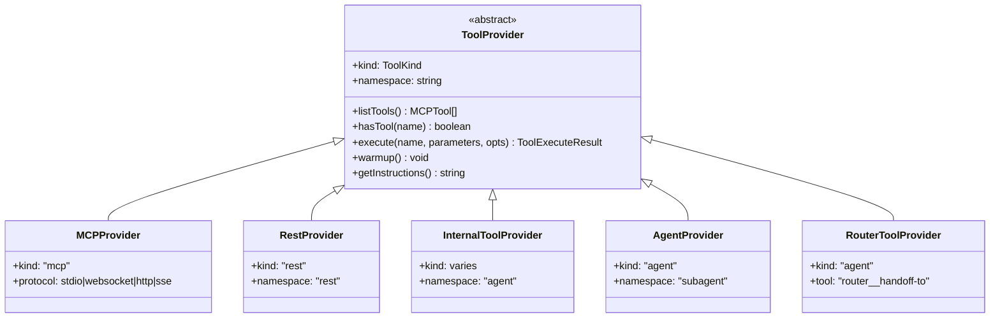
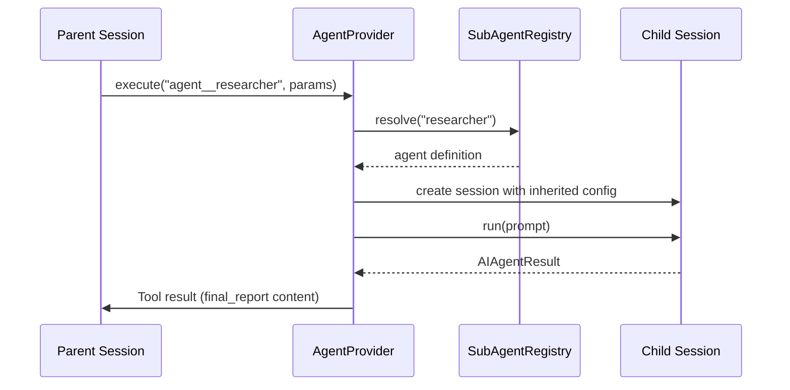
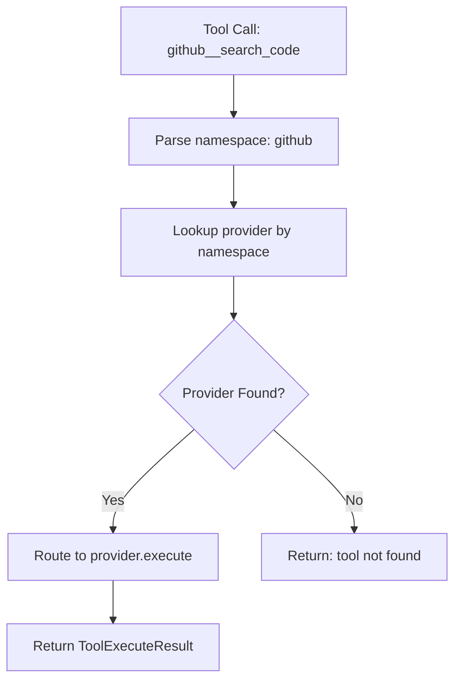
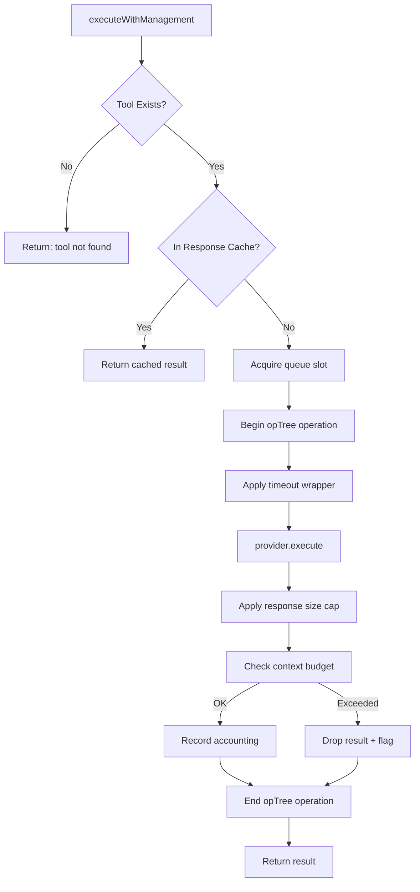
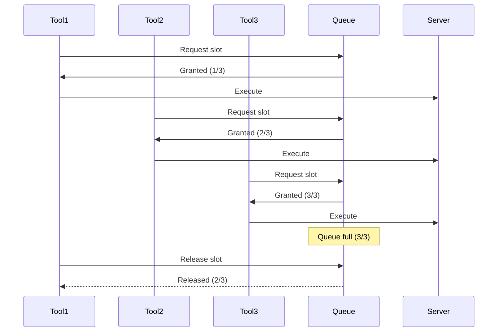
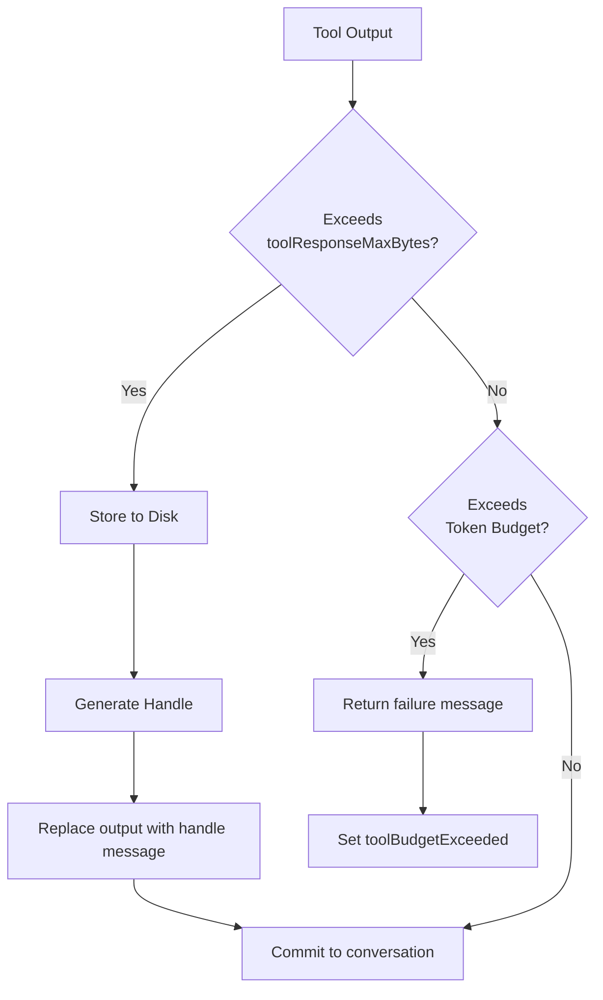

# Tool System

Tool providers, execution routing, queue management, and the unified tool abstraction that powers agent capabilities.

---

## Table of Contents

- [TL;DR](#tldr) - Quick summary of the tool system
- [Why This Matters](#why-this-matters) - When tool architecture affects you
- [Tool Provider Architecture](#tool-provider-architecture) - Provider abstraction
- [Concrete Providers](#concrete-providers) - MCP, REST, Internal, Agent providers
- [Tool Namespacing](#tool-namespacing) - How tools are named and resolved
- [Tools Orchestrator](#tools-orchestrator) - Routing and management
- [Queue Management](#queue-management) - Concurrency control
- [Tool Output Handling](#tool-output-handling) - Size limits and storage
- [Configuration](#configuration) - Settings that affect tools
- [Telemetry and Logging](#telemetry-and-logging) - Observability
- [Troubleshooting](#troubleshooting) - Common problems and solutions
- [See Also](#see-also) - Related documentation

---

## TL;DR

ai-agent uses a unified tool abstraction where all capabilities (MCP servers, REST APIs, sub-agents, internal tools) implement the same `ToolProvider` interface. The `ToolsOrchestrator` routes calls, manages queues, applies timeouts, and enforces size limits. Tools are namespaced as `{provider}__{toolname}`.

---

## Why This Matters

Understanding the tool system helps you:

- **Configure tools correctly**: Know which provider settings to use
- **Debug tool issues**: Understand execution flow and failure points
- **Optimize performance**: Use queues and timeouts effectively
- **Add new tools**: Implement the provider interface correctly
- **Understand failures**: Know why tools fail and how to fix them

---

## Tool Provider Architecture

### ToolProvider Interface

All tool providers implement this abstract interface.



### ToolExecuteResult

Every tool execution returns this structure.

```typescript
interface ToolExecuteResult {
    ok: boolean;           // Success flag
    result?: string;       // Output content (if success)
    error?: string;        // Error message (if failure)
    latencyMs: number;     // Execution time
    kind: ToolKind;        // Provider type
    namespace: string;     // Provider namespace
    extras?: Record<string, unknown>; // Additional metadata
}
```

---

## Concrete Providers

### MCPProvider

Model Context Protocol tools from external servers.

**Kind**: `mcp`

**Protocols Supported**:

| Protocol | Description | Use Case |
|----------|-------------|----------|
| `stdio` | Spawned process with stdin/stdout | Local executables |
| `websocket` | WebSocket connection | Remote servers |
| `http` | HTTP POST requests | REST-style MCP |
| `sse` | Server-Sent Events | Streaming responses |

**Tool Naming**: `{namespace}__{toolname}`

Example: `github__search_code`, `slack__send_message`

**Configuration Example**:
```json
{
    "type": "stdio",
    "command": "npx",
    "args": ["-y", "@mcp/github"],
    "env": { "GITHUB_TOKEN": "${GITHUB_TOKEN}" },
    "toolsAllowed": ["search_code", "get_file"],
    "toolsDenied": ["delete_repo"],
    "cache": 300000,
    "queue": "github-queue"
}
```

**Features**:
- Connection management with auto-reconnection
- Tool discovery via `tools/list`
- Parameter validation via AJV
- Server instructions injection
- Concurrency queues

---

### RestProvider

REST API tools defined inline or via OpenAPI specs.

**Kind**: `rest`
**Namespace**: `rest`

**Tool Naming**: `rest__{toolname}`

**Configuration Example**:
```json
{
    "description": "Get weather data for a city",
    "method": "GET",
    "url": "https://api.weather.com/v1/${parameters.city}",
    "headers": {
        "Authorization": "Bearer ${WEATHER_API_KEY}"
    },
    "parametersSchema": {
        "type": "object",
        "properties": {
            "city": { "type": "string", "description": "City name" }
        },
        "required": ["city"]
    }
}
```

**Features**:
- URL template expansion with `${parameters.x}`
- Query parameter handling
- Request body construction
- JSON streaming support
- OpenAPI schema import

---

### InternalToolProvider

Built-in tools provided by ai-agent itself.

**Kind**: (tool-specific)
**Namespace**: `agent`

**Available Tools**:

| Tool | Purpose | Always Available |
|------|---------|------------------|
| `agent__final_report` | Deliver final answer | Yes |
| `agent__task_status` | Track task progress | Optional |
| `agent__batch` | Batch tool execution | Optional |

**final_report Parameters**:

| Parameter | Type | Description |
|-----------|------|-------------|
| `status` | `'success'` \| `'failure'` \| `'partial'` | Completion status |
| `format` | string | Output format identifier |
| `content_json` | object | JSON content (for JSON formats) |
| `content` | string | Text content (for text formats) |
| `metadata` | object | Optional metadata |

**task_status Parameters**:

| Parameter | Type | Description |
|-----------|------|-------------|
| `status` | `'starting'` \| `'in-progress'` \| `'completed'` | Current status |
| `done` | string | What has been completed |
| `pending` | string | What remains |
| `now` | string | Current immediate step |
| `ready_for_final_report` | boolean | Can finalize now |
| `need_to_run_more_tools` | boolean | More tools needed |

---

### AgentProvider

Sub-agent invocation as tools.

**Kind**: `agent`
**Namespace**: `subagent`

**Tool Naming**: `agent__{agentname}`

Example: `agent__researcher`, `agent__code_reviewer`

**Execution Flow**:



**Features**:
- Recursive composition
- Trace context propagation
- OpTree hierarchy (child sessions nested)
- Accounting aggregation
- Inherited configuration

---

### RouterToolProvider

Dynamic agent routing.

**Kind**: `agent`
**Tool**: `router__handoff-to`

**Parameters**:
```typescript
{
    agent: string;      // Must be in router.destinations
    message?: string;   // Optional advisory text
}
```

**Registered When**: `router.destinations` is configured.

---

## Tool Namespacing

### Naming Convention

All tools follow the pattern: `{provider}__{toolname}`

| Provider Type | Namespace | Example |
|---------------|-----------|---------|
| MCP Server | Server name | `github__search_code` |
| REST | `rest` | `rest__weather_api` |
| Sub-Agent | `agent` | `agent__researcher` |
| Internal | `agent` | `agent__final_report` |
| Router | `router` | `router__handoff-to` |

### Sanitization Rules

Tool names are sanitized for safe usage:

| Rule | Example |
|------|---------|
| Replace invalid characters with `_` | `my-tool` → `my_tool` |
| Truncate to max length | Long names shortened |
| Normalize casing | Case preserved (provider-specific) |

### Resolution



---

## Tools Orchestrator

### State

```typescript
class ToolsOrchestrator {
    providers: Map<string, ToolProvider>;
    mapping: Map<string, ToolProvider>;     // tool → provider
    aliases: Map<string, string>;           // alias → canonical name
    canceled: boolean;
    pendingQueueControllers: Set<AbortController>;
}
```

### Key Methods

| Method | Purpose |
|--------|---------|
| `register(provider)` | Add provider to orchestrator |
| `listTools()` | Get all available tools |
| `warmup()` | Initialize all providers |
| `executeWithManagement()` | Execute with queue/budget/timeout |
| `cancel()` | Cancel all pending operations |
| `cleanup()` | Release resources (close connections) |

### Execution Flow



---

## Queue Management

### Purpose

Queues control concurrency to:
- Respect rate limits
- Prevent overload
- Prioritize requests

### Queue Types

| Type | Scope | Use Case |
|------|-------|----------|
| Per-server queue | All tools from one MCP server | Server rate limits |
| Per-tool queue | Individual tool | Tool-specific limits |
| No queue | Immediate execution | Low-traffic tools |

### Configuration

```json
{
    "queues": {
        "github": { "concurrent": 3 },
        "slow-api": { "concurrent": 1 }
    },
    "mcpServers": {
        "github": { "queue": "github" },
        "slow-service": { "queue": "slow-api" }
    }
}
```

### Queue Behavior



---

## Tool Output Handling

### Size Limit Flow



### Stored Output Format

When output exceeds `toolResponseMaxBytes`:

**Handle Message**:
```json
{
    "tool_output": {
        "handle": "session-abc123/file-xyz789",
        "reason": "size_limit_exceeded",
        "bytes": 1048576,
        "lines": 25000,
        "tokens": 250000
    }
}
```

**Storage Location**: `/tmp/ai-agent-<run-hash>/session-<uuid>/<file-uuid>`

### Output Outcomes

| Outcome | Conversation Message |
|---------|---------------------|
| Success | Tool result content |
| Timeout | `(tool failed: timeout)` |
| Error | `(tool failed: <error message>)` |
| Size exceeded | `tool_output` handle reference |
| Budget exceeded | `(tool failed: context window budget exceeded)` |

---

## Configuration

### Global Settings

| Setting | Type | Default | Effect |
|---------|------|---------|--------|
| `toolTimeout` | number | varies | Global timeout per tool |
| `toolResponseMaxBytes` | number | varies | Triggers disk storage |
| `traceMCP` | boolean | false | Enable MCP tracing logs |
| `mcpInitConcurrency` | number | varies | Parallel MCP initialization |

### Per-Server Settings

| Setting | Type | Description |
|---------|------|-------------|
| `toolsAllowed` | array | Whitelist of tool names |
| `toolsDenied` | array | Blacklist of tool names |
| `queue` | string | Queue name to use |
| `cache` | number | Cache duration in ms |
| `requestTimeoutMs` | number | Server-specific timeout |

### Example Configuration

```yaml
defaults:
  toolTimeout: 30000
  toolResponseMaxBytes: 100000

mcpServers:
  github:
    type: stdio
    command: npx
    args: ["-y", "@mcp/github"]
    toolsAllowed: ["search_code", "get_file_contents"]
    queue: github-queue

queues:
  github-queue:
    concurrent: 5
```

---

## Telemetry and Logging

### Metrics Per Tool Execution

| Metric | Description |
|--------|-------------|
| `latencyMs` | Execution duration |
| `charactersIn` | Input parameter size |
| `charactersOut` | Output size |
| `status` | `ok` or `failed` |
| `namespace` | Provider namespace |

### Log Events

**Request Logs** (VRB severity):
```
[VRB] tool request → github__search_code
    parameters: { query: "foo", limit: 10 }
```

**Response Logs**:
```
[VRB] tool response ← github__search_code
    latency: 234ms, output: 4521 chars, status: ok

[WRN] tool response ← github__search_code
    latency: 5000ms, status: failed, error: timeout
```

### Events

| Event | Description |
|-------|-------------|
| `tool_started` | Execution began |
| `tool_finished` | Execution completed |

---

## Troubleshooting

### Tool Not Found

**Symptom**: "Tool not found" error.

**Causes**:
- Tool name misspelled
- MCP server not started
- Tool in `toolsDenied` list
- Server `enabled: false`

**Solutions**:
1. Check exact tool name in logs
2. Verify MCP server initialization
3. Review `toolsAllowed`/`toolsDenied` configuration
4. Check server enabled status

### Tool Timeout

**Symptom**: `(tool failed: timeout)` in conversation.

**Causes**:
- `toolTimeout` too low
- Server slow to respond
- Network latency
- Tool execution genuinely slow

**Solutions**:
1. Increase `toolTimeout`
2. Check `requestTimeoutMs` per server
3. Review server performance
4. Consider async patterns for slow tools

### Large Response Stored

**Symptom**: `tool_output` handle instead of content.

**Causes**:
- Output exceeded `toolResponseMaxBytes`

**Behavior**:
- Normal operation (size limit working correctly)
- LLM receives handle reference instead of content
- Original content preserved on disk

**Solutions**:
1. Increase `toolResponseMaxBytes` if needed
2. Review tool output (may need filtering at source)

### MCP Connection Failed

**Symptom**: MCP server fails to initialize.

**Causes**:
- Command not found
- Missing environment variables
- Port already in use
- Spawn permissions

**Solutions**:
1. Verify `command` exists and is executable
2. Check `env` variables are set
3. For websocket/http, check URL accessibility
4. Review file permissions

### Queue Deadlock

**Symptom**: Tools hang waiting for queue.

**Causes**:
- Concurrent limit too low
- Tools not releasing slots
- Circular dependencies

**Solutions**:
1. Increase `concurrent` limit
2. Review timeout settings
3. Check for hanging tool executions

---

## See Also

- [Configuration-MCP-Servers](Configuration-MCP-Servers) - MCP configuration
- [Configuration-REST-Tools](Configuration-REST-Tools) - REST configuration
- [Agent-Files-Tools](Agent-Files-Tools) - Tool configuration in agent files
- [Context Management](Technical-Specs-Context-Management) - Tool budget handling
- [specs/tools-overview.md](specs/tools-overview.md) - Full specification
