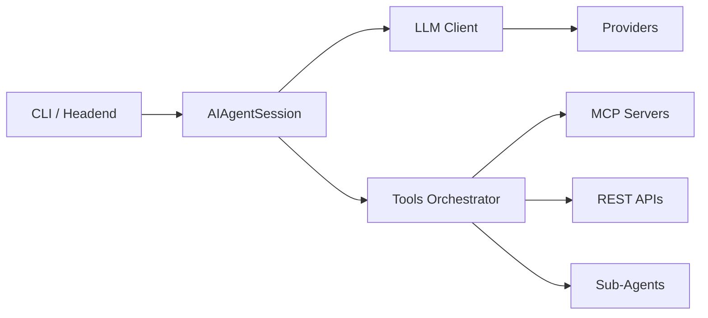

# Technical Specifications

Deep-dive technical documentation for contributors, maintainers, and advanced users who need to understand ai-agent internals.

---

## Table of Contents

- [Overview](#overview) - What these specifications cover and who they're for
- [Quick Navigation](#quick-navigation) - Find the right spec document fast
- [Core Architecture](#core-architecture) - System design documents
- [Runtime Behavior](#runtime-behavior) - How sessions execute
- [Contracts and Guarantees](#contracts-and-guarantees) - User-facing promises
- [Source Code Reference](#source-code-reference) - Key implementation files
- [Core Invariants](#core-invariants) - Rules that MUST always hold
- [See Also](#see-also) - Related documentation

---

## Overview

**TL;DR**: Technical specifications document the internal design, algorithms, and guarantees of ai-agent. Use these when building integrations, debugging complex issues, or contributing to the codebase.

### Why These Specifications Exist

1. **Contributors**: Understand implementation decisions before modifying code
2. **Advanced Users**: Debug complex issues with knowledge of internals
3. **Integrators**: Build robust integrations using documented guarantees
4. **Maintainers**: Ensure changes respect established contracts

### What You'll Find

| Spec Type        | Purpose                     | Example                         |
| ---------------- | --------------------------- | ------------------------------- |
| **Architecture** | How components fit together | Session → LLM Client → Provider |
| **Lifecycle**    | Sequence of operations      | Turn execution order            |
| **Algorithms**   | Decision logic              | Context guard projection        |
| **Contracts**    | Guaranteed behaviors        | "Never exceed maxTurns"         |
| **ADRs**         | Why decisions were made     | "Sub-agent as tool" rationale   |

---

## Quick Navigation

**Most Common Questions**:

| Question                          | Document                                                 |
| --------------------------------- | -------------------------------------------------------- |
| "How does a session work?"        | [Session Lifecycle](Technical-Specs-Session-Lifecycle)   |
| "Why did my session stop early?"  | [Context Management](Technical-Specs-Context-Management) |
| "What happens when an LLM fails?" | [Retry Strategy](Technical-Specs-Retry-Strategy)         |
| "How are tools executed?"         | [Tool System](Technical-Specs-Tool-System)               |
| "What guarantees can I rely on?"  | [User Contract](Technical-Specs-User-Contract)           |
| "Why is it designed this way?"    | [Design History](Technical-Specs-Design-History)         |

---

## Core Architecture

System design and component structure.

| Document                                               | Description                                                      |
| ------------------------------------------------------ | ---------------------------------------------------------------- |
| [Architecture](Technical-Specs-Architecture)           | Layered component design: CLI → Session → LLM Client → Providers |
| [Session Lifecycle](Technical-Specs-Session-Lifecycle) | Creation → Execution → Finalization flow                         |
| [Design History](Technical-Specs-Design-History)       | Architectural Decision Records (ADRs)                            |

---

## Runtime Behavior

How sessions execute at runtime.

| Document                                                 | Description                                         |
| -------------------------------------------------------- | --------------------------------------------------- |
| [Context Management](Technical-Specs-Context-Management) | Token budgets, context guard, overflow handling     |
| [Retry Strategy](Technical-Specs-Retry-Strategy)         | Error classification, provider cycling, backoff     |
| [Tool System](Technical-Specs-Tool-System)               | Tool providers, execution routing, queue management |

---

## Contracts and Guarantees

User-facing promises that implementations MUST honor.

| Document                                       | Description                                          |
| ---------------------------------------------- | ---------------------------------------------------- |
| [User Contract](Technical-Specs-User-Contract) | End-user guarantees (limits, error handling, output) |
| [Specifications Index](Technical-Specs-Index)  | Complete index of all spec documents                 |

---

## Source Code Reference

Key implementation files for each subsystem.

| Component             | File                        | Description                              |
| --------------------- | --------------------------- | ---------------------------------------- |
| Session Orchestration | `src/ai-agent.ts`           | Main session loop and orchestration      |
| LLM Client            | `src/llm-client.ts`         | Provider interface and request execution |
| Tool System           | `src/tools/tools.ts`        | Tool orchestration and routing           |
| MCP Provider          | `src/tools/mcp-provider.ts` | MCP protocol implementation              |
| Context Guard         | `src/context-guard.ts`      | Token budget enforcement                 |
| Types                 | `src/types.ts`              | Core type definitions                    |
| OpTree                | `src/session-tree.ts`       | Hierarchical operation tracking          |

---

## Core Invariants

These rules MUST hold under all conditions. Violations are critical bugs.

### Session Invariants

1. **Configuration Immutable**: Config cannot change after session creation
2. **Turn Ordering**: Turn 0 = system setup, action turns are 1-based
3. **Max Turns Honored**: Session NEVER exceeds configured `maxTurns`

### Provider Invariants

4. **Provider Isolation**: Each provider handles its own auth and protocol
5. **No Cross-Provider State**: Providers share nothing except explicit config

### Context Invariants

6. **Context Guard Active**: Token budget checked before every LLM request
7. **Tool Budget Enforced**: Tool output size checked before commit

### Operational Invariants

8. **Abort Propagation**: Cancellations propagate to all wait loops
9. **OpTree Consistency**: Every operation has begin/end lifecycle
10. **Always Returns Result**: Session NEVER crashes without returning `AIAgentResult`

---

## Reading Order for New Contributors

1. **Start**: [Architecture](Technical-Specs-Architecture) - Understand the layers
2. **Then**: [Session Lifecycle](Technical-Specs-Session-Lifecycle) - Follow a request through
3. **Deep Dive**: [Context Management](Technical-Specs-Context-Management) or [Tool System](Technical-Specs-Tool-System)
4. **Why**: [Design History](Technical-Specs-Design-History) - Understand decisions
5. **Reference**: [Specifications Index](Technical-Specs-Index) - Find detailed specs

---

## See Also

- [Configuration](Configuration) - System configuration reference
- [Agent-Files](Agent-Files) - Agent file configuration
- [Operations](Operations) - Debugging and monitoring
- [Contributing](Contributing) - How to contribute
