# Creating Alerts with Netdata Alerts Configuration Manager

The **Netdata Alerts Configuration Manager** lets you create and fine-tune alerts directly from the Netdata Cloud Dashboard.

:::info

To use this feature, you'll need an active Netdata subscription. [View subscription plans](https://www.netdata.cloud/pricing/)

:::

## Creating Alerts: Quick Guide

```mermaid
flowchart LR
    A("Navigate to Metrics") -->|"Find Chart"| B("Click Alert Icon")
    B -->|"Select Add Alert"| C("Set Thresholds")
    C -->|"Configure Options"| D("Submit to Nodes")
        
    %% Style definitions
    classDef alert fill:#ffeb3b,stroke:#000000,stroke-width:3px,color:#000000,font-size:18px
    classDef neutral fill:#f9f9f9,stroke:#000000,stroke-width:3px,color:#000000,font-size:18px
    classDef complete fill:#4caf50,stroke:#000000,stroke-width:3px,color:#000000,font-size:18px
    classDef database fill:#2196F3,stroke:#000000,stroke-width:3px,color:#000000,font-size:18px

    %% Apply styles
    class A neutral
    class B alert
    class C database
    class D complete
```



## Alert Detection Types

You can choose from different ways to trigger alerts based on your monitoring needs:

| Type                | Description                                             |
|---------------------|---------------------------------------------------------|
| **Standard**        | Fires when a metric crosses a set value                 |
| **Metric Variance** | Fires based on variation in values over time            |
| **Anomaly Rate**    | Fires when the anomaly rate exceeds a certain threshold |

Choose the type that best suits the behavior you want to monitor.

## Metrics Lookup & Filters

Click **Show advanced** in the Alert Configuration Manager to access these options.

### Metrics Lookup

You can define how Netdata should query the data before triggering an alert:

| Parameter    | Description                                                        |
|--------------|--------------------------------------------------------------------|
| `method`     | How values are aggregated (`avg`, `min`, `max`, etc.)              |
| `duration`   | Time window used for the check                                     |
| `dimensions` | Which metric dimensions to include                                 |
| `options`    | Modify how values are interpreted (e.g., `percentage`, `absolute`) |

### Filtering Targets

You can limit your alert to specific infrastructure components:

- Hosts
- Nodes
- Instances
- Operating systems
- Chart labels

### Formulas

You can use a custom formula to manipulate values before comparing against thresholds.

Example:

```txt
(metric1 - metric2) / 100
```

## Defining Alert Conditions

You control how and when alerts are triggered, escalated, or resolved:

| Setting                     | Purpose                                                         |
|-----------------------------|-----------------------------------------------------------------|
| **Thresholds**              | Define values for `warning` and `critical` states               |
| **Recovery thresholds**     | Set when the alert should downgrade or clear                    |
| **Check interval**          | How often the alert check runs (e.g., every 10 seconds)         |
| **Notification delay**      | Delay before sending notifications for state changes            |
| **Repeat notifications**    | How often to resend an alert if the issue persists (Agent only) |
| **Notification recipients** | Define who gets alerted (Agent only)                            |
| **Custom exec script**      | Run a custom shell script when an alert triggers                |

## Naming and Documentation

| Field           | Description                                         |
|-----------------|-----------------------------------------------------|
| **Alert Name**  | A unique name for the alert                         |
| **Description** | What the alert does, in one or two sentences        |
| **Summary**     | Optional: a short summary for display in dashboards |

## Final Notes

- You can apply alert definitions to **Parent Agents** or **Standalone Child Agents**
- If you need help writing custom alerts, check the [full alert reference](/src/health/REFERENCE.md)
