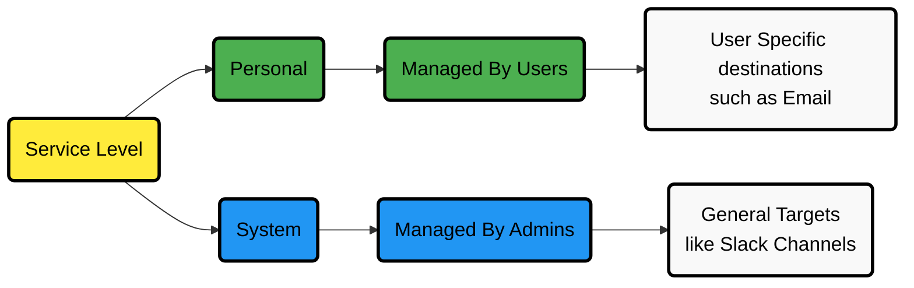
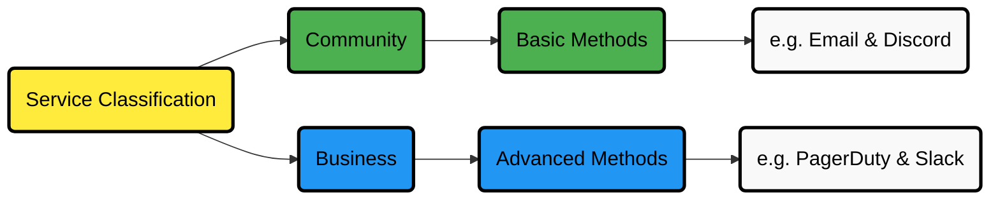
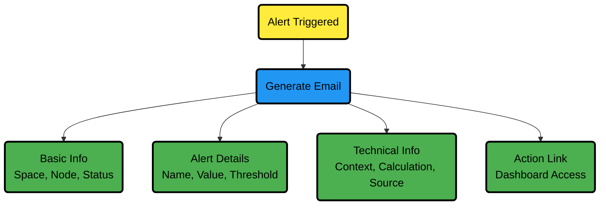

# Centralized Cloud Notifications Reference

Netdata Cloud sends Alert notifications for nodes in warning, critical, or unreachable states, ensuring Alerts are managed centrally and efficiently.

## Benefits of Centralized Notifications

- Consolidate health status views across all infrastructure components in one place
- Set up and [manage your Alert notifications easily](/docs/alerts-and-notifications/notifications/centralized-cloud-notifications/manage-notification-methods.md)
- Expedite troubleshooting with tools like [Metric Correlations](/docs/metric-correlations.md) and the [Anomaly Advisor](/docs/dashboards-and-charts/anomaly-advisor-tab.md)

:::info

To avoid notification overload, **flood protection** is triggered when a node frequently disconnects or sends excessive Alerts, highlighting potential issues. You can still access node details through Netdata Cloud or directly via the local Agent dashboard.

:::

:::important

You must [enable Alert notifications](/docs/alerts-and-notifications/notifications/centralized-cloud-notifications/manage-notification-methods.md#manage-space-notification-settings) for your Space(s) as an administrator. All users can then customize their notification preferences through their [account menu](/docs/alerts-and-notifications/notifications/centralized-cloud-notifications/manage-notification-methods.md#manage-user-notification-settings).

:::

:::note

Centralized Alerts in Netdata Cloud are separate from the [Netdata Agent](/docs/alerts-and-notifications/notifications/README.md) notifications. You must [configure Agent Alerts individually](/src/health/REFERENCE.md) on each node.

:::

## Alert Notifications

You can send notifications via email or through third-party services like PagerDuty or Slack. You can manage notification settings for the entire Space as an administrator, while individual users can personalize settings in their profile.

### Service Level

### Service Classification

## Alert Notification Silencing Rules

Netdata Cloud offers a silencing rule engine to mute Alert notifications based on specific conditions related to nodes or Alert types. You can manage these settings [here](/docs/alerts-and-notifications/notifications/centralized-cloud-notifications/manage-alert-notification-silencing-rules.md).

You can set up silencing rules that apply to any combination of:

- Users, rooms, nodes, host labels
- Contexts (charts), alert name, alert role
- Optional starting and ending date/time for scheduled maintenance windows

## Disabling Notifications from Netdata Cloud UI

You can turn off all notifications for a user at the space or war room level at the beginning of any maintenance window. This disables all notifications from Netdata Cloud, though you'll still need additional steps to disable or mute alerts from the nodes/agents themselves.

[For more info click here](https://learn.netdata.cloud/docs/alerts-&-notifications/alert-configuration-reference#disable-or-silence-alerts)

## Anatomy of an Email Alert Notification

Email notifications provide comprehensive details to help you understand and respond to alerts effectively.
