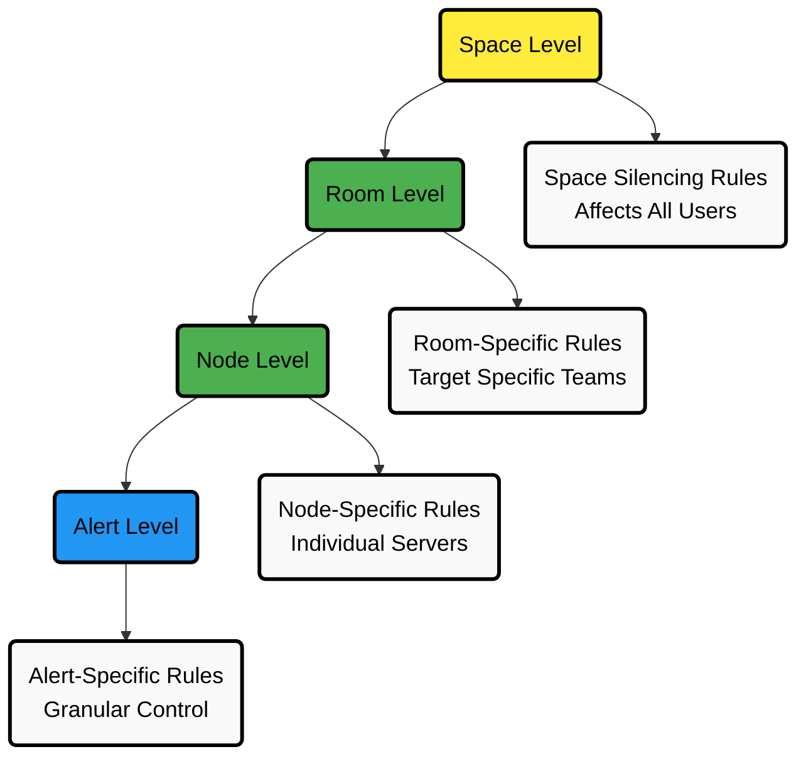
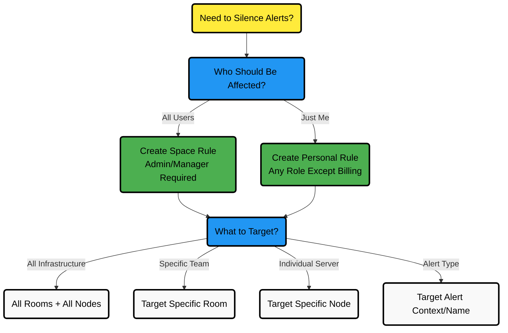

# Manage Alert Notification Silencing Rules

From the Cloud interface, you can manage your space's Alert notification silencing rules settings as well as allow users to define their personal ones.

## Rule Hierarchy

## Decision Flowchart

## Prerequisites

<strong>For Space Alert Notification Silencing Rules</strong>
 

To manage space-level silencing rules, you need:

- A Netdata Cloud account
- Access to Space as **administrator** or **manager** (**troubleshooters** can only view space rules)

<strong>For Personal Alert Notification Silencing Rules</strong>
 

To manage your personal silencing rules, you need:

- A Netdata Cloud account
- Access to Space with any role except **billing**

:::note

You can only add rules if your space is on a [paid plan](/docs/netdata-cloud/view-plan-and-billing.md).

:::

## Quick Access from Dashboard

You can also create silencing rules directly from the Alerts tab or Nodes tab:

- **From Alerts tab**: Use the "Actions" column to create new silencing rules for specific alerts
- **From Nodes tab**: Add alert silencing rules directly from any node row

## Steps to Configure Silencing Rules

1. Click the **Space settings** cog (located above your profile icon)
2. Click the **Alert & Notification** tab on the left-hand side
3. Click the **Notification Silencing Rules** tab

You will see configured Alert notification silencing rules for the space (if you aren't an **observer**) and yourself.

## Rule Configuration

### Available Actions

| Action                  | Description                                                                       |
|-------------------------|-----------------------------------------------------------------------------------|
| **Add New Rule**        | Create silencing rules for "All users" (administrators/managers only) or "Myself" |
| **Edit Existing Rule**  | Modify name, scope, criteria, and timing                                          |
| **Enable/Disable Rule** | Use toggle to activate or deactivate rules                                        |
| **Delete Rule**         | Remove silencing rules using the trash icon                                       |

### Configuration Criteria

<strong>Node Criteria</strong>
 

**Rooms**: Which Rooms will this apply to?

**Nodes**: What specific Nodes?

**Host Labels**: Does it apply to host labels key-value pairs?

<strong>Alert Criteria</strong>
 

**Alert Name**: Which alert name is being targeted?

**Alert Context**: What alert context?

**Alert Role**: Will it apply to a specific alert role?

<strong>Timing Options</strong>
 

**Immediate**: From now until turned off or until specific duration (start and end date automatically set).

**Scheduled**: Specify start and end time when the rule becomes active and inactive (time set according to your browser local timezone).

## Step-by-Step Wizards for Common Use Cases

<strong>Maintenance Window for All Infrastructure</strong>
 

**Use Case**: Complete infrastructure maintenance affecting all users

**Configuration Steps**:

1. Choose "All users" (requires admin/manager role)
2. Set name: "Infrastructure Maintenance [Date]"
3. **Node Criteria**:
    - Rooms: All Rooms
    - Nodes: *
    - Host Labels: *
4. **Alert Criteria**:
    - Alert Name: *
    - Alert Context: *
    - Alert Role: *
5. **Timing**: Scheduled with maintenance window start/end times

**Validation Checklist**:

- Admin/Manager permissions confirmed.
- All rooms and nodes are targeted (*).
- Maintenance window times are set correctly.
- Rule name includes a date for easy reference.

<strong>Team-Specific Alert Silencing</strong>
 

**Use Case**: Database team doesn't want notifications for their managed servers.

**Configuration Steps**:

1. Choose "All users" (for team-wide effect)
2. Set name: "DB Team - PostgreSQL Servers"
3. **Node Criteria**:
    - Rooms: PostgreSQL Servers
    - Nodes: *
    - Host Labels: *
4. **Alert Criteria**:
    - Alert Name: *
    - Alert Context: *
    - Alert Role: *
5. **Timing**: Immediate (ongoing)

**Validation Checklist**:

- Correct room selected (not "All Rooms")
- Team members have access to the specified room
- Rule name clearly identifies team and scope

<strong>Single Node Maintenance</strong>
 

**Use Case**: Specific server undergoing maintenance

**Configuration Steps**:

1. Choose "All users" or "Myself" based on impact
2. Set name: "Node Maintenance - [NodeName]"
3. **Node Criteria**:
    - Rooms: All Rooms
    - Nodes: [specific node name]
    - Host Labels: *
4. **Alert Criteria**:
    - Alert Name: *
    - Alert Context: *
    - Alert Role: *
5. **Timing**: Scheduled with the maintenance window

**Validation Checklist**:

- Exact node name specified correctly
- Maintenance window times confirmed
- Other team members are notified if using "All users"

<strong>Load Testing Alert Suppression</strong>
 

**Use Case**: Planned stress testing that will trigger CPU alerts

**Configuration Steps**:

1. Choose the appropriate scope ("All users" or "Myself")
2. Set the name: "Load Testing - CPU Alerts"
3. **Node Criteria**:
    - Rooms: [testing environment rooms]
    - Nodes: * (or specific test nodes)
    - Host Labels: environment:testing (if applicable)
4. **Alert Criteria**:
    - Alert Name: *
    - Alert Context: system.cpu
    - Alert Role: *
5. **Timing**: Scheduled for the testing period

:::tip

**Validation Checklist**:

- Correct alert context specified (system.cpu)
- Testing environment properly targeted
- Testing timeframe accurately set
- Production systems excluded

:::

## Rule Validation Checklist

:::tip

Before activating any silencing rule, verify:

| Category                 | Validation Item                  | Description                                      |
|--------------------------|----------------------------------|--------------------------------------------------|
| **Basic Configuration**  | Rule name is descriptive         | Include purpose/date for easy reference          |
|                          | Correct scope selected           | Choose "All users" vs "Myself" appropriately     |
|                          | Proper permissions for scope     | Admin/manager required for "All users"           |
| **Target Validation**    | Room selection matches scope     | Ensure intended rooms are targeted               |
|                          | Node specification is accurate   | Use * for all, specific names for targeted nodes |
|                          | Host labels correctly formatted  | Use key:value pairs format                       |
| **Alert Criteria**       | Alert name/context matches       | Verify targeting intended alerts                 |
|                          | Alert role properly specified    | Use role-based alerting correctly                |
|                          | Wildcard (*) used appropriately  | Apply broad targeting where needed               |
| **Timing Configuration** | Immediate vs Scheduled selection | Choose appropriate timing method                 |
|                          | Start/end times set correctly    | Consider browser timezone                        |
|                          | Duration appropriate             | Match planned activity timeframe                 |
| **Impact Assessment**    | Stakeholders notified            | Inform team of silencing rule activation         |
|                          | Alternative monitoring in place  | Ensure backup monitoring if needed               |
|                          | Rule deactivation planned        | Schedule rule removal after maintenance          |

:::

## Common Silencing Scenarios

| Scenario                        | Configuration                                     | Use Case                                                |
|---------------------------------|---------------------------------------------------|---------------------------------------------------------|
| **Infrastructure Maintenance**  | All Rooms, All Nodes (*)                          | Complete infrastructure-wide maintenance window         |
| **Team-Specific Silencing**     | Specific Room (e.g., PostgreSQL Servers)          | Team doesn't want notifications for their managed nodes |
| **Single Node Maintenance**     | Specific node (e.g., child1)                      | Node undergoing maintenance                             |
| **Environment-Based Silencing** | Host label: environment:production                | Maintenance on production environment nodes             |
| **Third-Party Service Issues**  | Specific alert name                               | External service maintenance affecting monitoring       |
| **Load Testing**                | Alert context: system.cpu                         | Planned stress testing on CPU resources                 |
| **Role-Based Control**          | Alert role: webmaster                             | Silence all alerts for specific role                    |
| **Granular Alert Control**      | Specific alert + specific node                    | Targeted silencing for known issues                     |
| **Storage Maintenance**         | Alert: disk_space_usage, Instance: specific mount | Maintenance on specific storage volumes                 |

## Detailed Examples Reference

| Rule Name                        | Rooms              | Nodes  | Host Label             | Alert Name                                     | Alert Context | Alert Instance         | Alert Role | Description                                                                         |
|----------------------------------|--------------------|--------|------------------------|------------------------------------------------|---------------|------------------------|------------|-------------------------------------------------------------------------------------|
| Space silencing                  | All Rooms          | *      | *                      | *                                              | *             | *                      | *          | Silences entire space, all nodes, all users. Infrastructure-wide maintenance window |
| DB Servers Rooms                 | PostgreSQL Servers | *      | *                      | *                                              | *             | *                      | *          | Silences nodes in PostgreSQL Servers Room only, not All Nodes Room                  |
| Node child1                      | All Rooms          | child1 | *                      | *                                              | *             | *                      | *          | Silences all Alert state transitions for node child1 in all Rooms                   |
| Production nodes                 | All Rooms          | *      | environment:production | *                                              | *             | *                      | *          | Silences Alert state transitions for nodes with environment:production label        |
| Third party maintenance          | All Rooms          | *      | *                      | httpcheck_posthog_netdata_cloud.request_status | *             | *                      | *          | Silences specific Alert during third-party partner maintenance                      |
| Intended stress usage on CPU     | All Rooms          | *      | *                      | *                                              | system.cpu    | *                      | *          | Silences specific Alerts across all nodes and their CPU cores                       |
| Silence role webmaster           | All Rooms          | *      | *                      | *                                              | *             | *                      | webmaster  | Silences all Alerts configured with role webmaster                                  |
| Silence Alert on node            | All Rooms          | child1 | *                      | httpcheck_posthog_netdata_cloud.request_status | *             | *                      | *          | Silences specific Alert on child1 node                                              |
| Disk Space Alerts on mount point | All Rooms          | *      | *                      | disk_space_usage                               | disk.space    | disk_space_opt_baddisk | *          | Silences specific Alert instance on all nodes /opt/baddisk                          |
