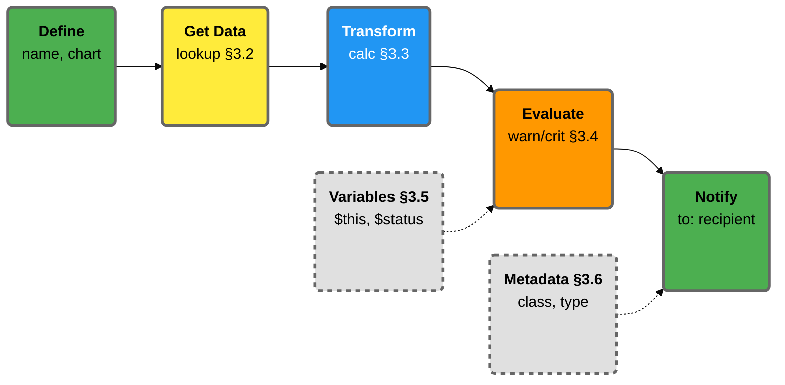

# 3. Alert Configuration Syntax (Reference)

This chapter is a precise, task-oriented reference for writing and understanding Netdata alert definitions in configuration files.

:::tip

Refer to this chapter when you:
- Are editing `.conf` files under `health.d` and need to know what each line means
- Want to understand or safely tweak a stock alert shipped by Netdata
- Need to write custom, advanced alert rules beyond what the UI exposes
- Are debugging an alert expression and need to know which variables, operators, or functions are available

:::

## Alert Configuration Structure Overview

Netdata alerts follow a simple pipeline:

**How it works:**

1. **Define** (§3.1): Name the alert and target a chart
2. **Get Data** (§3.2): Use `lookup` to read metrics over time
3. **Transform** (§3.3): Optionally use `calc` to compute derived values
4. **Evaluate** (§3.4): Apply `warn`/`crit` conditions using variables (§3.5)
5. **Notify**: Send to recipients with metadata (§3.6)

**Key:** Solid lines show the evaluation pipeline; dotted lines show supporting elements that inform evaluation or notifications.

## What You'll Find in This Chapter

Each section mirrors Netdata's `REFERENCE.md`, but is reorganized by what you're trying to do, not by internal implementation details.

| Section | What It Covers |
|---------|----------------|
| **3.1 Alert Definition Lines (Minimal and Full Forms)** | The structure of an alert block. Shows the essential lines (`alarm`/`template`, `on`, `lookup`, `every`, `warn`, `crit`) and optional ones (`to`, `summary`, `info`, `delay`, `exec`, etc.), with valid values and defaults. Helps you read or assemble a complete alert from top to bottom. |
| **3.2 Lookup and Time Windows** | The `lookup` line in detail: how to choose aggregation functions (`average`, `min`, `max`, `sum`, etc.), time windows (`1m`, `10m`, `1h`, etc.), and dimensions, and how these lookups interact with Netdata's time-series storage (dbengine). This is where you learn what data your alert actually sees. |
| **3.3 Calculations and Transformations (`calc`)** | How to transform lookup results before comparing them to thresholds. Documents the `calc` expression and how to build percentages and rate-of-change calculations on top of raw metrics. |
| **3.4 Expressions, Operators, and Functions** | The expression language used in `warn`, `crit`, and related lines: arithmetic operators, comparisons, logical operators, and any supported helper functions. This section explains how to write conditions that evaluate to true/false. |
| **3.5 Variables and Special Symbols** | All the variables you can use inside expressions: `$this`, `$status`, `$now`, chart and dimension variables, context-related variables, and status constants. Also shows how to discover available variables using the `alarm_variables` API. |
| **3.6 Optional Metadata: class, type, component, and labels** | Metadata lines that don't change when an alert fires, but control how alerts are grouped, filtered, and displayed in UIs and notifications. Explains how to keep metadata consistent so you can build clean views, silencing rules, and routing later. Covers `class`, `type`, `component`, `host labels`, and `chart labels`. |

## How to Navigate This Chapter

- If you're reading or editing a specific alert, start at 3.1, then jump to the subsection that matches the line you're unsure about.
- If you're designing a new rule, skim 3.1 → 3.2 → 3.3 → 3.4 to understand the core building blocks, then use 3.5–3.6 to add variables and metadata.
- For API details about querying alerts and variables, use this chapter together with Chapter 9: APIs for Alerts and Events.

:::note

This chapter is not a workflow guide. It won't tell you when to create alerts or how to deploy them across nodes. Instead, it's the place you come back to whenever you need a precise answer to: "What does this line/condition actually mean?"

:::

## What's Next

- **3.1 Alert Definition Lines (Minimal and Full Forms)** covers the structure of a single alert block line by line (start here).
- Or, if you're already comfortable with the basics and only care about what data the alert sees, skip ahead to **3.2 Lookup and Time Windows**.