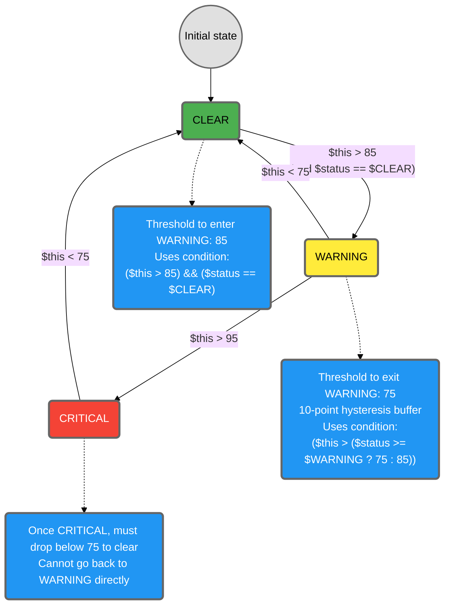

# 3.4 Expressions, Operators, and Functions

Alert conditions in Netdata are expressed as numeric boolean expressions on top of the value of `$this` (and other variables). These expressions appear in lines like `warn:`, `crit:`, and `ok:` (when used). Expressions compare and combine numbers and status constants; there are no string comparisons or regular expressions in the health expression language.

:::tip

Refer to this section when you're reading `warn` / `crit` lines and want to understand why an alert changes status, writing new conditions and need to know which operators and functions are available, or debugging expressions that always evaluate to true/false or behave unexpectedly.

:::

## 3.4.1 Where Expressions Are Used

Expressions primarily appear in these lines:

- `warn:` (condition for entering or staying in WARNING)
- `crit:` (condition for entering or staying in CRITICAL)
- `ok:` (optional, explicit condition for returning to CLEAR)

Example:

```conf
warn: $this > 80
crit: $this > 95
```

Here, the expression on `warn:` evaluates to true when `$this` is above `80`, and the expression on `crit:` evaluates to true when `$this` is above `95`.

Using an explicit `ok:` to control when the alert clears:

```conf
warn: $this > 80
crit: $this > 95
  ok: $this < 70
```

In many built-in alerts, `ok:` is omitted and Netdata uses default clear behavior based on `warn:`/`crit:` transitions. Use `ok:` only when you need more explicit or asymmetric clear conditions.

:::tip

Keep expressions as simple and readable as possible. Do math and unit conversions in `calc`, and use `warn`/`crit` mostly for comparisons and logical combinations.

:::

## 3.4.2 Expression Structure and Evaluation

An expression must evaluate to true or false. Internally, Netdata evaluates them in this order:

| Step | Action | Result |
|------|--------|--------|
| 1 | Compute `$this` from `lookup` and `calc` | See **3.2** and **3.3** |
| 2 | Evaluate the `crit:` and `warn:` expressions | Check both conditions |
| 3 | If `crit:` is true | Alert enters or stays in CRITICAL |
| 4 | If `crit:` is false but `warn:` is true | Alert enters or stays in WARNING |
| 5 | If both are false and an `ok:` expression exists | Netdata evaluates `ok:` to decide whether to return to CLEAR |
| 6 | Apply previous status and `delay`/hysteresis | Final status depends on these settings (see 3.1 and 8.1) |

A simple example:

```conf
warn: $this > 80
crit: $this > 95
```

A slightly more complex example using status:

```conf
warn: ($this > 80) && ($status != $CRITICAL)
crit: $this > 95
```

Here, `WARNING` is only entered if `$this > 80` and the alert is not already `CRITICAL`.

For the available variables (`$this`, `$status`, etc.), see **3.5**.

## 3.4.3 Comparison and Arithmetic Operators

Netdata's alert expressions support standard arithmetic and comparison operators.

### Comparison Operators

Use comparison operators to compare numeric values:

| Operator | Meaning | Example |
|----------|---------|---------|
| `>` | greater than | `$this > 80` |
| `<` | less than | `$this < 5` |
| `>=` | greater or equal | `$this >= 90` |
| `<=` | less or equal | `$this <= 0` |
| `==`, `=` | equal | `$status == $CRITICAL` |
| `!=`, `<>` | not equal | `$status != $CLEAR` |

:::note Alternative Operators

`=` is an alias for `==`, and `<>` is an alias for `!=`. Both are supported for compatibility.

:::

:::warning

All comparisons are numeric. There is no implicit unit conversion or string comparison. If you compare bytes to a threshold in megabytes, the expression will be wrong. Use `calc` to normalize units first (see **3.3**).

:::

Examples:

```conf
warn: $this >= 75
crit: $this >= 90

warn: ($this < 20) && ($status != $CRITICAL)
crit: $this < 10
```

### Arithmetic Operators

Use arithmetic operators for simple mathematical operations in expressions (more complex logic should usually go in `calc`):

| Operator | Meaning | Example |
|----------|---------|---------|
| `+` | addition | `$this + 10` |
| `-` | subtraction | `$this - 5` |
| `*` | multiplication | `$this * 2` |
| `/` | division | `$this / 100` |
| `%` | modulo (remainder) | `$this % 2` |

Examples:

```conf
# Compare to a value scaled by a factor
warn: $this > (2 * $baseline)

# Check if a value is even (illustrative)
warn: ($this % 2) == 0
```

:::tip

For clarity, keep complex arithmetic in `calc` and use `warn`/`crit` mainly for comparing `$this` to thresholds or combining a few boolean conditions.

:::

## 3.4.4 Logical Operators and Grouping

Logical operators let you combine conditions.

### Logical Operators

| Operator | Meaning | Example |
|----------|---------|---------|
| `&&`, `AND` | logical AND (case-insensitive) | `($this > 80) && ($status == $CLEAR)` |
| `\|\|`, `OR` | logical OR (case-insensitive) | `($cpu > 90) \|\| ($error_rate > 5)` |
| `!`, `NOT` | logical NOT (case-insensitive) | `!($status == $CRITICAL)` |

:::tip

You can use `AND`, `OR`, and `NOT` instead of `&&`, `||`, and `!`. They are case-insensitive (`and`, `AND`, `And` all work). Many stock alerts use the word forms for readability.

:::

Examples:

```conf
# WARNING if high load AND currently not CRITICAL
warn: ($this > 80) && ($status != $CRITICAL)

# CRITICAL if either CPU or error rate is high
crit: ($cpu_usage > 90) || ($error_rate > 5)

# WARNING only when above threshold and not already critical
warn: ($this > 75) && !($status == $CRITICAL)
```

### Parentheses and Precedence

Netdata follows normal operator precedence rules:

1. Parentheses `(...)`
2. Arithmetic operators (`*`, `/`, `%`, then `+`, `-`)
3. Comparison operators (`>`, `<`, `>=`, `<=`, `==`, `!=`)
4. Logical NOT `!`
5. Logical AND `&&`
6. Logical OR `||`

:::tip

To avoid ambiguity, always use parentheses when mixing comparisons and logical operators.

:::

Example:

```conf
# Clear grouping: (A && B) || C
crit: (($this > 95) && ($status != $CRITICAL)) || ($spikes > 10)
```

## 3.4.5 Status-Aware and Hysteresis-Friendly Expressions

The `$status` variable represents the current status of this alert before this evaluation (for example, `$CLEAR`, `$WARNING`, `$CRITICAL`). Status constants are described in **3.5 Variables and Special Symbols**.

You can use `$status` and status constants in expressions to create simple forms of hysteresis or to avoid unnecessary transitions.

Examples:

```conf
# Only enter WARNING from CLEAR when crossing 80
warn: ($this > 80) && ($status == $CLEAR)
crit: $this > 95

# Don't drop back to WARNING once CRITICAL
warn: ($this > 80) && ($status != $CRITICAL)
crit: $this > 95
```

### Hysteresis Example with Ternary Operator

A common pattern uses the ternary operator (`? :`) to create different thresholds based on current status:

```conf
# Hysteresis: enter WARNING at 85, exit at 75
warn: $this > (($status >= $WARNING) ? (75) : (85))
crit: $this > (($status == $CRITICAL) ? (85) : (95))
```

**How this works:**



**This creates a 10-point hysteresis buffer:**
- When CLEAR, `$this` must exceed **85** to trigger WARNING
- Once in WARNING, `$this` must drop below **75** to return to CLEAR
- Values between 75-85 maintain current state (prevents flapping)

:::tip

These patterns let you control whether an alert can go from `CRITICAL` to `WARNING` or must go `CRITICAL` to `CLEAR` first, and avoid toggling between `WARNING` and `CRITICAL` too frequently.

More advanced hysteresis patterns (including combining `delay` and status) are covered in **8.1 Hysteresis and Status-Based Conditions**.

:::

## 3.4.6 Helper Functions

Netdata's expression evaluator provides a minimal set of helper functions.

**Currently available:**

| Function | Description | Example |
|----------|-------------|---------|
| `abs()` | Absolute value | `abs($this) > 10` |

**Example usage:**

```conf
# Alert when deviation (positive or negative) exceeds threshold
lookup: average -5m unaligned of deviation
  warn: abs($this) > 10
  crit: abs($this) > 20
```

:::note

The `abs()` function is case-insensitive: `ABS()`, `Abs()`, and `abs()` all work.

:::

:::tip

When you're not sure if a function is supported, copy patterns from stock alerts in `/usr/lib/netdata/conf.d/health.d/` or check your local `REFERENCE.md` rather than inventing your own.

:::

## 3.4.7 Common Expression Pitfalls

:::note

Alert expressions are pure: they have no side effects and cannot trigger actions directly. If you want to run scripts or commands when an alert fires, use the `exec` line (see **8.4 Custom Actions with exec and Automation**).

:::

When an alert behaves unexpectedly, the most common expression issues are:

<details>
<summary><strong>Using the wrong variable</strong></summary>

Example: comparing `$total` directly instead of `$this`, or using a chart variable name that doesn't exist.

**Solution:** Inspect available variables via `alarm_variables` (see **3.5** and **9.3**).

</details>

<details>
<summary><strong>Missing parentheses</strong></summary>

Ambiguous:
```conf
warn: $this > 80 && $status == $CLEAR
```

Clear:
```conf
warn: ($this > 80) && ($status == $CLEAR)
```

</details>

<details>
<summary><strong>Mixing units</strong></summary>

Example: comparing raw bytes (`$this` in bytes) to thresholds that assume MB.

**Solution:** Move conversions into `calc` (see **3.3**).

</details>

<details>
<summary><strong>Expressions that are always true or always false</strong></summary>

Example: using `||` instead of `&&`, or incorrect equality tests.

**Solution:** Simplify the expression and test parts individually.

</details>

:::tip

For systematic debugging of alert behavior, see **Chapter 7: Troubleshooting Alert Behaviour**.

:::

## Key takeaway

Keep `warn`/`crit` expressions simple, explicit, and well-grouped with parentheses. Do calculations in `calc`, then use expressions mainly to decide when an alert should change state.

## What's Next

- **3.5 Variables and Special Symbols** lists the variables you can use inside expressions (`$this`, `$status`, `$now`, chart and context variables) and how to inspect them via the `alarm_variables` API
- **8.1 Hysteresis and Status-Based Conditions** shows advanced patterns for using status and expressions together to control alert transitions in more complex ways