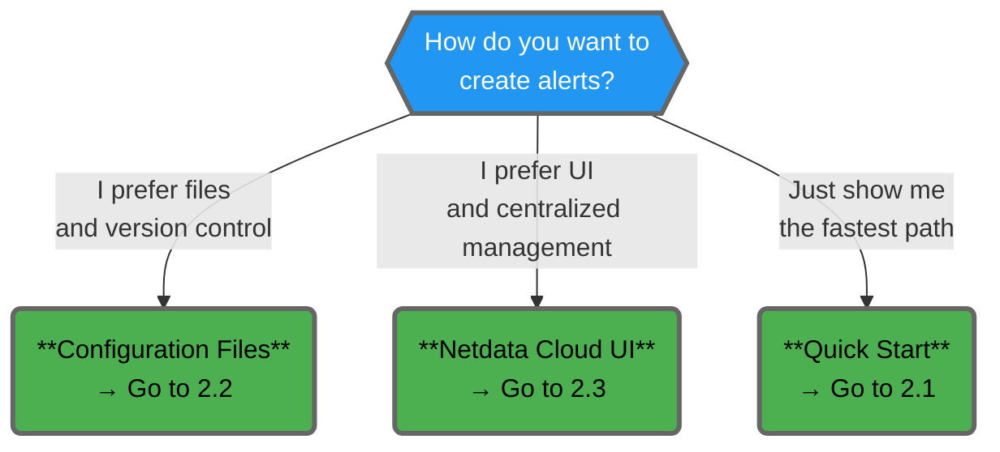

# 2. Creating and Managing Alerts

Now that you understand **what alerts are** (Chapter 1), this chapter shows you **how to create, edit, and manage them** in practice.

Netdata gives you **two primary workflows** for working with alerts:

1. **Configuration files** Write or edit alert definitions directly in `.conf` files on the Agent or Parent
2. **Netdata Cloud UI** Create and manage alerts visually through the Alerts Configuration Manager

:::note

Both approaches produce alerts that **run on your Agents or Parents**, not in Cloud. Events are visible locally and in Netdata Cloud. You can use either workflow exclusively or mix them based on your team's needs.

:::

## What This Chapter Covers

| Section | What You'll Learn |
|---------|-------------------|
| **2.1 Quick Start: Create Your First Alert** | A minimal, step-by-step path to get one alert working fast (file-based or Cloud UI) |
| **2.2 Creating and Editing Alerts via Configuration Files** | How to locate, edit, and reload health configuration files on disk |
| **2.3 Creating and Editing Alerts via Netdata Cloud** | How to use the Cloud Alerts Configuration Manager to define alerts visually |
| **2.4 Managing Stock versus Custom Alerts** | How to safely customize or override Netdata's built-in alerts |
| **2.5 Reloading and Validating Alert Configuration** | How to apply changes and confirm alerts loaded correctly |

## Which Workflow Should You Use?

Both workflows evaluate alerts **on the Agent/Parent** (not in Cloud). The difference is **where you define and store the rules**.

| Workflow | Best For |
|----------|----------|
| **Configuration Files** | • Version control (Git, CI/CD) • Air-gapped or offline environments • Advanced syntax and custom expressions • Infrastructure-as-code workflows • Templating and variable reuse (Ansible, Terraform, etc.) |
| **Netdata Cloud UI** | • Centralized management across many nodes • Instant rollout to connected nodes without SSH or file edits • Teams who prefer visual workflows • Quick iteration and testing |

You can start with one and switch to the other later, or use **both in parallel**:
- Use **Cloud** for standard, fleet-wide alerts
- Use **files** for node-specific or advanced cases

## What's Next

- **2.1 Quick Start** Get your first alert running in under 5 minutes
- **2.2 and 2.3** Detailed walkthroughs for file-based and Cloud UI workflows
- **Chapter 3** Full syntax reference for writing alert definitions