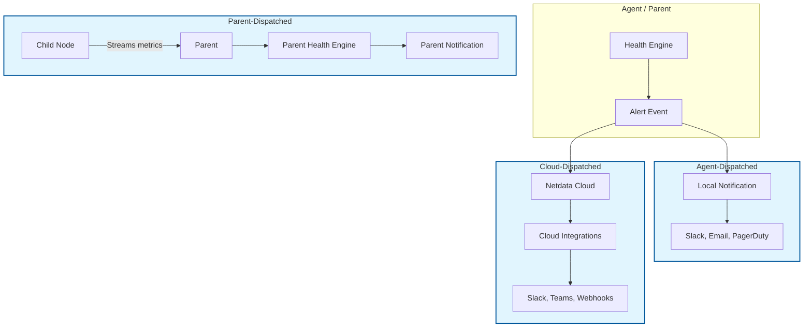

# 5. Receiving Notifications

Now that you know **how to create alerts** (Chapter 2) and **control their behavior** (Chapter 4), this chapter shows you how to **deliver alert events** to people and systems.

Alert events are only useful if the right people see them. Netdata supports three notification dispatch models:

| Model | Where Notifications Run | Best For |
|-------|------------------------|----------|
| **Agent-Dispatched** | Each Agent evaluates and sends notifications | Air-gapped environments, local teams |
| **Parent-Dispatched** | Parents aggregate and send for children | Hierarchical deployments, reduced Cloud traffic |
| **Cloud-Dispatched** | Cloud receives events and routes notifications | Centralized management, Cloud integrations |

## What This Chapter Covers

| Section | What You'll Learn |
|---------|-------------------|
| **5.1 Notification Concepts** | The three dispatch models and when to use each |
| **5.2 Agent and Parent Notifications** | Configuring local notification methods (email, Slack, PagerDuty, etc.) |
| **5.3 Cloud Notifications** | Setting up Cloud-integrated notifications with roles and routing |
| **5.4 Controlling Recipients** | Mapping severities to people, using Cloud roles |
| **5.5 Testing and Troubleshooting** | Verifying notifications work, common issues |

## 5.1 Notification Concepts

Before configuring notifications, understand where they originate and how they flow.

### 5.1.1 The Three Dispatch Models



**1. Agent-Dispatched Notifications**

Each Netdata Agent runs its own health engine and sends notifications directly to configured destinations.

**Pros:**
- Works without Cloud connectivity
- Lowest latency for local notifications
- Complete control via local configuration

**Cons:**
- Duplicate notifications if multiple Agents alert on the same issue
- Configuration must be managed per node

**2. Parent-Dispatched Notifications**

Parents receive streamed metrics from children and run health checks centrally. Notifications are sent from the Parent.

**Pros:**
- Single point of control for a cluster
- Reduced traffic to Cloud
- Aggregated view of child health

**Cons:**
- Parent must be available for children to alert
- More complex configuration

**3. Cloud-Dispatched Notifications**

Netdata Cloud receives alert events from all connected Agents/Parents and dispatches notifications through Cloud integrations.

**Pros:**
- Centralized management of notification settings
- Integrations with Cloud-native tools (Slack, Teams, webhooks)
- Personal and space-wide notification rules

**Cons:**
- Requires Cloud connectivity
- Additional latency (events travel to Cloud first)

### 5.1.2 Which Model Should You Use?

| Environment | Recommended Model |
|-------------|-------------------|
| Air-gapped / no internet | Agent-Dispatched |
| Hierarchical infrastructure | Parent-Dispatched |
| Cloud-connected, want centralized management | Cloud-Dispatched |
| Mixed environment | Combine models (some local, some Cloud) |

Many organizations use **Cloud-Dispatched** for most alerts and keep **Agent-Dispatched** for critical notifications that must work without Cloud.

## 5.2 Configuring Agent and Parent Notifications

Notifications from Agents and Parents are configured in `health_alarm_notify.conf`.

### 5.2.1 Finding the Configuration File

```bash
sudo less /etc/netdata/health_alarm_notify.conf
```

This file ships with Netdata and contains the notification subsystem configuration.

### 5.2.2 Notification Methods

Netdata supports multiple notification destinations:

| Method | Type | Setup Complexity | Best For |
|--------|------|------------------|----------|
| **Email** | Built-in | Low | Pager schedules, management |
| **Slack** | Webhook | Low | DevOps teams, chat workflows |
| **Discord** | Webhook | Low | Gaming teams, community ops |
| **PagerDuty** | Integration | Medium | On-call rotations, enterprise |
| **OpsGenie** | Integration | Medium | Enterprise incident management |
| **Telegram** | Bot | Medium | Direct message alerts |
| **Custom Scripts** | exec | High | Any custom integration |

### 5.2.3 Configuring Email Notifications

```conf
# Enable email notifications
SEND_EMAIL="YES"

# SMTP configuration (for systems without local MTA)
SMTP_SERVER="smtp.example.com:587"
SMTP_USER="alerts@example.com"
SMTP_PASSWORD="your-password"
FROM_ADDRESS="netdata@example.com"

# Default recipients (can be overridden per alert)
DEFAULT_RECIPIENT_EMAIL="admin@example.com"
```

**Per-alert email routing:**

```conf
# In your alert definition
template: high_cpu
   on: system.cpu
   lookup: average -5m of user,system
   every: 1m
   warn: $this > 80
   crit: $this > 95
   to: dbteam@example.com
```

### 5.2.4 Configuring Slack Notifications

**Step 1: Create a Slack Incoming Webhook**

1. Go to your Slack workspace → **Settings & Admin** → **Manage apps**
2. Create a new incoming webhook
3. Select the channel for alerts
4. Copy the webhook URL

**Step 2: Configure Netdata**

```conf
SEND_SLACK="YES"
SLACK_WEBHOOK_URL="https://hooks.slack.com/services/YOUR/WEBHOOK/URL"
DEFAULT_RECIPIENT_SLACK="#alerts"
```

**Per-alert channel routing:**

```conf
template: database_alert
   on: mysql.global_status
   lookup: average -1m of queries
   every: 1m
   warn: $this > 10000
   crit: $this > 50000
   to: slack:#database-alerts
```

### 5.2.5 Configuring PagerDuty

```conf
SEND_PD="YES"
PD_SERVICE_KEY="your-service-key"
DEFAULT_RECIPIENT_PD=" pagerduty-group"
```

PagerDency integration requires:
- A PagerDuty account and service
- The service key (Integration Key) for your Netdata service

### 5.2.6 Using Custom Scripts with `exec`

For integrations not built-in, use the `exec` line to run custom scripts:

```conf
template: custom_alert
   on: health.service
   lookup: average -1m of status
   every: 1m
   crit: $this == 0
   exec: /usr/lib/netdata/custom/alert-handler.sh
   to: custom-recipient
```

The script receives environment variables:

| Variable | Description |
|----------|-------------|
| `NETDATA_ALARM_NAME` | Name of the alert |
| `NETDATA_HOST` | Host name |
| `NETDATA_CHART` | Chart name |
| `NETDATA_STATUS` | Current status (CLEAR, WARNING, CRITICAL) |
| `NETDATA_VALUE` | Current value |
| `NETDATA_PREVIOUS_STATUS` | Previous status |
| `NETDATA_REASON` | Description of the condition |

## 5.3 Configuring Cloud Notifications

Cloud-dispatched notifications are managed through the Netdata Cloud UI rather than configuration files.

### 5.3.1 Accessing Notification Configuration

1. Log in to Netdata Cloud
2. Navigate to **Settings** → **Notification Integrations**
3. Click **+ Add Integration**

### 5.3.2 Supported Cloud Integrations

| Integration | Type | Use Case |
|-------------|------|----------|
| **Slack** | Channel | Team chat workflows |
| **Microsoft Teams** | Channel | Enterprise collaboration |
| **Email** | Address | Traditional notification delivery |
| **PagerDuty** | Service | On-call rotation management |
| **OpsGenie** | Service | Alert routing to on-call engineers |
| **Webhook** | URL | Custom integrations, SIEM systems |
| **Jira** | Project | Incident tracking and ticket creation |

### 5.3.3 Setting Up a Slack Integration in Cloud

1. Navigate to **Settings** → **Notification Integrations**
2. Click **+ Add Slack**
3. Enter the webhook URL (from your Slack app)
4. Select the default channel
5. Click **Save**

### 5.3.4 Cloud Notification Tiers

Netdata Cloud supports multiple notification tiers:

| Tier | Description | Example |
|------|-------------|---------|
| **Personal** | Notifications sent only to you | Your phone, your email |
| **Space** | Notifications to the space's configured integrations | `#alerts` channel for the Space |
| **Role-Based** | Notifications to users with specific roles | `on-call`, `sre-team` |

## 5.4 Controlling Who Gets Notified

### 5.4.1 Severity-to-Recipient Mapping

In Cloud integrations, you can configure which severities trigger notifications:

```yaml
integration: Slack #alerts
  severity:
    critical:
      - "#urgent"
      - on-call-pager
    warning:
      - "#alerts"
    clear:
      - "#alerts"
```

This means:
- **Critical** alerts go to `#urgent` and trigger on-call paging
- **Warning** alerts go to `#alerts` channel
- **Clear** events also go to `#alerts` for record-keeping

### 5.4.2 Using Cloud Roles

Assign roles to users in Netdata Cloud:

1. Navigate to **Settings** → **Users**
2. Select a user
3. Assign roles: `Admin`, `Member`, `Viewer`, or custom roles

Then configure notification routing by role:

```yaml
integration: Email ops-team@company.com
  role:
    - name: sre-on-call
      severity: [critical, warning]
    - name: manager
      severity: [critical]
```

### 5.4.3 Alert-Specific Routing

Override global routing for specific alerts:

```conf
# In local health configuration
template: critical_service
   on: health.service
   lookup: average -1m of status
   every: 1m
   crit: $this == 0
   to: ops-pager@company.com
   from: ops-team@company.com
```

## 5.5 Testing and Troubleshooting Notification Delivery

### 5.5.1 Testing Agent Notifications

**Send a test notification:**

```bash
# Using netdata-ui (if available)
/usr/lib/netdata/netdata-ui send-test-notification --type slack

# Or manually trigger a test
curl -s "http://localhost:19999/api/v1/alarms?test=1"
```

**Check notification logs:**

```bash
sudo tail -n 100 /var/log/netdata/error.log | grep -i notification
```

Look for lines containing `health_alarm_notify`, `send_slack`, `send_email`, etc.

### 5.5.2 Testing Cloud Notifications

**Create a test alert in Cloud UI:**

1. Navigate to **Alerts** → **Alert Configuration**
2. Create a test alert with low thresholds
3. Monitor the target integration (Slack channel, email inbox, etc.)

**Check Cloud event stream:**

1. Navigate to **Events** in Cloud
2. Look for test alert events
3. Verify status transitions appear

### 5.5.3 Common Issues and Fixes

| Issue | Likely Cause | Fix |
|-------|--------------|-----|
| No notifications received | Recipient misconfigured | Verify `to:` field in alert or integration settings |
| Duplicate notifications | Both Agent and Cloud sending | Disable one dispatch model |
| Notifications delayed | Network latency or batching | Check connection status, reduce batch size |
| Wrong channel | Routing misconfigured | Verify channel name in `health_alarm_notify.conf` |
| Alerts not triggering | Thresholds too high | Lower threshold or check metric values |

### 5.5.4 Notification Debugging Checklist

Use this checklist when notifications aren't working:

1. **Is the alert firing?** Check API: `curl http://localhost:19999/api/v1/alarms`
2. **Is the alert enabled?** Verify not disabled via `enabled: no`
3. **Is the recipient correct?** Check `to:` line in alert definition
4. **Is the notification method enabled?** Verify `SEND_SLACK=YES` etc. in `health_alarm_notify.conf`
5. **Are logs showing errors?** Check `/var/log/netdata/error.log`
6. **Is Cloud connected?** Verify Agent-Cloud link status in Cloud UI
7. **Are there silencing rules?** Check Cloud silencing rules
8. **Is the severity correct?** Verify `warn`/`crit` conditions evaluate true

## Key Takeaway

Notifications complete the alerting loop. Choose the right dispatch model for your environment, configure appropriate routes for each alert severity, and test thoroughly to ensure alerts reach the right people.

## What's Next

- **Chapter 6: Alert Examples and Common Patterns** Practical alert templates you can adapt
- **Chapter 7: Troubleshooting Alert Behaviour** Debugging alerts that don't fire
- **Chapter 8: Advanced Alert Techniques** Custom scripts, automation, and performance tuning
- **Chapter 11: Built-In Alerts Reference** Catalog of Netdata's stock alerts