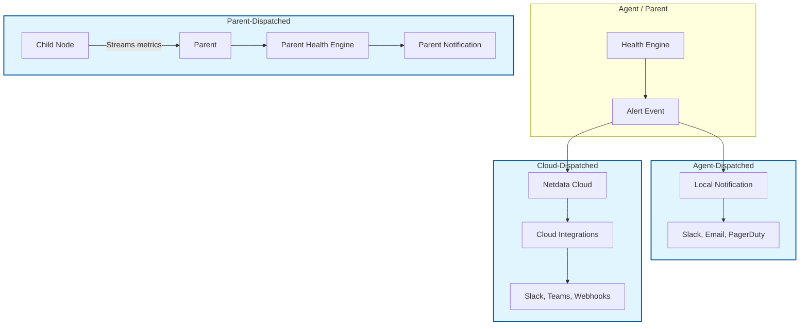

# 5.1 Notification Concepts

Before configuring notifications, understand where they originate and how they flow.

## 5.1.1 The Three Dispatch Models

**1. Agent-Dispatched Notifications**

Each Netdata Agent runs its own health engine and sends notifications directly to configured destinations.

| Pros | Cons |
|------|------|
| Works without Cloud connectivity | Duplicate notifications if multiple Agents alert on the same issue |
| Lowest latency for local notifications | Configuration must be managed per node |
| Complete control via local configuration | |

**2. Parent-Dispatched Notifications**

Parents receive streamed metrics from children and run health checks centrally. Notifications are sent from the Parent.

| Pros | Cons |
|------|------|
| Single point of control for a cluster | Parent must be available for children to alert |
| Reduced traffic to Cloud | More complex configuration |
| Aggregated view of child health | |

**3. Cloud-Dispatched Notifications**

Netdata Cloud receives alert events from all connected Agents/Parents and dispatches notifications through Cloud integrations.

| Pros | Cons |
|------|------|
| Centralized management of notification settings | Requires Cloud connectivity |
| Integrations with Cloud-native tools (Slack, Teams, webhooks) | Additional latency (events travel to Cloud first) |
| Personal and space-wide notification rules | |

## 5.1.2 Which Model Should You Use?

| Environment | Recommended Model |
|-------------|-------------------|
| Air-gapped / no internet | Agent-Dispatched |
| Hierarchical infrastructure | Parent-Dispatched |
| Cloud-connected, want centralized management | Cloud-Dispatched |
| Mixed environment | Combine models (some local, some Cloud) |

Many organizations use **Cloud-Dispatched** for most alerts and keep **Agent-Dispatched** for critical notifications that must work without Cloud.

## 5.1.3 Related Sections

- **[5.2 Agent and Parent Notifications](/docs/alerts/receiving-notifications/2-agent-parent-notifications.md)** for local configuration
- **[5.3 Cloud Notifications](/docs/alerts/receiving-notifications/3-cloud-notifications.md)** for Cloud-integrated setup
- **[9. APIs for Alerts and Events](/docs/alerts/apis-alerts-events/README.md)** for programmatic control