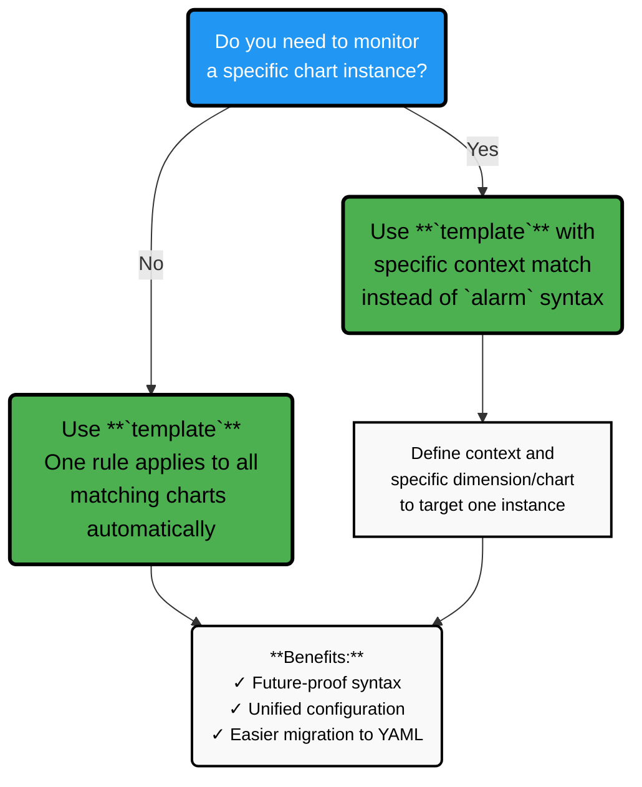

# 1.2 Alert Types: `alarm` vs `template`

:::note

The distinction between `alarm` and `template` is a legacy feature. Netdata is moving toward a unified alert definition format (YAML-based) where both will be consolidated into a single alert type. The `alarm` syntax is essentially a subset of `template` functionality. For new alert definitions, **use `template` exclusively**.

:::

## The Unified Alert Model

In Netdata, alerts are rules that monitor metrics from charts and assign a status. While the current configuration syntax has two forms (`alarm` and `template`), they share the same underlying mechanisms.

| Aspect | Description |
|--------|-------------|
| **Unified evaluation** | Both use the same health engine and evaluation logic |
| **Scope** | The rule can target one specific chart or all charts of a context |
| **Future direction** | Both will be unified into a single YAML-based alert definition format |

## `template`: The Preferred Alert Type

A **template** is the recommended way to define alerts. It is attached to a **context** (a chart "family" or type) and automatically applies to **all charts that match that context**.

| Aspect | Description |
|--------|-------------|
| **Scope** | All charts that share the same context (for example, all disks, all network interfaces, all containers) |
| **Use when** | You want one rule to monitor every instance of a type without writing separate alerts for each chart |
| **Examples** | • Alert if **any network interface** uses more than 90% of its bandwidth<br/>• Alert if **any filesystem** on the host has less than 5% free space<br/>• Alert if **any container** exceeds a CPU utilization threshold |
| **Benefits** | • Written once per context<br/>• Automatically instantiated for every matching chart<br/>• New charts automatically inherit the alert |

## `alarm`: Legacy Chart-Specific Syntax

An **alarm** is a legacy syntax for defining chart-specific alerts. It is tied to **one particular chart** on a node.

:::note 

Deprecation Notice
The `alarm` syntax is maintained for backward compatibility. New alert definitions should use `template` exclusively. In future versions, both will be consolidated into a unified YAML format.

:::

| Aspect | Description |
|--------|-------------|
| **Scope** | Exactly one chart (for example, a particular filesystem usage chart or a single network interface chart) |
| **When to use** | Legacy configurations only; new definitions should use `template` |
| **Characteristics** | Targets a single chart; exists only where that chart exists |

## Why Prefer `template`?


Use **template** when:
- You want **consistent monitoring** across all disks, interfaces, containers, or other repeated components
- You expect new instances to appear over time and want them **automatically covered**
- You are **creating new alert definitions** (strongly preferred over `alarm`)
- You want **future compatibility** with the upcoming YAML format

## How to Target a Specific Chart with `template`

If you need to target a specific chart instance (the use case for legacy `alarm`), use `template` with scoped context matching:

- Specify the exact context dimension or filter
- Use `from` and `to` options to narrow scope
- This approach migrates cleanly to the future YAML format

Example (legacy `alarm` vs equivalent `template`):
```yaml
# Legacy alarm syntax (discouraged)
alarm: disk_fill_alarm
    on: disk space
    to: disk
    units: %
    every: 10s
    warn: $this > 80
    crit: $this > 90

# Preferred template syntax (future-compatible)
template: disk_fill_alarm
    on: disk space
    dimensions: /var/lib
    warn: $this > 80
    crit: $this > 90
```

## Key Takeaways

- **`template`** is the **recommended and future-proof** way to define alerts
- **`alarm`** is legacy syntax maintained for backward compatibility only
- Both use the same health engine; only the **scope and syntax** differ
- New alert definitions should **exclusively use `template`**
- Netdata is moving toward a **unified YAML format** that will replace both

## What's Next

- **1.3 Where Alerts Live (Files, Agent, Cloud)** File locations for stock vs custom alerts, and how Cloud-defined alerts integrate with file-based configuration
- **Chapter 2: Creating and Managing Alerts** How to create/edit alert rules via config files and Netdata Cloud UI
- **Chapter 3: Alert Configuration Syntax** The exact configuration lines and options for defining template-based alerts
