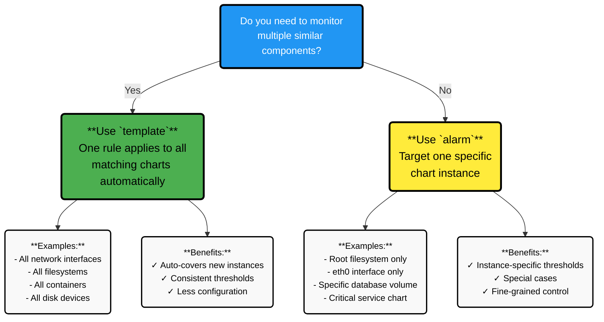

# 1.2 Alert Types: `alarm` vs `template`

A Netdata alert can be defined in two ways, depending on **how broadly you want the rule to apply**:

- **`alarm`** a rule attached to a **specific chart instance**
- **`template`** a rule attached to a **context**, applied to **all charts that match that context**

:::note

Both use the same health engine and evaluation logic; they differ only in **scope**.

:::

## `alarm`: Chart-Specific Alerts

An **`alarm`** is a chart-specific alert. It is tied to **one particular chart** on a node.

| Aspect | Description |
|--------|-------------|
| **Scope** | Exactly one chart (for example, a particular filesystem usage chart or a single network interface chart) |
| **Use when** | You know exactly which chart you want to monitor and you want instance-specific thresholds or behavior |
| **Examples** | • Alert if the **root filesystem** on this node is more than 90% full • Alert if **eth0** has packet error rate above a threshold |
| **Characteristics** | • The `alarm` definition targets a single chart, so it only exists where that chart exists • If that chart is not present on a given node, the alert is not created on that node • You can define multiple different `alarm` rules for different charts on the same host |

:::note

Detailed syntax for the `alarm` line and how it references a chart is covered in **Chapter 3: Alert Configuration Syntax**.

:::

## `template`: Context-Based Alerts

A **`template`** is a context-based alert. It is attached to a **context** (a chart "family" or type) and automatically applies to **all charts that belong to that context**.

| Aspect | Description |
|--------|-------------|
| **Scope** | All charts that share the same context (for example, all disks, all network interfaces, all containers) |
| **Use when** | You want one rule to monitor every instance of a type without writing separate alerts for each chart |
| **Examples** | • Alert if **any network interface** uses more than 90% of its bandwidth • Alert if **any filesystem** on the host has less than 5% free space • Alert if **any container** exceeds a CPU utilization threshold |
| **Characteristics** | • The `template` definition is written once per context • At runtime, the health engine automatically instantiates this template for every chart that matches that context • New charts of that context (for example, a new disk or container) automatically inherit the alert without additional configuration |

:::note

The exact rules for how contexts are matched and how templates are instantiated are described in **Chapter 3: Alert Configuration Syntax**.

:::

## When to Use `alarm` vs `template`

Both `alarm` and `template` use the same underlying mechanisms (metric lookups, expressions, thresholds). The difference is entirely about **how widely the rule applies**.

Use **`alarm`** when:

- You need a rule for **one specific chart**, not all similar ones
- A particular instance is more important or behaves differently (for example, a critical database volume vs generic disks)
- You want **special thresholds** for a single chart that differ from the generic rule

Use **`template`** when:

- You want **consistent monitoring** across all disks, interfaces, containers, or other repeated components
- You expect new instances to appear over time and want them **automatically covered**
- You prefer **shorter, more generic configuration** instead of many per-chart rules

A common pattern in real deployments is to:

- Define a **template** for general coverage of a context
- Add one or more **chart-specific alarms** on top for special cases that require different thresholds or behavior

## Key Takeaways

- **`alarm`** = one rule → **one chart instance** (chart-specific alert)
- **`template`** = one rule → **all charts of a context** (context-based alert)
- Both are evaluated by the same health engine on the Agent/Parent; only the **scope** differs

## What's Next

- **1.3 Where Alerts Live (Files, Agent, Cloud)** File locations for stock vs custom alerts, and how Cloud-defined alerts integrate with file-based configuration
- **Chapter 2: Creating and Managing Alerts** How to create/edit `alarm` and `template` rules via config files and Netdata Cloud UI
- **Chapter 3: Alert Configuration Syntax** The exact configuration lines and options for defining alarms and templates