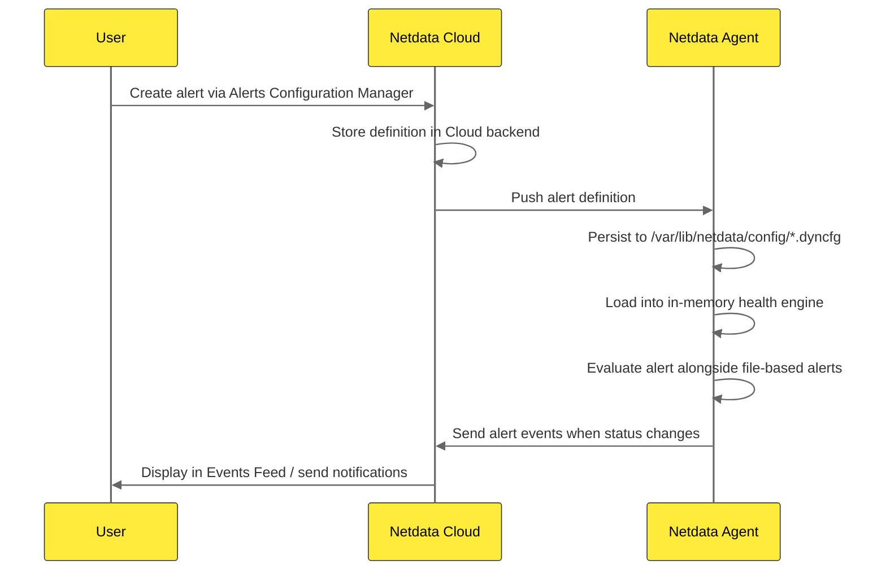

# 1.3 Where Alerts Live (Files, Agent, Cloud)

Alert definitions in Netdata can come from **three sources**, each with a different purpose and storage location:

1. **Stock alerts** (shipped with Netdata)
2. **Custom alerts** (your own rules)
3. **Cloud-defined alerts** (created via Netdata Cloud UI)

This section explains where each type lives, how they are loaded, and how they interact.

## Stock Alerts (Shipped with Netdata)

**Location:** `/usr/lib/netdata/conf.d/health.d/`

Netdata ships with hundreds of ready-made alert definitions covering:
- System resources (CPU, memory, disk, network)
- Common applications (databases, web servers, caches)
- Containers (Docker, Kubernetes, cgroups)
- Network services (HTTP checks, ping, DNS)
- Hardware sensors (RAID, SMART, temperatures)

| Aspect | Detail |
|--------|--------|
| **Path** | `/usr/lib/netdata/conf.d/health.d/` |
| **Ownership** | Package manager (immutable system files) |
| **Updated by** | Netdata package upgrades |
| **Should you edit?** | **No**, changes will be lost on upgrade |
| **Purpose** | Out-of-the-box monitoring for common scenarios |

:::warning 

Never Edit Stock Alerts Directly

Editing files in `/usr/lib/netdata/conf.d/health.d/` is **not recommended**. Package updates will overwrite your changes. To customize a stock alert, **copy it** to `/etc/netdata/health.d/` and edit the copy instead.

:::

## Custom Alerts (Your Own Rules)

**Location:** `/etc/netdata/health.d/`

This directory is where you place **your own alert definitions**:
- Custom alerts for your specific environment
- Modified copies of stock alerts with different thresholds
- Alerts for custom metrics or applications

| Aspect | Detail |
|--------|--------|
| **Path** | `/etc/netdata/health.d/` |
| **Ownership** | You (the administrator) |
| **Updated by** | You (manual edits) |
| **Survives upgrades?** | **Yes**, never overwritten by package manager |
| **Purpose** | Environment-specific alerts and customizations |

## Cloud-Defined Alerts (Netdata Cloud UI)

**Location:** Netdata Cloud backend + `/var/lib/netdata/config/` on agents

When you create or edit an alert using the **Alerts Configuration Manager** in Netdata Cloud:
- The alert definition is **stored in Netdata Cloud** as the source of truth
- Cloud **pushes the definition** to connected agents at runtime via the ACLK
- Agents **persist it to disk** at `/var/lib/netdata/config/*.dyncfg` for reliability
- Agents **load it into memory** and evaluate it alongside file-based alerts
- **Persisted files** survive agent restarts and work even if Cloud connectivity is lost

| Aspect | Detail |
|--------|--------|
| **Primary storage** | Netdata Cloud backend (SaaS) |
| **Agent persistence** | `/var/lib/netdata/config/*.dyncfg` |
| **Distribution** | Pushed to agents via Cloud-agent connection (ACLK) |
| **Applied** | At runtime (loaded into memory) |
| **Survives restart?** | **Yes**, reloaded from `/var/lib/netdata/config/` |
| **Works offline?** | **Yes**, last-known config persists after Cloud disconnect |
| **Purpose** | Centralized alert management with local resilience |

### How Cloud-Defined Alerts Work

**Key characteristics:**

- **Zero-touch rollout** Create an alert once in Cloud, it applies to all nodes in that space instantly
- **Persistent local storage** Agents save Cloud alerts to `/var/lib/netdata/config/` for restart resilience and offline operation
- **Centralized management** Edit thresholds, silencing rules, and notification routing from one place
- **Coexists with file-based alerts** Cloud-defined alerts work alongside stock and custom file-based alerts

### When to Use Cloud vs File-Based Alerts

| Alert Type | Best Used When | Common Use Cases |
|------------|----------------|------------------|
| **Cloud-defined alerts** | • You want centralized management across many nodes • You need instant rollout of new alerts or threshold changes • You prefer a UI workflow over editing config files • You want to leverage Cloud's deduplication and notification routing | Standard monitoring across your fleet |
| **File-based alerts** | • You need version control for alert definitions (Git, etc.) • You want full control over local configuration • You need custom syntax not yet supported in the Cloud UI • You prefer infrastructure-as-code workflows | Node-specific or advanced configurations |

## Configuration Precedence

When multiple alert sources exist, Netdata applies them in this order:

1. **Stock alerts** are loaded first from `/usr/lib/netdata/conf.d/health.d/`
2. **Custom alerts** are loaded next from `/etc/netdata/health.d/`
   - If a custom alert has the **same name** as a stock alert, the custom version **overrides** it
3. **Cloud-defined alerts** are loaded at runtime and **coexist** with file-based alerts
   - Cloud alerts use unique identifiers and typically don't conflict with file-based alert names

This layering means:
- You can **extend** stock alerts with custom rules
- You can **override** stock alerts by copying and modifying them in `/etc/netdata/health.d/`
- You can **manage centrally** via Cloud without touching local files

## Key Takeaways

- **Stock alerts** live in `/usr/lib/netdata/conf.d/health.d/` and are **overwritten on upgrades**, never edit them directly
- **Custom alerts** live in `/etc/netdata/health.d/` and **survive upgrades**, this is where you add your own rules
- **Cloud-defined alerts** are stored in **Netdata Cloud** and pushed to agents at runtime, persisted locally to `/var/lib/netdata/config/` for resilience
- Custom alerts **override** stock alerts with the same name
- Cloud alerts **coexist** with file-based alerts and provide centralized management

## What's Next

- **Chapter 2: Creating and Managing Alerts** Step-by-step guides for creating alerts via config files (2.2) and Netdata Cloud UI (2.3)
- **2.4 Managing Stock vs Custom Alerts** Detailed workflow for safely customizing stock alerts
- **Chapter 3: Alert Configuration Syntax** The exact syntax and configuration lines for writing `alarm` and `template` definitions