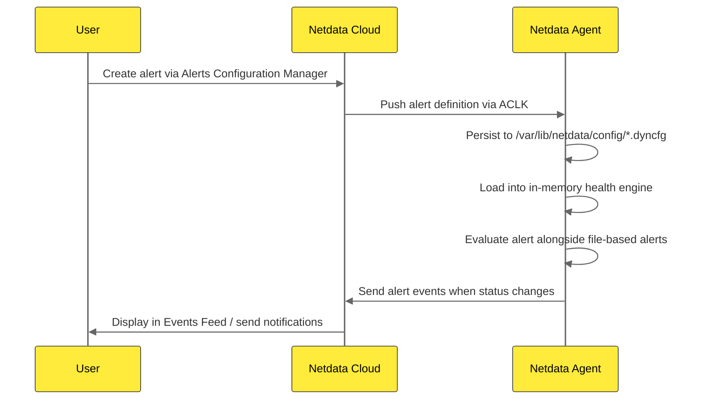

# 1.3 Where Alerts Live (Files, Agent, Cloud)

Alert definitions in Netdata can come from **three sources**, each with a different purpose and storage location:

1. **Stock alerts** (shipped with Netdata)
2. **Custom alerts** (your own rules)
3. **Cloud-pushed alerts** (created via Netdata Cloud UI and pushed to agents)

This section explains where each type lives, how they are loaded, and how they interact.

## Stock Alerts (Shipped with Netdata)

**Location:** `/usr/lib/netdata/conf.d/health.d/`

Netdata ships with hundreds of ready-made alert definitions covering:
- System resources (CPU, memory, disk, network)
- Common applications (databases, web servers, caches)
- Containers (Docker, Kubernetes, cgroups)
- Network services (HTTP checks, ping, DNS)
- Hardware sensors (RAID, SMART, temperatures)

| Aspect | Detail |
|--------|--------|
| **Path** | `/usr/lib/netdata/conf.d/health.d/` |
| **Ownership** | Package manager (immutable system files) |
| **Updated by** | Netdata package upgrades |
| **Should you edit?** | **No**, changes will be lost on upgrade |
| **Purpose** | Out-of-the-box monitoring for common scenarios |

### How Stock Alert Files Override Works

When you create a custom alert file with the **same name** as a stock alert file in `/etc/netdata/health.d/`, that custom file **completely overrides** the stock file. This is important to consider when customizing alerts.

**Best practices for naming custom alert files:**
- Use descriptive names that don't match stock file names (e.g., `my-org-critical-alerts.conf`)
- Avoid generic names like `mysql.conf` or `cpu.conf` which may conflict with stock alerts
- Create new files for each logical grouping rather than overriding stock files

:::warning 

When You Override a Stock Alert File
If you copy a stock alert file (e.g., `mysql.conf`) to `/etc/netdata/health.d/` and edit it, you will **not receive future updates** to that stock file. For most users, the preferred approach is to **create new files with unique names** for your custom alerts rather than overriding stock files.

:::

## Custom Alerts (Your Own Rules)

**Location:** `/etc/netdata/health.d/`

This directory is where you place **your own alert definitions**:
- Custom alerts for your specific environment
- Alerts that extend (not override) stock alerts
- Alerts for custom metrics or applications

| Aspect | Detail |
|--------|--------|
| **Path** | `/etc/netdata/health.d/` |
| **Ownership** | You (the administrator) |
| **Updated by** | You (manual edits or infrastructure-as-code tools) |
| **Survives upgrades?** | **Yes**, never overwritten by package manager |
| **Purpose** | Environment-specific alerts and customizations |

### Infrastructure-as-Code Integration

Custom alerts in `/etc/netdata/health.d/` work well with configuration management tools:
- **Ansible**: Deploy alert files using `ansible.builtin.copy` or `template` modules
- **Helm**: Use ConfigMaps or init containers to populate alert files
- **Terraform**: Manage alerts using the Netdata Terraform provider
- **GitOps**: Version control your alert definitions alongside application code

## Cloud-Pushed Alerts (Netdata Cloud UI)

**Location:** `/var/lib/netdata/config/*.dyncfg` on agents (persisted at runtime)

When you create or edit an alert using the **Alerts Configuration Manager** in Netdata Cloud:
1. The alert definition is **pushed to connected agents** via the ACLK (Agent Cloud Link)
2. Agents **persist it to disk** at `/var/lib/netdata/config/*.dyncfg` for reliability
3. Agents **load it into memory** and evaluate it alongside file-based alerts
4. Persisted files **survive agent restarts** and work even if Cloud connectivity is lost

:::warning 

Do Not Edit Cloud-Pushed Alert Files Manually
Files in `/var/lib/netdata/config/*.dyncfg` are **managed by Netdata** and should not be manually edited. The outcome of manual edits is undefined. These files are for internal agent resilience only.

:::

| Aspect | Detail |
|--------|--------|
| **Primary distribution** | Pushed from Netdata Cloud via ACLK |
| **Agent persistence** | `/var/lib/netdata/config/*.dyncfg` |
| **Applied** | At runtime (loaded into memory) |
| **Survives restart?** | **Yes**, reloaded from persistence |
| **Works offline?** | **Yes**, last-known config persists after Cloud disconnect |
| **Purpose** | Centralized alert management without requiring SSH/file access |

### How Cloud-Pushed Alerts Work

**Key characteristics:**
- **Instant rollout**: When you create or edit an alert in Cloud, changes propagate to all connected agents within seconds
- **Persistent local storage**: Agents save Cloud alerts locally for restart resilience and offline operation
- **Centralized management**: Edit thresholds, silencing rules, and notification routing from one place
- **Coexists with file-based alerts**: Cloud-pushed alerts work alongside stock and custom file-based alerts

### Alert Naming and Overrides

When creating Cloud-pushed alerts, you **must provide a unique name** for each alert. Alert definitions with the same name as a stock or custom file-based alert on the same Agent **will override that definition**.

Choose alert names that:
- Are unique within your deployment
- Follow consistent naming conventions
- Don't match stock alert names (to avoid unintended overrides)

## When to Use Cloud vs File-Based Alerts

| Alert Type | Best Used When | Common Use Cases |
|------------|----------------|------------------|
| **Cloud-pushed alerts** | • You want centralized management across many nodes • You need instant rollout of new alerts or threshold changes • You prefer a UI workflow over editing config files • You want to leverage Cloud's deduplication and notification routing | Standard monitoring across your fleet |
| **File-based alerts** | • You need version control for alert definitions (Git, Ansible, Helm, etc.) • You want full control over local configuration • You need custom syntax not yet supported in the Cloud UI • You prefer infrastructure-as-code workflows | Node-specific or advanced configurations |

## Configuration Precedence

When multiple alert sources exist, Netdata applies them in this order:

1. **Stock alerts** are loaded first from `/usr/lib/netdata/conf.d/health.d/`
2. **Custom alerts** are loaded next from `/etc/netdata/health.d/`
   - If a custom alert has the **same name** as a stock alert, the custom version **overrides** it
3. **Cloud-pushed alerts** are loaded at runtime and **override** file-based alerts with the same name
   - Alert names are provided by you when creating them in Cloud
   - Same-name alerts will conflict regardless of source

This layering means:
- You can **extend** stock alerts by creating new custom files with unique names
- You can **override** stock alerts by creating files with matching names
- Cloud-pushed alerts **override** any file-based alert with the same name
- Centralized management via Cloud doesn't require touching local files

## Key Takeaways

- **Stock alerts** live in `/usr/lib/netdata/conf.d/health.d/` and are **overwritten on upgrades**, never edit them directly
- **Custom alerts** live in `/etc/netdata/health.d/` and **survive upgrades**, use unique filenames to avoid overriding stock alerts
- **Cloud-pushed alerts** are **pushed to agents via ACLK** at runtime, persisted locally to `/var/lib/netdata/config/` for resilience
- Custom alerts **override** stock alerts with the same filename
- Cloud-pushed alerts **override** any alert with the same name
- Use **infrastructure-as-code tools** (Ansible, Helm, Terraform) for file-based alert management

## What's Next

- **Chapter 2: Creating and Managing Alerts** Step-by-step guides for creating alerts via config files (2.2) and Netdata Cloud UI (2.3)
- **2.4 Managing Stock vs Custom Alerts** Detailed workflow for safely customizing stock alerts
- **Chapter 3: Alert Configuration Syntax** The exact syntax and configuration lines for writing alert definitions
