# Netdata AI and Machine Learning

Boost your monitoring and troubleshooting capabilities with Netdata's AI-powered features.

Netdata AI helps you **detect anomalies, understand metric relationships, and resolve issues quickly** with intelligent assistance all designed to make your infrastructure management smarter, faster, and bulletproof.

## What Can Netdata AI Do For You?

Netdata AI combines powerful machine learning capabilities with intuitive interfaces to help you:

1. **Get intelligent infrastructure analysis** with both immediate alert assistance and strategic insights
2. **Connect to advanced AI models** for natural language infrastructure analysis
3. **Detect anomalies automatically** before they escalate into critical issues

## Netdata AI: Alert Assistant & Infrastructure Insights

Comprehensive **AI-powered assistance** for both immediate incident response and strategic infrastructure planning.

```mermaid
flowchart TD
    A("Infrastructure Issue Occurs")
    
    B("Real-time Alert Assistant")
    C("Strategic Insights Reports")
    
    D("Immediate context<br/>⚡ Instant guidance")
    E("Comprehensive analysis<br/>📊 Strategic intelligence")
    
    F("3 AM Emergency<br/>Quick resolution")
    G("Monday Morning Review<br/>Long-term planning")
    
    A --> B
    A --> C
    B --> D
    C --> E
    D --> F
    E --> G
    
    %% Styling
    classDef problem fill:#ffeb3b,stroke:#333,stroke-width:2px
    classDef realtime fill:#42a5f5,stroke:#333,stroke-width:2px
    classDef strategic fill:#ff7043,stroke:#333,stroke-width:2px
    classDef outcome fill:#f5f5f5,stroke:#333,stroke-width:2px
    
    class A problem
    class B,D realtime
    class C,E strategic
    class F,G outcome
```

<strong>Click to see visual representation of Alert Assistant & Infrastructure Insights workflow</strong>
 

 

Netdata AI: Alert Assistant & Infrastructure Insights provides two complementary approaches that serve different moments in your engineering workflow:

| Approach | Purpose | When You Use It |
|----------|---------|-----------------|
| **Real-time Alert Assistant** | Immediate context and guidance when alerts fire | 3 AM emergencies, active incidents |
| **Strategic Insights Reports** | Comprehensive analysis of infrastructure trends and patterns | Monday morning reviews, capacity planning |

Together, these approaches ensure you have intelligent assistance for both emergency response and strategic planning.

:::note

**Netdata Insights is currently in beta as a research preview:**

- Available in Netdata Cloud for Business users and Free Trial participants
- Works with any infrastructure where you've deployed Netdata Agents
- The quota for the first 10 reports are free
Community users can get early access via [Discord](https://discord.gg/t95Vfx2zyg) or email to product@netdata.cloud

Learn more about [Netdata AI: Infrastructure Insights](/docs/netdata-insights.md).

:::

## MCP Integration: Connect AI Models to Your Infrastructure

**Netdata is one of the first monitoring platforms** to integrate Model Context Protocol (MCP), enabling direct connections between advanced AI models and your real-time infrastructure data.

:::info

**MCP Integration is currently in preview.** [Request early access](https://b6yi53u6qjm.typeform.com/to/DQi5ibhE?typeform-source=www.netdata.cloud).

:::

MCP integration allows you to ask natural questions about your infrastructure, get comprehensive post-mortems with AI analysis of your metrics, and understand complex correlations across your services.

| **Current Capabilities** | Description |
|--------------------------|-------------|
| **Infrastructure Analysis** | Root cause identification for incidents |
| **Intelligent Querying** | Natural language questions about your infrastructure |
| **Expert Troubleshooting** | Automated correlation of events across your infrastructure |

:::info

This integration leverages evolving AI technologies. **The AI analysis features depend on external AI services** and their capabilities, not Netdata's built-in functionality.

:::

Learn more about [Netdata MCP Integration](/docs/netdata-mcp-integration.md).

## Machine Learning and Anomaly Detection

Our ML-powered anomaly detection works silently in the background, monitoring your metrics and identifying unusual patterns.

| **Key Features** | Description |
|------------------|-------------|
| **Unsupervised Learning** | Works automatically without manual training |
| **Multiple Model Consensus** | Reduces false positives through model agreement |
| **Real-time Anomaly Detection** | Flags anomalies with zero storage overhead |
| **Metric Correlations** | Helps find relationships between metrics |

Learn more in the [Machine Learning and Anomaly Detection](/src/ml/README.md) documentation.

## Getting Started

:::note

- **Netdata Assistant** features are enabled by default with the standard installation. 
- The **machine learning** capabilities require the `dbengine` database mode, which is the default setting. 
- **Insights** features require Netdata Cloud access.

:::

To start exploring:

1. **Netdata AI: Alert Assistant & Infrastructure Insights**: Access both Alert Assistant and Strategic Reports via Netdata Cloud
2. **MCP Integration**: [Request early access](https://b6yi53u6qjm.typeform.com/to/DQi5ibhE?typeform-source=www.netdata.cloud) for natural language queries
3. **Anomaly Detection**: Check the [Anomaly Advisor tab](/docs/dashboards-and-charts/anomaly-advisor-tab.md) to see detected anomalies
4. **Metric Correlations**: Use the [Metric Correlations](/docs/metric-correlations.md) button in the dashboard to analyze relationships between metrics

:::tip

These AI features work seamlessly with Netdata's other capabilities, **enhancing your overall monitoring and troubleshooting experience** without requiring any AI expertise.

:::