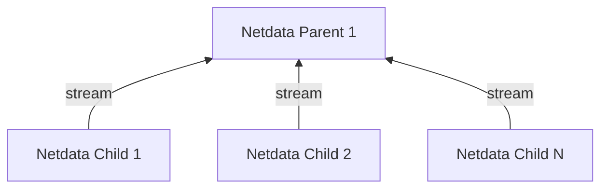
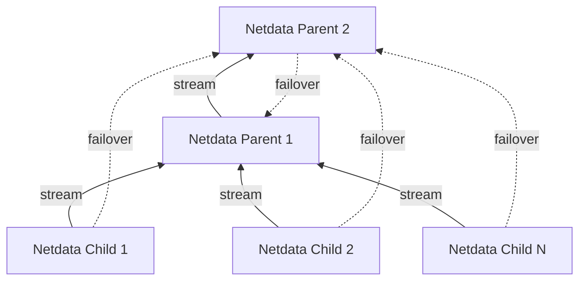

# Centralization Points

Centralization Points allow aggregating metric samples, logs and metadata within an infrastructure.

Centralization Points are required when:

1. The systems being monitored are **ephemeral** and may stop being available at any point in time. For example, Kubernetes nodes or ephemeral VMs.
2. The systems being monitored do not have the **required resources** (disk, CPU, RAM) for observability. For example, production systems that do not have enough disk space for maintaining the retention required, or enough RAM, CPU, or disk I/O bandwidth to spare for observability.
3. **Multi-node dashboards** are required, but Netdata Cloud is not used. A Netdata Parent can provide multi-node dashboards, like Netdata Cloud, for all the nodes it maintains data for.
4. Netdata Cloud is required, but the **systems being monitored cannot access the Internet**. A Netdata Parent will register to Netdata Cloud all the nodes for which it maintains data for.

Multiple centralization points **may exist concurrently** within an infrastructure:

- Netdata Cloud queries all of them in parallel, to provide an unified infrastructure view (for metrics only - for logs the aggregated views are limited to each centralization point).
- Without Netdata Cloud, the dashboard of each of the Netdata Parents provides an unified view of the infrastructure aggregated to it (metrics and logs).

To decide how many centralization points are needed and their location, the following should be considered:

1. The **number of production systems** monitored. Netdata Parents scale very well, but they are bound to the resources available on the system they run. As a rule of thumb, we recommend to use up to 50% of the available CPU resources when the system is steadily ingesting data, training machine learning models and running health checks. This will leave enough CPU resources for queries. For faster queries we also recommend to dedicate as much RAM as possible to the Netdata Parent (`dbengine page cache size MB` in `netdata.conf`).
2. The **egress bandwidth costs** involved. In multi-cloud and hybrid cloud environments it may be more cost efficient to have one Netdata Parent for each of the data centers / cloud provider regions used. This will eliminate the need of a constant stream of egress bandwidth for observability.

## Metrics Centralization Points

Netdata **Streaming and Replication** copies the recent past samples (replication) and in real-time all new samples collected (streaming) from production systems (Netdata Children) to Netdata Parents. The Netdata Parents then maintain the database for these metrics, according to their retention settings.

Each production system (Netdata Child) can stream to **only one** Netdata Parent at a time. The configuration allows configuring multiple Netdata Parents for high availability, but only the first found working will be used.

Netdata Parents receive metric samples **from multiple** production systems (Netdata Children) and have the option to re-stream them to another Netdata Parent. This allows building an infinite hierarchy of Netdata Parents. It also enables the configuration of Netdata Parents Clusters, for high availability.

|        Feature         |                                                            Netdata Child (production system)                                                            |                                Netdata Parent (centralization point)                                 |
|:----------------------:|:-------------------------------------------------------------------------------------------------------------------------------------------------------:|:----------------------------------------------------------------------------------------------------:|
|   Metrics Retention    |   Can be minimized, or switched to mode `ram` or `alloc` to save resources. Some retention is required in case network errors introduce disconnects.    |         Each Netdata Parent has common retention settings for all systems aggregated to it.          |
|    Machine Learning    |                                                                    Can be disabled.                                                                     |            Each Netdata Parent runs Anomaly Detection for all systems aggregated to it.             |
| Alerts & Notifications |                                                                    Can be disabled.                                                                     |   Each Netdata Parent runs health checks and sends notifications for all systems aggregated to it.   |
|API and Dashboard|                                                                    Can be disabled.                                                                     |    Each Netdata Parent provides an API and serves the dashboard for all systems aggregated to it.    |
|Exporting Metrics|                                                                      Not required.                                                                      | Each Netdata Parent can export the samples of all metrics collected by the systems aggregated to it. |
|Connection to Netdata Cloud|                                                                      Not required.                                                                      |             Each Netdata Parent registers to Netdata Cloud all systems aggregated to it.             |

### Clustering and High Availability of Metrics Centralization Points

Netdata supports building Parent clusters of 2+ nodes. Clustering and high availability works like this:

1. All Netdata Children are configured to stream to all Netdata Parents. The first one found working will be used by each Netdata Child and the others will be automatically used if and when this connection is interrupted.
2. The Netdata Parents are configured to stream to all other Netdata Parents. For each of them, the first found working will be used and the others will be automatically used if and when this connection is interrupted.

All the Netdata Parents in such a cluster will receive all the metrics of all Netdata Children connected to any of them. They will also receive the metrics all the other Netdata Parents have.

In case there is a failure on any of the Netdata Parents, the Netdata Children connected to it will automatically failover to another available Netdata Parent, which now will attempt to re-stream all the metrics it receives to the other available Netdata Parents.

Netdata Cloud will receive registrations for all Netdata Children from all the Netdata Parents. As long as at least one of the Netdata Parents is connected to Netdata Cloud, all the Netdata Children will be available on Netdata Cloud.

Netdata Children need to maintain a retention only for the time required to switch Netdata Parents. When Netdata Children connect to a Netdata Parent, they negotiate the available retention and any missing data on the Netdata Parent are replicated from the Netdata Children.

Special care is needed when restoring a Netdata Parent after some long maintenance work on it. If the Netdata Children do not have enough retention to replicate the missing data on this Netdata Parent, it is preferable to block access to this Netdata Parent from the Netdata Children, until it replicates the missing data from the other Netdata Parents.

## Logs Centralization Points

The logs centralization points and the metrics centralization points do not need to be the same. For clarity and simplicity however, we recommend to have unified centralization points for both metrics and logs.

Logs centralization points can be built using the `systemd-journald` methodologies, by configuring `systemd-journal-remote` (on the centralization point) and `systemd-journal-upload` (on the production system). [A detailed how-to can be found here](https://learn.netdata.cloud/docs/logs/systemd-journal/passive-journal-centralization-with-encryption-using-self-signed-certificates).

A Netdata running at the logs centralization point, will automatically detect and present the logs of all servers aggregated to it. This Netdata may or may not be a Netdata Parent for metrics.

