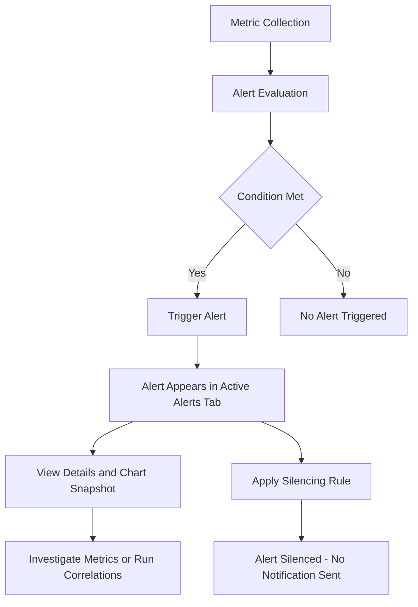

# **Alerts Tab**

Netdata provides hundreds of pre-configured health alerts designed to notify you when an anomaly or performance issue affects your node or its applications.

---

## **Active Alerts Tab**

The **Active Alerts** tab shows all current alerts in your Room that are in a **warning** or **critical** state.

### **Alert Table Overview**

The table provides key details about each active alert:

| Column              | Description                                        |
|---------------------|----------------------------------------------------|
| **Alert Name**      | The name of the alert; click to view alert details. |
| **Status**          | Current state: Warning or Critical.                 |
| **Class**           | The alert's class (e.g., Latency, Utilization).     |
| **Type & Component**| The system type and component involved.            |
| **Role**            | The notification role assigned to the alert.        |
| **Node Name**       | The node where the alert was triggered.            |
| **Silencing Rule**  | Whether silencing rules are applied.               |
| **Actions**         | Options to create silencing rules or ask Netdata Assistant for help. |

Use the **gear icon** (top right) to control which columns are visible. Sort alerts by clicking on column headers.

---

## **Filtering Alerts**

Filter the alert list using the right-hand bar:

| Filter Option              | Purpose                                      |
|----------------------------|----------------------------------------------|
| **Alert Status**           | Filter by status (Warning, Critical).        |
| **Alert Class**            | Filter by class (e.g., Latency, Utilization).|
| **Alert Type & Component** | Filter by alert type (e.g., System, Web Server) and component (e.g., CPU, Disk). |
| **Alert Role**             | Filter by the notification role (e.g., Sysadmin, Webmaster). |
| **Host Labels**            | Filter by host labels (e.g., `_cloud_instance_region=us-east-1`). |
| **Node Status**            | Filter by node availability (Live, Offline). |
| **Netdata Version**        | Filter by the Netdata version.               |
| **Nodes**                  | Filter by specific nodes.                   |

---

## **Viewing Alert Details**

Click on an alert name to open the **alert details page**, which provides:

| Section                     | Description                                       |
|------------------------------|---------------------------------------------------|
| **Latest / Triggered Time**  | Shows when the alert was last triggered.         |
| **Description**             | Includes a detailed explanation of the alert.     |
| **Netdata Advisor Link**     | Links to related Netdata Advisor guidance.        |
| **Triggered Chart Snapshot** | Visualizes the chart at the alert’s trigger time. |
| **Alert Metadata**           | Shows node name, chart instance, type, component, and class. |
| **Configuration**           | Displays the alert's configuration parameters.    |
| **Instance Values**          | Provides node instance details.                  |

At the bottom of this page, click **View alert page** to open a dynamic view where you can:
- Run metric correlations.
- Navigate to the specific node’s chart that triggered the alert.

---

## **Silencing Alerts**

In the **Active Alerts** tab:

- The **Silencing column** shows whether a silencing rule exists for an alert.
- The **Actions column** allows you to:
  - Create a new [silencing rule](/docs/alerts-and-notifications/notifications/centralized-cloud-notifications/centralized-cloud-notifications-reference.md#alert-notification-silencing-rules).
  - Ask for help from the [Netdata Assistant](/docs/netdata-assistant.md).

---

## **Alert Configurations Tab**

The **Alert Configurations** tab shows the configuration of all running alerts in your Room.

:::note
"Running alerts" are alerts attached to metrics that are actively being collected. Pre-configured alerts that do not match your setup may not appear here.
:::

### **Configuration Table Overview**

| Column                     | Description                                         |
|----------------------------|-----------------------------------------------------|
| **Alert Name**             | The name of the alert; click to view configuration. |
| **Node Name**              | The node where this configuration applies.          |
| **Status**                 | Whether the alert is active or silenced.            |
| **Silencing Rule**         | Indicates if silencing rules are applied.           |
| **Actions**                | Explore configuration or ask the Netdata Assistant.|

Use the **gear icon** to adjust which columns are displayed.

---

## **Viewing Alert Configuration**

From the **Actions column**, click **Show Configuration** to:

| Action                       | Outcome                                           |
|--------------------------------|--------------------------------------------------|
| **Explore by Node**            | View configurations split by node.               |
| **View Alert Page**           | See full alert details, including configuration and history. |

This allows you to investigate:
- When the alert last triggered.
- All configuration parameters per node.

---

## **Alert Lifecycle Diagram**

:::tip
The diagram above illustrates the flow of alert detection and management, from metric collection to alert evaluation, triggering, and optional silencing.
:::