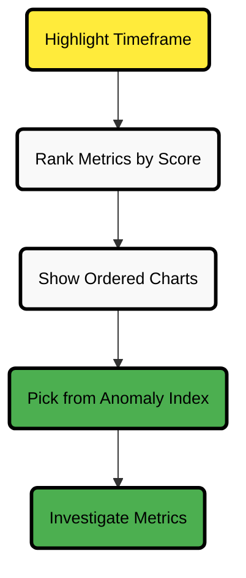

# Anomaly Advisor Tab

The **Anomaly Advisor** tab helps you identify potentially anomalous metrics and charts by focusing on a highlighted timeframe of interest. This feature uses Netdata's **Anomaly Rate ML scoring** to rank metrics based on unusual behavior.

Each chart in the [Metrics tab](/docs/dashboards-and-charts/metrics-tab-and-single-node-tabs.md) also features an [Anomaly Rate ribbon](/docs/dashboards-and-charts/netdata-charts.md#anomaly-rate-ribbon) for anomaly visibility.

For configuration details, see the [ML documentation](/src/ml/README.md).

## How Anomaly Advisor Works

The Anomaly Advisor leverages Netdata’s machine learning to evaluate anomaly rates across your nodes. It provides three key visualizations:

| Chart Name                     | Purpose                                                           | Why It Matters                                                 |
|--------------------------------|-------------------------------------------------------------------|----------------------------------------------------------------|
| **Anomaly Rate**               | Shows the percentage of anomalous metrics over time per node.     | Helps you quickly spot nodes behaving abnormally.              |
| **Count of Anomalous Metrics** | Displays raw counts of anomalous metrics per node.                | Useful when nodes have different numbers of collected metrics. |
| **Anomaly Events Detected**    | Indicates when the anomaly rate has triggered a node-level event. | Focuses your attention on meaningful spikes, not just noise.   |

:::note

**Anomaly Events Detected** appear slightly after anomaly rates rise, as they require a significant portion of metrics on the node to show anomalous behavior.

:::

## Workflow Overview

1. **Highlight a timeframe of interest** on the anomaly charts.
2. An ordered list of related charts appears, ranked by anomaly level.
3. The **Anomaly Rate ribbon** (purple) is visible on each chart.
4. Use the right-hand anomaly index to sort metrics from most to least anomalous.
5. Click an entry in the index to navigate directly to the corresponding chart.

:::tip

Use the [node filter](/docs/dashboards-and-charts/node-filter.md) to focus on specific nodes before highlighting a timeframe.

:::

## Usage Tips

| Tip                                           | Why It Matters                                                   |
|-----------------------------------------------|------------------------------------------------------------------|
| Filter to specific nodes before highlighting. | Reduces noise by limiting averaging across unrelated nodes.      |
| Highlight close to the anomaly spike.         | Improves ranking accuracy by focusing on the relevant timeframe. |

## Anomaly Advisor Diagram

:::tip

This diagram shows the Anomaly Advisor flow: highlight, rank, and explore. Use the ranking to prioritize which charts to investigate.

:::