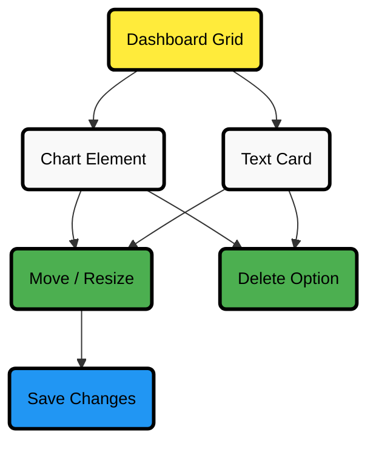

# Dashboards Tab

With **Netdata Cloud**, you can build **custom dashboards** that target your infrastructure’s unique needs. Dashboards help you centralize key metrics from any number of distributed systems, offering a clear, interactive overview of your infrastructure.

Click the **Dashboards** tab in any Room to get started.

## Create Your First Dashboard

To create a new dashboard:

1. From the **Dashboards** tab, click the **+** button.
2. In the modal, enter a name for your dashboard and click **+ Add**.

You can now add elements to your dashboard:

### Add a Chart

Click the **Add Chart** button at the top right of the dashboard.

| Step                     | Action                                                                                                                                                                                                                                                                                       |
|--------------------------|----------------------------------------------------------------------------------------------------------------------------------------------------------------------------------------------------------------------------------------------------------------------------------------------|
| **Select Source**        | Choose **All Nodes** or a specific node.                                                                                                                                                                                                                                                     |
| **Choose Context**       | Select the metric context. A preview of the chart will appear.                                                                                                                                                                                                                               |
| **Configure Chart**      | Adjust settings using the [NIDL framework](/docs/dashboards-and-charts/netdata-charts.md#nidl-framework):   - Group by method   - Aggregation function over the data source   - Nodes   - Instances   - Dimensions   - Labels   - Aggregation function over time |
| **Chart Type**           | Change the chart type using the [Title bar](/docs/dashboards-and-charts/netdata-charts.md#title-bar).                                                                                                                                                                                        |
| **Dimension Visibility** | Select which dimensions to display and set their order via the [Dimensions bar](/docs/dashboards-and-charts/netdata-charts.md#dimensions-bar).                                                                                                                                               |

### Add Text Cards

Click the **Add Text** button at the top right to add a text card.

Use text cards to:

- Document the purpose of the dashboard.
- Add notes for your team members.

:::tip

Click the **T** icon in the text box to switch between font sizes.

:::

:::important

Always click the **Save** button after making changes to your dashboard.

:::

## Dashboard Layout Overview

:::tip

The diagram above shows how charts and text cards interact within the dashboard layout. Use **drag & drop to move elements and resize** them as needed. Save your layout to keep changes. Remove elements using the delete option.

:::

:::tip

Keep related charts close together to improve visual correlation between metrics.

:::

## Using Your Dashboard

Dashboards are interactive and flexible. You can design them to fit your needs using any combination of charts and text cards.

### Chart Interaction

Charts on custom dashboards are [fully interactive](/docs/dashboards-and-charts/netdata-charts.md):

- Zoom, pan, and highlight timeframes.
- Synchronize charts across contexts and nodes.

### Text Cards

Text cards allow you to explain the arrangement or intent behind the dashboard. Share insights with your team directly on the dashboard.

## Organizing Dashboard Elements

### Move Elements

| Action                   | How to Do It                                                                                    |
|--------------------------|-------------------------------------------------------------------------------------------------|
| **Move a chart or card** | Click and hold **Drag & drop** at the top right of the element, then move it to a new location. |
| **Resize an element**    | Click and drag from the bottom-right corner of the element.                                     |

:::tip

Elements automatically align to the grid system after moving or resizing.

:::

## Chart Management Actions

| Action                     | How to Perform                                                                                                                                                                                              |
|----------------------------|-------------------------------------------------------------------------------------------------------------------------------------------------------------------------------------------------------------|
| **Go to chart**            | Use the 3-dot icon on any chart → click **Go-to-Chart**. Navigate directly to the chart in the [Metrics tab](/docs/dashboards-and-charts/metrics-tab-and-single-node-tabs.md) or the single-node dashboard. |
| **Rename a chart**         | Use the 3-dot icon on any chart → click **Rename**.                                                                                                                                                         |
| **Remove a chart or card** | Use the 3-dot icon on the element → click **Remove**.                                                                                                                                                       |

## Managing Your Dashboard

| Action                 | How to Perform                                                  |
|------------------------|-----------------------------------------------------------------|
| **View dashboards**    | Click the **Dashboards** tab in any Room.                       |
| **Delete a dashboard** | Select the dashboard → click the 🗑️ icon or **Delete** button. |
| **Save changes**       | Click the **Save** button after making any edits.               |

:::note

If multiple users edit the same dashboard at once, the second user who clicks **Save** will be prompted to either overwrite or reload the dashboard to see the latest changes.

:::

## Minimum Browser Viewport Requirement

Due to the visual complexity of individual charts, dashboards require a **minimum browser viewport width of 800px**.

## Next Steps

After designing your dashboards, [invite your team](/docs/netdata-cloud/organize-your-infrastructure-invite-your-team.md#team-collaboration) to collaborate. Add new users to the same Room so they can view and interact with your dashboards effortlessly.