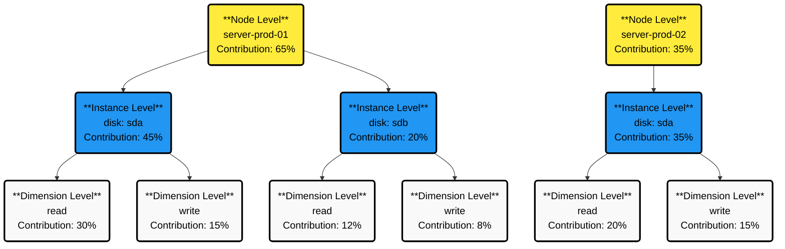

# Expanded Chart Analysis

Analyze your metrics in-depth with Netdata's Expanded Chart Analysis feature. Access detailed statistics, discover correlated metrics, and investigate anomalies directly from any chart.

## Overview

The Expanded Chart Analysis feature provides an analytical panel below your charts. It gives you four ways to investigate your data: view detailed statistics, explore hierarchical relationships, compare time periods, and discover correlated metrics across your infrastructure.

No query language required—everything works with point-and-click.

## Open the Analysis Panel

Click the **Expand** button at the bottom of any chart. The analysis panel opens below the chart with four analysis modes available.

When you're done, click **Collapse** to close the panel. Your settings persist and restore when you reopen it.

## Select Your Time Range

Choose which time period to analyze using the tabs at the top of the panel:

**Window** analyzes the entire visible time range on the chart. This tab is always available and updates automatically when you zoom or pan the chart.

**Selected Area** analyzes a specific highlighted period. This tab activates when you highlight a time range on the chart (see [Highlight a Time Range](#highlight-a-time-range)).

All analysis modes support both time range options.

## Analysis Modes

Switch between modes by clicking the icons in the panel header. Each mode is designed for a specific type of investigation.

| Mode | Icon | Use For |
|------|------|---------|
| **Chart Values** | 📊 | Viewing detailed statistics for all dimensions |
| **Drill Down** | 🔽 | Exploring which nodes or instances contribute most |
| **Compare Periods** | 📈 | Comparing current metrics with historical data |
| **Correlate Metrics** | 🔗 | Finding related metrics across your infrastructure |

### Chart Values

View detailed statistics for every dimension in your chart. This mode shows you the exact numbers behind the visualization.

| Column | Description |
|--------|-------------|
| **Dimension** | Dimension name with color indicator |
| **Value** | Current or hovering value with units |
| **Min** | Minimum value in the time period |
| **Avg** | Average value in the time period |
| **Max** | Maximum value in the time period |
| **Anomaly** | Anomaly rate (percentage of time behaving unusually) |

:::tip

Sort by the Anomaly column to quickly find which dimensions are behaving strangely.

:::

**Show advanced statistics**

Click the metrics icon in the panel header to reveal additional columns:

| Advanced Column | Description |
|-----------------|-------------|
| **Median** | Middle value (50th percentile) |
| **StdDev** | Standard deviation |
| **P95** | 95th percentile |
| **Range** | Difference between max and min |
| **Volume** | Sum of all values |

**Sort and export**

Click any column header to sort by that column. Click **Download** to export the data as CSV.

**When to use this mode:**

Use Chart Values when investigating spikes to see which specific dimensions are responsible. Sort by Anomaly to find unusual behavior, or check Max values to see peak usage.

### Drill Down

Explore hierarchical relationships in your infrastructure. This mode organizes metrics into a three-level tree:

| Level | Description | Examples |
|-------|-------------|----------|
| **Node** | Individual servers or hosts | server-01, web-prod-03 |
| **Instance** | Specific entities being monitored | disk "sda", network "eth0" |
| **Dimension** | Individual metrics | "read", "write", "used" |

Each level shows:

| Column | Description |
|--------|-------------|
| **Name** | Node, instance, or dimension name with expand icon |
| **Contribution** | Percentage weight (contribution to total) |
| **Anomaly Rate** | Aggregated anomaly rate for this branch |
| **Min** | Minimum value in period |
| **Avg** | Average value in period |
| **Max** | Maximum value in period |

**Navigate the hierarchy**

Click the expand icon next to any row to drill into the next level. Click again to collapse. Click **Group By** to change how the hierarchy is organized.

:::info

The contribution percentage shows the weight of each item relative to the total. A node contributing 80% tells you that most of your metrics come from that server.

:::

**When to use this mode:**

Use Drill Down to identify which node is using the most resources. Expand the Node level and sort by Contribution to see which servers contribute most. Click the node name to navigate to that node's dashboard.

### Compare Periods

Compare current metrics with historical periods to identify trends and changes. This mode automatically shows comparisons with:

| Period | Description |
|--------|-------------|
| **Current** | The visible time window or selected area (base period) |
| **Yesterday** | Same duration, 24 hours ago |
| **Last Week** | Same duration, 7 days ago |
| **Last Month** | Same duration, 30 days ago |

Each period card displays:
- Period label and date range
- Basic statistics (Min, Avg, Max)
- Change indicators showing percentage and absolute change compared to current

| Indicator | Meaning |
|-----------|---------|
| 🔴 Red | Increase from current period |
| 🟢 Green | Decrease from current period |
| ⚪ Gray | No significant change |

**Show advanced statistics**

Click the metrics icon in the panel header to reveal Median, StdDev, P95, Range, and Volume for each period. All statistics include change indicators.

**Add custom periods**

Compare with specific dates important to your analysis. Click **Add Custom Period**, enter a label (e.g., "Black Friday 2024"), set the start and end date/time, and click **Add**. The custom period appears in the comparison grid.

Click the edit icon on any custom period card to modify the label or date range.

:::warning

Historical data might not be available if it exceeds your retention settings. Use shorter comparison periods if you see errors.

:::

**When to use this mode:**

Use Compare Periods to identify growth trends over time. Review Avg values across all periods to spot consistent increases or decreases. Export the data for capacity planning.

### Correlate Metrics

Discover which metrics across your infrastructure correlate with the current chart's behavior. This mode shows you metrics that follow similar patterns, helping you find related issues.

The table displays correlated metrics grouped by context:

| Column | Description |
|--------|-------------|
| **Context** | Metric category (grouped header) |
| **Metric** | Full metric name (node:instance:dimension) |
| **Weight** | Correlation weight (lower = stronger correlation) |
| **Sparkline** | Mini chart showing the metric's behavior |

**Choose your correlation method**

Select how to calculate correlations:

| Method | Description | Best For |
|--------|-------------|----------|
| **Volume** | Identifies metrics with similar magnitude changes | Most use cases (recommended) |
| **KS2** | Uses statistical analysis for similar distributions | Complex pattern matching |

**Select aggregation**

Choose how to aggregate data:

| Aggregation | Use When |
|-------------|----------|
| **Average** | General patterns (recommended) |
| **Median** | Outliers might skew results |
| **Min** | Focusing on minimum values |
| **Max** | Focusing on peak values |
| **StdDev** | Focusing on variability |

**Adjust the threshold**

Use the threshold slider to control how many results appear. Lower threshold (e.g., 0.1%) shows more results including weaker correlations. Higher threshold (e.g., 5%) shows fewer results with only the strongest correlations.

:::tip

Start with 1-2% threshold for most investigations. Increase the threshold if you see too many results, or decrease it if you need more options.

:::

**Navigate to correlated metrics**

Click any metric row to navigate to that chart and investigate further.

**When to use this mode:**

Use Correlate Metrics when investigating a spike or anomaly. Highlight the problem period, switch to Selected Area tab, and review correlated metrics to find related issues across your infrastructure.

## Highlight a Time Range

Focus your analysis on a specific time period by highlighting it on the chart.

Hold **Alt** (Windows/Linux) or **⌘** (macOS), then click and drag across the chart to select a time range. The highlighted area appears with a visual overlay.

Once you create a highlight, the **Selected Area** tab becomes available in the analysis panel. Click it to view statistics and correlations for only the highlighted period.

To remove a highlight, click anywhere on the chart outside the highlighted area.

:::note

The **Selected Area** tab is disabled until you create a highlight on the chart.

:::

## Troubleshooting

<strong>The Selected Area tab is grayed out</strong>

You need to highlight a time range on the chart first. Hold **Alt** (or **⌘** on macOS) and drag across the chart to create a highlight.

<strong>No correlated metrics appear</strong>

The threshold might be set too low. Try increasing the threshold slider to 1-5% to see the strongest correlations.

<strong>Drill Down shows "No data available"</strong>

This occurs when:
- The time range is too short
- No data was collected during this period

Try zooming out to a longer time range on the chart.

<strong>Compare mode shows errors for historical periods</strong>

Historical data might not be available due to retention settings. Try using shorter comparison periods (Yesterday instead of Last Month) or check your data retention configuration.

<strong>Advanced statistics columns are missing</strong>

Click the metrics icon button in the panel header to show advanced statistics (Median, StdDev, P95, Range, Volume).

<strong>The analysis panel is slow to load</strong>

For large time ranges or many dimensions:
- Use a shorter time range
- Highlight a specific area to analyze
- Filter to fewer dimensions using the chart legend

