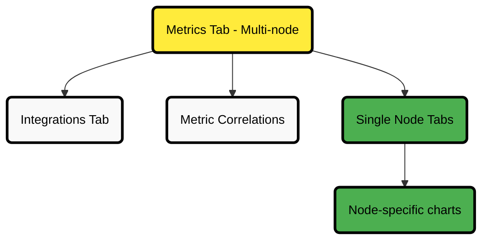

# Metrics Tab and Single Node Tabs

The **Metrics tab** provides real-time, per-second time series charts for all nodes in a Room. It helps you visualize, explore, and troubleshoot metrics across your entire infrastructure in one place.

You can also view **single-node dashboards**, which offer the same charts but are focused on a single node. You can access these dashboards from most places in the Netdata UI, often by clicking the name of a node.

From the Metrics tab, you can also access:

- The **Integrations tab**
- **Metric Correlations** to identify related metrics and uncover patterns across your infrastructure

:::note

Learn more: [Metric Correlations documentation](/docs/metric-correlations.md)

:::

## Metrics Tab Structure Overview

:::tip

The diagram above shows how the Metrics tab connects to related features and single-node dashboards, making it easier to navigate between views.

:::

## How the Dashboard is Organized

The dashboard displays various charts organized by their [context](/docs/dashboards-and-charts/netdata-charts.md#contexts). At the beginning of each section, there is a predefined arrangement of charts that provides an overview for that particular group of metrics.

The available chart types and grouping options allow flexible data visualization for troubleshooting and analysis.

:::tip

Use the chart arrangement at the start of each section to quickly identify patterns, spikes, or anomalies before diving into detailed chart filtering.

:::

## Chart Navigation Menu

The **Chart Navigation Menu**, located on the right-hand side of the dashboard, helps you navigate through sections, filter charts, and view active alerts.

| Feature                       | Description                                                                                                    |
|-------------------------------|----------------------------------------------------------------------------------------------------------------|
| **Section Navigation**        | Navigate quickly through the dashboard sections.                                                               |
| **Chart Filtering Options**   | Filter charts by:    - Host labels    - Node status    - Netdata version    - Individual nodes |
| **Active Alerts Display**     | View active alerts for the Room.                                                                               |
| **Anomaly Rate (AR%) Button** | Check the maximum chart anomaly rate for each section by clicking the `AR%` button.                            |

:::tip

Use chart filtering to reduce visual noise and focus on the nodes, labels, or statuses that matter most to your investigation.

:::

:::tip

The **AR% button** shows the maximum anomaly rate for each dashboard section, helping you quickly identify where issues may be occurring.

:::