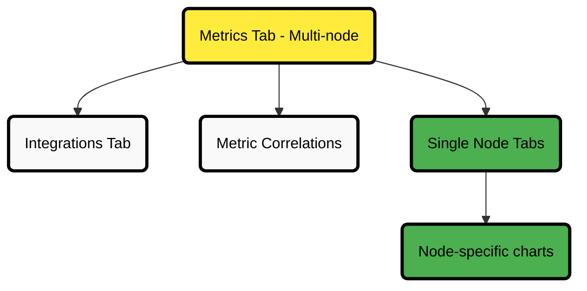

# Metrics Tab and Single Node Tabs

The **Metrics tab** provides real-time, per-second time series charts for all nodes in a Room. It helps you visualize, explore, and troubleshoot metrics across your entire infrastructure in one place.

You can also view **single-node dashboards**, which offer the same charts but are focused on a single node. You can access these dashboards from most places in the Netdata UI, often by clicking the name of a node.

From the Metrics tab, you can also access:

- The **Integrations tab**
- **Metric Correlations** to identify related metrics and uncover patterns across your infrastructure

:::note

Learn more: [Metric Correlations documentation](/docs/metric-correlations.md)

:::

## Metrics Tab Structure Overview

```mermaid
flowchart TD
    A("Metrics Tab - Multi-node")
    A --> B("Integrations Tab")
    A --> C("Metric Correlations")
    A --> D("Single Node Tabs")
    D --> E("Node-specific charts")

    %% Style definitions
    classDef alert fill:#ffeb3b,stroke:#000000,stroke-width:3px,color:#000000,font-size:14px
    classDef neutral fill:#f9f9f9,stroke:#000000,stroke-width:3px,color:#000000,font-size:14px
    classDef complete fill:#4caf50,stroke:#000000,stroke-width:3px,color:#000000,font-size:14px
    classDef database fill:#2196F3,stroke:#000000,stroke-width:3px,color:#000000,font-size:14px

    %% Apply styles
    class A alert
    class B,C neutral
    class D,E complete
```

:::tip

The diagram above shows how the Metrics tab connects to related features and single-node dashboards, making it easier to navigate between views.

:::

## How the Dashboard is Organized

The dashboard displays various charts organized by their [context](/docs/dashboards-and-charts/netdata-charts.md#contexts). At the beginning of each section, there is a predefined arrangement of charts that provides an overview for that particular group of metrics — including the first section, which summarizes the node's overall system resources such as CPU, memory, disk, and network. The exact charts and gauges shown depend on the node's hardware and enabled collectors.

The available chart types and grouping options allow flexible data visualization for troubleshooting and analysis.

:::tip

Use the chart arrangement at the start of each section to quickly identify patterns, spikes, or anomalies before diving into detailed chart filtering.

:::

## Gauge Colors

The gauges and easy-pie charts at the top of each dashboard section — such as CPU, RAM, disk, and network — summarize the current value of a resource. Each one displays a **single fixed color** (the color assigned to that metric's dimension) and the arc or pie **fills in proportion to the current value** relative to the chart's range.

Gauges do **not** change color based on the value, on thresholds, or on health alarm status. A CPU gauge at 90% uses exactly the same color as the same gauge at 10%; only the length of the filled arc changes.

There is no built-in setting that makes a dashboard gauge switch color when a metric crosses a threshold (for example, turning red at 90%).

### Getting threshold-based alerts

Netdata uses **health alarms** for threshold-based alerting. When an alarm fires it appears in the **Raised Alerts** tab with a **Warning** or **Critical** status, alert details, and a chart snapshot of the moment it triggered. See the [Alerts tab documentation](/docs/dashboards-and-charts/alerts-tab.md).

To monitor a specific threshold — for example, to be alerted when CPU reaches 90% — create or tune a health alarm. The warning and critical levels come from the alarm's `warn:` and `crit:` expressions (for example, `crit: $this > 90`). You can configure alarms through:

- The **Alerts Configuration Manager** (visual UI)
- **Alerts Automation** (describe the alert in plain English)
- **Manual configuration** by editing `health.d/*.conf` files

The Alerts Configuration Manager and Alerts Automation require a paid plan; manual configuration is available on every plan. See [feature availability](/docs/netdata-oss-limitations.md). For the full configuration reference, see [Configure Health Alerts](/src/health/REFERENCE.md).

:::note

Configuring a health alarm does **not** change the color of a dashboard gauge. Gauges always use the metric's fixed dimension color; alarms surface separately in the Alerts tab and through notifications.

:::

:::note

If you need an embeddable, color-changing value visual outside the dashboard, Netdata's [badge API](/src/web/api/v1/api_v1_badge/README.md) (`/api/v1/badge.svg`) renders a badge whose color can follow a chart's alarm status (critical = red, warning = orange, clear = green) or explicit value thresholds. Badges are a separate feature from dashboard gauges.

:::

## Chart Navigation Menu

The **Chart Navigation Menu**, located on the right-hand side of the dashboard, helps you navigate through sections, filter charts, and view active alerts.

| Feature                       | Description                                                                                                    |
|-------------------------------|----------------------------------------------------------------------------------------------------------------|
| **Section Navigation**        | Navigate quickly through the dashboard sections.                                                               |
| **Chart Filtering Options**   | Filter charts by:    - Host labels    - Node status    - Netdata version    - Individual nodes |
| **Active Alerts Display**     | View active alerts for the Room.                                                                               |
| **Anomaly Rate (AR%) Button** | Check the maximum chart anomaly rate for each section by clicking the `AR%` button.                            |

:::tip

Use chart filtering to reduce visual noise and focus on the nodes, labels, or statuses that matter most to your investigation.

:::

:::tip

The **AR% button** shows the maximum anomaly rate for each dashboard section, helping you quickly identify where issues may be occurring.

:::
