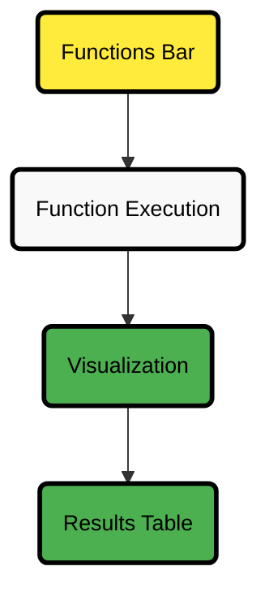

# Top Tab

The **Top tab** gives you access to [Netdata Functions](/docs/top-monitoring-netdata-functions.md) that can be executed on any node running the Netdata Agent. These specialized routines, provided by various collectors, offer enhanced insights and allow you to trigger specific actions directly on the monitored node.

You can **use these Functions to**:

- **Retrieve** extra diagnostic **information**
- Perform actions to support **troubleshooting directly on the node**

:::tip

You can also execute a Function from the [Nodes tab](/docs/dashboards-and-charts/nodes-tab.md) by pressing the `f(x)` button next to the node.

:::

:::note

If you receive an error saying that your node can’t execute Functions, check the [prerequisites](/docs/top-monitoring-netdata-functions.md) to ensure your node is configured properly.

:::

## Top Tab Structure Overview

:::tip

The diagram above shows how Function selection and execution work in the Top tab, helping you visualize the flow from choosing a Function to viewing the results.

:::

## Top Tab View

The main view of the Top tab provides two elements, depending on the selected Function:

| Element           | Description                                                                                                                  |
|-------------------|------------------------------------------------------------------------------------------------------------------------------|
| **Visualization** | Located at the top of the page. The type of visualization depends on the selected Function and may allow user customization. |
| **Data Table**    | Located below the visualization. Displays detailed results from the executed Function.                                       |

### View Controls

You can control the data refresh and update settings in the top right-hand corner of the view:

| Control                 | Description                                                              |
|-------------------------|--------------------------------------------------------------------------|
| **Refresh results**     | Manually refresh results (works when the dashboard is in `Paused` mode). |
| **Set update interval** | Configure how often the results should refresh.                          |

## Functions Bar

The **Functions bar**, located on the right-hand side of the Top tab, lets you select which Function to run, on which node, and apply filtering where available.

| Option              | Description                                                                                                                                                                  |
|---------------------|------------------------------------------------------------------------------------------------------------------------------------------------------------------------------|
| **Select Function** | Choose the Function to run from the available routines.                                                                                                                      |
| **Select Node**     | Select the node where the Function will execute.                                                                                                                             |
| **Apply Filtering** | Narrow down results using the available filters.    Example for the `Block-devices` Function:   - Device   - Type   - ID   - Model   - Serial number |

:::tip

The available filters depend on the Function you select. After choosing the Function, use the filters provided to narrow down the results and focus on the data you need.

:::