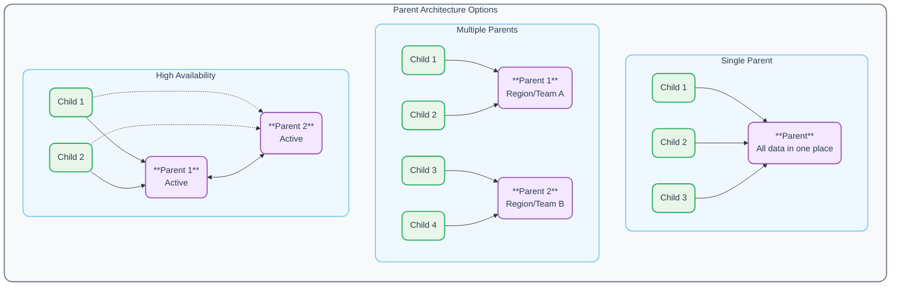
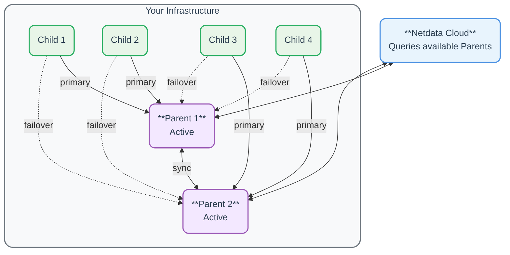

# Parents: Your Centralization Points

***Parents*** are Netdata Agents that collect and store data from other Agents ("***Children***"). They act as centralization points for your observability data.

## How It Works

1. **You designate some Agents as Parents** - Configure them to receive streaming data
2. **Children stream their data to Parents** - They push metrics continuously
3. **Parents store and process everything** - All metrics and logs from all Children
4. **You access Parents for dashboards and alerts** - Centralized monitoring interface
5. **Cloud queries Parents when configured** - Reduces load on production systems

:::info

Parents give you centralized collection with distributed architecture benefits.

:::

## What Parents Do

Parents are specialized Netdata installations that you can configure to **receive, store, and process** observability data (metrics and logs) from multiple other systems in your infrastructure.

These Parents give you several core functions:

* **Receiving and storing** metrics and logs from multiple systems
* **Processing and analyzing** your collected data
* **Running health checks and alerts**
* Providing **unified dashboards** across all your systems
* **Replicating data** for your historical analysis

:::info

This **distributed yet centralized** approach gives you the benefits of both decentralized collection and centralized analysis.

:::

## Why Use Parents

| Use Case | Description | Benefits |
|----------|-------------|----------|
| **Ephemeral Systems** | Ideal for your Kubernetes nodes or temporary VMs that frequently go offline | You retain metrics and logs for analysis and troubleshooting even after node termination |
| **Limited Resources** | Offloads observability tasks from your systems with low disk space, CPU, RAM, or I/O bandwidth | Your production systems run efficiently without performance trade-offs |
| **Multi-Node Dashboards Without Netdata Cloud** | Aggregates data from all your nodes for centralized dashboards | You get Cloud-like functionality in environments that prefer or require on-premises solutions |
| **Restricted Netdata Cloud Access** | Acts as a bridge when your monitored systems can't connect to Netdata Cloud | You can still use Cloud features despite firewall restrictions or security policies |

## How Multiple Parents Work

<strong>Click to see Parent architecture options</strong>
 

 

| Scenario | Operation | Advantages |
|----------|-----------|------------|
| **With Netdata Cloud** | Queries all your Parents in parallel for a unified view | You get a seamless experience regardless of your underlying architecture |
| **Without Netdata Cloud** | Your Parents consolidate data from connected systems | You have a local view of metrics and logs without external dependencies |
| **High Availability Setup** | Your Parents share data with each other, forming a cluster | You won't lose data if one Parent fails |

## Technical Implementation

Parents consist of two major components you can deploy:

1. **Metrics Centralization** - Uses Netdata's streaming and replication features to centralize your metrics data
2. **Logs Centralization** - Uses systemd-journald methodologies to centralize your log data

You can configure your systems to connect to **multiple Parents** for redundancy. If a connection fails, they automatically switch to an available alternative.

In a **high-availability setup**, your Parents can form a cluster by sharing data with each other, ensuring all points have a complete copy of all your metrics and logs.

<strong>Click to see how high availability works</strong>
 

 

:::tip

Check out our [Parent-Child Deployment Guide](/docs/deployment-guides/parent-child-deployment.md) for step-by-step instructions.

:::