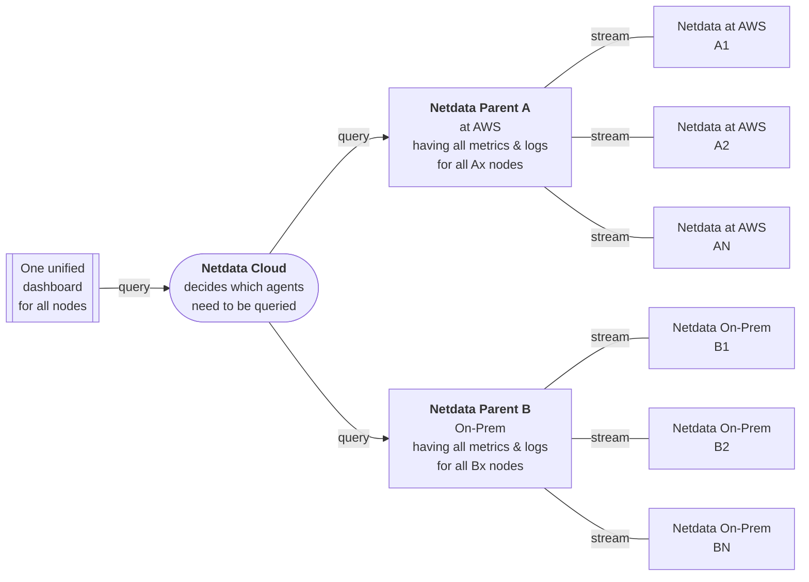
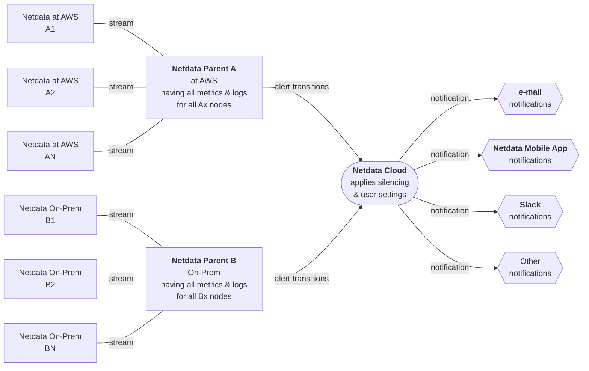

# Deployment with Centralization Points

An observability centralization point can centralize both metrics and logs. The sending systems are called Children, while the receiving systems are called a Parents.

When metrics and logs are centralized, the Children are never queried for metrics and logs. The Netdata Parents have all the data needed to satisfy queries.

- **Metrics** are centralized by Netdata, with a feature we call **Streaming**. The Parents listen for incoming connections and permit access only to Children that connect to it with the right API key. Children are configured to push their metrics to the Parents and they initiate the connections to do so.

- **Logs** are centralized with methodologies provided by `systemd-journald`. This involves installing `systemd-journal-remote` on both the Parent and the Children, and configuring the keys required for this communication.

|                    Feature                    |                                                 How it works                                                  |
|:---------------------------------------------:|:-------------------------------------------------------------------------------------------------------------:|
| Unified infrastructure dashboards for metrics |                                             Yes, at Netdata Cloud                                             |
|  Unified infrastructure dashboards for logs   | All logs are accessible via the same dashboard at Netdata Cloud, although they are unified per Netdata Parent |
|          Centrally configured alerts          |                                            Yes, at Netdata Parents                                            |
|   Centrally dispatched alert notifications    |                                             Yes, at Netdata Cloud                                             |
|         Data are exclusively on-prem          |                                                 Yes, Netdata Cloud queries Netdata Agents to satisfy dashboard queries.                                                 |

A configuration with 2 observability centralization points, looks like this:

Netdata Cloud queries the Netdata Parents to provide aggregated dashboard views.

For alerts, the dispatch of notifications looks like in the following chart:

### Configuration steps for deploying Netdata with Observability Centralization Points

For Metrics:

- Install Netdata agents on all systems and the Netdata Parents.

- Configure `stream.conf` at the Netdata Parents to enable streaming access with an API key.

- Configure `stream.conf` at the Netdata Children to enable streaming to the configured Netdata Parents.

For Logs:

- Install `systemd-journal-remote` on all systems and the Netdata Parents.

- Configure `systemd-journal-remote` at the Netdata Parents to enable logs reception.

- Configure `systemd-journal-upload` at the Netdata Children to enable transmission of their logs to the Netdata Parents.

Optionally:

- Disable ML, health checks and dashboard access at Netdata Children to save resources and avoid duplicate notifications.

When using Netdata Cloud:

- Optionally: disable dashboard access on all Netdata agents (including Netdata Parents).
- Optionally: disable alert notifications on all Netdata agents (including Netdata Parents).
