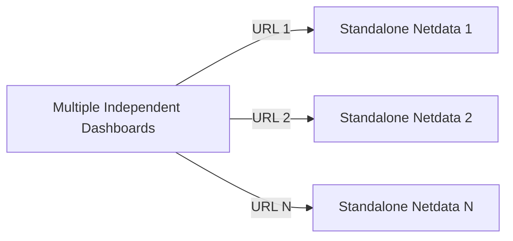
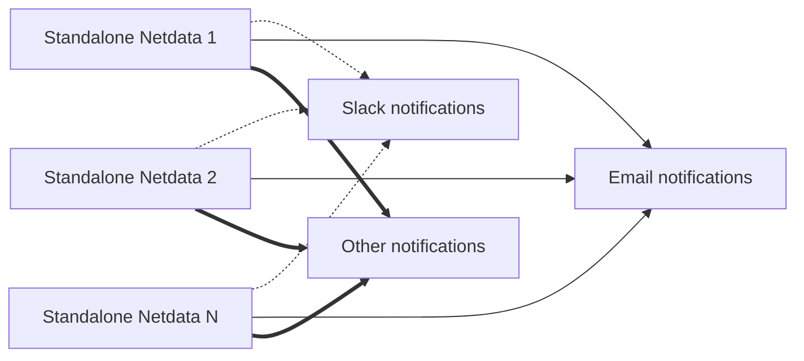
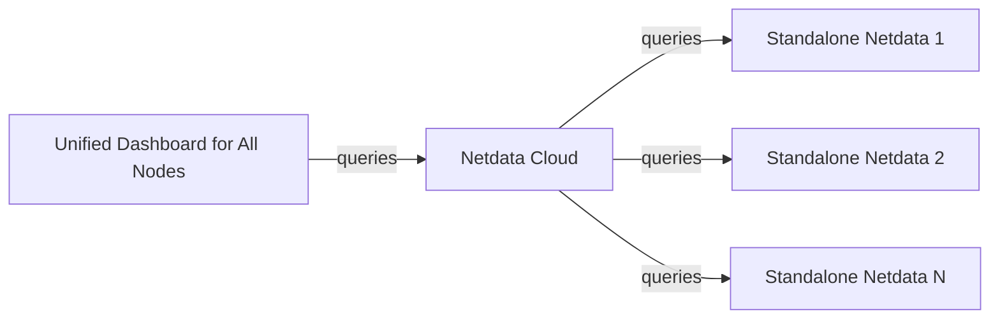
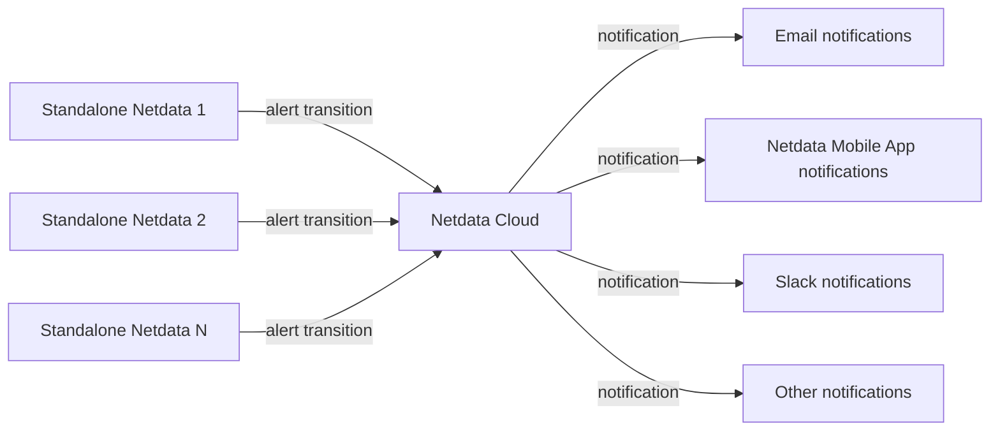

# Standalone Deployment

Netdata provides real-time monitoring out of the box. By default, each Netdata Agent functions as a standalone monitoring system with no additional configuration required.

## Standalone Agents Without Netdata Cloud

Each Netdata Agent operates independently and provides its own monitoring dashboard and alerting system.

### Features

| Feature | How it works |
|---------|-------------|
| **Infrastructure dashboards for metrics** | No, each Netdata Agent provides its own dashboard. |
| **Infrastructure dashboards for logs** | No, logs are only accessible per individual Netdata Agent. |
| **Centralized alert configuration** | No, each Netdata Agent has its own alert settings. |
| **Centralized alert notifications** | No, each Netdata Agent sends notifications independently. |
| **On-prem data retention** | Yes, all collected data remains on the monitored system. |

Each Netdata Agent is accessible via a unique URL: `http://agent-ip:19999`.

Each agent also manages its own alert notifications:

### Configuration Steps

- Install Netdata Agents on each system.
- Access each Agent individually via its URL (`http://agent-ip:19999`).

## Standalone Agents With Netdata Cloud

Connecting Netdata Agents to Netdata Cloud enables centralized monitoring while keeping collected data on-premise.

### Features

| Feature | Description |
|---------|-------------|
| **Infrastructure dashboards for metrics** | Yes, Netdata Cloud provides unified charts aggregating metrics from all systems. |
| **Infrastructure dashboards for logs** | Logs from all agents are accessible in Netdata Cloud (though not merged into a single view). |
| **Centralized alert configuration** | No, each Netdata Agent maintains its own alert settings. |
| **Centralized alert notifications** | Yes, Netdata Cloud manages and dispatches notifications. |
| **On-prem data retention** | Yes, Netdata Cloud queries Netdata Agents in real time. |

Connecting Netdata Agents to Netdata Cloud enables a unified monitoring view without requiring additional infrastructure setup.

Alert notifications are managed centrally in Netdata Cloud:

> **Note:** Alerts are still triggered by Netdata Agents. Netdata Cloud manages notifications.

### Configuration Steps

- Install Netdata Agents using the installation commands provided by Netdata Cloud to automatically link them to your Space.
- Alternatively, install Netdata Agents manually and connect them via the command line or dashboard.
- **Optional:** Disable direct dashboard access for security.
- **Optional:** Disable individual agent notifications to prevent duplicate alerts (Netdata Agents send email alerts by default if an MTA is detected).