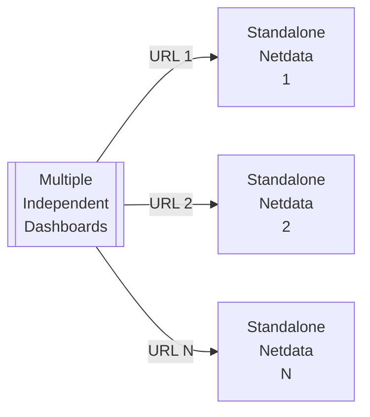
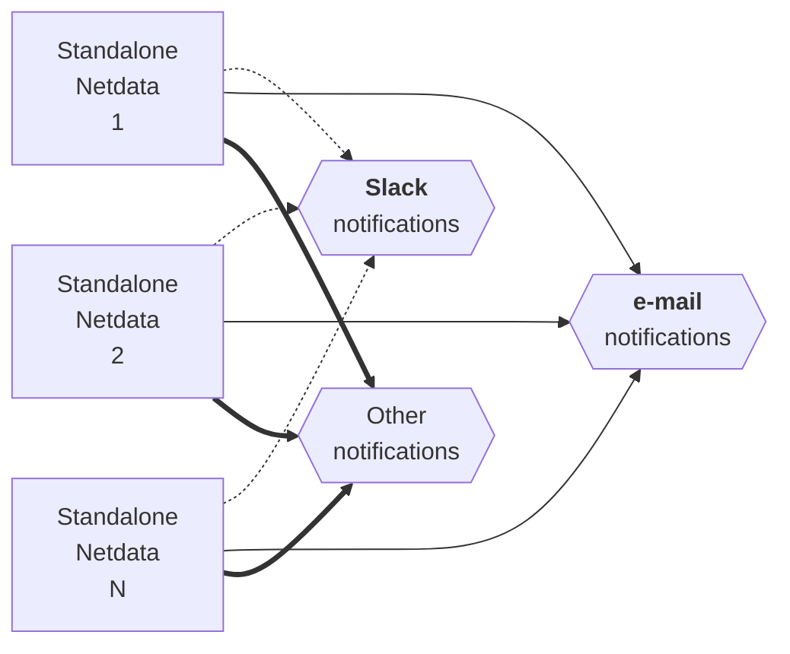
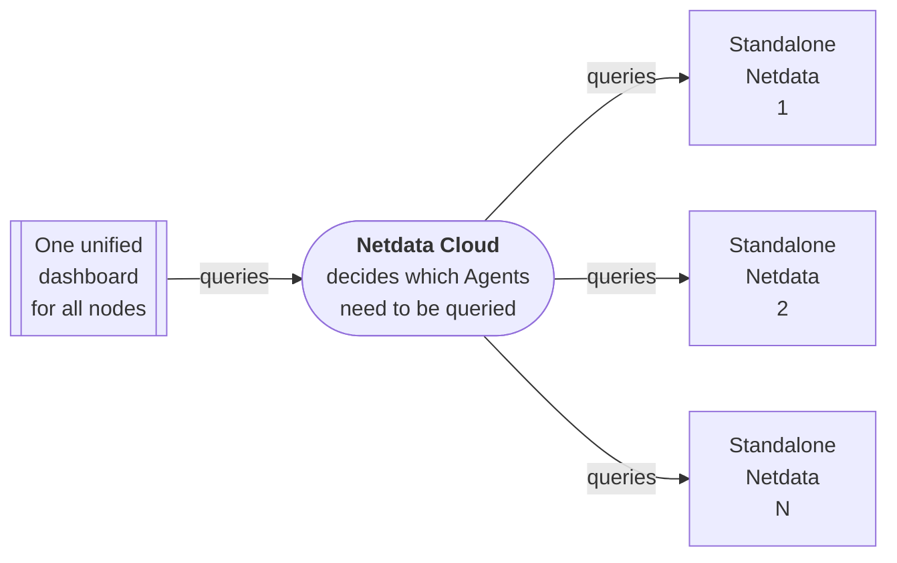
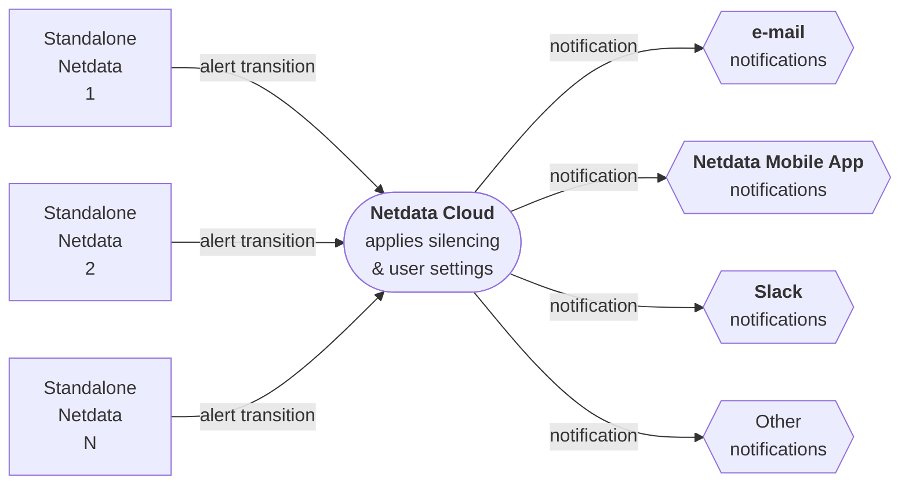

# Standalone Deployment

To help our users have a complete experience of Netdata when they install it for the first time, the Netdata Agent with default configuration is a complete monitoring solution out of the box, with features enabled and available.

So, each Netdata Agent acts as a standalone monitoring system by default.

## Standalone Agents, without Netdata Cloud

|                    Feature                    |                     How it works                     |
|:---------------------------------------------:|:----------------------------------------------------:|
| Unified infrastructure dashboards for metrics |  No, each Netdata Agent provides its own dashboard   |
|  Unified infrastructure dashboards for logs   |     No, each Netdata Agent exposes its own logs      |
|          Centrally configured alerts          |  No, each Netdata has its own alerts configuration   |
|   Centrally dispatched alert notifications    | No, each Netdata Agent sends notifications by itself |
|         Data are exclusively on-prem          |                         Yes                          |

When using Standalone Netdata Agents, each of them offers an API and a dashboard, at its own unique URL, that looks like `http://agent-ip:19999`.

So, each of the Netdata Agents has to be accessed individually and independently of the others:

The same is true for alert notifications. Each of the Netdata Agents runs its own alerts and sends notifications by itself, according to its configuration:

### Configuration steps for standalone Netdata Agents without Netdata Cloud

No special configuration needed.

- Install Netdata Agents on all your systems, then access each of them via its own unique URL, that looks like `http://agent-ip:19999/`.

## Standalone Agents, with Netdata Cloud

|                    Feature                    |                                                                              How it works                                                                               |
|:---------------------------------------------:|:-----------------------------------------------------------------------------------------------------------------------------------------------------------------------:|
| Unified infrastructure dashboards for metrics |                                                 Yes, via Netdata Cloud, all charts aggregate metrics from all servers.                                                  |
|  Unified infrastructure dashboards for logs   | All logs are accessible via the same dashboard at Netdata Cloud, although they are not unified (ie. logs from different servers are not multiplexed into a single view) |
|          Centrally configured alerts          |                                                            No, each Netdata has its own alerts configuration                                                            |
|   Centrally dispatched alert notifications    |                                                                         Yes, via Netdata Cloud                                                                          |
|         Data are exclusively on-prem          |                                                 Yes, Netdata Cloud queries Netdata Agents to satisfy dashboard queries.                                                 |

By [connecting all Netdata Agents to Netdata Cloud](/src/claim/README.md), you can have a unified infrastructure view of all your nodes, with aggregated charts, without configuring [observability centralization points](/docs/observability-centralization-points/README.md).

Similarly for alerts, Netdata Cloud receives all alert transitions from all Agents, decides which notifications should be sent and how, applies silencing rules, maintenance windows and based on each Netdata Cloud space and user settings, dispatches notifications:

> **Note**
>
> Alerts are still triggered by Netdata Agents. Netdata Cloud only takes care of the notifications.

### Configuration steps for standalone Netdata Agents with Netdata Cloud

- Install Netdata Agents using the commands given by Netdata Cloud so that they will be automatically connected to your Space. Otherwise, install Netdata Agents and connect them via the command line or their dashboard.

- Optionally: disable their direct dashboard access to secure them.

- Optionally: disable their alert notifications to avoid receiving email notifications directly from them (email notifications are automatically enabled when a working MTA is found on the systems Netdata Agents are installed).
