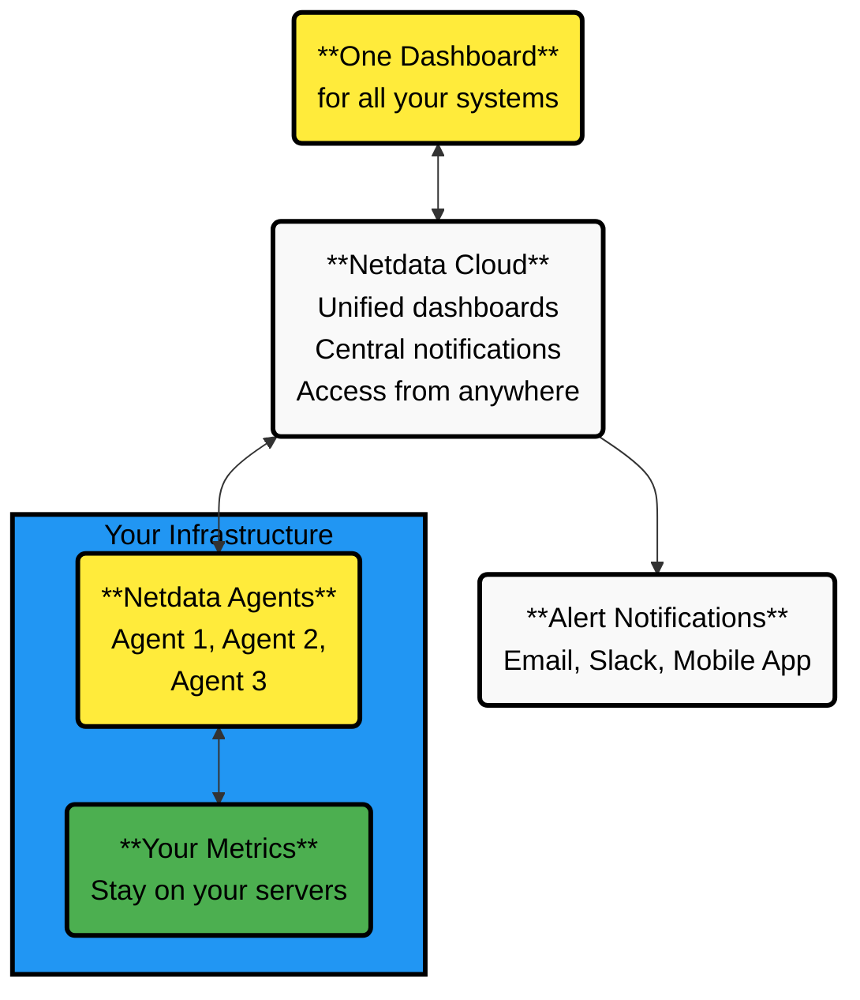
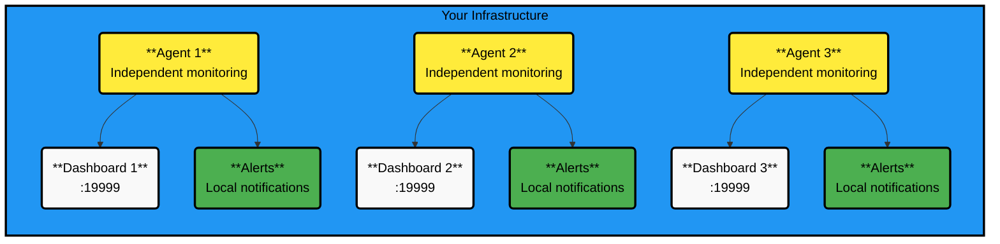

# Single Agent Deployment

The simplest way to use Netdata - install it, and you're monitoring. Each Agent works independently with zero configuration.

## Single Agents With Netdata Cloud (Recommended)

Get the best experience - one dashboard for all your systems, mobile alerts, and team collaboration. Your data stays on your servers.

### What You Get

| Feature                         | How it Works                             |
|---------------------------------|------------------------------------------|
| **Unified metrics dashboard**   | ✓ See all Agents in one place            |
| **Unified logs view**           | ✓ Access all logs from Cloud             |
| **Central alert configuration** | Each Agent still manages its own alerts  |
| **Central notifications**       | ✓ Cloud handles all notifications        |
| **Data stays on-premise**       | ✓ Cloud queries your Agents in real-time |

<strong>Click to see visual representation of the architecture</strong>
 

### Setup

Getting started is simple:

1. **Sign up for Netdata Cloud** (it's free)
2. **Get your connection command** - Once logged in, you have three ways to get it:
    - Navigate to **Space Settings** → **Nodes** → Click **"+"**
    - Go to **Nodes** tab → Click **Add nodes**
    - Visit **Integrations** page → Select your OS

3. **Run the installation command** that includes your unique claim token and room information

**What happens next:**

- The command automatically detects your OS
- Installs the latest Netdata Agent
- Connects to your Cloud Space
- Your node appears live in seconds
- Charts start streaming real-time data immediately

:::tip

Get detailed instructions on how to connect Agents to Cloud in our [Connect Agent to Cloud Guide](https://github.com/netdata/netdata/blob/master/src/claim/README.md).

:::

### Optional Optimizations

- Disable local Agent notifications (Cloud handles them better)
- Restrict local dashboard access for security (use Cloud instead)

## Single Agents Without Cloud

You can also run Agents independently, though you'll miss out on unified dashboards and mobile alerts.

<strong>Click to see visual representation of standalone architecture</strong>
 

### Setup

:::tip

Check the [Version & Platform](https://learn.netdata.cloud/docs/netdata-agent/versions-&-platforms) that's suitable for your needs and install the Agent.

:::

1. Install Netdata on each system
2. Access each dashboard at `http://agent-ip:19999`
3. Configure alerts individually on each Agent

## When to Use Each Approach

**Use Cloud-connected Agents when:**

- You want one dashboard for everything
- You need mobile alerts
- Multiple people need access
- You're managing more than one system

**Use standalone Agents only when:**

- You have strict air-gapped requirements
- You're testing on a single system
- Cloud connectivity is not possible

:::note

Without Netdata Cloud, each Agent operates independently - you'll need to check multiple dashboards, configure alerts on each system separately, and won't receive mobile notifications. Cloud connection is free and keeps your data on-premise while providing a unified view.

:::
