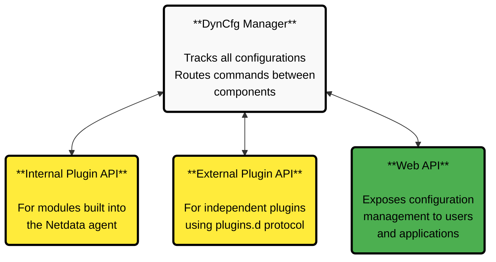

# Developing with Dynamic Configuration (DynCfg)

:::tip

**What You'll Learn**

How to integrate Dynamic Configuration into your Netdata plugins and modules to create configurable, user-friendly monitoring solutions.

:::

Dynamic Configuration (DynCfg) enables your plugins and modules to expose their configurations through Netdata's unified interface. Instead of requiring users to manually edit configuration files, they can configure your plugin directly through the Netdata UI.

## What DynCfg Does for You

DynCfg provides a complete configuration management system that handles:

| Feature                        | What It Does                                                   |
|--------------------------------|----------------------------------------------------------------|
| **Configuration Registration** | Register your plugin's configuration objects with Netdata      |
| **User Interface Generation**  | Automatically create UI forms from JSON Schema definitions     |
| **Configuration Persistence**  | Save and restore configurations across Netdata agent restarts  |
| **Validation Pipeline**        | Route configuration changes back to your plugin for validation |
| **Standardized Experience**    | Provide users with consistent configuration workflows          |

:::info

**Key Benefits**

- Users configure your plugin through the UI instead of editing files
- JSON Schema automatically generates user-friendly forms
- Your plugin validates all configuration changes before they're applied
- Configurations persist automatically across restarts

:::

## How DynCfg Works

The system consists of four main parts working together:

1. **DynCfg Manager** - Tracks all configurations and routes commands between components
2. **Internal Plugin API** - For modules built into the Netdata agent
3. **External Plugin API** - For independent plugins using the plugins.d protocol
4. **Web API** - Exposes configuration management to users and applications

## Configuration Types You Can Create

Choose the configuration type that matches your use case:

| Type         | Use Case                                       | Example                            |
|--------------|------------------------------------------------|------------------------------------|
| **SINGLE**   | One standalone configuration                   | systemd-journal directories        |
| **TEMPLATE** | Blueprint for creating multiple configurations | Nginx collector template           |
| **JOB**      | Specific instance created from a template      | Individual Nginx server to monitor |

## Implementation Guides

### Getting Started

1. **Choose your implementation path** - Internal module or external plugin?
2. **Read the relevant implementation guide** - Follow the detailed documentation for your chosen approach
3. **Study working examples** - Look at existing implementations for patterns and best practices
4. **Start with simple configurations** - Begin with basic SINGLE type configurations before moving to TEMPLATE/JOB patterns
5. **Test thoroughly** - Verify your configurations work correctly through both API and UI

:::tip

Ready to make your plugin configurable through the Netdata UI? Choose your implementation guide and start building!

:::

### For Internal Modules

Are you developing a module built into the Netdata agent?

👉 **[Internal DynCfg Implementation Guide](/src/daemon/dyncfg/README.md)**

<strong>This guide covers:</strong>
 

- Low-level and high-level APIs for internal modules
- Configuration ID structure and naming conventions
- Response codes and status handling
- Action behavior for different configuration types
- JSON Schema implementation details
- API access patterns and endpoints
- Implementation best practices

 

### For External Plugins

Are you developing a standalone plugin that communicates with Netdata using the plugins.d protocol?

👉 **[External Plugin DynCfg Implementation Guide](/src/plugins.d/DYNCFG.md)**

<strong>This guide covers:</strong>
 

- Plugin protocol commands and response formats
- Configuration registration process
- Handling incoming configuration commands
- Responding to status changes and validation requests
- Schema definition and management
- Complete working examples with code

 

## Learn from Working Examples

Study these real implementations to understand DynCfg patterns:

<strong>Health Alerts System (Internal Module)</strong>
 

The health module manages alert definitions through DynCfg:

- **File**: `src/health/health_dyncfg.c`
- **Pattern**: Uses high-level internal API
- **Type**: TEMPLATE and JOB configurations for alert definitions

 

<strong>journal-viewer-plugin (External Plugin, Rust)</strong>
 

External Rust plugin that provides systemd journal log viewing and analysis:

- **Location**: `src/crates/netdata-log-viewer/journal-viewer-plugin/`
- **Use Case**: Viewing and analyzing systemd journal logs

 

<strong>go.d.plugin (External Plugin, Go)</strong>
 

Go-based plugin managing multiple data collector configurations:

- **Pattern**: TEMPLATE and JOB configurations
- **Feature**: Dynamically generates JSON Schema from Go struct tags
- **Scale**: Manages dozens of different collector types

 

## Implementation Best Practices

| Category                          | Best Practice                     | Description                                                      |
|-----------------------------------|-----------------------------------|------------------------------------------------------------------|
| **Configuration Design**          | Use clear ID structure            | Follow the `component:category:name` pattern consistently        |
|                                   | Choose logical paths              | The path parameter affects how configurations appear in the UI   |
|                                   | Design intuitive schemas          | Include helpful descriptions and examples in your JSON Schema    |
| **Validation and Error Handling** | Validate thoroughly               | Always validate configuration changes before accepting them      |
|                                   | Provide helpful errors            | Give users clear explanations when configurations are rejected   |
|                                   | Return appropriate codes          | Use correct HTTP status codes for different situations           |
| **User Experience**               | Respect type-action relationships | Different actions behave differently for each configuration type |
|                                   | Test your UI                      | Verify that your JSON Schema generates usable forms              |
|                                   | Document your options             | Help users understand what each configuration option does        |
