# Netdata MCP Integration: AI-Powered Infrastructure Analysis

:::info

The Netdata MCP Server preview is live. [Get early access](https://b6yi53u6qjm.typeform.com/to/DQi5ibhE?typeform-source=www.netdata.cloud) or visit our GitHub repository for the latest nd-mcp tools and setup instructions.

:::

:::note

This integration leverages new and evolving AI technologies. While Netdata provides comprehensive infrastructure monitoring capabilities, the AI analysis features **depend on external AI services** and their inherent limitations. The quality and accuracy of AI-generated insights are **subject to the capabilities and constraints of the underlying AI models, not Netdata's monitoring functionality**.

:::

## What is MCP?

**Model Context Protocol (MCP)** is a new open standard that allows AI assistants to connect directly to your data sources and tools. Think of it as a bridge that lets AI systems access and analyze your real-time infrastructure data instead of just providing generic advice.

:::note

**Learn More**: MCP is an open standard created by Anthropic. For technical details about the protocol specification, visit [Anthropic's MCP documentation](https://modelcontextprotocol.io/).

:::

## How Netdata is Pioneering AI-Powered Monitoring

Netdata is **one of the first monitoring platforms** to integrate MCP, placing us among the pioneers in AI-powered infrastructure analysis. We've built a direct connection between advanced AI models (like Claude) and your Netdata monitoring data, creating an intelligent troubleshooting partner that understands your specific infrastructure.

### What Makes This Revolutionary

**Traditional monitoring**: You look at charts and graphs, manually correlating data across different services to find problems.

**Netdata with MCP**: AI analyzes your actual monitoring data in real-time, automatically correlates anomalies across your entire infrastructure, and provides expert-level post-mortem analysis.

## What This Changes for You

### Instant Expert Analysis

Instead of spending hours analyzing charts during an incident, you can now:

- **Ask natural questions**: "What caused the outage between 13:00-13:30 UTC?"
- **Get comprehensive post-mortems**: AI analyzes your metrics, identifies root causes, and maps dependency chains
- **Understand complex correlations**: AI detects which services were affected and why

### Real-World Example

**The Problem**: Database server goes down, affecting multiple applications across your infrastructure.

```mermaid
flowchart TD
    A("🚨 Database Outage Occurs")
    
    B("📊 Traditional Approach")
    C("🤖 Netdata + MCP")
    
    D("Manual dashboard review<br/>⏱️ Hours of analysis")
    E("AI analyzes all metrics<br/>⚡ Instant correlation")
    
    F("❌ Slow resolution<br/>Missed dependencies")
    G("✅ Fast resolution<br/>Complete root cause")
    
    A --> B
    A --> C
    B --> D
    C --> E
    D --> F
    E --> G
    
    %% Styling
    classDef problem fill:#ffeb3b,stroke:#333,stroke-width:2px
    classDef traditional fill:#ff7043,stroke:#333,stroke-width:2px
    classDef ai fill:#42a5f5,stroke:#333,stroke-width:2px
    classDef outcome fill:#f5f5f5,stroke:#333,stroke-width:2px
    
    class A problem
    class B,D traditional
    class C,E ai
    class F,G outcome
```

### Advanced Anomaly Detection

Your AI assistant can:

- **Detect anomaly patterns** across your entire infrastructure
- **Identify cascade failures** before they become critical
- **Explain complex service dependencies** in plain language
- **Predict which services will be affected** by specific component failures

## Current Capabilities

### What You Can Do Today

| Capability                  | What You Get                                                                                                                                                                                                                                     | Key Benefits                                                                                             |
|-----------------------------|--------------------------------------------------------------------------------------------------------------------------------------------------------------------------------------------------------------------------------------------------|----------------------------------------------------------------------------------------------------------|
| **Infrastructure Analysis** | **Post-mortem analysis** of incidents with **root cause identification**, **real-time anomaly correlation** across all your services, **service dependency mapping** and impact analysis, **performance bottleneck identification**              | Understand complex incidents in minutes instead of hours, identify cascading failures before they spread |
| **Intelligent Querying**    | Ask questions about your infrastructure in **natural language**, get **explanations of complex metrics** and their relationships, understand **streaming configurations** and network topologies, analyze **resource usage patterns** and trends | No more manual chart correlation - just ask and get expert-level insights                                |
| **Expert Troubleshooting**  | **AI-powered investigation** of performance issues, **automated correlation** of events across your infrastructure, **context-aware recommendations** based on your specific setup                                                               | Get the analysis that would normally require a senior engineer, available 24/7                           |

### How to Get Started

1. **Install Netdata nightly build** (required for MCP support)
2. **Set up the MCP bridge** using our nd-mcp tool
3. **Connect your AI assistant** (Claude Desktop recommended)
4. **Start asking questions** about your infrastructure

:::note

**Current Version**: MCP integration works with both individual Netdata agents and parent agents that aggregate data from multiple nodes. When connected to a parent, AI can analyze data across all nodes that stream to that parent.

:::

## What's Coming Next

### Netdata Cloud Integration

**The next major step**: MCP will integrate directly with Netdata Cloud, giving you access to your complete infrastructure data:

- **Organization-wide analysis** across all your monitored infrastructure
- **Cross-room correlation** for complex distributed systems
- **Complete infrastructure visibility** through AI analysis
- **Team-wide insights** from your centralized monitoring data

### Beyond Single Nodes

**Current capability**: MCP integration works with individual Netdata agents and parent agents that aggregate multiple nodes.

**Coming soon**: Direct access to your Netdata Cloud data, enabling AI analysis across your entire infrastructure ecosystem with full organizational context.

## The Future of Infrastructure Monitoring

With Netdata MCP, we're moving toward a future where **AI understands your infrastructure** as well as your best engineers. **Troubleshooting becomes conversational** rather than manual chart analysis, **post-mortems write themselves** with complete root cause analysis, and **your monitoring system becomes a true team member** that helps solve problems.

:::note

This represents our vision for the future of infrastructure monitoring. While we're making significant progress with MCP integration, these capabilities are aspirational goals we're working toward, not current product features. For now, we are building the foundations for the reality we want to create.

:::

**Join us in pioneering the next generation of intelligent infrastructure monitoring.**
