# Metric Correlations

The **Metric Correlations** feature helps you quickly identify metrics and charts relevant to a specific time window of interest, allowing for faster root cause analysis.

:::tip

By filtering your standard Netdata dashboard to **display only the most relevant charts**, Metric Correlations make it easier for you to pinpoint anomalies and investigate issues.

:::

Since it leverages every available metric in your infrastructure with up to 1-second granularity, **Metric Correlations provides you with highly accurate insights**.

## Using Metric Correlations

When viewing the [Metrics tab or a single-node dashboard](/WRONGdocs/dashboards-and-charts/metrics-tab-and-single-node-tabs.md), you'll find the **Metric Correlations** button in the top-right corner.

<details>
<summary><strong>To start:</strong></summary><br/>

1. Click **Metric Correlations**.
2. Highlight a selection of metrics on a single chart. **The selected timeframe must be at least 15 seconds**.
3. The menu displays details about your selected area and reference baseline. Metric Correlations compares your highlighted window to a reference baseline, which is four times its length and precedes it immediately.
4. Click **Find Correlations**.

:::note

This button is only active if you've selected a valid timeframe.

:::

5. **The process evaluates all your available metrics and returns a filtered Netdata dashboard** showing only the most changed metrics between the baseline and your highlighted window.
6. If needed, select another window and press **Find Correlations** again to refine your analysis.

</details>

## Integration with Anomaly Detection

You can combine Metric Correlations with Anomaly Detection for powerful troubleshooting:

:::tip

When you notice an anomaly in your system, use Metric Correlations with the **Anomaly Rate** data type to quickly identify which metrics are contributing to the anomalous behavior.

:::

### How to Use Together

```mermaid
flowchart LR
    A("Detection<br/>Spot anomaly spike<br/>in node rate chart")
    B("Selection<br/>Highlight specific<br/>time period")
    C("Configuration<br/>Select Anomaly Rate<br/>as data type")
    D("Execute<br/>Click Find<br/>Correlations")
    E("Analysis<br/>Review metrics with<br/>highest anomaly rates")
    F("Resolution<br/>Examine metrics to<br/>determine root cause")
    
    A --> B --> C --> D --> E --> F
    
    %% Style definitions
    classDef alert fill:#ffeb3b,stroke:#000000,stroke-width:3px,color:#000000,font-size:14px
    classDef neutral fill:#f9f9f9,stroke:#000000,stroke-width:3px,color:#000000,font-size:14px
    classDef complete fill:#4caf50,stroke:#000000,stroke-width:3px,color:#000000,font-size:14px
    classDef database fill:#2196F3,stroke:#000000,stroke-width:3px,color:#000000,font-size:14px

    %% Apply styles
    class A,B alert
    class C,D neutral
    class E complete
    class F database
```



:::tip

**This workflow helps you move from detecting** that *"something is wrong"* **to understanding** exactly which components are behaving abnormally, significantly reducing your troubleshooting time.

:::

## API Access

You can access anomaly detection data and use it with metric correlations through Netdata's API:

<details>
<summary><strong>Querying Anomaly Bits</strong></summary><br/>

To get the anomaly bits for any metric, add the `options=anomaly-bit` parameter to your API query:

```
https://your-netdata-node/api/v1/data?chart=system.cpu&dimensions=user&after=-60&options=anomaly-bit
```

Sample response:

```json
{
  "labels": [
    "time",
    "user"
  ],
  "data": [
    [
      1684852570,
      0
    ],
    [
      1684852569,
      0
    ],
    [
      1684852568,
      0
    ],
    [
      1684852567,
      0
    ],
    [
      1684852566,
      0
    ],
    [
      1684852565,
      0
    ],
    [
      1684852564,
      0
    ],
    [
      1684852563,
      0
    ],
    [
      1684852562,
      0
    ],
    [
      1684852561,
      0
    ]
  ]
}
```

</details>

<details>
<summary><strong>Querying Anomaly Rates</strong></summary><br/>

For anomaly rates over a time window, use the same parameter but with aggregated data:

```
https://your-netdata-node/api/v1/data?chart=system.cpu&dimensions=user&after=-600&before=0&points=10&options=anomaly-bit
```

Sample response showing the percentage of time each metric was anomalous:

```json
{
  "labels": [
    "time",
    "user"
  ],
  "data": [
    [
      1684852770,
      0
    ],
    [
      1684852710,
      20
    ],
    [
      1684852650,
      0
    ],
    [
      1684852590,
      10
    ],
    [
      1684852530,
      0
    ],
    [
      1684852470,
      0
    ],
    [
      1684852410,
      30
    ],
    [
      1684852350,
      0
    ],
    [
      1684852290,
      0
    ],
    [
      1684852230,
      0
    ]
  ]
}
```

</details>

:::tip

You can programmatically access this data to build custom dashboards or alerts based on anomaly patterns in your infrastructure.

:::

## Metric Correlations Options

Metric Correlations offer adjustable parameters for deeper data exploration. Since different data types and incidents require different approaches, **these settings allow for flexible analysis**.

<details>
<summary><strong>Method</strong></summary><br/>

Two algorithms are available for scoring metrics based on changes between the baseline and highlight windows:

* **`KS2` (Kolmogorov-Smirnov Test)**: A statistical method comparing distributions between the highlighted and baseline windows to detect significant changes. [Implementation details](https://github.com/netdata/netdata/blob/d917f9831c0a1638ef4a56580f321eb6c9a88037/database/metric_correlations.c#L212).
* **`Volume`**: A heuristic approach based on percentage change in averages, designed to handle edge cases. [Implementation details](https://github.com/netdata/netdata/blob/d917f9831c0a1638ef4a56580f321eb6c9a88037/database/metric_correlations.c#L516).

</details>

<details>
<summary><strong>Aggregation</strong></summary><br/>

To accommodate different window lengths, Netdata aggregates your raw data as needed. The default aggregation method is `Average`, but you can also choose `Median`, `Min`, `Max`, or `Stddev`.
</details>

<details>
<summary><strong>Data Type</strong></summary><br/>

Netdata assigns an [Anomaly Bit](https://github.com/netdata/netdata/tree/master/src/ml#anomaly-bit) to each of your metrics in real-time, flagging whether it deviates significantly from normal behavior. You can analyze either raw data or anomaly rates:

* **`Metrics`**: Runs Metric Correlations on your raw metric values.
* **`Anomaly Rate`**: Runs Metric Correlations on anomaly rates for each of your metrics.

</details>

## Metric Correlations on the Agent

Metric Correlations (MC) requests to Netdata Cloud are handled in two ways:

1. **If MC is enabled** on any of your nodes, the request is routed to the highest-level node (a Parent node or the node itself).
2. **If MC is not enabled** on any of your nodes, Netdata Cloud processes the request by collecting data from your nodes and computing correlations on its backend.

## Interpreting Combined Results

When you use Metric Correlations together with Anomaly Detection, you'll want to understand how to interpret the results:

:::tip

**High anomaly rates combined with significant metric changes** often indicate genuine issues rather than false positives.

:::

Here's how to interpret different scenarios:

| Anomaly Rate | Metric Correlation | Interpretation                                       |
|--------------|--------------------|------------------------------------------------------|
| High         | Strong             | Likely a significant issue affecting system behavior |
| High         | Weak               | Possible edge case or intermittent issue             |
| Low          | Strong             | Normal but significant change in system behavior     |
| Low          | Weak               | Likely normal system operation                       |

:::tip

By examining both the anomaly rate and the correlation strength, you can prioritize your troubleshooting efforts more effectively.

:::

## Usage Tips

:::tip

When running Metric Correlations from the [Metrics tab](/docs/dashboards-and-charts/metrics-tab-and-single-node-tabs.md) across multiple nodes, refine your results by grouping by node:

1. Run MC on all your nodes if you're unsure which ones are relevant.
2. Group the most interesting charts by node to determine whether changes affect all your nodes or just a subset.
3. If a subset of your nodes stands out, filter for those nodes and rerun MC to get more precise results.

Choose the **`Volume`** algorithm for sparse metrics (e.g., request latency with few requests). Otherwise, use **`KS2`**.

- **`KS2`** is ideal for detecting complex distribution changes in your metrics, such as shifts in variance.
- **`Volume`** is better for detecting your metrics that were inactive and then spiked (or vice versa).

**Example:**

- `Volume` can highlight network traffic suddenly turning on in your system.
- `KS2` can detect entropy distribution changes in your data missed by `Volume`.

Combine **`Volume`** and **`Anomaly Rate`** to identify the most anomalous metrics within your selected timeframe. Expand the anomaly rate chart to visualize results more clearly.

:::
