# AI Chat with Netdata

Chat with your infrastructure using natural language through two distinct integration architectures.

## Integration Architecture

### Method 1: Client-Controlled Communication (Available Now)

```mermaid
flowchart TB
    LLM("🤖 LLM Provider<br/>OpenAI, Anthropic, etc.")
    
    subgraph infra["Your Infrastructure"]
        direction TB
        subgraph userLayer[" "]
            direction LR
            User("👤 User") 
            Client("💻 AI Client<br/>Claude Desktop, Cursor, etc.")
            
            User -->|"(1) Ask question"| Client
            Client -->|"(8) Display response"| User
        end
        
        Agent("📊 Netdata Agent or Parent<br/>with MCP Server")
        
        Client -->|"(4) Execute tools"| Agent
        Agent -->|"(5) Return data"| Client
    end
    
    Client -->|"(2) Send query"| LLM
    LLM -->|"(3) Tool commands"| Client
    Client -->|"(6) Send results"| LLM
    LLM -->|"(7) Final answer"| Client
    
    classDef user fill:#e1f5fe,stroke:#01579b,stroke-width:2px
    classDef client fill:#f3e5f5,stroke:#4a148c,stroke-width:2px
    classDef llm fill:#e8f5e8,stroke:#1b5e20,stroke-width:2px
    classDef agent fill:#e8f5e9,stroke:#2e7d32,stroke-width:2px
    classDef invisible fill:transparent,stroke:transparent
    
    class User user
    class Client client
    class LLM llm
    class Agent agent
    class userLayer invisible
```

**How it works:**

1. You ask a question to your AI client
2. LLM responds with tool execution commands
3. Your AI client executes tools against Netdata Agent MCP (locally)
4. Your AI client sends tool responses back to LLM
5. LLM provides the final answer

**Key characteristics:**

- Your AI client orchestrates all communication
- Netdata Agent MCP runs locally on your infrastructure
- No internet access required for Netdata Agent
- Full control over data flow and privacy

### Method 2: LLM-Direct Communication (Coming Soon)

```mermaid
flowchart TB
    LLM("🤖 LLM Provider<br/>OpenAI, Anthropic, etc.")
    CloudMCP("☁️ Netdata Cloud<br/>with MCP Server")
    
    subgraph infra["Your Infrastructure"]
        direction TB
        subgraph userLayer[" "]
            direction LR
            User("👤 User")
            Client("💻 AI Client")
            
            User -->|"(1) Ask question"| Client
            Client -->|"(6) Display response"| User
        end
        
        Agents("📊 Netdata Agents<br/>and Parents")
    end
    
    Client -->|"(2) Send query"| LLM
    LLM -.->|"(3) Access tools"| CloudMCP
    CloudMCP -.->|"(4) Return data"| LLM
    LLM -->|"(5) Final answer"| Client
    
    Agents -.-> CloudMCP
    
    classDef user fill:#e1f5fe,stroke:#01579b,stroke-width:2px
    classDef client fill:#f3e5f5,stroke:#4a148c,stroke-width:2px
    classDef llm fill:#e8f5e8,stroke:#1b5e20,stroke-width:2px
    classDef cloud fill:#e3f2fd,stroke:#0d47a1,stroke-width:2px
    classDef agent fill:#e8f5e9,stroke:#2e7d32,stroke-width:2px
    classDef invisible fill:transparent,stroke:transparent
    
    class User user
    class Client client
    class LLM llm
    class CloudMCP cloud
    class Agents agent
    class userLayer invisible
```

**How it works:**

1. You ask a question to your AI client
2. LLM directly accesses Netdata Cloud MCP tools
3. LLM provides the final answer with integrated data

**Key characteristics:**

- LLM provider manages MCP integration
- Direct connection between LLM and MCP tools
- Netdata Cloud MCP accessible via internet
- Simplified setup, no local MCP configuration needed

## Quick Comparison

| Aspect | Method 1: Client-Controlled | Method 2: LLM-Direct |
|--------|---------------------------|---------------------|
| **Availability** | ✅ Available now | 🚧 Coming soon |
| **Setup Complexity** | Moderate (configure AI client + MCP) | Simple (just AI client) |
| **Data Privacy** | Depends on LLM provider | Depends on LLM provider |
| **Internet Requirements** | AI client needs internet, MCP is local | Both AI client and MCP need internet |
| **Supported AI Clients** | Any MCP-aware client (including those using LLM APIs) | Only clients from providers that support MCP on LLM side |
| **Infrastructure Access** | Limited to one Parent's scope | Complete visibility across all infrastructure |
