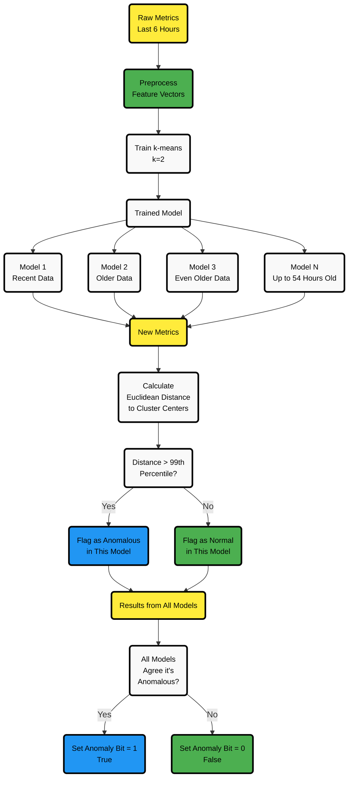

# Machine Learning Anomaly Detection

Netdata uses k-means clustering to detect anomalies for each collected metric automatically.

The system maintains 18 models per metric, each trained on 6-hour windows at 3-hour intervals, providing approximately 54 hours of rolling behavioral patterns. Anomaly detection occurs in real-time during data collection - a data point is flagged as anomalous only when all 18 models reach consensus, effectively eliminating noise while maintaining sensitivity to genuine issues.

Anomaly bits are stored alongside metric data in the time-series database, with the same retention period. The query engine calculates anomaly rates dynamically during data aggregation, exposing anomaly information on every chart without additional overhead.

A dedicated process correlates anomalies across all metrics within each node, generating real-time node-level anomaly charts. This correlation data feeds into Netdata's scoring engine - a specialized query system that can evaluate thousands of metrics simultaneously and return an ordered list ranked by anomaly severity, powering the Anomaly Advisor for rapid root cause analysis.

## System Characteristics

| Aspect | Implementation | Benefit |
|--------|----------------|---------|
| **Algorithm** | Unsupervised k-means clustering (k=2) via [dlib](https://github.com/davisking/dlib) | No manual training or labeled data required |
| **Model Architecture** | rolling 18 models per metric, 3-hour staggered training | Eliminates 99% of false positives through consensus |
| **Processing Location** | Edge computation on each Netdata agent | No cloud dependency, no data egress |
| **Resource Usage** | ~18KB RAM per metric, 2-4% of a single CPU for 10k metrics | Predictable linear scaling |
| **Configuration** | Zero-configuration with automatic adaptation | Works instantly on any metric type |
| **Detection Latency** | Real-time during data collection | Anomalies flagged within 1 second |
| **Historical Storage** | Anomaly bit embedded in metric storage | No additional storage overhead |
| **Query Performance** | On-the-fly anomaly rate calculation | No pre-aggregation needed |
| **Time-series Integrity** | Immutable anomaly history | No hindsight bias - shows what was detectable THEN |
| **Coverage** | Every metric, every dimension | No sampling, no blind spots |
| **Correlation Engine** | Real-time anomaly correlation across metrics | Powers Anomaly Advisor for root cause analysis |
| **Alert Philosophy** | Investigation aid, not alert source | Reduces alert fatigue |

:::note
Netdata avoids deep learning models to maintain lightweight operation on any Linux system. The entire ML system is designed to run efficiently without specialized hardware or dependencies.
:::

## Types of Anomalies Detected

| Anomaly Type             | Description                                                       | Business Impact                          |
|--------------------------|-------------------------------------------------------------------|------------------------------------------|
| **Point Anomalies**      | Unusually high or low values compared to historical data          | Early warning of service degradation     |
| **Contextual Anomalies** | Sequences of values that deviate from expected patterns           | Identification of unusual usage patterns |
| **Collective Anomalies** | Multivariate anomalies where a combination of metrics appears off | Detection of complex system issues       |
| **Concept Drifts**       | Gradual shifts leading to a new baseline                          | Recognition of evolving system behavior  |
| **Change Points**        | Sudden shifts resulting in a new normal state                     | Identification of system changes         |

## Technical Deep Dive: How Netdata ML Works



### Training & Detection Process

When you enable ML, Netdata trains an unsupervised model for each of your metrics. By default, this model is a [k-means clustering](https://en.wikipedia.org/wiki/K-means_clustering) algorithm (with k=2) trained on the last 6 hours of your data. Instead of just analyzing raw values, the model works with preprocessed feature vectors to improve your detection accuracy.

:::important
To reduce false positives in your environment, Netdata trains multiple models per time-series, covering over two days of data. **An anomaly is flagged only if all models agree on it, eliminating 99% of false positives**. This approach of requiring consensus across models trained on different time scales makes the system highly resistant to spurious anomalies while still being sensitive to real issues.
:::

The anomaly detection algorithm uses the [Euclidean distance](https://en.wikipedia.org/wiki/Euclidean_distance) between recent metric patterns and the learned cluster centers. If this distance exceeds a threshold based on the 99th percentile of training data, that model considers the metric anomalous.

### The Anomaly Bit

Each trained model assigns an **anomaly score** at every time step based on how far your data deviates from learned clusters. If the score exceeds the 99th percentile of training data, the **anomaly bit** is set to `true` (100); otherwise, it remains `false` (0).

**Key benefits you'll experience:**

- No additional storage overhead since the anomaly bit is embedded in Netdata's floating point number format
- The query engine automatically computes anomaly rates without requiring extra queries

:::note
The anomaly bit is quite literally a bit in Netdata's [internal storage representation](https://github.com/netdata/netdata/blob/89f22f056ca2aae5d143da9a4e94fcab1f7ee1b8/libnetdata/storage_number/storage_number.c#L83). This ingenious design means that for every metric collected, Netdata can also track whether it's anomalous without increasing storage requirements.
:::

You can access the anomaly bits through Netdata's API by adding the `options=anomaly-bit` parameter to your query. For example:

```
https://your-node/api/v3/data?chart=system.cpu&dimensions=user&after=-10&options=anomaly-bit
```

This would return anomaly bits for the last 10 seconds of CPU user data, with values of either 0 (normal) or 100 (anomalous).

### Anomaly Rate Calculations

You can see **Node Anomaly Rate (NAR)** and **Dimension Anomaly Rate (DAR)** calculated based on anomaly bits. Here's an example matrix:

| Time    | d1      | d2      | d3      | d4      | d5      | **NAR**               |
|---------|---------|---------|---------|---------|---------|-----------------------|
| t1      | 0       | 0       | 0       | 0       | 0       | **0%**                |
| t2      | 0       | 0       | 0       | 0       | 100     | **20%**               |
| t3      | 0       | 0       | 0       | 0       | 0       | **0%**                |
| t4      | 0       | 100     | 0       | 0       | 0       | **20%**               |
| t5      | 100     | 0       | 0       | 0       | 0       | **20%**               |
| t6      | 0       | 100     | 100     | 0       | 100     | **60%**               |
| t7      | 0       | 100     | 0       | 100     | 0       | **40%**               |
| t8      | 0       | 0       | 0       | 0       | 100     | **20%**               |
| t9      | 0       | 0       | 100     | 100     | 0       | **40%**               |
| t10     | 0       | 0       | 0       | 0       | 0       | **0%**                |
| **DAR** | **10%** | **30%** | **20%** | **20%** | **30%** | **_NAR_t1-10 = 22%_** |

- **DAR (Dimension Anomaly Rate):** Average anomalies for a specific metric over time
- **NAR (Node Anomaly Rate):** Average anomalies across all metrics at a given time
- **Overall anomaly rate:** Computed across your entire dataset for deeper insights

### Node-Level Anomaly Detection

Netdata tracks the percentage of anomaly bits over time for you. When the **Node Anomaly Rate (NAR)** exceeds a set threshold and remains high for a period, a **node anomaly event** is triggered. These events are recorded in the `new_anomaly_event` dimension on the `anomaly_detection.anomaly_detection` chart.

## Available Documentation

- **[ML Configuration](/src/ml/ml-configuration.md)** - Configuration and tuning guide
- **[Metric Correlations](/docs/metric-correlations.md)** - Finding related metrics during incidents

## Viewing Anomaly Data in Your Netdata Dashboard

Once you enable ML, you'll have access to an **Anomaly Detection** menu with key charts:

- **`anomaly_detection.dimensions`**: Number of dimensions flagged as anomalous
- **`anomaly_detection.anomaly_rate`**: Percentage of anomalous dimensions
- **`anomaly_detection.anomaly_detection`**: Flags (0 or 1) indicating when an anomaly event occurs

These insights help you quickly assess potential issues and take action before they escalate.

## Operational Details

### Why 18 Models?

The number 18 balances three competing requirements:

1. **Incremental learning efficiency** - Training 48 hours of data every 3 hours would waste computational resources. Instead, each model trains on just 6 hours of data, with only one new model created every 3 hours.

2. **Adaptive memory duration** - When an anomaly occurs, the newest model will learn it as "normal" within 3 hours. The system gradually "forgets" this pattern as older models are replaced. With 18 models at 3-hour intervals, complete forgetting takes 54 hours (2.25 days).

3. **Consensus noise reduction** - Multiple models voting together eliminate random fluctuations. 18 models provide strong consensus without excessive memory use.

This creates a sliding window memory: recent anomalies become "normal" quickly (within 3 hours for the newest model), while the full consensus takes 54 hours to completely forget an anomalous pattern. This balance prevents both alert fatigue from repeated anomalies and blindness to recurring issues.

### How Netdata Minimizes Training CPU Impact

ML typically doubles the agent's CPU usage - from ~2% to ~4% of a single core. This efficiency comes from several optimizations:

1. **Smart metric filtering** - Metrics with constant or fixed values are automatically excluded from training, eliminating wasted computation on unchanging data.

2. **Incremental training windows** - Each model trains on only 6 hours of data instead of the full 54-hour history, reducing computational requirements by ~90%.

3. **Even training distribution** - The agent dynamically throttles model training to spread the work evenly across each 3-hour window, preventing CPU spikes. With 10,000 metrics, this means training ~1 model per second instead of training 10,000 models in a burst.

4. **Distributed intelligence** - Child agents stream both trained models and anomaly bits to parent agents along with metric data. Parents receive pre-computed ML results, requiring zero additional ML computation for aggregated views.

This design ensures ML remains lightweight enough to run on production systems without impacting primary workloads.

**Dynamic prioritization**: ML automatically throttles or even pauses training during:

- Heavy query load - ensuring dashboards remain responsive
- Parent-child reconnections - prioritizing metric replication
- Any resource contention - backing off to protect core monitoring

Under these conditions, ML will completely stop training new models to ensure:

- User queries remain fast and responsive
- Metric streaming completes quickly after network interruptions
- Overall CPU and I/O consumption stays within bounds

This means ML is truly a background process - it uses spare cycles but immediately yields resources when needed for operational tasks.

### Storage Impact

ML has **zero storage overhead** in the time-series database. The anomaly bit uses a previously unused bit in the existing sample storage format - no schema changes or storage expansion required.

The only storage impact comes from persisting trained models to disk for survival across restarts:

- Model files are small compared to the time-series data
- Negligible impact on overall storage requirements
- Models are retained only for active metrics

This means you can enable ML without provisioning additional storage capacity. Anomaly history is retained for the same period as your metrics, with no extra space required.

**Query performance impact: None**. The anomaly bit is loaded together with metric data in a single disk read - no additional I/O operations required. Querying metrics with anomaly data has the same disk I/O pattern as querying metrics without ML.

### Cold Start Behavior

On a freshly installed agent, ML begins detecting anomalies within 10 minutes. However, early detection has important characteristics:

**Timeline:**

- **0-10 minutes**: Collecting initial data, no anomaly detection
- **10+ minutes**: First models trained, anomaly detection begins with high sensitivity
- **3 hours**: First model rotation, improved accuracy
- **54 hours**: Full model set established, optimal detection accuracy

**What to expect:**

- Initial hours show more anomalies due to limited training data
- False positive rate decreases as models accumulate more behavioral patterns
- Each 3-hour cycle improves detection quality
- After 2-3 days, the system reaches steady-state accuracy

**Operational tip**: During the first 48 hours after deployment, expect elevated anomaly rates. This is normal as the system learns your infrastructure's patterns. Use this period to observe ML behavior but avoid making critical decisions based solely on early anomaly detection.

## Getting Started

ML is enabled by default in recent Netdata versions. To use anomaly detection:

1. **View anomaly ribbons** - Purple overlays on all charts show anomaly rates
2. **Access Anomaly Advisor** - Click the Anomalies tab for guided troubleshooting
3. **Query historical anomalies** - Use the query engine to analyze past incidents

[Learn more about the Anomaly Advisor →](/docs/ml-ai/anomaly-advisor.md)
