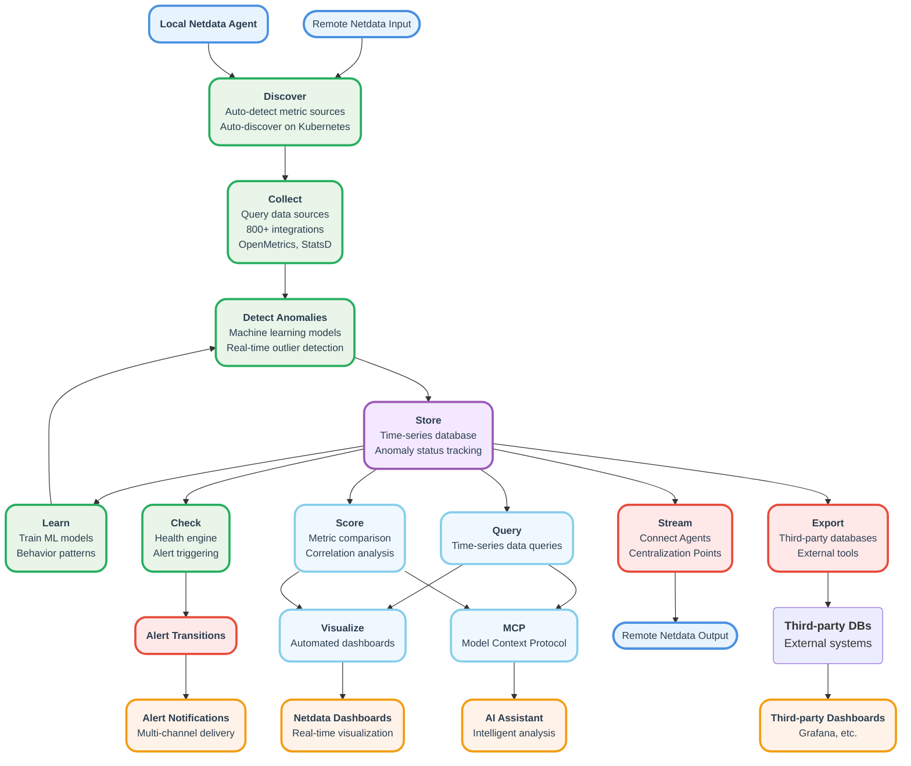

# Netdata Agent

The Netdata Agent is the main building block in the Netdata ecosystem. You install it on all monitored systems to monitor system components, containers and applications.

The Netdata Agent is an **observability pipeline in a box** that you can either operate standalone, or blend into a bigger pipeline made by more Netdata Agents (Children and Parents).

## Distributed Observability Pipeline

Your Netdata observability pipeline looks like in the following graph.

You can extend the pipeline by creating Metrics Observability Centralization Points that are linked all together (`from a remote Netdata`, `to a remote Netdata`), so that all Netdata you install become a vast integrated observability pipeline.

<strong>Click to see visual representation of the observability pipeline</strong>
 

 

1. **Discover**: You can auto-detect metric sources on localhost and auto-discover metric sources on Kubernetes.
2. **Collect**: Query data sources to collect metric samples, using the optimal protocol for each data source. You get 800+ integrations supported, including dozens of native application protocols, OpenMetrics and StatsD.
3. **Detect Anomalies**: Use the trained machine learning models for each metric to detect in real-time if each sample collected is an outlier (an anomaly), or not.
4. **Store**: Keep collected samples and their anomaly status, in the time-series database (database mode `dbengine`) or a ring buffer (database modes `ram` and `alloc`).
5. **Learn**: Train multiple machine learning models for each metric collected, learning behaviors and patterns for detecting anomalies.
6. **Check**: A health engine, triggering alerts and sending notifications. Netdata comes with hundreds of alert configurations that are automatically attached to metrics when they get collected, detecting errors, common configuration errors and performance issues.
7. **Query**: A query engine for querying time-series data.
8. **Score**: A scoring engine for comparing and correlating metrics.
9. **Stream**: A mechanism to connect Netdata Agents and build Metrics Centralization Points (Netdata Parents).
10. **Visualize**: Netdata's fully automated dashboards for all metrics.
11. **Export**: Export metric samples to third party time-series databases, enabling you to use third party tools for visualization, like Grafana.

## Comparison to Other Observability Solutions

| Aspect | Traditional Solutions | Netdata |
|--------|----------------------|---------|
| **Architecture** | Multiple components (metrics exporters, time-series databases, visualization engines) requiring separate maintenance | One integrated package with everything included, even for Metrics Centralization Points |
| **Setup & Configuration** | Manual configuration and setup required | Fully automated with comprehensive dashboards and alerts available instantly with zero configuration |
| **Monitoring Fidelity** | Variable granularity depending on configuration | Console-level granularity and fidelity, plus holistic monitoring tools like [Top Monitoring](/docs/top-monitoring-netdata-functions.md) |
| **System Impact** | Higher CPU usage, RAM utilization, and execution time impact on monitored systems | Minimal impact on monitored systems and applications, verified by [independent studies](https://www.ivanomalavolta.com/files/papers/ICSOC_2023.pdf) |
| **Energy Efficiency** | Higher energy consumption | [Most energy efficient monitoring tool](https://twitter.com/IMalavolta/status/1734208439096676680) according to University of Amsterdam research |

## Dashboard Versions

Your Netdata Agents (Standalone, Children and Parents) **share the dashboard** of Netdata Cloud. However, when you are logged in and your Agent is connected to the Cloud, the following are enabled (which are otherwise disabled):

1. **Access to Sensitive Data**: Some data, like systemd-journal logs and several [Top Monitoring](/docs/top-monitoring-netdata-functions.md) features expose sensitive data, like IPs, ports, process command lines and more. To access all these when the dashboard is served directly from an Agent, Netdata Cloud is required to verify that you have the required permissions to access the dashboard.

2. **Dynamic Configuration**: You can configure Netdata Agents via configuration files, manually or through some provisioning system. The latest Netdata includes a feature to allow you to change some configurations (collectors, alerts) via the dashboard. This feature is only available to you if you have a paid Netdata Cloud plan.