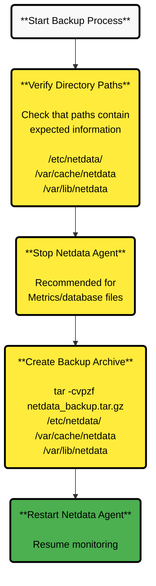

 Agent data including configuration, metrics, and identity files for disaster recovery scenarios.

:::

:::important

**User Responsibility**

Users are responsible for backing up, recovering, and ensuring their data's availability because Netdata stores data locally on each system due to its decentralized architecture.

:::

## Introduction

When planning a Netdata Agent backup, it's essential to recognize the types of data that can be backed up, either individually or collectively:

| Data type           | Description                                          | Location                                                        |
|---------------------|------------------------------------------------------|-----------------------------------------------------------------|
| Agent configuration | Files controlling configuration of the Netdata Agent | [config directory](/docs/netdata-agent/configuration/README.md) |
| Metrics             | Database files                                       | /var/cache/netdata                                              |
| Identity            | Claim token, API key and some other files            | /var/lib/netdata                                                |

## Backup and Restore Scenarios

<details>
<summary><strong>Backing up to restore data in case of a node failure</strong></summary><br/>

In this standard scenario, you're backing up your Netdata Agent in case of a node failure or data corruption so that the metrics and the configuration can be recovered. The purpose is not to backup/restore the application itself.

### Backup Process



1. **Verify directory paths**

   Verify that the directory paths in the table above contain the information you expect.

   :::note
   
   **Path Variations**
   
   The specific paths may vary depending on installation method, Operating System, and whether it is a Docker/Kubernetes deployment.
   
   :::

2. **Stop the Netdata Agent**

   It is recommended that you [stop the Netdata Agent](/docs/netdata-agent/start-stop-restart.md) when backing up the Metrics/database files. Backing up the Agent configuration and Identity folders is straightforward as they shouldn't be changing very frequently.

3. **Create backup archive**

   Using a backup tool such as `tar` you will need to run the backup as _root_ or as the _netdata_ user to access all the files in the directories.

   ```bash
   sudo tar -cvpzf netdata_backup.tar.gz /etc/netdata/ /var/cache/netdata /var/lib/netdata
   ```

   Stopping the Netdata Agent is typically necessary to back up the database files of the Netdata Agent.

### Minimizing Service Interruption

If you want to minimize the gap in metrics caused by stopping the Netdata Agent, consider implementing a backup job or script that follows this sequence:

- Backup the Agent configuration Identity directories
- Stop the Netdata service
- Backup up the database files
- Restart the Netdata Agent.

<br/>
</details>

<details>
<summary><strong>Restoring Netdata</strong></summary><br/>

### Restoration Process

1. **Prepare for restoration**

   Ensure that the Netdata Agent is installed and is [stopped](/docs/netdata-agent/start-stop-restart.md)

   If you plan to deploy the Agent and restore a backup on top of it, then you might find it helpful to use the [`--dont-start-it`](/packaging/installer/methods/kickstart.md#other-options) option upon installation.

   ```bash
   wget -O /tmp/netdata-kickstart.sh https://get.netdata.cloud/kickstart.sh && sh /tmp/netdata-kickstart.sh --dont-start-it
   ```

   :::warning
   
   **Database File Restoration**
   
   If you are going to restore the database files, then you should first ensure that the Metrics directory is empty.

   ```bash
   sudo rm -Rf /var/cache/netdata
   ```
   
   :::

2. **Restore from backup archive**

    ```bash
    sudo tar -xvpzf /path/to/netdata_backup.tar.gz -C /
    ```

3. **Start the Netdata Agent**

   [Start the Netdata Agent](/docs/netdata-agent/start-stop-restart.md)

<br/>
</details>

