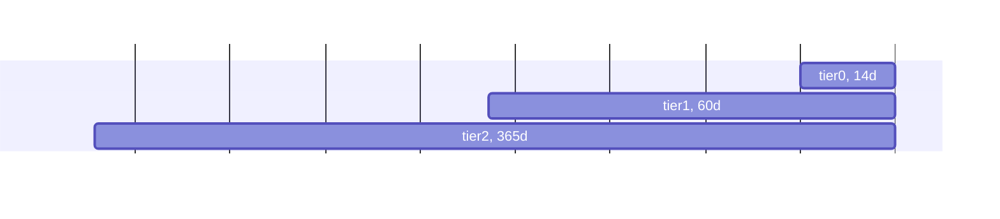

# Disk Requirements &amp; Retention

## Database Modes and Tiers

Netdata comes with 3 database modes:

1. `dbengine`: the default high-performance multi-tier database of Netdata. Metric samples are cached in memory and are saved to disk in multiple tiers, with compression.
2. `ram`: metric samples are stored in ring buffers in memory, with increments of 1024 samples. Metric samples are not committed to disk. Kernel-Same-Page (KSM) can be used to deduplicate Netdata's memory.
3. `alloc`: metric samples are stored in ring buffers in memory, with flexible increments. Metric samples are not committed to disk.

## `ram` and `alloc`

Modes `ram` and `alloc` can help when Netdata should not introduce any disk I/O at all. In both of these modes, metric samples exist only in memory, and only while they are collected.

When Netdata is configured to stream its metrics to a Metrics Observability Centralization Point (a Netdata Parent), metric samples are forwarded in real-time to that Netdata Parent. The ring buffers available in these modes is used to cache the collected samples for some time, in case there are network issues, or the Netdata Parent is restarted for maintenance.

The memory required per sample in these modes, is 4 bytes:

- `ram` mode uses `mmap()` behind the scene, and can be incremented in steps of 1024 samples (4KiB). Mode `ram` allows the use of the Linux kernel memory dedupper (Kernel-Same-Page or KSM) to deduplicate Netdata ring buffers and save memory.
- `alloc` mode can be sized for any number of samples per metric. KSM cannot be used in this mode.

To configure database mode `ram` or `alloc`, in `netdata.conf`, set the following:

- `[db].mode` to either `ram` or `alloc`.
- `[db].retention` to the number of samples the ring buffers should maintain. For `ram` if the value set is not a multiple of 1024, the next multiple of 1024 will be used.

## `dbengine`

`dbengine` supports up to 5 tiers. By default, 3 tiers are used, like this:

|   Tier   |                                          Resolution                                          | Uncompressed Sample Size |
|:--------:|:--------------------------------------------------------------------------------------------:|:------------------------:|
| `tier0`  |            native resolution (metrics collected per-second as stored per-second)             |         4 bytes          |
| `tier1`  | 60 iterations of `tier0`, so when metrics are collected per-second, this tier is per-minute. |         16 bytes         |
| `tier2`  |  60 iterations of `tier1`, so when metrics are collected per second, this tier is per-hour.  |         16 bytes         |

Data are saved to disk compressed, so the actual size on disk varies depending on compression efficiency.

`dbegnine` tiers are overlapping, so higher tiers include a down-sampled version of the samples in lower tiers:



## Disk Space and Metrics Retention

You can find information about the current disk utilization of a Netdata Parent, at <http://agent-ip:19999/api/v2/info>. The output of this endpoint is like this:

```json
{
  // more information about the agent
  // near the end:
  "db_size": [
    {
      "tier": 0,
      "disk_used": 1677528462156,
      "disk_max": 1677721600000,
      "disk_percent": 99.9884881,
      "from": 1706201952,
      "to": 1707401946,
      "retention": 1199994,
      "expected_retention": 1200132,
      "currently_collected_metrics": 2198777
    },
    {
      "tier": 1,
      "disk_used": 838123468064,
      "disk_max": 838860800000,
      "disk_percent": 99.9121032,
      "from": 1702885800,
      "to": 1707401946,
      "retention": 4516146,
      "expected_retention": 4520119,
      "currently_collected_metrics": 2198777
    },
    {
      "tier": 2,
      "disk_used": 334329683032,
      "disk_max": 419430400000,
      "disk_percent": 79.710408,
      "from": 1679670000,
      "to": 1707401946,
      "retention": 27731946,
      "expected_retention": 34790871,
      "currently_collected_metrics": 2198777
    }
  ]
}
```

In this example:

- `tier` is the database tier.
- `disk_used` is the currently used disk space in bytes.
- `disk_max` is the configured max disk space in bytes.
- `disk_percent` is the current disk space utilization for this tier.
- `from` is the first (oldest) timestamp in the database for this tier.
- `to` is the latest (newest) timestamp in the database for this tier.
- `retention` is the current retention of the database for this tier, in seconds (divide by 3600 for hours, divide by 86400 for days).
- `expected_retention` is the expected retention in seconds when `disk_percent` will be 100 (divide by 3600 for hours, divide by 86400 for days).
- `currently_collected_metrics` is the number of unique time-series currently being collected for this tier.

The estimated number of samples on each tier can be calculated as follows:

```
estimasted number of samples = retention / sample duration * currently_collected_metrics
```

So, for our example above:

|  Tier   | Sample Duration (seconds) | Estimated Number of Samples | Disk Space Used | Current Retention (days) | Expected Retention (days) | Bytes Per Sample |
|:-------:|:-------------------------:|:---------------------------:|:---------------:|:------------------------:|:-------------------------:|:----------------:|
| `tier0` |             1             |    2.64 trillion samples    |    1.56 TiB     |           13.8           |           13.9            |       0.64       |
| `tier1` |            60             |    165.5 billion samples    |     780 GiB     |           52.2           |           52.3            |       5.01       |
| `tier2` |           3600            |    16.9 billion samples     |     311 GiB     |          320.9           |           402.7           |      19.73       |

Note: as you can see in this example, the disk footprint per sample of `tier2` is bigger than the uncompressed sample size (19.73 bytes vs 16 bytes). This is due to the fact that samples are organized into pages and pages into extents. When Netdata is restarted frequently, it saves all data prematurely, before filling up entire pages and extents, leading to increased overheads per sample.

To configure retention, in `netdata.conf`, set the following:

- `[db].mode` to `dbengine`.
- `[db].dbengine multihost disk space MB`, this is the max disk size for `tier0`. The default is 256MiB.
- `[db].dbengine tier 1 multihost disk space MB`, this is the max disk space for `tier1`. The default is 50% of `tier0`.
- `[db].dbengine tier 2 multihost disk space MB`, this is the max disk space for `tier2`. The default is 50% of `tier1`.
