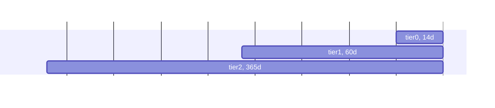

# Disk Requirements &amp; Retention

## Database Modes and Tiers

Netdata offers two database modes to suit your needs for performance and data persistence:

|        Mode        | Description                                                                                                                                                                                                                            |
|:------------------:|----------------------------------------------------------------------------------------------------------------------------------------------------------------------------------------------------------------------------------------|
| dbengine (default) | High-performance, multi-tier storage with compression. Metric samples are cached in memory and then written to disk in multiple tiers for efficient retrieval and long-term storage.                                                   |
|        ram         | In-memory storage. Metric samples are stored in memory only, and older data is overwritten as new data arrives. This mode prioritizes speed, making it ideal for Netdata Child instances that stream data to a central Netdata parent. |

## `dbengine`

Netdata's `dbengine` mode efficiently stores data on disk using compression. The actual disk space used depends on how well the data compresses.
This mode uses a tiered storage approach: data is saved in multiple tiers on disk. Each tier retains data at a different resolution (detail level). Higher tiers store a down-sampled (less detailed) version of the data found in lower tiers.

`dbengine` supports up to five tiers. By default, three tiers are used:

|  Tier   |                                          Resolution                                          | Uncompressed Sample Size | Usually On Disk |
|:-------:|:--------------------------------------------------------------------------------------------:|:------------------------:|:---------------:|
| `tier0` |            native resolution (metrics collected per-second as stored per-second)             |         4 bytes          |    0.6 bytes    |
| `tier1` | 60 iterations of `tier0`, so when metrics are collected per-second, this tier is per-minute. |         16 bytes         |     6 bytes     |
| `tier2` |  60 iterations of `tier1`, so when metrics are collected per second, this tier is per-hour.  |         16 bytes         |    18 bytes     |

**Configuring dbengine mode and retention**:

- Enable dbengine mode: The dbengine mode is already the default, so no configuration change is necessary. For reference, the dbengine mode can be configured by setting `[db].mode` to `dbengine` in `netdata.conf`.
- Adjust retention (optional): see [Change how long Netdata stores metrics](/src/database/CONFIGURATION.md#tiers).

## `ram`

`ram` mode can help when Netdata shouldn’t introduce any disk I/O at all. In both of these modes, metric samples exist only in memory, and only while they’re collected.

When Netdata is configured to stream its metrics to a Metrics Observability Centralization Point (a Netdata Parent), metric samples are forwarded in real-time to that Netdata Parent. The ring buffers available in these modes are used to cache the collected samples for some time, in case there are network issues, or the Netdata Parent is restarted for maintenance.

The memory required per sample in these modes, is four bytes: `ram` mode uses `mmap()` behind the scene, and can be incremented in steps of 1024 samples (4KiB). Mode `ram` allows the use of the Linux kernel memory dedupper (Kernel-Same-Page or KSM) to deduplicate Netdata ring buffers and save memory.

**Configuring ram mode and retention**:

- Enable ram mode: To use in-memory storage, set `[db].mode` to ram in your `netdata.conf` file. Remember, this mode won't retain historical data after restarts.
- Adjust retention (optional): While ram mode focuses on real-time data, you can optionally control the number of samples stored in memory. Set `[db].retention` in `netdata.conf` to the desired number in seconds. Note: If the value you choose isn't a multiple of 1024, Netdata will automatically round it up to the nearest multiple.
