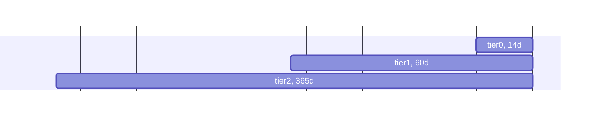

# Disk Requirements &amp; Retention

## Database Modes and Tiers

Netdata offers two database modes to suit your needs for performance and data persistence:

|        Mode        | Description                                                                                                                                                                                                                            |
|:------------------:|----------------------------------------------------------------------------------------------------------------------------------------------------------------------------------------------------------------------------------------|
| dbengine (default) | High-performance, multi-tier storage with compression. Metric samples are cached in memory and then written to disk in multiple tiers for efficient retrieval and long-term storage.                                                   |
|        ram         | In-memory storage. Metric samples are stored in memory only, and older data is overwritten as new data arrives. This mode prioritizes speed, making it ideal for Netdata Child instances that stream data to a central Netdata parent. |

## `dbengine`

Netdata's `dbengine` mode efficiently stores data on disk using compression. The actual disk space used depends on how well the data compresses.
This mode uses a tiered storage approach: data is saved in multiple tiers on disk. Each tier retains data at a different resolution (detail level). Higher tiers store a down-sampled (less detailed) version of the data found in lower tiers.

```mermaid
gantt
    dateFormat  YYYY-MM-DD
    tickInterval 1week
    axisFormat    
    todayMarker off
    tier0, 14d       :a1, 2023-12-24, 7d
    tier1, 60d       :a2, 2023-12-01, 30d
    tier2, 365d      :a3, 2023-11-02, 59d
```

`dbengine` supports up to five tiers. By default, three tiers are used:

|  Tier   |                                          Resolution                                          | Uncompressed Sample Size | Usually On Disk |
|:-------:|:--------------------------------------------------------------------------------------------:|:------------------------:|:---------------:|
| `tier0` |            native resolution (metrics collected per-second as stored per-second)             |         4 bytes          |    0.6 bytes    |
| `tier1` | 60 iterations of `tier0`, so when metrics are collected per-second, this tier is per-minute. |         16 bytes         |     6 bytes     |
| `tier2` |  60 iterations of `tier1`, so when metrics are collected per second, this tier is per-hour.  |         16 bytes         |    18 bytes     |

### Default Disk Footprint

Netdata Agent metrics storage is limited to 3 GiB by default (configurable), using 1 GiB per tier × 3 tiers. In total, with SQLite databases, alert transitions, and other metadata, expect about 4 GiB of disk usage under normal conditions. The default retention limits are:

|  Tier   | Resolution | Size Limit | Time Limit |
|:-------:|:----------:|:----------:|:----------:|
| `tier0` | per-second |   1 GiB    |  14 days   |
| `tier1` | per-minute |   1 GiB    |  3 months  |
| `tier2` |  per-hour  |   1 GiB    |  2 years   |

Data is deleted when retention enforcement detects that **either** the size limit or the time limit has been reached, whichever comes first. Retention is enforced asynchronously — dbengine evaluates quotas and schedules rotation both on a background timer and after normal activity (such as extent writes), deleting whole datafiles until the retention check no longer reports the tier over its limit. Actual disk usage may temporarily exceed the configured size limit. The number of metrics collected determines how far back in time retention extends within the size limit.

In practice, with default settings and an ingestion rate of about 4,000 metrics per second, Netdata provides about 14 days of high resolution (per-second) data, 3 months of medium resolution (per-minute) data, and more than 1 year of low resolution (per-hour) data.

These limits are fully configurable. See [Changing how long Netdata stores metrics](/src/database/CONFIGURATION.md#tiers).

### Understanding Actual Disk Usage vs Configured Retention Size

The configured `dbengine tier N retention size` sets the target disk cap for that tier. Netdata enforces this cap using an *estimated* per-tier disk usage figure, not just compressed metric samples. The estimate includes the tier’s `.ndf/.njf/.njfv2` footprint, the expected final size of the currently-active datafile, and a per-tier share of global database metadata (tracked internally via `disk_percentage`). A tier’s dbengine directory usage is typically the sum of:
Journal file sizes depend on metric cardinality — the number of unique metrics stored in each datafile. The more distinct metrics per datafile, the larger the journal indexes. On a Netdata Parent receiving streams from many Children, datafiles and indexes can accumulate metrics from many hosts over time. This increases aggregate cardinality and can make journal files proportionally larger than on a standalone Agent.

#### Retention Size is Per-Tier, Not Per-Host

The `dbengine tier N retention size` setting applies to the whole tier. All streaming Children share the Parent's tier quota. There is **no per-host or per-Child disk space limit**. When sizing retention for a Parent, use the total metric count across all Children and leave room for both data and journal overhead.

#### Parent-Specific Sizing Guidance

On Parent nodes with many streaming Children (100+), journal files can be significantly larger because per-tier journal/index overhead grows with aggregate metric cardinality across hosts. To effectively limit disk usage on a Parent:

1. Calculate the expected data-only size based on total metrics from **all** Children combined.
2. Account for journal file overhead, which grows with metric cardinality per datafile. On Parents with many Children, total disk usage per tier can be several times the data-only size.
3. Consider adding a `dbengine tier N retention time` limit alongside the size limit. The time limit provides a secondary enforcement mechanism that rotates out datafiles whose data exceeds the configured time window.

### Disk Retention FAQ

Netdata does not automatically change retention targets based on free disk space; retention is governed by your configured size/time limits. If you disable both limits (size = 0 and time = 0), disk usage can grow until the filesystem fills.

**Will adding a time-based retention limit trigger immediate cleanup?**

It can. After you configure `dbengine tier N retention time`, the retention check (about every 60 seconds) rotates out eligible datafiles when data older than the configured window exists. Cleanup starts on the next retention check cycle after the change takes effect; it is not instantaneous.

**Is there a per-Child disk space limit?**

No. All retention size settings are per-tier and shared across all hosts. There is no configuration to limit how much disk space an individual streaming Child can consume on the Parent. To control per-Child impact, reduce the Child's collection scope or otherwise reduce the volume and cardinality of the metrics it streams to the Parent.

**When a Child streams to a Parent, where are metrics stored?**

There are two independent storage behaviors:

- **On the Child (local):** Controlled by the Child's `[db].mode` (`dbengine` keeps local disk history, `ram` keeps in-memory history only, `none` keeps no local metric history).
- **On the Parent (received stream):** Controlled by the Parent's settings. Metrics streamed from Children can be persisted on the Parent and count against the Parent's per-tier retention limits.

**Configuring dbengine mode and retention**:

- Enable dbengine mode: The dbengine mode is already the default, so no configuration change is necessary. For reference, the dbengine mode can be configured by setting `[db].mode` to `dbengine` in `netdata.conf`.
- Adjust retention (optional): see [Change how long Netdata stores metrics](/src/database/CONFIGURATION.md#tiers).

## `ram`

`ram` mode can help when Netdata shouldn’t introduce any disk I/O at all. In both of these modes, metric samples exist only in memory, and only while they’re collected.

When Netdata is configured to stream its metrics to a Metrics Observability Centralization Point (a Netdata Parent), metric samples are forwarded in real-time to that Netdata Parent. The ring buffers available in these modes are used to cache the collected samples for some time, in case there are network issues, or the Netdata Parent is restarted for maintenance.

The memory required per sample in these modes, is four bytes: `ram` mode uses `mmap()` behind the scene, and can be incremented in steps of 1024 samples (4KiB). Mode `ram` allows the use of the Linux kernel memory dedupper (Kernel-Same-Page or KSM) to deduplicate Netdata ring buffers and save memory.

**Configuring ram mode and retention**:

- Enable ram mode: To use in-memory storage, set `[db].mode` to ram in your `netdata.conf` file. Remember, this mode won't retain historical data after restarts.
- Adjust retention (optional): While ram mode focuses on real-time data, you can optionally control the number of samples stored in memory. Set `[db].retention` in `netdata.conf` to the desired number in seconds. Note: If the value you choose isn't a multiple of 1024, Netdata will automatically round it up to the nearest multiple.
