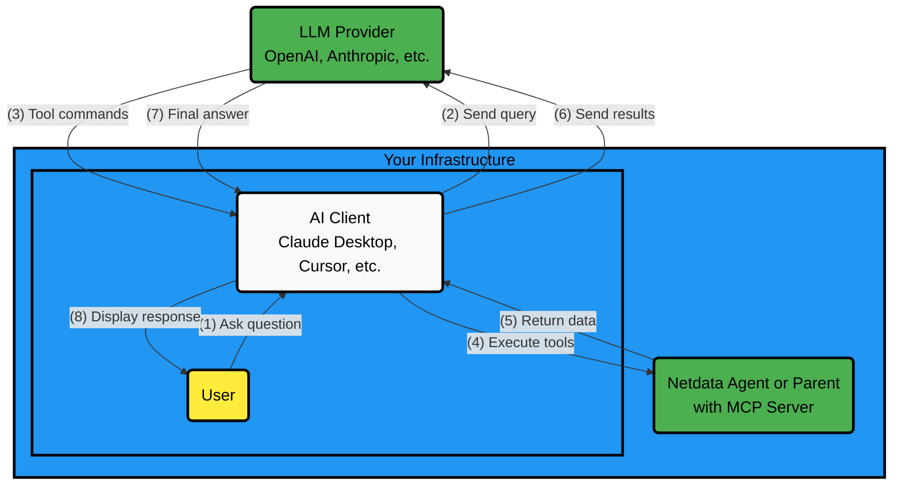
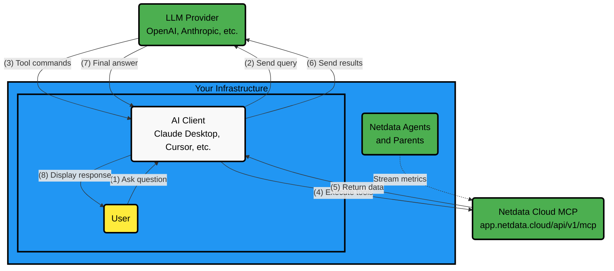

# AI Chat with Netdata

Chat with your infrastructure using natural language through two distinct integration architectures.

## Integration Architecture

### Method 1: Connect to a Local Agent or Parent

**How it works:**

1. You ask a question to your AI client
2. LLM responds with tool execution commands
3. Your AI client executes tools against Netdata Agent MCP (locally)
4. Your AI client sends tool responses back to LLM
5. LLM provides the final answer

**Key characteristics:**

- Your AI client orchestrates all communication
- Netdata Agent MCP runs locally on your infrastructure
- No internet access required for Netdata Agent
- Full control over data flow and privacy

### Method 2: Connect to Netdata Cloud

**How it works:**

1. You ask a question to your AI client
2. Your AI client sends the query to the LLM
3. LLM responds with tool execution commands
4. Your AI client executes tools against
   Netdata Cloud MCP (over the internet)
5. Netdata Cloud MCP returns the data
6. Your AI client sends tool responses back to LLM
7. LLM provides the final answer
8. Your AI client displays the response

**Key characteristics:**

- Same client-controlled architecture as Method 1, but with a cloud-hosted MCP endpoint
- No direct network access to Netdata Agents required
- Complete visibility across all nodes in your infrastructure
- Any MCP-aware client can connect

## Quick Comparison

| Aspect | Method 1: Local Agent/Parent | Method 2: Netdata Cloud |
|--------|---------------------------|---------------------|
| **Setup Complexity** | Moderate (configure AI client + local MCP) | Simple (configure AI client + cloud endpoint) |
| **Data Privacy** | Depends on LLM provider | Depends on LLM provider |
| **Internet Requirements** | AI client needs internet, MCP is local | Both AI client and MCP need internet |
| **Supported AI Clients** | Any MCP-aware client | Any MCP-aware client |
| **Infrastructure Access** | One Agent or Parent's scope | All infrastructure |
| **Network Access** | Direct access to Netdata IP | No firewall changes |

To get started with Method 2, see
[Netdata Cloud MCP](/docs/netdata-ai/mcp/README.md#netdata-cloud-mcp)
for setup instructions.
