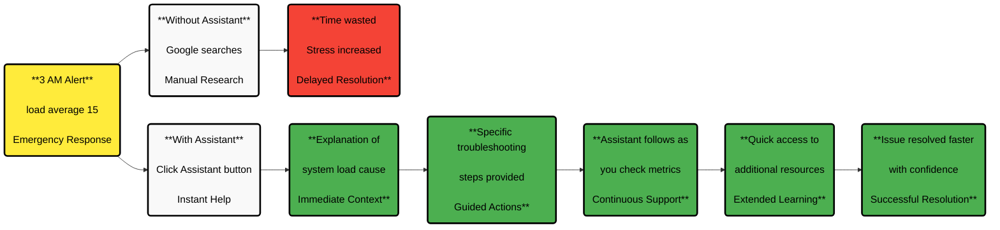

# Netdata AI: Alert Assistant & Infrastructure Insights

**Netdata AI provides intelligent assistance for both immediate alert response and strategic infrastructure analysis** using advanced AI to help you understand incidents quickly and synthesize high-resolution metrics into actionable intelligence.

This comprehensive system combines **real-time alert assistance** for emergency troubleshooting with **strategic infrastructure insights** for long-term planning, helping you both respond to immediate incidents and make informed decisions about your infrastructure's future.

## Two Complementary Approaches

Netdata Insights serves different moments in your engineering workflow through two distinct but complementary capabilities:

| Aspect | **Real-time Alert Assistant** | **Strategic Insights Reports** |
|--------|-------------------------------|--------------------------------|
| **Primary Use** | **Immediate incident response** | Strategic planning & analysis |
| **When You Use It** | During active alerts | Post-incident, planning sessions |
| **Mindset** | "The building is on fire" | "Let's understand and plan better" |
| **Response Time** | **Instant contextual help** | **2-3 minutes for comprehensive analysis** |
| **Scope** | Single alert or immediate issue | Infrastructure-wide trends and patterns |
| **Output** | Quick explanations and next steps | Detailed reports with embedded visualizations, **downloadable as PDFs**, **shareable via email** |
| **Typical Scenario** | 3 AM emergency response | Monday morning incident review |

:::tip 

These serve fundamentally different moments in an engineer's workflow. The **Assistant** is for high-stress situations when you need immediate context, while **Insights Reports** are for when you have time to think strategically about your infrastructure's health and future needs.

:::

:::note

**Netdata Insights is currently in beta as a research preview:**
- Available in Netdata Cloud for Business users and Free Trial participants
- Works with any infrastructure where you've deployed Netdata agents
- No additional configuration or new pipelines required
- Everyone gets 10 reports to generate for free
- Community users can get early access via Discord or email to product@netdata.cloud

:::

## Real-time Alert Assistant

**Get immediate context and guidance when alerts fire** - exactly when you need it most, especially during critical situations.

The Assistant provides instant explanations and troubleshooting steps directly within your alert workflow, helping you understand what's happening without leaving the Netdata interface.

| Feature                   | Benefit                                                                                                               |
|---------------------------|-----------------------------------------------------------------------------------------------------------------------|
| **Follows Your Workflow** | The Assistant window stays with you as you navigate through Netdata dashboards during your troubleshooting process.   |
| **Works at Any Hour**     | Especially valuable during after-hours emergencies when you might not have team support available.                    |
| **Contextual Knowledge**  | Combines Netdata's community expertise with the power of large language models to provide relevant advice.            |
| **Time-Saving**           | Eliminates the need for searches across multiple documentation sources or community forums.                           |
| **Non-Intrusive**         | Provides helpful guidance without taking control away from you - you remain in charge of the troubleshooting process. |

### Using the Alert Assistant

<strong>Accessing the Assistant</strong>
 

1. Navigate to the **Alerts** tab.
2. If there are active alerts, the **Actions** column will have an **Assistant** button.

   

3. Click the **Assistant** button to open a floating window with tailored troubleshooting insights.

4. If there are no active alerts, you can still access the Assistant from the **Alert Configuration** view.

<strong>Understanding Assistant Information</strong>
 

When you open the Assistant, you'll see:

1. **Alert Context**: Explanation of what the alert means and why it's occurring

   

2. **Troubleshooting Steps**: Recommended actions to address the issue

3. **Importance Level**: Context on how critical this alert is for your system

4. **Resource Links**: Curated documentation and external resources for further investigation

   

### Real-World Alert Response

Here's how the Alert Assistant helps in a critical situation:

## Strategic Insights Reports

**Generate comprehensive infrastructure analysis** that synthesizes days, weeks, or months of high-resolution data into actionable intelligence for strategic decision-making.

**Insights Reports transform your raw telemetry data into structured narratives** that help you understand trends, plan capacity, optimize performance, and conduct thorough post-incident analysis.

### Four Types of Strategic Analysis

| Report Type | What It Provides | Key Capabilities | Best Used For |
|-------------|------------------|------------------|---------------|
| **Infrastructure Summary** | Complete timeline of incidents, performance changes, and system behavior | **What happened**: Timeline reconstruction **Impact assessment**: Affected services **Current status**: Action items | Weekend incident recovery, executive updates, team handoffs |
| **Capacity Planning** | Data-driven projections with concrete recommendations | **Trend analysis**: Resource utilization patterns **Bottleneck prediction**: Inflection-point dates **Scaling recommendations**: Hardware suggestions | Quarterly planning, budget justification, infrastructure roadmaps |
| **Performance Optimization** | Synthesized analysis of system inefficiencies and improvement opportunities | **Contention patterns**: Resource conflicts **Optimization opportunities**: Tuning recommendations **Impact prioritization**: Biggest improvement areas | Performance debugging, system tuning, SRE optimization projects |
| **Anomaly Analysis** | Context-aware detection and explanation of unusual infrastructure behavior | **Pattern recognition**: Abnormal behavior **Root cause analysis**: Why anomalies occurred **Trend correlation**: Cross-infrastructure connections | Post-incident analysis, proactive issue detection, system health assessment |

:::tip

**Simply request the analysis you need and get comprehensive reports** that turn months of raw telemetry data into clear, actionable intelligence that helps you make better infrastructure decisions faster.

:::

## How Netdata Insights Works

The system combines three key components to deliver infrastructure intelligence at scale:

<strong>1. Data Pipeline</strong>
 

Your Netdata agents continue collecting metrics every second, storing them locally as they always have. **When you request analysis, Insights queries relevant time ranges across your infrastructure**, pulling raw metrics, events, and anomaly detection results.

<strong>2. Context Compression</strong>
 

Raw telemetry data is compressed into structured context bundles that include:
- **Statistical summaries** (percentiles, trends, correlation coefficients)
- **Detected anomalies** with confidence scores and affected metrics
- **Event timelines** (alerts, deployments, configuration changes)
- **Cross-node correlations** and dependency mappings
- **Historical baselines** for comparison

<strong>3. AI Analysis</strong>
 

**Advanced language models process the compressed context** to generate structured reports with natural-language explanations, relevant visualizations, and actionable recommendations. 

:::important

Your infrastructure data is processed for your reports and then discarded. **We never use them for training or model improvement**.

:::

## What's Coming Next

The goal is building **an autonomous debugging partner, not just another chatbot**. A system that scales human decision-making using all the info that Netdata already collects about your infrastructure.

For details on upcoming features and our product roadmap, [read our full announcement on the Netdata blog](https://www.netdata.cloud/blog/netdata-insights/).